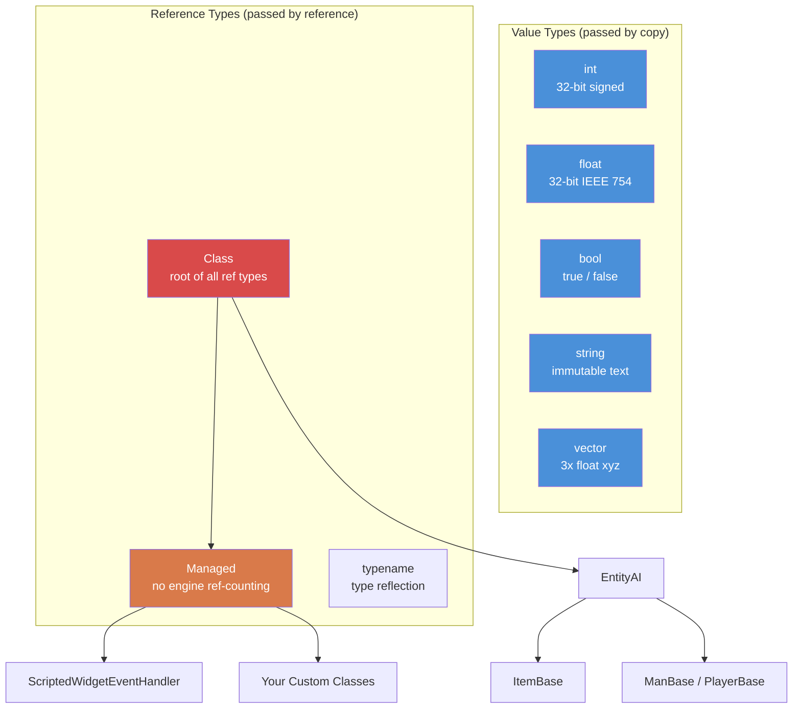

# Chapter 1.1: Variables & Types

[Home](../README.md) | **Variables & Types** | [Next: Arrays, Maps & Sets >>](02-arrays-maps-sets.md)

---

## Primitive Types

Enforce Script has a small, fixed set of primitive types. You cannot define new value types --- only classes (covered in [Chapter 1.3](03-classes-inheritance.md)).

| Type | Size | Default Value | Description |
|------|------|---------------|-------------|
| `int` | 32-bit signed | `0` | Whole numbers from -2,147,483,648 to 2,147,483,647 |
| `float` | 32-bit IEEE 754 | `0.0` | Floating-point numbers |
| `bool` | 1 bit logical | `false` | `true` or `false` |
| `string` | Variable | `""` (empty) | Text. Immutable value type --- passed by value, not reference |
| `vector` | 3x float | `"0 0 0"` | Three-component float (x, y, z). Passed by value |
| `typename` | Engine ref | `null` | A reference to a type itself, used for reflection |
| `void` | N/A | N/A | Used only as a return type to indicate "returns nothing" |

### Type Hierarchy Diagram



### Type Constants

Several types expose useful constants:

```c
// int bounds
int maxInt = int.MAX;    // 2147483647
int minInt = int.MIN;    // -2147483648

// float bounds
float smallest = float.MIN;     // smallest positive float (~1.175e-38)
float largest  = float.MAX;     // largest float (~3.403e+38)
float lowest   = float.LOWEST;  // most negative float (-3.403e+38)
```

---

## Declaring Variables

Variables are declared by writing the type followed by the name. You can declare and assign in one statement or separately.

```c
void MyFunction()
{
    // Declaration only (initialized to default value)
    int health;          // health == 0
    float speed;         // speed == 0.0
    bool isAlive;        // isAlive == false
    string name;         // name == ""

    // Declaration with initialization
    int maxPlayers = 60;
    float gravity = 9.81;
    bool debugMode = true;
    string serverName = "My DayZ Server";
}
```

### The `auto` Keyword

When the type is obvious from the right-hand side, you can use `auto` to let the compiler infer it:

```c
void Example()
{
    auto count = 10;           // int
    auto ratio = 0.75;         // float
    auto label = "Hello";      // string
    auto player = GetGame().GetPlayer();  // DayZPlayer (or whatever GetPlayer returns)
}
```

This is purely a convenience --- the compiler resolves the type at compile time. There is no performance difference.

### Constants

Use the `const` keyword for values that should never change after initialization:

```c
const int MAX_SQUAD_SIZE = 8;
const float SPAWN_RADIUS = 150.0;
const string MOD_PREFIX = "[MyMod]";

void Example()
{
    int a = MAX_SQUAD_SIZE;  // OK: reading a constant
    MAX_SQUAD_SIZE = 10;     // ERROR: cannot assign to a constant
}
```

Constants are typically declared at file scope (outside any function) or as class members. Naming convention: `UPPER_SNAKE_CASE`.

---

## Working with `int`

Integers are the workhorse type. DayZ uses them for item counts, player IDs, health values (when discretized), enum values, bitflags, and more.

```c
void IntExamples()
{
    int count = 5;
    int total = count + 10;     // 15
    int doubled = count * 2;    // 10
    int remainder = 17 % 5;     // 2 (modulo)

    // Increment and decrement
    count++;    // count is now 6
    count--;    // count is now 5 again

    // Compound assignment
    count += 3;  // count is now 8
    count -= 2;  // count is now 6
    count *= 4;  // count is now 24
    count /= 6;  // count is now 4

    // Integer division truncates (no rounding)
    int result = 7 / 2;    // result == 3, not 3.5

    // Bitwise operations (used for flags)
    int flags = 0;
    flags = flags | 0x01;   // set bit 0
    flags = flags | 0x04;   // set bit 2
    bool hasBit0 = (flags & 0x01) != 0;  // true
}
```

### Real-World Example: Player Count

```c
void PrintPlayerCount()
{
    array<Man> players = new array<Man>;
    GetGame().GetPlayers(players);
    int count = players.Count();
    Print(string.Format("Players online: %1", count));
}
```

---

## Working with `float`

Floats represent decimal numbers. DayZ uses them extensively for positions, distances, health percentages, damage values, and timers.

```c
void FloatExamples()
{
    float health = 100.0;
    float damage = 25.5;
    float remaining = health - damage;   // 74.5

    // DayZ-specific: damage multiplier
    float headMultiplier = 3.0;
    float actualDamage = damage * headMultiplier;  // 76.5

    // Float division gives decimal results
    float ratio = 7.0 / 2.0;   // 3.5

    // Useful math
    float dist = 150.7;
    float rounded = Math.Round(dist);    // 151
    float floored = Math.Floor(dist);    // 150
    float ceiled  = Math.Ceil(dist);     // 151
    float clamped = Math.Clamp(dist, 0.0, 100.0);  // 100
}
```

### Real-World Example: Distance Check

```c
bool IsPlayerNearby(PlayerBase player, vector targetPos, float radius)
{
    if (!player)
        return false;

    vector playerPos = player.GetPosition();
    float distance = vector.Distance(playerPos, targetPos);
    return distance <= radius;
}
```

---

## Working with `bool`

Booleans hold `true` or `false`. They are used in conditions, flags, and state tracking.

```c
void BoolExamples()
{
    bool isAdmin = true;
    bool isBanned = false;

    // Logical operators
    bool canPlay = isAdmin || !isBanned;    // true (OR, NOT)
    bool isSpecial = isAdmin && !isBanned;  // true (AND)

    // Negation
    bool notAdmin = !isAdmin;   // false

    // Comparison results are bool
    int health = 50;
    bool isLow = health < 25;       // false
    bool isHurt = health < 100;     // true
    bool isDead = health == 0;      // false
    bool isAlive = health != 0;     // true
}
```

### Truthiness in Conditions

In Enforce Script, you can use non-bool values in conditions. The following are considered `false`:
- `0` (int)
- `0.0` (float)
- `""` (empty string)
- `null` (null object reference)

Everything else is `true`. This is commonly used for null checks:

```c
void SafeCheck(PlayerBase player)
{
    // These two are equivalent:
    if (player != null)
        Print("Player exists");

    if (player)
        Print("Player exists");

    // And these two:
    if (player == null)
        Print("No player");

    if (!player)
        Print("No player");
}
```

---

## Working with `string`

Strings in Enforce Script are **value types** --- they are copied when assigned or passed to functions, just like `int` or `float`. This is different from C# or Java where strings are reference types.

```c
void StringExamples()
{
    string greeting = "Hello";
    string name = "Survivor";

    // Concatenation with +
    string message = greeting + ", " + name + "!";  // "Hello, Survivor!"

    // String formatting (1-indexed placeholders)
    string formatted = string.Format("Player %1 has %2 health", name, 75);
    // Result: "Player Survivor has 75 health"

    // Length
    int len = message.Length();    // 17

    // Comparison
    bool same = (greeting == "Hello");  // true

    // Conversion from other types
    string fromInt = "Score: " + 42;     // does NOT work -- must convert explicitly
    string correct = "Score: " + 42.ToString();  // "Score: 42"

    // Using Format is the preferred approach
    string best = string.Format("Score: %1", 42);  // "Score: 42"
}
```

### Escape Sequences

Strings support standard escape sequences:

| Sequence | Meaning |
|----------|---------|
| `\n` | Newline |
| `\r` | Carriage return |
| `\t` | Tab |
| `\\` | Literal backslash |
| `\"` | Literal double quote |

**Warning:** While these are documented, backslash (`\\`) and escaped quotes (`\"`) are known to cause issues with the CParser in some contexts, especially in JSON-related operations. When working with file paths or JSON strings, avoid backslashes when possible. Use forward slashes for paths --- DayZ accepts them on all platforms.

### Real-World Example: Chat Message

```c
void SendAdminMessage(string adminName, string text)
{
    string msg = string.Format("[ADMIN] %1: %2", adminName, text);
    Print(msg);
}
```

---

## Working with `vector`

The `vector` type holds three `float` components (x, y, z). It is DayZ's fundamental type for positions, directions, rotations, and velocities. Like strings and primitives, vectors are **value types** --- they are copied on assignment.

### Initialization

Vectors can be initialized in two ways:

```c
void VectorInit()
{
    // Method 1: String initialization (three space-separated numbers)
    vector pos1 = "100.5 0 200.3";

    // Method 2: Vector() constructor function
    vector pos2 = Vector(100.5, 0, 200.3);

    // Default value is "0 0 0"
    vector empty;   // empty == <0, 0, 0>
}
```

**Important:** The string initialization format uses **spaces** as separators, not commas. `"1 2 3"` is valid; `"1,2,3"` is not.

### Component Access

Access individual components using array-style indexing:

```c
void VectorComponents()
{
    vector pos = Vector(100.5, 25.0, 200.3);

    // Reading components
    float x = pos[0];   // 100.5  (East/West)
    float y = pos[1];   // 25.0   (Up/Down, altitude)
    float z = pos[2];   // 200.3  (North/South)

    // Writing components
    pos[1] = 50.0;      // Change altitude to 50
}
```

DayZ coordinate system:
- `[0]` = X = East(+) / West(-)
- `[1]` = Y = Up(+) / Down(-) (altitude above sea level)
- `[2]` = Z = North(+) / South(-)

### Static Constants

```c
vector zero    = vector.Zero;      // "0 0 0"
vector up      = vector.Up;        // "0 1 0"
vector right   = vector.Aside;     // "1 0 0"
vector forward = vector.Forward;   // "0 0 1"
```

### Common Vector Operations

```c
void VectorOps()
{
    vector pos1 = Vector(100, 0, 200);
    vector pos2 = Vector(150, 0, 250);

    // Distance between two points
    float dist = vector.Distance(pos1, pos2);

    // Squared distance (faster, good for comparisons)
    float distSq = vector.DistanceSq(pos1, pos2);

    // Direction from pos1 to pos2
    vector dir = vector.Direction(pos1, pos2);

    // Normalize a vector (make length = 1)
    vector norm = dir.Normalized();

    // Length of a vector
    float len = dir.Length();

    // Linear interpolation (50% between pos1 and pos2)
    vector midpoint = vector.Lerp(pos1, pos2, 0.5);

    // Dot product
    float dot = vector.Dot(dir, vector.Up);
}
```

### Real-World Example: Spawn Position

```c
// Get a position on the ground at given X,Z coordinates
vector GetGroundPosition(float x, float z)
{
    vector pos = Vector(x, 0, z);
    pos[1] = GetGame().SurfaceY(x, z);  // Set Y to terrain height
    return pos;
}

// Get a random position within a radius of a center point
vector GetRandomPositionAround(vector center, float radius)
{
    float angle = Math.RandomFloat(0, Math.PI2);
    float dist = Math.RandomFloat(0, radius);

    vector offset = Vector(Math.Cos(angle) * dist, 0, Math.Sin(angle) * dist);
    vector pos = center + offset;
    pos[1] = GetGame().SurfaceY(pos[0], pos[2]);
    return pos;
}
```

---

## Working with `typename`

The `typename` type holds a reference to a type itself. It is used for reflection --- inspecting and working with types at runtime. You will encounter it when writing generic systems, config loaders, and factory patterns.

```c
void TypenameExamples()
{
    // Get the typename of a class
    typename t = PlayerBase;

    // Get typename from a string
    typename t2 = t.StringToEnum(PlayerBase, "PlayerBase");

    // Compare types
    if (t == PlayerBase)
        Print("It's PlayerBase!");

    // Get the typename of an object instance
    PlayerBase player;
    // ... assume player is valid ...
    typename objType = player.Type();

    // Check inheritance
    bool isMan = objType.IsInherited(Man);

    // Convert typename to string
    string name = t.ToString();  // "PlayerBase"

    // Create an instance from typename (factory pattern)
    Class instance = t.Spawn();
}
```

### Enum Conversion with typename

```c
enum DamageType
{
    MELEE = 0,
    BULLET = 1,
    EXPLOSION = 2
};

void EnumConvert()
{
    // Enum to string
    string name = typename.EnumToString(DamageType, DamageType.BULLET);
    // name == "BULLET"

    // String to enum (returns int, -1 on failure)
    int value = typename.StringToEnum(DamageType, "EXPLOSION");
    // value == 2
}
```

---

## Managed Class

`Managed` is a special base class that **disables engine reference counting**. Classes that extend `Managed` are not tracked by the engine's garbage collector --- their lifetime is managed entirely by script `ref` references.

```c
class MyScriptHandler : Managed
{
    // This class won't be garbage collected by the engine
    // It will only be deleted when the last ref is released
}
```

Most script-only classes (that don't represent game entities) should extend `Managed`. Entity classes like `PlayerBase`, `ItemBase` extend `EntityAI` (which is engine-managed, NOT `Managed`).

### When to Use Managed

| Use `Managed` for... | Do NOT use `Managed` for... |
|----------------------|-----------------------------|
| Config data classes | Items (`ItemBase`) |
| Manager singletons | Weapons (`Weapon_Base`) |
| UI controllers | Vehicles (`CarScript`) |
| Event handler objects | Players (`PlayerBase`) |
| Helper/utility classes | Any class that extends `EntityAI` |

If your class does not represent a physical entity in the game world, it should almost certainly extend `Managed`.

---

## Type Conversion

Enforce Script supports both implicit and explicit conversions between types.

### Implicit Conversions

Some conversions happen automatically:

```c
void ImplicitConversions()
{
    // int to float (always safe, no data loss)
    int count = 42;
    float fCount = count;    // 42.0

    // float to int (TRUNCATES, does not round!)
    float precise = 3.99;
    int truncated = precise;  // 3, NOT 4

    // int/float to bool
    bool fromInt = 5;      // true (non-zero)
    bool fromZero = 0;     // false
    bool fromFloat = 0.1;  // true (non-zero)

    // bool to int
    int fromBool = true;   // 1
    int fromFalse = false; // 0
}
```

### Explicit Conversions (Parsing)

To convert between strings and numeric types, use parsing methods:

```c
void ExplicitConversions()
{
    // String to int
    int num = "42".ToInt();           // 42
    int bad = "hello".ToInt();        // 0 (fails silently)

    // String to float
    float f = "3.14".ToFloat();       // 3.14

    // String to vector
    vector v = "100 25 200".ToVector();  // <100, 25, 200>

    // Number to string (using Format)
    string s1 = string.Format("%1", 42);       // "42"
    string s2 = string.Format("%1", 3.14);     // "3.14"

    // int/float .ToString()
    string s3 = (42).ToString();     // "42"
}
```

### Object Casting

For class types, use `Class.CastTo()` or `ClassName.Cast()`. This is covered in detail in [Chapter 1.3](03-classes-inheritance.md), but here is the essential pattern:

```c
void CastExample()
{
    Object obj = GetSomeObject();

    // Safe cast (preferred)
    PlayerBase player;
    if (Class.CastTo(player, obj))
    {
        // player is valid and safe to use
        string name = player.GetIdentity().GetName();
    }

    // Alternative cast syntax
    PlayerBase player2 = PlayerBase.Cast(obj);
    if (player2)
    {
        // player2 is valid
    }
}
```

---

## Variable Scope

Variables exist only within the code block (curly braces) where they are declared. Enforce Script does **not** allow redeclaring a variable name within nested or sibling scopes.

```c
void ScopeExample()
{
    int x = 10;

    if (true)
    {
        // int x = 20;  // ERROR: redeclaration of 'x' in nested scope
        x = 20;         // OK: modifying the outer x
        int y = 30;     // OK: new variable in this scope
    }

    // y is NOT accessible here (declared in inner scope)
    // Print(y);  // ERROR: undeclared identifier 'y'

    // IMPORTANT: this also applies to for loops
    for (int i = 0; i < 5; i++)
    {
        // i exists here
    }
    // for (int i = 0; i < 3; i++)  // ERROR in DayZ: 'i' already declared
    // Use a different name:
    for (int j = 0; j < 3; j++)
    {
        // j exists here
    }
}
```

### The Sibling Scope Trap

This is one of the most notorious Enforce Script quirks. Declaring the same variable name in `if` and `else` blocks causes a compile error:

```c
void SiblingTrap()
{
    if (someCondition)
    {
        int result = 10;    // Declared here
        Print(result);
    }
    else
    {
        // int result = 20; // ERROR: multiple declaration of 'result'
        // Even though this is a sibling scope, not the same scope
    }

    // FIX: declare above the if/else
    int result;
    if (someCondition)
    {
        result = 10;
    }
    else
    {
        result = 20;
    }
}
```

---

## Operator Precedence

From highest to lowest precedence:

| Priority | Operator | Description | Associativity |
|----------|----------|-------------|---------------|
| 1 | `()` `[]` `.` | Grouping, array access, member access | Left to right |
| 2 | `!` `-` (unary) `~` | Logical NOT, negation, bitwise NOT | Right to left |
| 3 | `*` `/` `%` | Multiplication, division, modulo | Left to right |
| 4 | `+` `-` | Addition, subtraction | Left to right |
| 5 | `<<` `>>` | Bitwise shift | Left to right |
| 6 | `<` `<=` `>` `>=` | Relational | Left to right |
| 7 | `==` `!=` | Equality | Left to right |
| 8 | `&` | Bitwise AND | Left to right |
| 9 | `^` | Bitwise XOR | Left to right |
| 10 | `\|` | Bitwise OR | Left to right |
| 11 | `&&` | Logical AND | Left to right |
| 12 | `\|\|` | Logical OR | Left to right |
| 13 | `=` `+=` `-=` `*=` `/=` `%=` `&=` `\|=` `^=` `<<=` `>>=` | Assignment | Right to left |

> **Tip:** When in doubt, use parentheses. Enforce Script follows C-like precedence rules, but explicit grouping prevents bugs and improves readability.

---

## Common Mistakes

### 1. Uninitialized Variables Used in Logic

Primitives get default values (`0`, `0.0`, `false`, `""`), but relying on this makes code fragile and hard to read. Always initialize explicitly.

```c
// BAD: relying on implicit zero
int count;
if (count > 0)  // This works because count == 0, but intent is unclear
    DoThing();

// GOOD: explicit initialization
int count = 0;
if (count > 0)
    DoThing();
```

### 2. Float-to-Int Truncation

Float-to-int conversion truncates (rounds toward zero), not rounds to nearest:

```c
float f = 3.99;
int i = f;         // i == 3, NOT 4

// If you want rounding:
int rounded = Math.Round(f);  // 4
```

### 3. Float Precision in Comparisons

Never compare floats for exact equality:

```c
float a = 0.1 + 0.2;
// BAD: may fail due to floating-point representation
if (a == 0.3)
    Print("Equal");

// GOOD: use a tolerance (epsilon)
if (Math.AbsFloat(a - 0.3) < 0.001)
    Print("Close enough");
```

### 4. String Concatenation with Numbers

You cannot simply concatenate a number onto a string with `+`. Use `string.Format()`:

```c
int kills = 5;
// Potentially problematic:
// string msg = "Kills: " + kills;

// CORRECT: use Format
string msg = string.Format("Kills: %1", kills);
```

### 5. Vector String Format

Vector string initialization requires spaces, not commas:

```c
vector good = "100 25 200";     // CORRECT
// vector bad = "100, 25, 200"; // WRONG: commas are not parsed correctly
// vector bad2 = "100,25,200";  // WRONG
```

### 6. Forgetting that Strings and Vectors are Value Types

Unlike class objects, strings and vectors are copied on assignment. Modifying a copy does not affect the original:

```c
vector posA = "10 20 30";
vector posB = posA;       // posB is a COPY
posB[1] = 99;             // Only posB changes
// posA is still "10 20 30"
```

---

## Practice Exercises

### Exercise 1: Variable Basics
Declare variables to store:
- A player's name (string)
- Their health percentage (float, 0-100)
- Their kill count (int)
- Whether they are an admin (bool)
- Their world position (vector)

Print a formatted summary using `string.Format()`.

### Exercise 2: Temperature Converter
Write a function `float CelsiusToFahrenheit(float celsius)` and its inverse `float FahrenheitToCelsius(float fahrenheit)`. Test with boiling point (100C = 212F) and freezing point (0C = 32F).

### Exercise 3: Distance Calculator
Write a function that takes two vectors and returns:
- The 3D distance between them
- The 2D distance (ignoring height/Y axis)
- The height difference

Hint: For 2D distance, create new vectors with `[1]` set to `0` before calculating distance.

### Exercise 4: Type Juggling
Given the string `"42"`, convert it to:
1. An `int`
2. A `float`
3. Back to a `string` using `string.Format()`
4. A `bool` (should be `true` since the int value is non-zero)

### Exercise 5: Ground Position
Write a function `vector SnapToGround(vector pos)` that takes any position and returns it with the Y component set to the terrain height at that X,Z location. Use `GetGame().SurfaceY()`.

---

## Summary

| Concept | Key Point |
|---------|-----------|
| Types | `int`, `float`, `bool`, `string`, `vector`, `typename`, `void` |
| Defaults | `0`, `0.0`, `false`, `""`, `"0 0 0"`, `null` |
| Constants | `const` keyword, `UPPER_SNAKE_CASE` convention |
| Vectors | Init with `"x y z"` string or `Vector(x,y,z)`, access with `[0]`, `[1]`, `[2]` |
| Scope | Variables scoped to `{}` blocks; no redeclaration in nested/sibling blocks |
| Conversion | `float`-to-`int` truncates; use `.ToInt()`, `.ToFloat()`, `.ToVector()` for string parsing |
| Formatting | Always use `string.Format()` for building strings from mixed types |

---

[Home](../README.md) | **Variables & Types** | [Next: Arrays, Maps & Sets >>](02-arrays-maps-sets.md)
