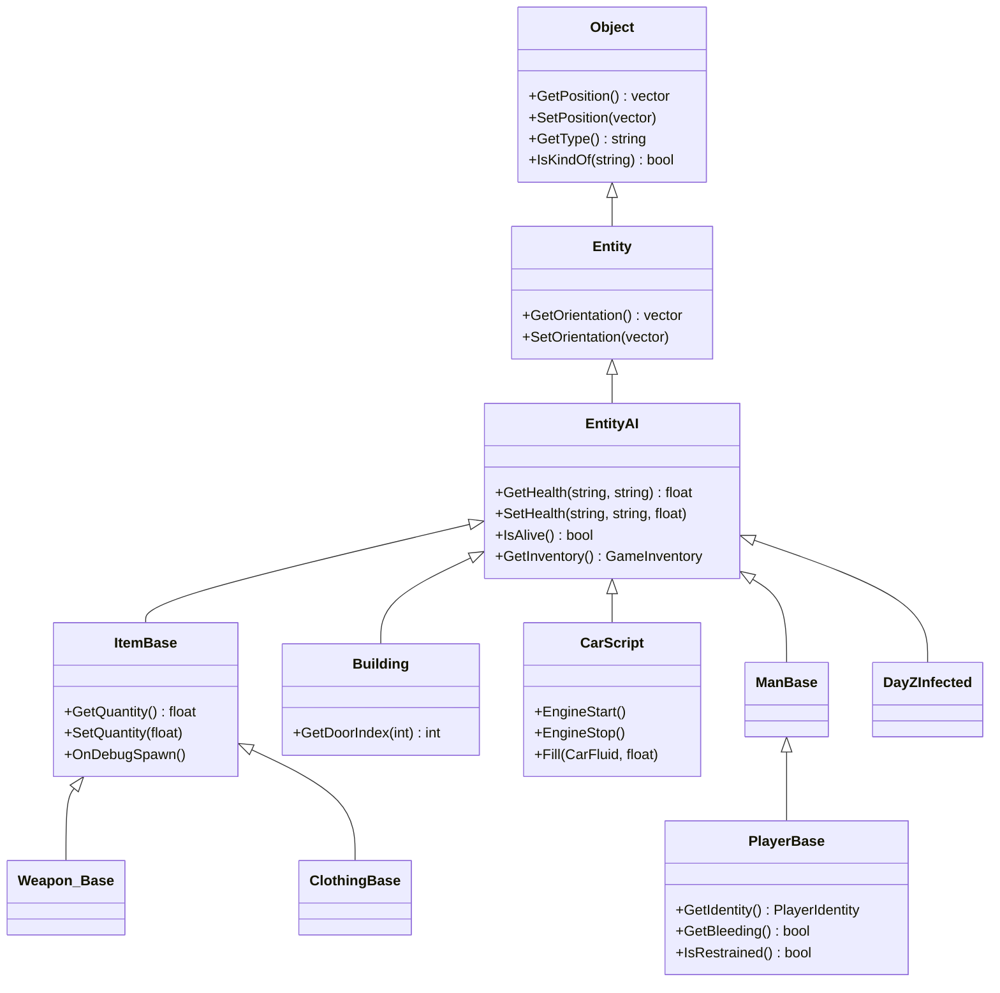

# Chapter 1.3: Classes & Inheritance

[Home](../README.md) | [<< Previous: Arrays, Maps & Sets](02-arrays-maps-sets.md) | **Classes & Inheritance** | [Next: Modded Classes >>](04-modded-classes.md)

---

## Introduction

Everything in DayZ is a class. Every weapon, vehicle, zombie, UI panel, config manager, and player is an instance of a class. Understanding how to declare, extend, and work with classes in Enforce Script is the foundation of all DayZ modding.

Enforce Script's class system is single-inheritance, object-oriented, with access modifiers, constructors, destructors, static members, and method overriding. If you know C# or Java, the concepts are familiar --- but the syntax has its own flavor, and there are important differences covered in this chapter.

---

## Declaring a Class

A class groups related data (fields) and behavior (methods) together.

```c
class ZombieTracker
{
    // Fields (member variables)
    int m_ZombieCount;
    float m_SpawnRadius;
    string m_ZoneName;
    bool m_IsActive;
    vector m_CenterPos;

    // Methods (member functions)
    void Activate(vector center, float radius)
    {
        m_CenterPos = center;
        m_SpawnRadius = radius;
        m_IsActive = true;
    }

    bool IsActive()
    {
        return m_IsActive;
    }

    float GetDistanceToCenter(vector pos)
    {
        return vector.Distance(m_CenterPos, pos);
    }
}
```

### Class Naming Conventions

DayZ modding follows these conventions:
- Class names: `PascalCase` (e.g., `PlayerTracker`, `LootManager`)
- Member fields: `m_PascalCase` prefix (e.g., `m_Health`, `m_PlayerList`)
- Static fields: `s_PascalCase` prefix (e.g., `s_Instance`, `s_Counter`)
- Constants: `UPPER_SNAKE_CASE` (e.g., `MAX_HEALTH`, `DEFAULT_RADIUS`)
- Methods: `PascalCase` (e.g., `GetPosition()`, `SetHealth()`)
- Local variables: `camelCase` (e.g., `playerCount`, `nearestDist`)

### Creating and Using Instances

```c
void Example()
{
    // Create an instance with 'new'
    ZombieTracker tracker = new ZombieTracker;

    // Call methods
    tracker.Activate(Vector(5000, 0, 8000), 200.0);

    if (tracker.IsActive())
    {
        float dist = tracker.GetDistanceToCenter(Vector(5050, 0, 8050));
        Print(string.Format("Distance: %1", dist));
    }

    // Destroy an instance with 'delete' (usually not needed; see Memory section)
    delete tracker;
}
```

---

## Constructors and Destructors

Constructors initialize an object when it is created. Destructors clean up when it is destroyed. In Enforce Script, both use the class name --- the destructor is prefixed with `~`.

### Constructor

```c
class SpawnZone
{
    protected string m_Name;
    protected vector m_Position;
    protected float m_Radius;
    protected ref array<string> m_AllowedTypes;

    // Constructor: same name as the class
    void SpawnZone(string name, vector pos, float radius)
    {
        m_Name = name;
        m_Position = pos;
        m_Radius = radius;
        m_AllowedTypes = new array<string>;

        Print(string.Format("[SpawnZone] Created: %1 at %2, radius %3", m_Name, m_Position, m_Radius));
    }

    // Destructor: ~ prefix
    void ~SpawnZone()
    {
        Print(string.Format("[SpawnZone] Destroyed: %1", m_Name));
        // m_AllowedTypes is a ref, it will be deleted automatically
    }

    void AddAllowedType(string typeName)
    {
        m_AllowedTypes.Insert(typeName);
    }
}
```

### Default Constructor (No Parameters)

If you do not define a constructor, the class gets an implicit default constructor that initializes all fields to their default values (`0`, `0.0`, `false`, `""`, `null`).

```c
class SimpleConfig
{
    int m_MaxPlayers;      // initialized to 0
    float m_SpawnDelay;    // initialized to 0.0
    string m_ServerName;   // initialized to ""
    bool m_PvPEnabled;     // initialized to false
}

void Test()
{
    SimpleConfig cfg = new SimpleConfig;
    // All fields are at their defaults
    Print(cfg.m_MaxPlayers);  // 0
}
```

### Constructor Overloading

You can define multiple constructors with different parameter lists:

```c
class DamageEvent
{
    protected float m_Amount;
    protected string m_Source;
    protected vector m_Position;

    // Constructor with all parameters
    void DamageEvent(float amount, string source, vector pos)
    {
        m_Amount = amount;
        m_Source = source;
        m_Position = pos;
    }

    // Simpler constructor with defaults
    void DamageEvent(float amount)
    {
        m_Amount = amount;
        m_Source = "Unknown";
        m_Position = vector.Zero;
    }
}

void Test()
{
    DamageEvent full = new DamageEvent(50.0, "AKM", Vector(100, 0, 200));
    DamageEvent simple = new DamageEvent(25.0);
}
```

---

## Access Modifiers

Access modifiers control who can see and use fields and methods.

| Modifier | Accessible From | Syntax |
|----------|----------------|--------|
| `private` | Only the declaring class | `private int m_Secret;` |
| `protected` | Declaring class + all subclasses | `protected int m_Health;` |
| *(none)* | Everywhere (public) | `int m_Value;` |

There is no explicit `public` keyword --- everything without `private` or `protected` is public by default.

```c
class BaseVehicle
{
    // Public: anyone can access
    string m_DisplayName;

    // Protected: this class and subclasses only
    protected float m_Fuel;
    protected float m_MaxFuel;

    // Private: only this exact class
    private int m_InternalState;

    void BaseVehicle(string name, float maxFuel)
    {
        m_DisplayName = name;
        m_MaxFuel = maxFuel;
        m_Fuel = maxFuel;
        m_InternalState = 0;
    }

    // Public method
    float GetFuelPercent()
    {
        return (m_Fuel / m_MaxFuel) * 100.0;
    }

    // Protected method: subclasses can call this
    protected void ConsumeFuel(float amount)
    {
        m_Fuel = Math.Clamp(m_Fuel - amount, 0, m_MaxFuel);
    }

    // Private method: only this class
    private void UpdateInternalState()
    {
        m_InternalState++;
    }
}
```

### Best Practice: Encapsulation

Expose fields through methods (getters/setters) rather than making them public. This lets you add validation, logging, or side effects later without breaking code that uses the class.

```c
class PlayerStats
{
    protected float m_Health;
    protected float m_MaxHealth;

    void PlayerStats(float maxHealth)
    {
        m_MaxHealth = maxHealth;
        m_Health = maxHealth;
    }

    // Getter
    float GetHealth()
    {
        return m_Health;
    }

    // Setter with validation
    void SetHealth(float value)
    {
        m_Health = Math.Clamp(value, 0, m_MaxHealth);
    }

    // Convenience methods
    void TakeDamage(float amount)
    {
        SetHealth(m_Health - amount);
    }

    void Heal(float amount)
    {
        SetHealth(m_Health + amount);
    }

    bool IsAlive()
    {
        return m_Health > 0;
    }
}
```

---

## Inheritance

Inheritance lets you create a new class based on an existing one. The child class inherits all fields and methods from the parent, and can add new ones or override existing behavior.

### Syntax: `extends` or `:`

Enforce Script supports two syntaxes for inheritance. Both are equivalent:

```c
// Syntax 1: extends keyword (preferred, more readable)
class Car extends BaseVehicle
{
}

// Syntax 2: colon (C++ style, also common in DayZ code)
class Truck : BaseVehicle
{
}
```

### Basic Inheritance Example

```c
class Animal
{
    protected string m_Name;
    protected float m_Health;

    void Animal(string name, float health)
    {
        m_Name = name;
        m_Health = health;
    }

    string GetName()
    {
        return m_Name;
    }

    void Speak()
    {
        Print(m_Name + " makes a sound");
    }
}

class Dog extends Animal
{
    protected string m_Breed;

    void Dog(string name, string breed)
    {
        // Note: parent constructor is called automatically with no args,
        // or you can initialize parent fields directly since they are protected
        m_Name = name;
        m_Health = 100.0;
        m_Breed = breed;
    }

    string GetBreed()
    {
        return m_Breed;
    }

    // New method only in Dog
    void Fetch()
    {
        Print(m_Name + " fetches the stick!");
    }
}

void Test()
{
    Dog rex = new Dog("Rex", "German Shepherd");
    rex.Speak();         // Inherited from Animal: "Rex makes a sound"
    rex.Fetch();         // Dog's own method: "Rex fetches the stick!"
    Print(rex.GetName()); // Inherited: "Rex"
    Print(rex.GetBreed()); // Dog's own: "German Shepherd"
}
```

### Single Inheritance Only

Enforce Script supports **single inheritance only**. A class can extend exactly one parent. There is no multiple inheritance, no interfaces, and no mixins.

```c
class A { }
class B extends A { }     // OK: single parent
// class C extends A, B { }  // ERROR: multiple inheritance not supported
class D extends B { }     // OK: B extends A, D extends B (inheritance chain)
```

### The `sealed` Keyword (1.28+)

A class marked `sealed` cannot be inherited from. A method marked `sealed` cannot be overridden. DayZ 1.28 enforces this at compile time.

```c
sealed class FinalClass
{
    void DoWork()
    {
        // This class cannot be extended
    }
}

class MyChild : FinalClass  // COMPILE ERROR: cannot inherit from sealed class
{
}
```

Methods can also be sealed individually:

```c
class MyBase
{
    sealed void LockedMethod()
    {
        // Cannot be overridden in child classes
    }

    void OpenMethod()
    {
        // Can be overridden normally
    }
}
```

> **Migration note:** If you update to DayZ 1.28 and get a compile error about inheriting a sealed class, you must refactor. Use composition (wrap the class as a member) instead of inheritance.

`sealed` is rarely used in DayZ modding since extensibility is the primary goal.

---

## Overriding Methods

When a subclass needs to change the behavior of an inherited method, it uses the `override` keyword. The compiler checks that the method signature matches a method in the parent class.

```c
class Weapon
{
    protected string m_Name;
    protected float m_Damage;

    void Weapon(string name, float damage)
    {
        m_Name = name;
        m_Damage = damage;
    }

    float CalculateDamage(float distance)
    {
        // Base damage, no falloff
        return m_Damage;
    }

    string GetInfo()
    {
        return string.Format("%1 (Dmg: %2)", m_Name, m_Damage);
    }
}

class Rifle extends Weapon
{
    protected float m_MaxRange;

    void Rifle(string name, float damage, float maxRange)
    {
        m_Name = name;
        m_Damage = damage;
        m_MaxRange = maxRange;
    }

    // Override: change damage calculation to include distance falloff
    override float CalculateDamage(float distance)
    {
        float falloff = Math.Clamp(1.0 - (distance / m_MaxRange), 0.1, 1.0);
        return m_Damage * falloff;
    }

    // Override: add range info
    override string GetInfo()
    {
        return string.Format("%1 (Dmg: %2, Range: %3m)", m_Name, m_Damage, m_MaxRange);
    }
}
```

### The `super` Keyword

`super` refers to the parent class. Use it to call the parent's version of a method, then add your own logic on top. This is critical --- especially in [modded classes](04-modded-classes.md).

```c
class BaseLogger
{
    void Log(string message)
    {
        Print("[LOG] " + message);
    }
}

class TimestampLogger extends BaseLogger
{
    override void Log(string message)
    {
        // Call parent's Log first
        super.Log(message);

        // Then add timestamp logging
        int hour, minute, second;
        GetHourMinuteSecond(hour, minute, second);
        Print(string.Format("[%1:%2:%3] %4", hour, minute, second, message));
    }
}
```

### `this` Keyword

`this` refers to the current object instance. It is usually implicit (you do not need to write it), but can be useful for clarity or when passing the current object to another function.

```c
class EventManager
{
    void Register(Managed handler) { /* ... */ }
}

class MyPlugin
{
    void Init(EventManager mgr)
    {
        // Pass 'this' (the current MyPlugin instance) to the manager
        mgr.Register(this);
    }
}
```

---

## Proto Methods (Engine Bindings)

Enforce Script uses `proto` to declare methods that are implemented in the C++ engine:

```c
// proto native — direct C++ binding, most common
proto native void SetPosition(vector pos);
proto native vector GetPosition();
proto native float GetHealth(string zoneName, string healthType);

// proto native owned — caller owns the returned object
proto native owned string ClassName();

// proto volatile — function may yield/sleep (used by engine internals)
proto volatile int Call(Class inst, string func, void param);

// proto native external — binding detail for cross-module calls
proto native external void DoSomething();
```

You cannot implement `proto` methods --- they are engine-provided. You can only **call** them.

---

## Parameter Modifiers

In addition to access modifiers on fields and methods, Enforce Script has parameter-level modifiers that control how arguments are passed to functions:

```c
// out — parameter is output only (written by the function)
bool TryGetValue(out int result)
{
    result = 42;
    return true;
}

// inout — parameter is both input and output
void ModifyArray(inout array<int> arr)
{
    arr.Insert(99);  // modifies the caller's array
}

// notnull — compile-time guarantee parameter is not null
void Process(notnull EntityAI entity)
{
    // entity guaranteed non-null by compiler
}
```

| Modifier | Meaning |
|----------|---------|
| `out` | Callee writes the value; caller reads it after the call |
| `inout` | Caller passes a value in; callee may modify it |
| `notnull` | Compiler enforces that the argument is never `null` |

These modifiers appear frequently in vanilla DayZ methods and engine API signatures.

---

## Static Methods and Fields

Static members belong to the class itself, not to any instance. They are accessed using the class name, not an object variable.

### Static Fields

```c
class GameConfig
{
    // Static fields: shared across all instances (and accessible without an instance)
    static int s_MaxPlayers = 60;
    static float s_TickRate = 30.0;
    static string s_ServerName = "My Server";

    // Regular (instance) field
    protected bool m_IsLoaded;
}

void UseStaticFields()
{
    // Access without creating an instance
    Print(GameConfig.s_MaxPlayers);     // 60
    Print(GameConfig.s_ServerName);     // "My Server"

    // Modify
    GameConfig.s_MaxPlayers = 40;
}
```

### Static Methods

```c
class MathUtils
{
    static float MetersToKilometers(float meters)
    {
        return meters / 1000.0;
    }

    static string FormatDistance(float meters)
    {
        if (meters >= 1000)
            return string.Format("%1 km", (meters / 1000.0));
        else
            return string.Format("%1 m", Math.Round(meters));
    }

    static bool IsInCircle(vector point, vector center, float radius)
    {
        return vector.Distance(point, center) <= radius;
    }
}

void Test()
{
    float km = MathUtils.MetersToKilometers(2500);     // 2.5
    string display = MathUtils.FormatDistance(750);      // "750 m"
    bool inside = MathUtils.IsInCircle("100 0 200", "150 0 250", 100);
}
```

### The Singleton Pattern

The most common use of static fields in DayZ mods is the singleton pattern: a class that has exactly one instance, accessible globally.

```c
class MyModManager
{
    // Static reference to the single instance
    private static ref MyModManager s_Instance;

    protected bool m_Initialized;
    protected ref array<string> m_Data;

    void MyModManager()
    {
        m_Initialized = false;
        m_Data = new array<string>;
    }

    // Static getter for the singleton
    static MyModManager GetInstance()
    {
        if (!s_Instance)
            s_Instance = new MyModManager;

        return s_Instance;
    }

    void Init()
    {
        if (m_Initialized)
            return;

        m_Initialized = true;
        Print("[MyMod] Manager initialized");
    }

    // Static cleanup
    static void Destroy()
    {
        s_Instance = null;
    }
}

// Usage from anywhere:
void SomeFunction()
{
    MyModManager.GetInstance().Init();
}
```

---

## Real-World Example: Custom Item Class

Here is a complete example showing a custom item class hierarchy in the style of DayZ modding. This demonstrates everything covered in this chapter.

```c
// Base class for all custom medical items
class CustomMedicalBase extends ItemBase
{
    protected float m_HealAmount;
    protected float m_UseTime;      // seconds to use
    protected bool m_RequiresBandage;

    void CustomMedicalBase()
    {
        m_HealAmount = 0;
        m_UseTime = 3.0;
        m_RequiresBandage = false;
    }

    float GetHealAmount()
    {
        return m_HealAmount;
    }

    float GetUseTime()
    {
        return m_UseTime;
    }

    bool RequiresBandage()
    {
        return m_RequiresBandage;
    }

    // Can be overridden by subclasses
    void OnApplied(PlayerBase player)
    {
        if (!player)
            return;

        player.AddHealth("", "Health", m_HealAmount);
        Print(string.Format("[Medical] %1 applied, healed %2", GetType(), m_HealAmount));
    }
}

// Specific medical item: Bandage
class CustomBandage extends CustomMedicalBase
{
    void CustomBandage()
    {
        m_HealAmount = 25.0;
        m_UseTime = 2.0;
    }

    override void OnApplied(PlayerBase player)
    {
        super.OnApplied(player);

        // Additional bandage-specific effect: stop bleeding
        // (simplified example)
        Print("[Medical] Bleeding stopped");
    }
}

// Specific medical item: First Aid Kit (heals more, takes longer)
class CustomFirstAidKit extends CustomMedicalBase
{
    private int m_UsesRemaining;

    void CustomFirstAidKit()
    {
        m_HealAmount = 75.0;
        m_UseTime = 8.0;
        m_UsesRemaining = 3;
    }

    int GetUsesRemaining()
    {
        return m_UsesRemaining;
    }

    override void OnApplied(PlayerBase player)
    {
        if (m_UsesRemaining <= 0)
        {
            Print("[Medical] First Aid Kit is empty!");
            return;
        }

        super.OnApplied(player);
        m_UsesRemaining--;

        Print(string.Format("[Medical] Uses remaining: %1", m_UsesRemaining));
    }
}
```

### config.cpp for Custom Items

The class hierarchy in script must match the `config.cpp` inheritance:

```cpp
class CfgVehicles
{
    class ItemBase;

    class CustomMedicalBase : ItemBase
    {
        scope = 0;  // 0 = abstract, cannot be spawned
        displayName = "";
    };

    class CustomBandage : CustomMedicalBase
    {
        scope = 2;  // 2 = public, can be spawned
        displayName = "Custom Bandage";
        descriptionShort = "A sterile bandage for wound treatment.";
        model = "\MyMod\data\bandage.p3d";
        weight = 50;
    };

    class CustomFirstAidKit : CustomMedicalBase
    {
        scope = 2;
        displayName = "Custom First Aid Kit";
        descriptionShort = "A complete first aid kit with multiple uses.";
        model = "\MyMod\data\firstaidkit.p3d";
        weight = 300;
    };
};
```

---

## The DayZ Class Hierarchy

Understanding the vanilla class hierarchy is essential for modding. Here are the most important classes you will inherit from or interact with:

```
Class                          // Root of all reference types
  Managed                      // Prevents engine ref-counting (use for pure script classes)
  IEntity                      // Engine entity base
    Object                     // Anything with a position in the world
      Entity
        EntityAI               // Has inventory, health, actions
          InventoryItem
            ItemBase           // ALL items (inherit from this for custom items)
              Weapon_Base      // All weapons
              Magazine_Base    // All magazines
              Clothing_Base    // All clothing
          Transport
            CarScript          // All vehicles
          DayZCreatureAI
            DayZInfected       // Zombies
            DayZAnimal         // Animals
          Man
            DayZPlayer
              PlayerBase       // THE player class (modded constantly)
                SurvivorBase   // Character appearance
```

### DayZ Class Hierarchy



### Common Base Classes for Modding

| If you want to create... | Extend... |
|--------------------------|-----------|
| A new item | `ItemBase` |
| A new weapon | `Weapon_Base` |
| A new piece of clothing | `Clothing_Base` |
| A new vehicle | `CarScript` |
| A UI element | `UIScriptedMenu` or `ScriptedWidgetEventHandler` |
| A manager/system | `Managed` |
| A config data class | `Managed` |
| A mission hook | `MissionServer` or `MissionGameplay` (via `modded class`) |

---

## Best Practices

- Always call `super.MethodName()` in overrides unless you intentionally want to replace the parent behavior entirely -- DayZ's deep inheritance chains depend on it.
- Use `protected` for member fields and expose them via getter/setter methods -- this lets you add validation or logging later without breaking callers.
- Prefer composition over deep inheritance when combining unrelated behaviors (e.g., a flight controller inside a vehicle, not a FlyingCar multi-inherit attempt).
- Mark owned object members with `ref` at declaration -- without it, the object may be garbage collected while your class still expects it.
- Use the singleton pattern (`static ref` + `GetInstance()`) for manager classes that must have exactly one instance.

---

## Observed in Real Mods

> Patterns confirmed by studying professional DayZ mod source code.

| Pattern | Mod | Detail |
|---------|-----|--------|
| Singleton via `static ref` + `GetInstance()` | COT / Expansion | Every major manager (permissions, notifications, market) follows this exact pattern |
| Constructor initializes all `ref` collections | Dabs Framework | Constructors always create `new array` / `new map` for every `ref` member |
| `override` + `super` on every lifecycle method | VPP Admin | `OnInit`, `OnMissionStart`, `OnUpdate` always call `super` first, then add behavior |
| Abstract base with `scope=0` in config.cpp | Expansion Vehicles | Base vehicle script class has `scope=0` (cannot spawn), concrete subclasses have `scope=2` |

---

## Theory vs Practice

| Concept | Theory | Reality |
|---------|--------|---------|
| Omitting `override` keyword | Should create a new method | Often creates a subtle bug where the parent method runs instead of the child's |
| Multiple constructors (overloading) | Standard OOP feature | Works but rarely used in DayZ mods -- most classes use a single constructor with default values |
| `sealed` classes/methods | Prevents inheritance or override (enforced at compile time since 1.28) | Almost never used in DayZ modding because extensibility is the whole point |

---

## Common Mistakes

### 1. Forgetting `ref` for Owned Objects

When a class owns another object (creates it, responsible for its lifetime), declare the field as `ref`. Without `ref`, the object may be garbage collected unexpectedly.

```c
// BAD: m_Data might be garbage collected
class BadManager
{
    array<string> m_Data;  // raw pointer, no ownership

    void BadManager()
    {
        m_Data = new array<string>;  // object might get collected
    }
}

// GOOD: ref ensures the manager keeps m_Data alive
class GoodManager
{
    ref array<string> m_Data;  // strong reference, owns the object

    void GoodManager()
    {
        m_Data = new array<string>;
    }
}
```

### 2. Forgetting `override` Keyword

If you intend to override a parent method but forget the `override` keyword, you get a **new** method that hides the parent's method instead of replacing it. The compiler may warn about this.

```c
class Parent
{
    void DoWork() { Print("Parent"); }
}

class Child extends Parent
{
    // BAD: creates a new method, doesn't override
    void DoWork() { Print("Child"); }

    // GOOD: properly overrides
    override void DoWork() { Print("Child"); }
}
```

### 3. Not Calling `super` in Overrides

When you override a method, the parent's code is NOT automatically called. If you skip `super`, you lose the parent's behavior --- which can break functionality, especially in DayZ's deep inheritance chains.

```c
class Parent
{
    void Init()
    {
        // Critical initialization happens here
        Print("Parent.Init()");
    }
}

class Child extends Parent
{
    // BAD: Parent.Init() never runs
    override void Init()
    {
        Print("Child.Init()");
    }

    // GOOD: Parent.Init() runs first, then child adds behavior
    override void Init()
    {
        super.Init();
        Print("Child.Init()");
    }
}
```

### 4. Ref Cycles Cause Memory Leaks

If object A holds a `ref` to object B, and object B holds a `ref` to object A, neither can ever be freed. One side must use a raw (non-ref) pointer.

```c
// BAD: ref cycle, neither object can be freed
class Parent
{
    ref Child m_Child;
}
class Child
{
    ref Parent m_Parent;  // LEAK: circular ref
}

// GOOD: child holds a raw pointer to parent
class Parent2
{
    ref Child2 m_Child;
}
class Child2
{
    Parent2 m_Parent;  // raw pointer, no ref -- breaks the cycle
}
```

### 5. Trying to Use Multiple Inheritance

Enforce Script does not support multiple inheritance. If you need to share behavior across unrelated classes, use composition (hold a reference to a helper object) or static utility methods.

```c
// CANNOT DO THIS:
// class FlyingCar extends Car, Aircraft { }  // ERROR

// Instead, use composition:
class FlyingCar extends Car
{
    protected ref FlightController m_Flight;

    void FlyingCar()
    {
        m_Flight = new FlightController;
    }

    void Fly(vector destination)
    {
        m_Flight.NavigateTo(destination);
    }
}
```

---

## Practice Exercises

### Exercise 1: Shape Hierarchy
Create a base class `Shape` with a method `float GetArea()`. Create subclasses `Circle` (radius), `Rectangle` (width, height), and `Triangle` (base, height) that override `GetArea()`. Print the area of each.

### Exercise 2: Logger System
Create a `Logger` class with a `Log(string message)` method that prints to console. Create `FileLogger` that extends it and also writes to a conceptual file (just print with a `[FILE]` prefix). Create `DiscordLogger` that extends `Logger` and adds a `[DISCORD]` prefix. Each should call `super.Log()`.

### Exercise 3: Inventory Item
Create a class `CustomItem` with protected fields for `m_Weight`, `m_Value`, and `m_Condition` (float 0-1). Include:
- A constructor that takes all three values
- Getters for each field
- A method `Degrade(float amount)` that reduces condition (clamped to 0)
- A method `GetEffectiveValue()` that returns `m_Value * m_Condition`

Then create `CustomWeaponItem` that extends it, adding `m_Damage` and an override of `GetEffectiveValue()` that factors in damage.

### Exercise 4: Singleton Manager
Implement a `SessionManager` singleton that tracks player join/leave events. It should store join times in a map and provide methods:
- `OnPlayerJoin(string uid, string name)`
- `OnPlayerLeave(string uid)`
- `int GetOnlineCount()`
- `float GetSessionDuration(string uid)` (in seconds)

### Exercise 5: Chain of Command
Create an abstract `Handler` class with `protected Handler m_Next` and methods `SetNext(Handler next)` and `void Handle(string request)`. Create three concrete handlers (`AuthHandler`, `PermissionHandler`, `ActionHandler`) that either handle the request or pass it to `m_Next`. Demonstrate the chain.

---

## Summary

| Concept | Syntax | Notes |
|---------|--------|-------|
| Class declaration | `class Name { }` | Public members by default |
| Inheritance | `class Child extends Parent` | Single inheritance only; also `: Parent` |
| Constructor | `void ClassName()` | Same name as class |
| Destructor | `void ~ClassName()` | Called on deletion |
| Private | `private int m_Field;` | This class only |
| Protected | `protected int m_Field;` | This class + subclasses |
| Public | `int m_Field;` | No keyword needed (default) |
| Override | `override void Method()` | Must match parent signature |
| Super call | `super.Method()` | Calls parent's version |
| Static field | `static int s_Count;` | Shared across all instances |
| Static method | `static void DoThing()` | Called via `ClassName.DoThing()` |
| `ref` | `ref MyClass m_Obj;` | Strong reference (owns the object) |
| Sealed class | `sealed class Name { }` | Cannot be inherited (1.28+ compile error) |
| Sealed method | `sealed void Method()` | Cannot be overridden in child classes |
| Proto native | `proto native void Func();` | Engine-implemented method |
| `out` param | `void Func(out int val)` | Output-only parameter |
| `inout` param | `void Func(inout array<int> a)` | Input + output parameter |
| `notnull` param | `void Func(notnull EntityAI e)` | Compiler-enforced non-null |

---

[Home](../README.md) | [<< Previous: Arrays, Maps & Sets](02-arrays-maps-sets.md) | **Classes & Inheritance** | [Next: Modded Classes >>](04-modded-classes.md)
