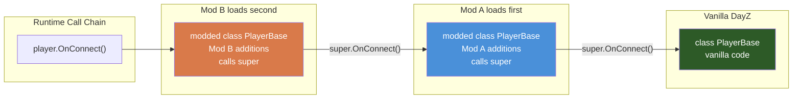

# Chapter 1.4: Modded Classes (The Key to DayZ Modding)

[Home](../README.md) | [<< Previous: Classes & Inheritance](03-classes-inheritance.md) | **Modded Classes** | [Next: Control Flow >>](05-control-flow.md)

---

## Introduction

**Modded classes are the single most important concept in DayZ modding.** They are the mechanism that allows your mod to change the behavior of existing game classes without replacing the original files. Without modded classes, DayZ modding as we know it would not exist.

Every major DayZ mod --- Community Online Tools, VPP Admin Tools, DayZ Expansion, Trader mods, medical overhauls, building systems --- works by using `modded class` to hook into vanilla classes and add or change behavior. When you mod `PlayerBase`, every player in the game gets your new behavior. When you mod `MissionServer`, your code runs as part of the server's mission lifecycle. When you mod `ItemBase`, every item in the game is affected.

This chapter is intentionally the longest and most detailed in Part 1 because getting modded classes right is what separates a working mod from one that crashes servers or breaks other mods.

---

## How Modded Classes Work

### The Basic Idea

Normally, `class Child extends Parent` creates a new class named `Child` that inherits from `Parent`. But `modded class Parent` does something fundamentally different: it **replaces** the original `Parent` class in the engine's class hierarchy, inserting your code into the inheritance chain.

```
Before modding:
  Parent -> (all code that creates Parent gets the original)

After modded class:
  Original Parent -> Your Modded Parent
  (all code that creates Parent now gets YOUR version)
```

Every `new Parent()` call anywhere in the game --- vanilla code, other mods, everywhere --- now creates an instance of your modded version.

### Syntax

```c
modded class ClassName
{
    // Your additions and overrides go here
}
```

That is it. No `extends`, no new name. The `modded` keyword tells the engine: "I am modifying the existing class `ClassName`."

### The Canonical Example

```c
// === Original vanilla class (in DayZ's scripts) ===
class ModMe
{
    void Say()
    {
        Print("Hello from the original");
    }
}

// === Your mod's script file ===
modded class ModMe
{
    override void Say()
    {
        Print("Hello from the mod");
        super.Say();  // Call the original
    }
}

// === What happens at runtime ===
void Test()
{
    ModMe obj = new ModMe();
    obj.Say();
    // Output:
    //   "Hello from the mod"
    //   "Hello from the original"
}
```

---

## Chaining: Multiple Mods Modding the Same Class

The real power of modded classes is that **multiple mods can modify the same class**, and they all chain together automatically. The engine processes mods in load order, and each `modded class` inherits from the previous one.

```c
// === Vanilla ===
class ModMe
{
    void Say()
    {
        Print("Original");
    }
}

// === Mod A (loaded first) ===
modded class ModMe
{
    override void Say()
    {
        Print("Mod A");
        super.Say();  // Calls original
    }
}

// === Mod B (loaded second) ===
modded class ModMe
{
    override void Say()
    {
        Print("Mod B");
        super.Say();  // Calls Mod A's version
    }
}

// === At runtime ===
void Test()
{
    ModMe obj = new ModMe();
    obj.Say();
    // Output (reverse load order):
    //   "Mod B"
    //   "Mod A"
    //   "Original"
}
```

This is why **always calling `super`** is critical. If Mod A does not call `super.Say()`, then the original `Say()` never runs. If Mod B does not call `super.Say()`, then Mod A's `Say()` never runs. One mod skipping `super` breaks the entire chain.

### Visual Representation

```
new ModMe() creates an instance with this inheritance chain:

  ModMe (Mod B's version)      <-- Instantiated
    |
    super -> ModMe (Mod A's version)
               |
               super -> ModMe (Original vanilla)
```

### How Modded Classes Work



---

## What You Can Do in a Modded Class

### 1. Override Existing Methods

The most common use. Add behavior before or after the vanilla code.

```c
modded class PlayerBase
{
    override void Init()
    {
        super.Init();  // Let vanilla initialization happen first
        Print("[MyMod] Player initialized: " + GetType());
    }
}
```

### 2. Add New Fields (Member Variables)

Extend the class with new data. Every instance of the modded class will have these fields.

```c
modded class PlayerBase
{
    protected int m_KillStreak;
    protected float m_LastKillTime;
    protected ref array<string> m_Achievements;

    override void Init()
    {
        super.Init();
        m_KillStreak = 0;
        m_LastKillTime = 0;
        m_Achievements = new array<string>;
    }
}
```

### 3. Add New Methods

Add entirely new functionality that other parts of your mod can call.

```c
modded class PlayerBase
{
    protected int m_Reputation;

    override void Init()
    {
        super.Init();
        m_Reputation = 0;
    }

    void AddReputation(int amount)
    {
        m_Reputation += amount;
        if (m_Reputation > 1000)
            Print("[MyMod] " + GetIdentity().GetName() + " is now a legend!");
    }

    int GetReputation()
    {
        return m_Reputation;
    }

    bool IsHeroStatus()
    {
        return m_Reputation >= 500;
    }
}
```

### 4. Access Private Members of the Original Class

Unlike normal inheritance where `private` members are inaccessible, **modded classes CAN access private members** of the original class. This is a special rule of the `modded` keyword.

```c
// Vanilla class
class VanillaClass
{
    private int m_SecretValue;

    private void DoSecretThing()
    {
        Print("Secret!");
    }
}

// Modded class CAN access private members
modded class VanillaClass
{
    void ExposeSecret()
    {
        Print(m_SecretValue);  // OK! Modded classes bypass private
        DoSecretThing();       // OK! Can call private methods too
    }
}
```

This is powerful but should be used carefully. Private members are private for a reason --- they may change between DayZ updates.

### 5. Override Constants

Modded classes can redefine constants:

```c
// Vanilla
class GameSettings
{
    const int MAX_PLAYERS = 60;
}

// Modded
modded class GameSettings
{
    const int MAX_PLAYERS = 100;  // Overrides the original value
}
```

---

## Common Modded Targets

These are the classes that virtually every DayZ mod hooks into. Understanding what each one offers is essential.

### MissionServer

Runs on the dedicated server. Handles server startup, player connections, and the game loop.

```c
modded class MissionServer
{
    protected ref MyServerManager m_MyManager;

    override void OnInit()
    {
        super.OnInit();

        // Initialize your server-side systems
        m_MyManager = new MyServerManager;
        m_MyManager.Init();
        Print("[MyMod] Server systems initialized");
    }

    override void OnMissionStart()
    {
        super.OnMissionStart();
        Print("[MyMod] Mission started");
    }

    override void OnMissionFinish()
    {
        // Clean up BEFORE super (super may tear down systems we depend on)
        if (m_MyManager)
            m_MyManager.Shutdown();

        super.OnMissionFinish();
    }

    // Called when a player connects
    override void InvokeOnConnect(PlayerBase player, PlayerIdentity identity)
    {
        super.InvokeOnConnect(player, identity);

        if (identity)
            Print("[MyMod] Player connected: " + identity.GetName());
    }

    // Called when a player disconnects
    override void InvokeOnDisconnect(PlayerBase player)
    {
        if (player && player.GetIdentity())
            Print("[MyMod] Player disconnected: " + player.GetIdentity().GetName());

        super.InvokeOnDisconnect(player);
    }

    // Called every server tick
    override void OnUpdate(float timeslice)
    {
        super.OnUpdate(timeslice);

        if (m_MyManager)
            m_MyManager.Update(timeslice);
    }
}
```

### MissionGameplay

Runs on the client. Handles client-side UI, input, and rendering hooks.

```c
modded class MissionGameplay
{
    protected ref MyHUDPanel m_MyHUD;

    override void OnInit()
    {
        super.OnInit();

        m_MyHUD = new MyHUDPanel;
        Print("[MyMod] Client HUD initialized");
    }

    override void OnUpdate(float timeslice)
    {
        super.OnUpdate(timeslice);

        if (m_MyHUD)
            m_MyHUD.Update(timeslice);
    }

    override void OnKeyPress(int key)
    {
        super.OnKeyPress(key);

        // Open custom menu on F5
        if (key == KeyCode.KC_F5)
        {
            if (m_MyHUD)
                m_MyHUD.Toggle();
        }
    }

    override void OnMissionFinish()
    {
        if (m_MyHUD)
            m_MyHUD.Destroy();

        super.OnMissionFinish();
    }
}
```

### PlayerBase

The player class. Every living player in the game is an instance of `PlayerBase` (or a subclass like `SurvivorBase`). Modding this class is how you add per-player features.

```c
modded class PlayerBase
{
    protected bool m_IsGodMode;
    protected float m_CustomTimer;

    override void Init()
    {
        super.Init();
        m_IsGodMode = false;
        m_CustomTimer = 0;
    }

    // Called every frame on the server for this player
    override void CommandHandler(float pDt, int pCurrentCommandID, bool pCurrentCommandFinished)
    {
        super.CommandHandler(pDt, pCurrentCommandID, pCurrentCommandFinished);

        // Server-side per-player tick
        if (GetGame().IsServer())
        {
            m_CustomTimer += pDt;
            if (m_CustomTimer >= 60.0)  // Every 60 seconds
            {
                m_CustomTimer = 0;
                OnMinuteElapsed();
            }
        }
    }

    void SetGodMode(bool enabled)
    {
        m_IsGodMode = enabled;
    }

    // Override damage to implement god mode
    override void EEHitBy(TotalDamageResult damageResult, int damageType, EntityAI source,
                          int component, string dmgZone, string ammo,
                          vector modelPos, float speedCoef)
    {
        if (m_IsGodMode)
            return;  // Skip damage entirely

        super.EEHitBy(damageResult, damageType, source, component, dmgZone, ammo, modelPos, speedCoef);
    }

    protected void OnMinuteElapsed()
    {
        // Custom periodic logic
    }
}
```

### ItemBase

The base class for all items. Modding this affects every item in the game.

```c
modded class ItemBase
{
    override void SetActions()
    {
        super.SetActions();

        // Add a custom action to ALL items
        AddAction(MyInspectAction);
    }

    override void EEItemLocationChanged(notnull InventoryLocation oldLoc, notnull InventoryLocation newLoc)
    {
        super.EEItemLocationChanged(oldLoc, newLoc);

        // Track when items move
        Print(string.Format("[MyMod] %1 moved from %2 to %3",
            GetType(), oldLoc.GetType(), newLoc.GetType()));
    }
}
```

### DayZGame

The global game class. Available throughout the entire game lifecycle.

```c
modded class DayZGame
{
    void DayZGame()
    {
        // Constructor: very early initialization
        Print("[MyMod] DayZGame constructor - extremely early init");
    }

    override void OnUpdate(bool doSim, float timeslice)
    {
        super.OnUpdate(doSim, timeslice);

        // Global update tick (both client and server)
    }
}
```

### CarScript

The base vehicle class. Mod it to change all vehicle behavior.

```c
modded class CarScript
{
    protected float m_BoostMultiplier;

    override void OnEngineStart()
    {
        super.OnEngineStart();
        m_BoostMultiplier = 1.0;
        Print("[MyMod] Vehicle engine started: " + GetType());
    }

    override void OnEngineStop()
    {
        super.OnEngineStop();
        Print("[MyMod] Vehicle engine stopped: " + GetType());
    }
}
```

---

## `#ifdef` Guards for Optional Dependencies

When your mod optionally supports another mod, use preprocessor guards. If the other mod defines a symbol in its `config.cpp` (via `CfgPatches`), you can check for it at compile time.

### How It Works

Every mod's `CfgPatches` class name becomes a preprocessor symbol. For example, if a mod has:

```cpp
class CfgPatches
{
    class MyMod_AI_Scripts
    {
        // ...
    };
};
```

Then `#ifdef MYMOD_AI_Scripts` will be `true` when that mod is loaded.

Many mods also define explicit symbols. The convention varies --- check the mod's documentation or `config.cpp`.

### Basic Pattern

```c
modded class PlayerBase
{
    override void Init()
    {
        super.Init();

        // This code ONLY compiles when MyMod_AI is present
        #ifdef MYMOD_AI
            MyAIManager mgr = MyAIManager.GetInstance();
            if (mgr)
                mgr.RegisterPlayer(this);
        #endif
    }
}
```

### Server vs Client Guards

```c
modded class MissionBase
{
    override void OnInit()
    {
        super.OnInit();

        // Server-only code
        #ifdef SERVER
            InitServerSystems();
        #endif

        // Client-only code (also runs on listen-server host)
        #ifndef SERVER
            InitClientHUD();
        #endif
    }

    #ifdef SERVER
    protected void InitServerSystems()
    {
        Print("[MyMod] Server systems started");
    }
    #endif

    #ifndef SERVER
    protected void InitClientHUD()
    {
        Print("[MyMod] Client HUD started");
    }
    #endif
}
```

### Multi-Mod Compatibility

Here is a real-world pattern for a mod that enhances players, with optional support for two other mods:

```c
modded class PlayerBase
{
    protected int m_BountyPoints;

    override void Init()
    {
        super.Init();
        m_BountyPoints = 0;
    }

    void AddBounty(int amount)
    {
        m_BountyPoints += amount;

        // If Expansion Notifications is loaded, show a fancy notification
        #ifdef EXPANSIONMODNOTIFICATION
            ExpansionNotification("Bounty!", string.Format("+%1 points", amount)).Create(GetIdentity());
        #else
            // Fallback: simple notification
            NotificationSystem.SendNotificationToPlayerExtended(this, 5, "Bounty",
                string.Format("+%1 points", amount), "");
        #endif

        // If a trader mod is loaded, update the player's balance
        #ifdef TraderPlus
            // TraderPlus-specific API call
        #endif
    }
}
```

---

## Professional Patterns from Real Mods

### Pattern 1: Non-Destructive Method Wrapping (COT Style)

Community Online Tools wraps methods by doing work before and after `super`, never replacing behavior entirely:

```c
modded class MissionServer
{
    // New field added by COT
    protected ref JMPlayerModule m_JMPlayerModule;

    override void OnInit()
    {
        super.OnInit();  // All vanilla init happens

        // COT adds its own initialization AFTER vanilla
        m_JMPlayerModule = new JMPlayerModule;
        m_JMPlayerModule.Init();
    }

    override void InvokeOnConnect(PlayerBase player, PlayerIdentity identity)
    {
        // COT does pre-processing
        if (identity)
            m_JMPlayerModule.OnClientConnect(identity);

        // Then lets vanilla (and other mods) handle it
        super.InvokeOnConnect(player, identity);

        // COT does post-processing
        if (identity)
            m_JMPlayerModule.OnClientReady(identity);
    }
}
```

### Pattern 2: Conditional Override (VPP Style)

VPP Admin Tools checks conditions before deciding whether to modify behavior:

```c
#ifndef VPPNOTIFICATIONS
modded class MissionGameplay
{
    private ref VPPNotificationUI m_NotificationUI;

    override void OnInit()
    {
        super.OnInit();
        m_NotificationUI = new VPPNotificationUI;
    }

    override void OnUpdate(float timeslice)
    {
        super.OnUpdate(timeslice);

        if (m_NotificationUI)
            m_NotificationUI.OnUpdate(timeslice);
    }
}
#endif
```

Note the `#ifndef VPPNOTIFICATIONS` guard --- this prevents the code from compiling if the standalone notifications mod is already loaded, avoiding conflicts.

### Pattern 3: Event Injection (Expansion Style)

DayZ Expansion injects events into vanilla classes to broadcast information to its own systems:

```c
modded class PlayerBase
{
    override void EEKilled(Object killer)
    {
        // Fire Expansion's event system before vanilla death handling
        ExpansionEventBus.Fire("OnPlayerKilled", this, killer);

        super.EEKilled(killer);

        // Post-death processing
        ExpansionEventBus.Fire("OnPlayerKilledPost", this, killer);
    }

    override void OnConnect()
    {
        super.OnConnect();
        ExpansionEventBus.Fire("OnPlayerConnect", this);
    }
}
```

### Pattern 4: Feature Registration (Community Framework Style)

CF mods register features in constructors, keeping initialization centralized:

```c
modded class DayZGame
{
    void DayZGame()
    {
        // CF registers its systems in the DayZGame constructor
        // This runs extremely early, before any mission loads
        CF_ModuleManager.RegisterModule(MyCFModule);
    }
}

modded class MissionServer
{
    void MissionServer()
    {
        // Constructor: runs when MissionServer is first created
        // Register RPCs here
        GetRPCManager().AddRPC("MyMod", "RPC_HandleRequest", this, SingleplayerExecutionType.Both);
    }
}
```

---

## Rules and Best Practices

### Rule 1: ALWAYS Call `super`

Unless you have a deliberate, well-understood reason to completely replace parent behavior, always call `super`. Failing to do so breaks the mod chain and can crash servers.

```c
// The GOLDEN RULE of modded classes
modded class AnyClass
{
    override void AnyMethod()
    {
        super.AnyMethod();  // ALWAYS unless you intentionally replace
        // Your code here
    }
}
```

When you do intentionally skip `super`, document why:

```c
modded class PlayerBase
{
    // Intentionally NOT calling super to completely disable fall damage
    // WARNING: This will also prevent other mods from running their fall damage code
    override void EEHitBy(TotalDamageResult damageResult, int damageType, EntityAI source,
                          int component, string dmgZone, string ammo,
                          vector modelPos, float speedCoef)
    {
        // Check if this is fall damage
        if (ammo == "FallDamage")
            return;  // Silently ignore

        // For all other damage, call the normal chain
        super.EEHitBy(damageResult, damageType, source, component, dmgZone, ammo, modelPos, speedCoef);
    }
}
```

### Rule 2: Initialize New Fields in the Right Override

When adding fields to a modded class, initialize them in the appropriate lifecycle method, not just anywhere:

| Class | Initialize in | Why |
|-------|--------------|-----|
| `PlayerBase` | `override void Init()` | Called once when the player entity is created |
| `ItemBase` | constructor or `override void InitItemVariables()` | Item creation |
| `MissionServer` | `override void OnInit()` | Server mission startup |
| `MissionGameplay` | `override void OnInit()` | Client mission startup |
| `DayZGame` | constructor `void DayZGame()` | Earliest possible point |
| `CarScript` | constructor or `override void EOnInit(IEntity other, int extra)` | Vehicle creation |

### Rule 3: Guard Against Null

In modded classes, you often work with objects that may not be initialized yet (because you are running before or after other code):

```c
modded class PlayerBase
{
    override void CommandHandler(float pDt, int pCurrentCommandID, bool pCurrentCommandFinished)
    {
        super.CommandHandler(pDt, pCurrentCommandID, pCurrentCommandFinished);

        // Always check: is this running on the server?
        if (!GetGame().IsServer())
            return;

        // Always check: is the player alive?
        if (!IsAlive())
            return;

        // Always check: does the player have an identity?
        PlayerIdentity identity = GetIdentity();
        if (!identity)
            return;

        // Now it is safe to use identity
        string uid = identity.GetPlainId();
    }
}
```

### Rule 4: Do Not Break Other Mods

Your modded class is part of a chain. Respect the contract:

- Do not swallow events silently (always call `super` unless deliberately overriding)
- Do not overwrite fields that other mods might have set (add your own fields instead)
- Use `#ifdef` guards for optional dependencies
- Test with other popular mods loaded

### Rule 5: Use Descriptive Field Prefixes

When adding fields to a modded class, prefix them with your mod name to avoid collisions with other mods adding fields to the same class:

```c
modded class PlayerBase
{
    // BAD: generic name, might collide with another mod
    protected int m_Points;

    // GOOD: mod-specific prefix
    protected int m_MyMod_Points;
    protected float m_MyMod_LastSync;
    protected ref array<string> m_MyMod_Unlocks;
}
```

---

## Common Mistakes

### 1. Not Calling `super` (The #1 Mod-Breaking Bug)

This cannot be emphasized enough. Every time you see a bug report that says "Mod X broke when I added Mod Y," the first thing to check is whether someone forgot to call `super`.

```c
// THIS BREAKS EVERYTHING DOWNSTREAM
modded class MissionServer
{
    override void OnInit()
    {
        // NO super.OnInit() call!
        // Every mod loaded before this one has its OnInit skipped
        Print("My mod started!");
    }
}
```

### 2. Overriding a Method That Does Not Exist

If you try to `override` a method that does not exist in the parent class, you get a compile error. This usually happens when:
- You misspelled the method name
- You are overriding a method from the wrong class
- A DayZ update renamed or removed the method

```c
modded class PlayerBase
{
    // ERROR: no such method in PlayerBase
    // override void OnPlayerSpawned()

    // CORRECT method name:
    override void OnConnect()
    {
        super.OnConnect();
    }
}
```

### 3. Modding the Wrong Class

A common beginner mistake is modding a class that seems right by name but is in the wrong script layer:

```c
// WRONG: MissionBase is the abstract base -- your hooks here may not fire
// when you expect them to
modded class MissionBase
{
    override void OnInit()
    {
        super.OnInit();
        // This runs for ALL mission types -- but is it what you want?
    }
}

// RIGHT: Choose the specific class for your target
// For server logic:
modded class MissionServer
{
    override void OnInit() { super.OnInit(); /* server code */ }
}

// For client UI:
modded class MissionGameplay
{
    override void OnInit() { super.OnInit(); /* client code */ }
}
```

### 4. Heavy Processing in Per-Frame Overrides

Methods like `OnUpdate()` and `CommandHandler()` run every tick or every frame. Adding expensive logic here destroys server/client performance:

```c
modded class PlayerBase
{
    // BAD: runs every frame for every player
    override void CommandHandler(float pDt, int pCurrentCommandID, bool pCurrentCommandFinished)
    {
        super.CommandHandler(pDt, pCurrentCommandID, pCurrentCommandFinished);

        // This creates and destroys an array EVERY FRAME for EVERY PLAYER
        array<Man> players = new array<Man>;
        GetGame().GetPlayers(players);
        foreach (Man m : players)
        {
            // O(n^2) per frame!
        }
    }
}

// GOOD: use a timer to throttle expensive operations
modded class PlayerBase
{
    protected float m_MyMod_Timer;

    override void CommandHandler(float pDt, int pCurrentCommandID, bool pCurrentCommandFinished)
    {
        super.CommandHandler(pDt, pCurrentCommandID, pCurrentCommandFinished);

        if (!GetGame().IsServer())
            return;

        m_MyMod_Timer += pDt;
        if (m_MyMod_Timer < 5.0)  // Every 5 seconds, not every frame
            return;

        m_MyMod_Timer = 0;
        DoExpensiveWork();
    }

    protected void DoExpensiveWork()
    {
        // Periodic logic here
    }
}
```

### 5. Forgetting `#ifdef` Guards for Optional Dependencies

If your mod references a class from another mod without `#ifdef` guards, it will fail to compile when that mod is not loaded:

```c
modded class PlayerBase
{
    override void Init()
    {
        super.Init();

        // BAD: compile error if ExpansionMod is not loaded
        // ExpansionHumanity.AddKarma(this, 10);

        // GOOD: guarded with #ifdef
        #ifdef EXPANSIONMODCORE
            ExpansionHumanity.AddKarma(this, 10);
        #endif
    }
}
```

### 6. Destructors: Clean Up Before `super`

When overriding destructors or cleanup methods, do your cleanup **before** calling `super`, since `super` may destroy resources you depend on:

```c
modded class MissionServer
{
    protected ref MyManager m_MyManager;

    override void OnMissionFinish()
    {
        // Clean up YOUR stuff first
        if (m_MyManager)
        {
            m_MyManager.Save();
            m_MyManager.Shutdown();
        }
        m_MyManager = null;

        // THEN let vanilla and other mods clean up
        super.OnMissionFinish();
    }
}
```

---

## File Naming and Organization

Modded class files should follow a clear naming convention so you can tell at a glance what class is being modded and by which mod:

```
MyMod/
  Scripts/
    3_Game/
      MyMod/
    4_World/
      MyMod/
        Entities/
          ManBase/
            MyMod_PlayerBase.c         <-- modded class PlayerBase
          ItemBase/
            MyMod_ItemBase.c           <-- modded class ItemBase
          Vehicles/
            MyMod_CarScript.c          <-- modded class CarScript
    5_Mission/
      MyMod/
        Mission/
          MyMod_MissionServer.c        <-- modded class MissionServer
          MyMod_MissionGameplay.c      <-- modded class MissionGameplay
```

This mirrors the vanilla DayZ file structure, making it easy to find which file mods which class.

---

## Practice Exercises

### Exercise 1: Player Join Logger
Create a `modded class MissionServer` that prints a message to the server log whenever a player connects or disconnects, including their name and UID. Make sure to call `super`.

### Exercise 2: Item Inspection
Create a `modded class ItemBase` that adds a method `string GetInspectInfo()` which returns a formatted string showing the item's class name, health, and whether it is ruined. Override an appropriate method to print this info when the item is placed in a player's hands.

### Exercise 3: Admin God Mode
Create a `modded class PlayerBase` that:
1. Adds a `m_IsGodMode` field
2. Adds `EnableGodMode()` and `DisableGodMode()` methods
3. Overrides the damage method `EEHitBy` to skip damage when god mode is active
4. Always calls `super` for normal (non-god-mode) damage

### Exercise 4: Vehicle Speed Logger
Create a `modded class CarScript` that tracks the maximum speed reached during each engine session. Override `OnEngineStart()` and `OnEngineStop()` to begin/end tracking. Print the max speed when the engine stops.

### Exercise 5: Optional Mod Integration
Create a `modded class PlayerBase` that adds a reputation system. When a player kills a zombie, they gain 1 point. Use `#ifdef` guards to:
- If Expansion's notification system is available, show a notification
- If a trader mod is available, add currency
- If neither is available, fall back to a simple Print() message

---

## Summary

| Concept | Details |
|---------|---------|
| Syntax | `modded class ClassName { }` |
| Effect | Replaces the original class globally for all `new` calls |
| Chaining | Multiple mods can mod the same class; they chain in load order |
| `super` | **Always call it** unless deliberately replacing behavior |
| New fields | Add with mod-specific prefixes (`m_MyMod_FieldName`) |
| New methods | Fully supported; callable from anywhere that has a reference |
| Private access | Modded classes **can** access private members of the original |
| `#ifdef` guards | Use for optional dependencies on other mods |
| Common targets | `MissionServer`, `MissionGameplay`, `PlayerBase`, `ItemBase`, `DayZGame`, `CarScript` |

### The Three Commandments of Modded Classes

1. **Always call `super`** --- unless you have a documented reason not to
2. **Guard optional dependencies with `#ifdef`** --- your mod should work standalone
3. **Prefix your fields and methods** --- avoid name collisions with other mods

---

[Home](../README.md) | [<< Previous: Classes & Inheritance](03-classes-inheritance.md) | **Modded Classes** | [Next: Control Flow >>](05-control-flow.md)
