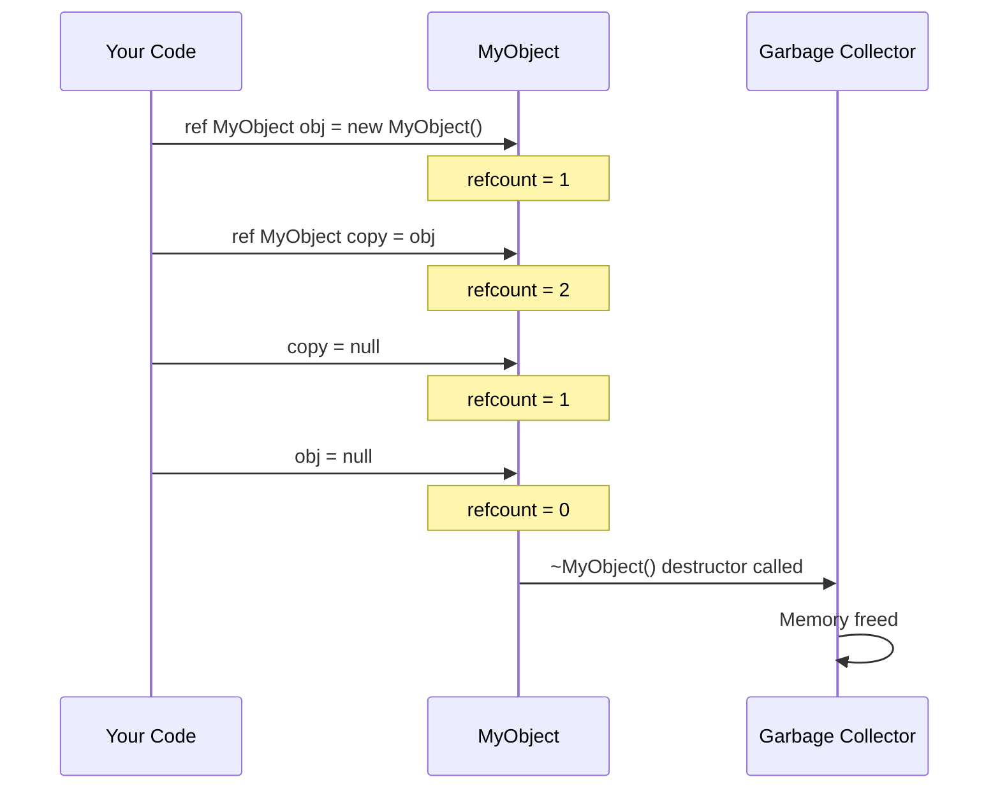
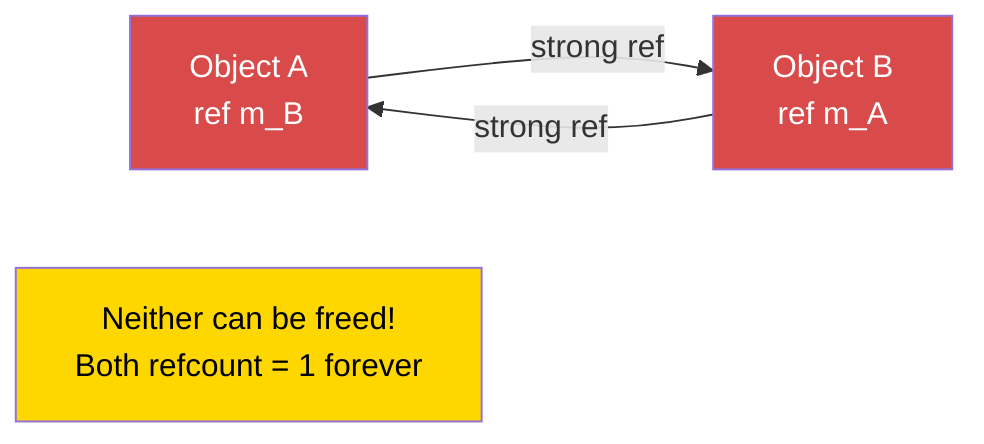

# Chapter 1.8: Memory Management

[Home](../README.md) | [<< Previous: Math & Vectors](07-math-vectors.md) | **Memory Management** | [Next: Casting & Reflection >>](09-casting-reflection.md)

---

## Introduction

Enforce Script uses **automatic reference counting (ARC)** for memory management -- not garbage collection in the traditional sense. Understanding how `ref`, `autoptr`, and raw pointers work is essential for writing stable DayZ mods. Get it wrong and you will either leak memory (your server gradually consumes more RAM until it crashes) or access deleted objects (instant crash with no useful error message). This chapter explains every pointer type, when to use each, and how to avoid the most dangerous pitfall: reference cycles.

---

## The Three Pointer Types

Enforce Script has three ways to hold a reference to an object:

| Pointer Type | Keyword | Keeps Object Alive? | Zeroed on Delete? | Primary Use |
|-------------|---------|---------------------|-------------------|-------------|
| **Raw pointer** | *(none)* | No (weak reference) | Only if class extends `Managed` | Back-references, observers, caches |
| **Strong reference** | `ref` | Yes | Yes | Owned members, collections |
| **Auto pointer** | `autoptr` | Yes, deleted at end of scope | Yes | Local variables |

### How ARC Works

Every object has a **reference count** -- the number of strong references (`ref`, `autoptr`, local variables, function arguments) pointing to it. When the count drops to zero, the object is automatically destroyed and its destructor is called.

**Weak references** (raw pointers) do NOT increase the reference count. They observe the object without keeping it alive.

---

## Raw Pointers (Weak References)

A raw pointer is any variable declared without `ref` or `autoptr`. For class members, this creates a **weak reference**: it points to the object but does NOT keep it alive.

```c
class Observer
{
    PlayerBase m_WatchedPlayer;  // Weak reference -- does NOT keep player alive

    void Watch(PlayerBase player)
    {
        m_WatchedPlayer = player;
    }

    void Report()
    {
        if (m_WatchedPlayer) // ALWAYS null-check weak references
        {
            Print("Watching: " + m_WatchedPlayer.GetIdentity().GetName());
        }
        else
        {
            Print("Player no longer exists");
        }
    }
}
```

### Managed vs Non-Managed classes

The safety of weak references depends on whether the object's class extends `Managed`:

- **Managed classes** (most DayZ gameplay classes): When the object is deleted, all weak references are automatically set to `null`. This is safe.
- **Non-Managed classes** (plain `class` without inheriting `Managed`): When the object is deleted, weak references become **dangling pointers** -- they still hold the old memory address. Accessing them causes a crash.

```c
// SAFE -- Managed class, weak refs are zeroed
class SafeData : Managed
{
    int m_Value;
}

void TestManaged()
{
    SafeData data = new SafeData();
    SafeData weakRef = data;
    delete data;

    if (weakRef) // false -- weakRef was automatically set to null
    {
        Print(weakRef.m_Value); // Never reached
    }
}
```

```c
// DANGEROUS -- Non-Managed class, weak refs become dangling
class UnsafeData
{
    int m_Value;
}

void TestNonManaged()
{
    UnsafeData data = new UnsafeData();
    UnsafeData weakRef = data;
    delete data;

    if (weakRef) // TRUE -- weakRef still holds old address!
    {
        Print(weakRef.m_Value); // CRASH! Accessing deleted memory
    }
}
```

> **Rule:** If you are writing your own classes, always extend `Managed` for safety. Most DayZ engine classes (EntityAI, ItemBase, PlayerBase, etc.) already inherit from `Managed`.

---

## ref (Strong Reference)

The `ref` keyword marks a variable as a **strong reference**. The object stays alive as long as at least one strong reference exists. When the last strong reference is destroyed or overwritten, the object is deleted.

### Class members

Use `ref` for objects that your class **owns** and is responsible for creating and destroying.

```c
class MissionManager
{
    protected ref array<ref MissionBase> m_ActiveMissions;
    protected ref map<string, ref MissionConfig> m_Configs;
    protected ref MyLog m_Logger;

    void MissionManager()
    {
        m_ActiveMissions = new array<ref MissionBase>;
        m_Configs = new map<string, ref MissionConfig>;
        m_Logger = new MyLog;
    }

    // No destructor needed! When MissionManager is deleted:
    // 1. m_Logger ref is released -> MyLog is deleted
    // 2. m_Configs ref is released -> map is deleted -> each MissionConfig is deleted
    // 3. m_ActiveMissions ref is released -> array is deleted -> each MissionBase is deleted
}
```

### Collections of owned objects

When you store objects in an array or map and want the collection to own them, use `ref` on both the collection AND the elements:

```c
class ZoneManager
{
    // The array is owned (ref), and each zone inside is owned (ref)
    protected ref array<ref SafeZone> m_Zones;

    void ZoneManager()
    {
        m_Zones = new array<ref SafeZone>;
    }

    void AddZone(vector center, float radius)
    {
        ref SafeZone zone = new SafeZone(center, radius);
        m_Zones.Insert(zone);
    }
}
```

**Critical distinction:** An `array<SafeZone>` holds **weak** references. An `array<ref SafeZone>` holds **strong** references. If you use the weak version, objects inserted into the array may be immediately deleted because no strong reference keeps them alive.

```c
// WRONG -- Objects are deleted immediately after insertion!
ref array<MyClass> weakArray = new array<MyClass>;
weakArray.Insert(new MyClass()); // Object created, inserted as weak ref,
                                  // no strong ref exists -> IMMEDIATELY deleted

// CORRECT -- Objects are kept alive by the array
ref array<ref MyClass> strongArray = new array<ref MyClass>;
strongArray.Insert(new MyClass()); // Object lives as long as it's in the array
```

---

## autoptr (Scoped Strong Reference)

`autoptr` is identical to `ref` but is intended for **local variables**. The object is automatically deleted when the variable goes out of scope (when the function returns).

```c
void ProcessData()
{
    autoptr JsonSerializer serializer = new JsonSerializer;
    // Use serializer...

    // serializer is automatically deleted here when the function exits
}
```

### When to use autoptr

In practice, **local variables are already strong references by default** in Enforce Script. The `autoptr` keyword makes this explicit and self-documenting. You can use either:

```c
void Example()
{
    // These are functionally equivalent:
    MyClass a = new MyClass();       // Local var = strong ref (implicit)
    autoptr MyClass b = new MyClass(); // Local var = strong ref (explicit)

    // Both a and b are deleted when this function exits
}
```

> **Convention in DayZ modding:** Most codebases use `ref` for class members and omit `autoptr` for locals (relying on the implicit strong reference behavior). The CLAUDE.md for this project notes: "**`autoptr` is NOT used** -- use explicit `ref`." Follow whichever convention your project establishes.

---

## notnull Parameter Modifier

The `notnull` modifier on a function parameter tells the compiler that null is not a valid argument. The compiler enforces this at call sites.

```c
void ProcessPlayer(notnull PlayerBase player)
{
    // No need to check for null -- the compiler guarantees it
    string name = player.GetIdentity().GetName();
    Print("Processing: " + name);
}

void CallExample(PlayerBase maybeNull)
{
    if (maybeNull)
    {
        ProcessPlayer(maybeNull); // OK -- we checked first
    }

    // ProcessPlayer(null); // COMPILE ERROR: cannot pass null to notnull parameter
}
```

Use `notnull` on parameters where null would always be a programming error. It catches bugs at compile time rather than causing crashes at runtime.

---

## Reference Cycles (MEMORY LEAK WARNING)

A reference cycle occurs when two objects hold strong references (`ref`) to each other. Neither object can ever be deleted because each one keeps the other alive. This is the most common source of memory leaks in DayZ mods.

### The problem

```c
class Parent
{
    ref Child m_Child; // Strong reference to Child
}

class Child
{
    ref Parent m_Parent; // Strong reference to Parent -- CYCLE!
}

void CreateCycle()
{
    ref Parent parent = new Parent();
    ref Child child = new Child();

    parent.m_Child = child;
    child.m_Parent = parent;

    // When this function exits:
    // - The local 'parent' ref is released, but child.m_Parent still holds parent alive
    // - The local 'child' ref is released, but parent.m_Child still holds child alive
    // NEITHER object is ever deleted! This is a permanent memory leak.
}
```

### The fix: One side must be a raw (weak) reference

Break the cycle by making one side a weak reference. The "child" should hold a weak reference to its "parent":

```c
class Parent
{
    ref Child m_Child; // Strong -- parent OWNS the child
}

class Child
{
    Parent m_Parent; // Weak (raw) -- child OBSERVES the parent
}

void NoCycle()
{
    ref Parent parent = new Parent();
    ref Child child = new Child();

    parent.m_Child = child;
    child.m_Parent = parent;

    // When this function exits:
    // - Local 'parent' ref is released -> parent's ref count = 0 -> DELETED
    // - Parent destructor releases m_Child -> child's ref count = 0 -> DELETED
    // Both objects are properly cleaned up!
}
```

### Real-world example: UI panels

A common pattern in DayZ UI code is a panel that holds widgets, where widgets need a reference back to the panel. The panel owns the widgets (strong ref), and widgets observe the panel (weak ref).

```c
class AdminPanel
{
    protected ref array<ref AdminPanelTab> m_Tabs; // Owns the tabs

    void AdminPanel()
    {
        m_Tabs = new array<ref AdminPanelTab>;
    }

    void AddTab(string name)
    {
        ref AdminPanelTab tab = new AdminPanelTab(name, this);
        m_Tabs.Insert(tab);
    }
}

class AdminPanelTab
{
    protected string m_Name;
    protected AdminPanel m_Owner; // WEAK -- avoids cycle

    void AdminPanelTab(string name, AdminPanel owner)
    {
        m_Name = name;
        m_Owner = owner; // Weak reference back to parent
    }

    AdminPanel GetOwner()
    {
        return m_Owner; // May be null if panel was deleted
    }
}
```

### Reference Counting Lifecycle



### Reference Cycle (Memory Leak)



---

## The delete Keyword

You can manually delete an object at any time using `delete`. This destroys the object **immediately**, regardless of its reference count. All references (both strong and weak, on Managed classes) are set to null.

```c
void ManualDelete()
{
    ref MyClass obj = new MyClass();
    ref MyClass anotherRef = obj;

    Print(obj != null);        // true
    Print(anotherRef != null); // true

    delete obj;

    Print(obj != null);        // false
    Print(anotherRef != null); // false (also nulled, on Managed classes)
}
```

### When to use delete

- When you need to release a resource **immediately** (not waiting for ARC)
- When cleaning up in a shutdown/destroy method
- When removing objects from the game world (`GetGame().ObjectDelete(obj)` for game entities)

### When NOT to use delete

- On objects owned by someone else (the owner's `ref` will become null unexpectedly)
- On objects still in use by other systems (timers, callbacks, UI)
- On engine-managed entities without going through proper channels

---

## Garbage Collection Behavior

Enforce Script does NOT have a traditional garbage collector that periodically scans for unreachable objects. Instead, it uses **deterministic reference counting:**

1. When a strong reference is created (assignment to `ref`, local variable, function argument), the object's reference count increases.
2. When a strong reference goes out of scope or is overwritten, the reference count decreases.
3. When the reference count reaches zero, the object is **immediately** destroyed (destructor is called, memory is freed).
4. `delete` bypasses the reference count and destroys the object immediately.

This means:
- Object lifetimes are predictable and deterministic
- There are no "GC pauses" or unpredictable delays
- Reference cycles are NEVER collected -- they are permanent leaks
- Order of destruction is well-defined: objects are destroyed in reverse order of their last reference being released

---

## Real-World Example: Proper Manager Class

Here is a complete example showing proper memory management patterns for a typical DayZ mod manager:

```c
class MyZoneManager
{
    // Singleton instance -- the only strong ref keeping this alive
    private static ref MyZoneManager s_Instance;

    // Owned collections -- manager is responsible for these
    protected ref array<ref MyZone> m_Zones;
    protected ref map<string, ref MyZoneConfig> m_Configs;

    // Weak reference to external system -- we don't own this
    protected PlayerBase m_LastEditor;

    void MyZoneManager()
    {
        m_Zones = new array<ref MyZone>;
        m_Configs = new map<string, ref MyZoneConfig>;
    }

    void ~MyZoneManager()
    {
        // Explicit cleanup (optional -- ARC handles it, but good practice)
        m_Zones.Clear();
        m_Configs.Clear();
        m_LastEditor = null;

        Print("[MyZoneManager] Destroyed");
    }

    static MyZoneManager GetInstance()
    {
        if (!s_Instance)
        {
            s_Instance = new MyZoneManager();
        }
        return s_Instance;
    }

    static void DestroyInstance()
    {
        s_Instance = null; // Releases the strong ref, triggers destructor
    }

    void CreateZone(string name, vector center, float radius, PlayerBase editor)
    {
        ref MyZoneConfig config = new MyZoneConfig(name, center, radius);
        m_Configs.Set(name, config);

        ref MyZone zone = new MyZone(config);
        m_Zones.Insert(zone);

        m_LastEditor = editor; // Weak reference -- we don't own the player
    }

    void RemoveZone(int index)
    {
        if (!m_Zones.IsValidIndex(index))
            return;

        MyZone zone = m_Zones.Get(index);
        string name = zone.GetName();

        m_Zones.RemoveOrdered(index); // Strong ref released, zone may be deleted
        m_Configs.Remove(name);       // Config ref released, config deleted
    }

    MyZone FindZoneAtPosition(vector pos)
    {
        foreach (MyZone zone : m_Zones)
        {
            if (zone.ContainsPosition(pos))
                return zone; // Return weak reference to caller
        }
        return null;
    }
}

class MyZone
{
    protected string m_Name;
    protected vector m_Center;
    protected float m_Radius;
    protected MyZoneConfig m_Config; // Weak -- config is owned by manager

    void MyZone(MyZoneConfig config)
    {
        m_Config = config; // Weak reference
        m_Name = config.GetName();
        m_Center = config.GetCenter();
        m_Radius = config.GetRadius();
    }

    string GetName() { return m_Name; }

    bool ContainsPosition(vector pos)
    {
        return vector.Distance(m_Center, pos) <= m_Radius;
    }
}

class MyZoneConfig
{
    protected string m_Name;
    protected vector m_Center;
    protected float m_Radius;

    void MyZoneConfig(string name, vector center, float radius)
    {
        m_Name = name;
        m_Center = center;
        m_Radius = radius;
    }

    string GetName() { return m_Name; }
    vector GetCenter() { return m_Center; }
    float GetRadius() { return m_Radius; }
}
```

### Memory ownership diagram for this example

```
MyZoneManager (singleton, owned by static s_Instance)
  |
  |-- ref array<ref MyZone>   m_Zones     [STRONG -> STRONG elements]
  |     |
  |     +-- MyZone
  |           |-- MyZoneConfig m_Config    [WEAK -- owned by m_Configs]
  |
  |-- ref map<string, ref MyZoneConfig> m_Configs  [STRONG -> STRONG elements]
  |     |
  |     +-- MyZoneConfig                   [OWNED here]
  |
  +-- PlayerBase m_LastEditor                [WEAK -- owned by engine]
```

When `DestroyInstance()` is called:
1. `s_Instance` is set to null, releasing the strong reference
2. `MyZoneManager` destructor runs
3. `m_Zones` is released -> array is deleted -> each `MyZone` is deleted
4. `m_Configs` is released -> map is deleted -> each `MyZoneConfig` is deleted
5. `m_LastEditor` is a weak reference, nothing to clean up
6. All memory is freed. No leaks.

---

## Best Practices

- Use `ref` for class members your class creates and owns; use raw pointers (no keyword) for back-references and external observations.
- Always extend `Managed` for pure-script classes -- it ensures weak references are zeroed on delete, preventing dangling pointer crashes.
- Break reference cycles by making the child hold a raw pointer to its parent: parent owns child (`ref`), child observes parent (raw).
- Use `array<ref MyClass>` when the collection owns its elements; `array<MyClass>` holds weak references that will not keep objects alive.
- Prefer ARC-driven cleanup over manual `delete` -- let the last `ref` release trigger the destructor naturally.

---

## Observed in Real Mods

> Patterns confirmed by studying professional DayZ mod source code.

| Pattern | Mod | Detail |
|---------|-----|--------|
| Parent `ref` + child raw back-pointer | COT / Expansion UI | Panels own tabs with `ref`, tabs hold raw pointer to parent panel to avoid cycles |
| `static ref` singleton + `Destroy()` nulling | Dabs / VPP | All singletons use `s_Instance = null` in a static `Destroy()` to trigger cleanup |
| `ref array<ref T>` for managed collections | Expansion Market | Both the array and its elements are `ref` to ensure proper ownership |
| Raw pointer for engine entities (players, items) | COT Admin | Player references stored as raw pointers since the engine manages entity lifetime |

---

## Theory vs Practice

| Concept | Theory | Reality |
|---------|--------|---------|
| `autoptr` for local variables | Should auto-delete at scope exit | Locals are already implicitly strong references; `autoptr` is rarely used in practice |
| ARC handles all cleanup | Objects freed when refcount hits zero | Reference cycles are never collected -- they leak permanently until server restart |
| `delete` for immediate cleanup | Destroys the object right away | Can null out references held by other systems unexpectedly -- prefer letting ARC handle it |

---

## Common Mistakes

| Mistake | Problem | Fix |
|---------|---------|-----|
| Two objects with `ref` to each other | Reference cycle, permanent memory leak | One side must be a raw (weak) reference |
| `array<MyClass>` instead of `array<ref MyClass>` | Elements are weak references, objects may be deleted immediately | Use `array<ref MyClass>` for owned elements |
| Accessing a raw pointer after the object was deleted | Crash (dangling pointer on non-Managed classes) | Extend `Managed` and always null-check weak references |
| Not checking weak references for null | Crash when the referenced object has been deleted | Always: `if (weakRef) { weakRef.DoThing(); }` |
| Using `delete` on objects owned by another system | The owner's `ref` becomes null unexpectedly | Let the owner release the object through ARC |
| Storing `ref` to engine entities (players, items) | Can fight with engine lifetime management | Use raw pointers for engine entities |
| Forgetting `ref` on class member collections | Collection is a weak reference, may be collected | Always: `protected ref array<...> m_List;` |
| Circular parent-child with `ref` on both sides | Classic cycle; neither parent nor child is ever freed | Parent owns child (`ref`), child observes parent (raw) |

---

## Decision Guide: Which Pointer Type?

```
Is this a class member that this class CREATES and OWNS?
  -> YES: Use ref
  -> NO: Is this a back-reference or external observation?
    -> YES: Use raw pointer (no keyword), always null-check
    -> NO: Is this a local variable in a function?
      -> YES: Raw is fine (locals are implicitly strong)
      -> Explicit autoptr is optional for clarity

Storing objects in a collection (array/map)?
  -> Objects OWNED by the collection: array<ref MyClass>
  -> Objects OBSERVED by the collection: array<MyClass>

Function parameter that must never be null?
  -> Use notnull modifier
```

---

## Quick Reference

```c
// Raw pointer (weak reference for class members)
MyClass m_Observer;              // Does NOT keep object alive
                                 // Set to null on delete (Managed only)

// Strong reference (keeps object alive)
ref MyClass m_Owned;             // Object lives until ref is released
ref array<ref MyClass> m_List;   // Array AND elements are strongly held

// Auto pointer (scoped strong reference)
autoptr MyClass local;           // Deleted when scope exits

// notnull (compile-time null guard)
void Func(notnull MyClass obj);  // Compiler rejects null arguments

// Manual delete (immediate, bypasses ARC)
delete obj;                      // Destroys immediately, nulls all refs (Managed)

// Break reference cycles: one side must be weak
class Parent { ref Child m_Child; }      // Strong -- parent owns child
class Child  { Parent m_Parent; }        // Weak   -- child observes parent
```

---

[<< 1.7: Math & Vectors](07-math-vectors.md) | [Home](../README.md) | [1.9: Casting & Reflection >>](09-casting-reflection.md)
