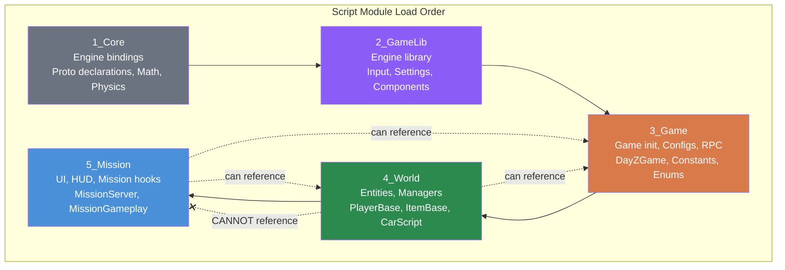
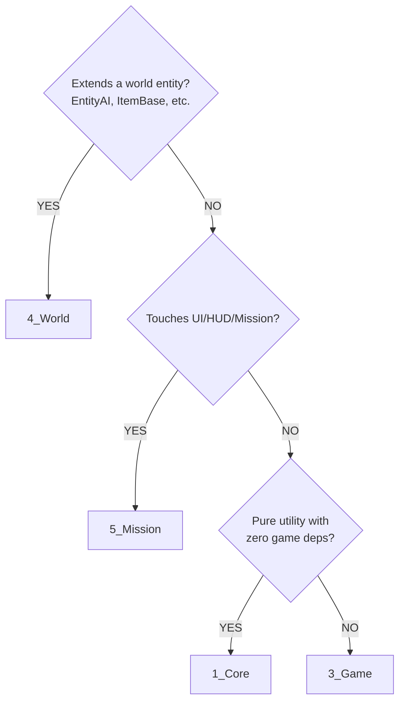

# Chapter 2.1: The 5-Layer Script Hierarchy

[Home](../README.md) | **The 5-Layer Script Hierarchy** | [Next: config.cpp Deep Dive >>](02-config-cpp.md)

---

> **Summary:** DayZ organizes all scripts into five compilation layers. Understanding these layers is the single most important concept in DayZ modding -- it determines where every file in your mod lives, what it can access, and when it executes.

---

## Table of Contents

- [Overview](#overview)
- [The Layer Stack](#the-layer-stack)
- [Layer 1: 1_Core (engineScriptModule)](#layer-1-1_core-enginescriptmodule)
- [Layer 2: 2_GameLib (gameLibScriptModule)](#layer-2-2_gamelib-gamelibscriptmodule)
- [Layer 3: 3_Game (gameScriptModule)](#layer-3-3_game-gamescriptmodule)
- [Layer 4: 4_World (worldScriptModule)](#layer-4-4_world-worldscriptmodule)
- [Layer 5: 5_Mission (missionScriptModule)](#layer-5-5_mission-missionscriptmodule)
- [The Critical Rule](#the-critical-rule)
- [Load Order and Timing](#load-order-and-timing)
- [When Each Layer Executes](#when-each-layer-executes)
- [Practical Guidelines](#practical-guidelines)
- [Quick Decision Guide](#quick-decision-guide)
- [Common Mistakes](#common-mistakes)

---

## Overview

The DayZ engine compiles scripts in five distinct passes called **script modules**. Each module corresponds to a numbered folder in your mod's `Scripts/` directory:

```
Scripts/
  1_Core/          --> engineScriptModule
  2_GameLib/       --> gameLibScriptModule
  3_Game/          --> gameScriptModule
  4_World/         --> worldScriptModule
  5_Mission/       --> missionScriptModule
```

Each layer builds on top of the previous ones. The numbers are not arbitrary -- they define a strict compilation and dependency order enforced by the engine.

---

## The Layer Stack



---

## Layer 1: 1_Core (engineScriptModule)

### Purpose

The absolute foundation. Code here runs at the engine level before any game systems exist. This is the earliest point where mod code can execute.

### What Goes Here

- Constants and enums shared across all layers
- Pure utility functions (math helpers, string utilities)
- Logging infrastructure (the logger itself, not what logs)
- Preprocessor defines and typedefs
- Base class definitions that need to be visible everywhere

### Real Examples

**Community Framework** places its core module system here:

```c
// 1_Core/CF_ModuleCoreManager.c
class CF_ModuleCoreManager
{
    static ref array<typename> s_Modules = new array<typename>;

    static void _Insert(typename module)
    {
        s_Modules.Insert(module);
    }
};
```

**A framework mod** might place logging constants here:

```c
// 1_Core/MyLogLevel.c
enum MyLogLevel
{
    TRACE = 0,
    DEBUG = 1,
    INFO  = 2,
    WARN  = 3,
    ERROR = 4
};
```

### When to Use

Use `1_Core` only when you need something available to **all** other layers, and it has zero dependency on game types like `PlayerBase`, `ItemBase`, or `MissionBase`. Most mods do not need this layer at all.

---

## Layer 2: 2_GameLib (gameLibScriptModule)

### Purpose

Low-level engine library bindings. This layer exists in the vanilla script hierarchy but is **rarely used by mods**. It sits between the raw engine and the game logic.

### What Goes Here

- Engine-level abstractions (rendering, sound engine bindings)
- Mathematical libraries beyond what `1_Core` provides
- Base widget/UI engine types

### Real Examples

**DabsFramework** is one of the few mods that uses this layer:

```c
// 2_GameLib/DabsFramework/MVC/ScriptView.c
// Low-level view binding infrastructure
class ScriptView : ScriptedWidgetEventHandler
{
    // ...
};
```

### When to Use

Almost never. Unless you are building a framework that needs engine-level bindings below the game layer, skip `2_GameLib` entirely. The vast majority of mods use only layers 3, 4, and 5.

---

## Layer 3: 3_Game (gameScriptModule)

### Purpose

The workhorse layer for configuration, data definitions, and systems that do not interact directly with world entities. This is the first layer where game types are available.

### What Goes Here

- Configuration classes (settings that can be loaded/saved)
- RPC registration and identifiers
- Data classes and DTOs (data transfer objects)
- Input binding registration
- Plugin/module registration systems
- Shared enums and constants that depend on game types
- Custom keybind handlers

### Real Examples

**A framework mod** configuration system:

```c
// 3_Game/MyMod/Config/MyConfigBase.c
class MyConfigBase
{
    // Base configuration with automatic JSON persistence
    void Load();
    void Save();
    string GetConfigPath();
};
```

**COT** defines its RPC identifiers here:

```c
// 3_Game/COT/RPCData.c
class JMRPCData
{
    static const int WEATHER_SET  = 0x1001;
    static const int PLAYER_HEAL  = 0x1002;
    // ...
};
```

**VPP Admin Tools** registers its chat commands:

```c
// 3_Game/VPPAdminTools/ChatCommands/ChatCommandBase.c
class ChatCommandBase
{
    string GetCommand();
    bool Execute(PlayerIdentity sender, array<string> args);
};
```

### When to Use

**If in doubt, put it in `3_Game`.** This is the default layer for most non-entity code. Configuration classes, enums, constants, RPC definitions, data classes -- all belong here.

---

## Layer 4: 4_World (worldScriptModule)

### Purpose

Gameplay logic that interacts with the 3D world. This layer has access to entities, items, vehicles, buildings, and all world objects.

### What Goes Here

- Custom items and weapons (extending `ItemBase`, `Weapon_Base`)
- Custom entities (extending `Building`, `DayZAnimal`, etc.)
- World managers (spawn systems, loot managers, AI directors)
- Player extensions (modded `PlayerBase` behavior)
- Vehicle customization
- Action systems (extending `ActionBase`)
- Trigger zones and area effects

### Real Examples

**A missions mod** spawns mission markers in the world:

```c
// 4_World/Missions/MyMissionMarker.c
class MyMissionMarker : House
{
    void MyMissionMarker()
    {
        SetFlags(EntityFlags.VISIBLE, true);
    }

    void SetPosition(vector pos)
    {
        SetPosition(pos);
    }
};
```

**An AI mod** implements bot entities here:

```c
// 4_World/AI/MyAIBot.c
class MyAIBot : SurvivorBase
{
    protected ref MyAIBrain m_Brain;

    override void EOnInit(IEntity other, int extra)
    {
        super.EOnInit(other, extra);
        m_Brain = new MyAIBrain(this);
    }
};
```

**Vanilla DayZ** defines all items here:

```c
// 4_World/Entities/ItemBase/Edible_Base.c
class Edible_Base extends ItemBase
{
    // All food items inherit from this
};
```

### When to Use

Anything that touches the physical game world: creating entities, modifying items, handling player interactions, managing world state. If your class extends `EntityAI`, `ItemBase`, `PlayerBase`, `Building`, or interacts with `GetGame().GetWorld()`, it belongs in `4_World`.

---

## Layer 5: 5_Mission (missionScriptModule)

### Purpose

The highest layer. Mission lifecycle, UI panels, HUD overlays, and the final initialization point. This is where client-side and server-side startup code lives.

### What Goes Here

- Mission class hooks (`MissionServer`, `MissionGameplay` overrides)
- HUD and UI panels
- Menu screens
- Mod registration and initialization (the "boot" sequence)
- Client-side rendering overlays
- Server startup/shutdown handlers

### Real Examples

**A framework mod** hooks into the mission to initialize all subsystems:

```c
// 5_Mission/MyMod/MyModMissionClient.c
modded class MissionGameplay
{
    override void OnInit()
    {
        super.OnInit();
        MyFramework.Init();
    }

    override void OnMissionFinish()
    {
        MyFramework.ShutdownAll();
        super.OnMissionFinish();
    }
};
```

**COT** adds its admin menu here:

```c
// 5_Mission/COT/gui/COT_Menu.c
class COT_Menu : UIScriptedMenu
{
    override Widget Init()
    {
        // Build admin panel UI
    }
};
```

**A feature mod** registers itself with a framework:

```c
// 5_Mission/Missions/MyMissionsRegister.c
class MyMissionsRegister
{
    void MyMissionsRegister()
    {
        MyFramework.RegisterMod("Missions", "1.0.0");
        MyFramework.RegisterModConfig(new MyMissionsConfig());
    }
};
```

### When to Use

UI, HUD, menu screens, and mod initialization that depends on the mission being active. Also the final place where the server hooks into startup/shutdown lifecycle.

---

## The Critical Rule

> **Lower layers CANNOT reference types from higher layers.**

This is the single most important rule in DayZ script architecture. The engine enforces this at compile time.

```
ALLOWED:
  5_Mission code references a class from 4_World       OK
  4_World code references a class from 3_Game           OK
  3_Game code references a class from 1_Core            OK

FORBIDDEN:
  3_Game code references a class from 4_World           COMPILE ERROR
  4_World code references a class from 5_Mission        COMPILE ERROR
  1_Core code references a class from 3_Game            COMPILE ERROR
```

### Why This Exists

Each layer is compiled separately and sequentially. When `3_Game` is being compiled, `4_World` and `5_Mission` do not exist yet. The compiler has no knowledge of those types.

### What Happens When You Violate It

The error message is often unhelpful:

```
SCRIPT (E): Undefined type 'PlayerBase'
```

This typically means you placed code in `3_Game` that references `PlayerBase`, which is defined in `4_World`. The fix is to move your code to `4_World` or higher.

### The Workaround: Casting Through Base Types

When `3_Game` code needs to handle an object that will be a `PlayerBase` at runtime, use the base `Object` or `Man` type (defined in `3_Game`) and cast later:

```c
// In 3_Game -- we cannot reference PlayerBase directly
class MyConfig
{
    void HandlePlayer(Man player)
    {
        // 'Man' is available in 3_Game
        // At runtime, this will be a PlayerBase, but we cannot name it here
    }
};

// In 4_World -- now we can cast safely
class MyWorldLogic
{
    void ProcessPlayer(Man player)
    {
        PlayerBase pb;
        if (Class.CastTo(pb, player))
        {
            // Now we have full PlayerBase access
        }
    }
};
```

---

## Load Order and Timing

### What Controls Load Order

The **only** thing that determines mod load order is `requiredAddons[]` in `config.cpp` `CfgPatches`. Nothing else matters. Not the `-mod=` order on the command line, not folder names, not file names. The engine reads every PBO's `CfgPatches`, builds a dependency graph from `requiredAddons[]`, and sorts mods topologically.

If your mod declares:

```cpp
requiredAddons[] = { "DZ_Data", "JM_CF_Scripts" };
```

Then `DZ_Data` and `JM_CF_Scripts` are guaranteed to be loaded and compiled before your mod. If you forget to list a dependency, your mod may compile before it, causing "Undefined type" errors.

### Compilation Order

The engine compiles all mods' scripts for each layer before moving to the next layer:

```
Step 1: Compile ALL mods' 1_Core scripts (ordered by requiredAddons)
Step 2: Compile ALL mods' 2_GameLib scripts (ordered by requiredAddons)
Step 3: Compile ALL mods' 3_Game scripts (ordered by requiredAddons)
Step 4: Compile ALL mods' 4_World scripts (ordered by requiredAddons)
Step 5: Compile ALL mods' 5_Mission scripts (ordered by requiredAddons)
```

Within each step, mods are ordered by the dependency graph built from `requiredAddons[]`. If ModB lists `"ModA_Scripts"` in its `requiredAddons`, ModA's scripts for that layer compile first.

> **Community insight:** When two mods have no dependency relationship (neither lists the other in `requiredAddons[]`), they compile in ASCII alphabetical order of the `CfgMods` class name. For example, a mod with `class AlphaMod` compiles before `class BetaMod` if neither depends on the other. *Source: inclementdab (DabsFramework author).*

### Initialization Order

After compilation, the runtime initialization follows a different sequence:

```
1. Engine boots, loads configs (requiredAddons determines config parse order)
2. 1_Core scripts are available (static constructors run)
3. 2_GameLib scripts are available
4. 3_Game scripts are available
   --> CfgMods entry functions run (e.g., "CreateGameMod")
   --> Input bindings register
5. 4_World scripts are available
   --> Entities can be created
6. Mission loads
7. 5_Mission scripts are available
   --> MissionServer.OnInit() / MissionGameplay.OnInit() fire
   --> UI and HUD become available
```

---

## When Each Layer's Code Executes

| Layer | Static Init | Runtime Ready | Key Event |
|-------|------------|---------------|-----------|
| `1_Core` | First | Immediately | Engine boot |
| `2_GameLib` | Second | After engine init | Engine subsystems ready |
| `3_Game` | Third | After game init | `CreateGame()` / custom entry function |
| `4_World` | Fourth | After world loads | Entities start spawning |
| `5_Mission` | Fifth (last) | After mission starts | `MissionServer.OnInit()` / `MissionGameplay.OnInit()` |

**Important:** Static variables and global-scope code in each layer execute during the compilation/linking phase, before `OnInit()` is ever called. Do not put complex initialization logic in static initializers.

---

## Practical Guidelines

### "If in Doubt, Put It in 3_Game"

This is the most common layer for mod code. Unless your code:
- Needs to be available before game types exist --> `1_Core`
- Extends an entity/item/vehicle/player --> `4_World`
- Touches UI, HUD, or mission lifecycle --> `5_Mission`

...then it belongs in `3_Game`.

### The Layer Checklist

Before placing a file, ask these questions:

1. **Does it extend `EntityAI`, `ItemBase`, `PlayerBase`, `Building`, or any world entity?**
   Put it in `4_World`.

2. **Does it reference `MissionServer`, `MissionGameplay`, or create UI widgets?**
   Put it in `5_Mission`.

3. **Is it a pure data class, config, enum, or RPC definition?**
   Put it in `3_Game`.

4. **Is it a fundamental constant or utility with zero game dependencies?**
   Put it in `1_Core`.

5. **None of the above?**
   Default to `3_Game`.

### Keep Your Layers Thin

A common mistake is dumping everything into `4_World`. This creates tightly coupled code. Instead:

```
GOOD:
  3_Game/  --> Config class, enums, RPC IDs, data structs
  4_World/ --> Manager that uses the config, entity classes
  5_Mission/ --> UI that displays manager state

BAD:
  4_World/ --> Config, enums, RPCs, managers, AND entity classes all mixed together
```

---

## Quick Decision Guide



---

## Common Mistakes

### 1. Referencing PlayerBase from 3_Game

```c
// WRONG: in 3_Game/MyConfig.c
class MyConfig
{
    void ApplyToPlayer(PlayerBase player)  // ERROR: PlayerBase not defined yet
    {
    }
};

// RIGHT: in 3_Game/MyConfig.c
class MyConfig
{
    ref array<float> m_Values;  // Pure data, no entity references
};

// RIGHT: in 4_World/MyManager.c
class MyManager
{
    void ApplyConfig(PlayerBase player, MyConfig config)
    {
        // Now we can use both
    }
};
```

### 2. Putting UI Code in 4_World

```c
// WRONG: in 4_World/MyPanel.c
class MyPanel : UIScriptedMenu  // UIScriptedMenu works in 4_World,
{                                // but MissionGameplay hooks are in 5_Mission
    // This will cause problems when trying to register the UI
};

// RIGHT: in 5_Mission/MyPanel.c
class MyPanel : UIScriptedMenu
{
    // UI belongs in 5_Mission where mission lifecycle is available
};
```

### 3. Putting Constants in 4_World When 3_Game Needs Them

```c
// WRONG: Constants defined in 4_World
// 4_World/MyConstants.c
const int MY_RPC_ID = 12345;

// 3_Game/MyRPCHandler.c
class MyRPCHandler
{
    void Register()
    {
        // ERROR: MY_RPC_ID not visible here (defined in higher layer)
    }
};

// RIGHT: Constants defined in 3_Game (or 1_Core)
// 3_Game/MyConstants.c
const int MY_RPC_ID = 12345;  // Now visible to 3_Game AND 4_World AND 5_Mission
```

### 4. Overcomplicating with 1_Core

If your "constants" reference any game type, they cannot go in `1_Core`. Even something like `const string PLAYER_CONFIG_PATH` is fine in `1_Core`, but a class that takes a `CGame` parameter is not.

---

## Summary

| Layer | Folder | Config Entry | Primary Use | Frequency |
|-------|--------|-------------|-------------|-----------|
| 1 | `1_Core/` | `engineScriptModule` | Constants, utilities, logging base | Rare |
| 2 | `2_GameLib/` | `gameLibScriptModule` | Engine bindings | Very rare |
| 3 | `3_Game/` | `gameScriptModule` | Configs, RPCs, data classes | **Most common** |
| 4 | `4_World/` | `worldScriptModule` | Entities, items, managers | Common |
| 5 | `5_Mission/` | `missionScriptModule` | UI, HUD, mission hooks | Common |

**Remember:** Lower layers cannot see higher layers. When in doubt, use `3_Game`. Move code up only when you need access to types defined in a higher layer.

---

**Next:** [Chapter 2.2: config.cpp Deep Dive](02-config-cpp.md)
