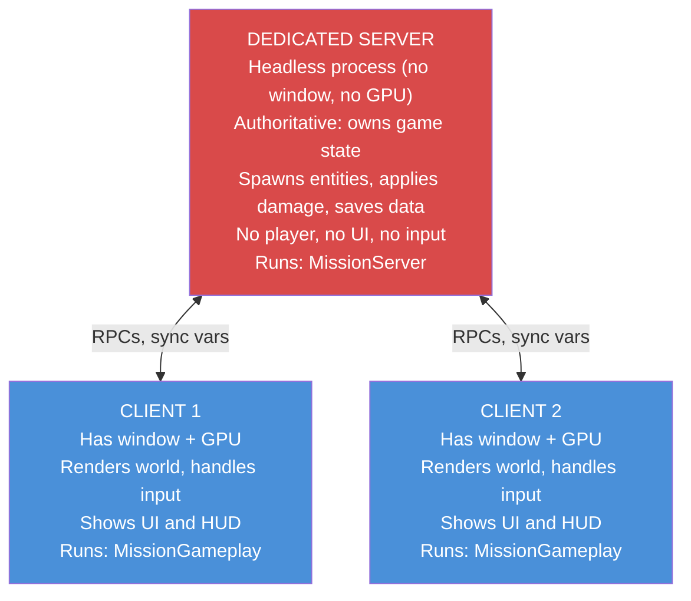
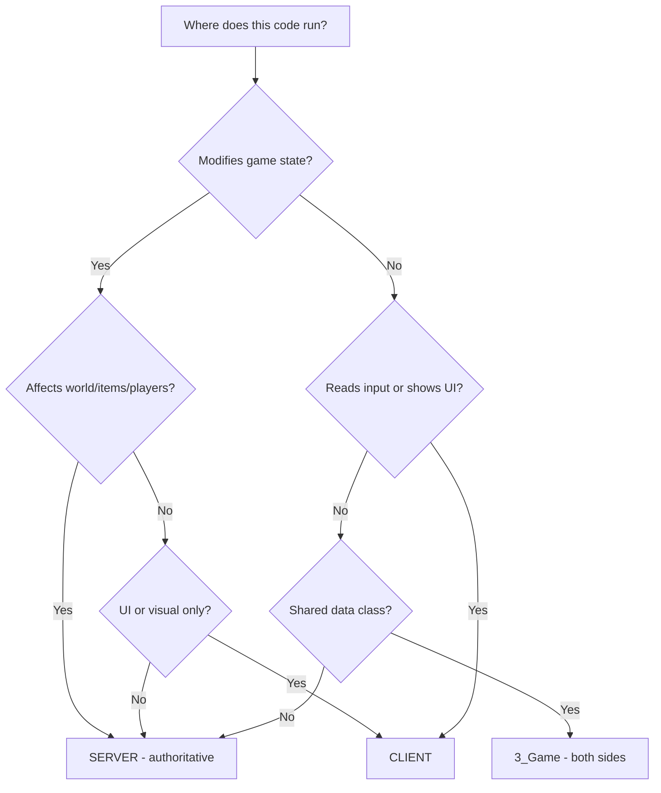
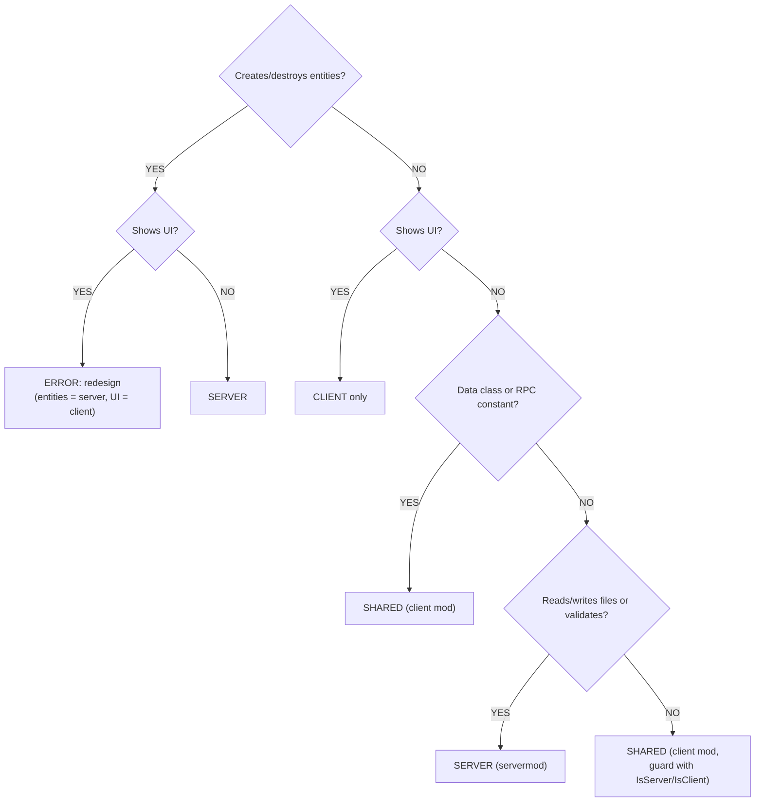

# Chapter 2.6: Server vs Client Architecture

[Home](../README.md) | [<< Previous: File Organization](05-file-organization.md) | **Server vs Client Architecture**

---

> **Summary:** DayZ is a client-server game. Every line of code you write runs in a specific context -- server, client, or both. Understanding this split is essential for writing secure, functional mods. This chapter explains where code runs, how to detect which side you are on, how to structure multi-package mods, and the patterns that keep server and client code properly separated.

---

## Table of Contents

- [The Fundamental Split](#the-fundamental-split)
- [The Three Execution Contexts](#the-three-execution-contexts)
- [Checking Where Your Code Runs](#checking-where-your-code-runs)
- [The mod.cpp type Field](#the-modcpp-type-field)
- [The config.cpp type Field](#the-configcpp-type-field)
- [Multi-Package Mod Architecture](#multi-package-mod-architecture)
- [The Golden Rules](#the-golden-rules)
- [Script Layer and Side Matrix](#script-layer-and-side-matrix)
- [Preprocessor Guards](#preprocessor-guards)
- [Common Server-Client Patterns](#common-server-client-patterns)
- [Listen Server Gotchas](#listen-server-gotchas)
- [Dependency Between Split Mods](#dependency-between-split-mods)
- [Real-World Split Examples](#real-world-split-examples)
- [Common Mistakes](#common-mistakes)
- [Decision Flowchart](#decision-flowchart)
- [Summary Checklist](#summary-checklist)

---

## The Fundamental Split

DayZ uses a **dedicated server** model. The server and the client are separate processes running separate executables. They communicate over the network, and the engine handles synchronization of entities, variables, and RPCs.

This means your mod code runs in one of three contexts, and the rules for each are fundamentally different.



---

## The Three Execution Contexts

### 1. Dedicated Server

The dedicated server is a **headless process**. It has no window, no graphics card output, no monitor, no keyboard, no mouse. It exists only to run game logic.

Key characteristics:
- **Authoritative** -- the server's state is the truth. If the server says a player has 50 health, the player has 50 health.
- **No player object** -- `GetGame().GetPlayer()` always returns `null` on a dedicated server. The server manages ALL players but IS none of them.
- **No UI** -- any code that creates widgets, shows menus, or renders HUD elements will crash or silently fail.
- **No input** -- there is no keyboard or mouse. Input-handling code is meaningless here.
- **File system access** -- the server can read and write files to its profile directory (`$profile:`), which is where configs, player data, and logs are stored.
- **Mission class** -- the server instantiates `MissionServer`, not `MissionGameplay`.

### 2. Client

The client is the player's game. It has a window, renders 3D graphics, plays audio, and handles input.

Key characteristics:
- **Presentation layer** -- the client renders what the server tells it to render. It does not decide what exists in the world.
- **Has a player** -- `GetGame().GetPlayer()` returns the local player's `PlayerBase` instance.
- **UI and HUD** -- all widget creation, layout loading, and menu code runs here.
- **Input** -- keyboard, mouse, and gamepad input is processed here.
- **Limited authority** -- the client can REQUEST actions (via RPC), but the server DECIDES whether they happen.
- **Mission class** -- the client instantiates `MissionGameplay`, not `MissionServer`.

### 3. Listen Server (Development/Testing)

A listen server is both server AND client in the same process. This is what you get when you launch DayZ through the Workbench or use the `-server` launch parameter with a local game.

Key characteristics:
- **Both `IsServer()` and `IsClient()` return true** -- this is the critical difference from dedicated servers.
- **Has a player AND manages all players** -- `GetGame().GetPlayer()` returns the host player.
- **Both `MissionServer` and `MissionGameplay` hooks run** -- your modded classes for both will execute.
- **Used for development only** -- production servers are always dedicated.
- **Can mask bugs** -- code that works on a listen server may break on dedicated because the listen server has access to both server and client types.

---

## Checking Where Your Code Runs

The `GetGame()` global function returns the game instance, which provides methods to detect the execution context:

```c
// ---------------------------------------------------------------
// Runtime context checks
// ---------------------------------------------------------------

if (GetGame().IsServer())
{
    // TRUE on: dedicated server, listen server
    // FALSE on: client connected to a remote server
    // Use for: server-side logic (spawning, damage, saving)
}

if (GetGame().IsClient())
{
    // TRUE on: client connected to a remote server, listen server
    // FALSE on: dedicated server
    // Use for: UI code, input handling, visual effects
}

if (GetGame().IsDedicatedServer())
{
    // TRUE on: dedicated server ONLY
    // FALSE on: client, listen server
    // Use for: code that must NEVER run on a listen server
}

if (GetGame().IsMultiplayer())
{
    // TRUE on: any multiplayer session (dedicated server, remote client)
    // FALSE on: singleplayer/offline mode
    // Use for: disabling features in offline testing
}
```

### Truth Table

| Method | Dedicated Server | Client (Remote) | Listen Server (LAN) | Offline Singleplayer |
|--------|:---:|:---:|:---:|:---:|
| `IsServer()` | true | false | true | true |
| `IsClient()` | false | true | true | true |
| `IsDedicatedServer()` | true | false | false | false |
| `IsMultiplayer()` | true | true | true | false |
| `GetPlayer()` returns | null | PlayerBase | PlayerBase | PlayerBase |

> **Note on IsMultiplayer():** A LAN listen server (launched with `-server`) returns `true` for `IsMultiplayer()` because it accepts network connections from other players. Only true offline singleplayer (no networking) returns `false`. The distinction is whether the session involves networking, not whether the process acts as a server.

### Common Patterns

```c
// Guard: server-only logic
void SpawnLoot(vector position)
{
    if (!GetGame().IsServer())
        return;

    // Only the server creates entities
    EntityAI item = EntityAI.Cast(GetGame().CreateObjectEx("AK101", position, ECE_PLACE_ON_SURFACE));
}

// Guard: client-only logic
void ShowNotification(string text)
{
    if (!GetGame().IsClient())
        return;

    // Only the client can display UI
    NotificationSystem.AddNotification(text, "set:dayz_gui image:icon_pin");
}

// Guard: handle both sides correctly
void OnPlayerAction(PlayerBase player, int actionID)
{
    if (GetGame().IsServer())
    {
        // Validate and execute the action
        ValidateAndApply(player, actionID);
    }

    if (GetGame().IsClient())
    {
        // Play a local sound effect
        PlayActionSound(actionID);
    }
}
```

---

## The mod.cpp type Field

The `mod.cpp` file at the root of your mod folder contains a `type` field that controls WHERE the mod is loaded:

### type = "mod" (Both Sides)

```
name = "My Mod";
type = "mod";
```

The mod is loaded on **both server and client**. The server loads it, clients download and load it. Both sides compile and execute the scripts.

**When to use:** Most mods use this. Any mod that has shared types (entity definitions, config classes, RPC data structures) needs to be `type = "mod"` so both sides know about the same types.

**Example:** The StarDZ AI client mod uses `type = "mod"` because both server and client need the AI entity class definitions, RPC constants, and sync data structures:

```
// StarDZ_AI/mod.cpp
name = "StarDZ AI";
type = "mod";
```

### type = "servermod" (Server Only)

```
name = "My Mod Server";
type = "servermod";
```

The mod is loaded on the **server only**. Clients never see it, never download it, never know it exists. The server does not send it in the mod list.

**When to use:** Server-side logic that clients should never have access to. This includes:
- Spawn algorithms (prevents players from predicting loot)
- AI brain logic (prevents exploit analysis)
- Admin commands and server management
- Database connections and external API calls
- Anti-cheat validation logic

**Example:** The StarDZ AI Server mod uses `type = "servermod"` because clients should never see the AI brain, perception, combat, or spawning logic:

```
// StarDZ_AI_Server/mod.cpp
name = "StarDZ AI Server";
type = "servermod";
```

### Why This Matters for Security

If your spawn logic is in a `type = "mod"` package, **every player downloads it**. They can decompile the PBO and read your spawn algorithms, loot tables, admin passwords, or anti-cheat logic. Always put sensitive server logic in a `type = "servermod"` package.

---

## The config.cpp type Field

Inside `config.cpp` (in the `CfgMods` section), there is also a `type` field. This one controls how the engine treats the mod internally:

```cpp
class CfgMods
{
    class MyMod
    {
        type = "mod";          // or "servermod"
        // ...
    };
};
```

This field should match your `mod.cpp` type field. If they disagree, you get unpredictable behavior. Keep them consistent.

The `config.cpp` also contains the `defines[]` array, which is how you enable preprocessor symbols for cross-mod detection:

```cpp
class CfgMods
{
    class StarDZ_AI
    {
        type = "mod";
        defines[] = { "STARDZ_AI" };    // Other mods can use #ifdef STARDZ_AI
    };
};

class CfgMods
{
    class StarDZ_AIServer
    {
        type = "servermod";
        defines[] = { "STARDZ_AI", "STARDZ_AISERVER" };  // Both defines available
    };
};
```

Notice that the server mod defines both `STARDZ_AI` and `STARDZ_AISERVER`. This allows server-side code to detect whether just the client mod is present or the full server package is loaded.

---

## Multi-Package Mod Architecture

### Why Split Into Multiple Packages?

A single mod folder with `type = "mod"` ships everything to clients. For many mods, this is fine. But for mods with sensitive server logic, you need to split:

```
@MyMod/                          <-- Client package (type = "mod")
  mod.cpp                        <-- type = "mod"
  Addons/
    MyMod_Scripts.pbo            <-- Shared: RPCs, config classes, entity defs
    MyMod_Data.pbo               <-- Shared: models, textures
    MyMod_GUI.pbo                <-- Client-only: layouts, imagesets

@MyModServer/                    <-- Server package (type = "servermod")
  mod.cpp                        <-- type = "servermod"
  Addons/
    MyModServer_Scripts.pbo      <-- Server-only: spawning, brain, admin
```

The server loads BOTH `@MyMod` and `@MyModServer`. Clients only load `@MyMod`.

### What Goes Where

**Client package** (`type = "mod"`) contains:
- Entity class definitions (both sides need to know the class exists)
- RPC ID constants and data structures (both sides send/receive)
- Config classes for settings that affect client display
- GUI layouts, imagesets, and styles
- Client-side UI code (wrapped in `#ifndef SERVER`)
- Models, textures, sounds
- `stringtable.csv` for localization

**Server package** (`type = "servermod"`) contains:
- Manager/controller classes (spawn logic, AI brains)
- Server-side validation and anti-cheat
- Config loading and file I/O (JSON configs, player data)
- Admin command handlers
- External service integration (webhooks, APIs)
- `MissionServer` hooks

### The Dependency Chain

The server package depends on the client package, never the other way around:

```cpp
// Client mod: config.cpp
class CfgPatches
{
    class MyMod_Scripts
    {
        requiredAddons[] = { "DZ_Scripts" };  // No dependency on server
    };
};

// Server mod: config.cpp
class CfgPatches
{
    class MyModServer_Scripts
    {
        requiredAddons[] = { "DZ_Scripts", "MyMod_Scripts" };  // Depends on client
    };
};
```

This ensures the client package compiles first, and the server package can reference all types defined in the client package.

---

## The Golden Rules

These rules govern every decision about where code belongs:

### Rule 1: Server is AUTHORITATIVE

The server owns the game state. It decides what exists, where it exists, and what happens to it. Never let the client make authoritative decisions.

### Rule 2: Client handles PRESENTATION

The client renders the world, plays sounds, shows UI, and collects input. It does not decide game outcomes.

### Rule 3: RPC is the BRIDGE

Remote Procedure Calls (RPCs) are the only structured way for server and client to communicate. The client sends requests, the server sends responses and state updates.

### Rule 4: Never Trust the Client

Any data coming from a client could be tampered with. Always validate on the server.

### Decision Tree



### Responsibility Matrix

| Task | Where | Why |
|------|-------|-----|
| Spawn entities | Server | Prevents item duplication |
| Apply damage | Server | Prevents god mode hacks |
| Delete entities | Server | Prevents grief exploits |
| Save player data | Server | Persistent server-side storage |
| Load configs | Server | Server controls game rules |
| Validate actions | Server | Anti-cheat enforcement |
| Check permissions | Server | Client cannot self-authorize |
| Show UI panels | Client | Server has no display |
| Read keyboard/mouse | Client | Server has no input devices |
| Play sounds | Client | Server has no audio output |
| Render effects | Client | Server has no GPU |
| Display notifications | Client | Visual feedback for the player |
| Send chat messages | Both | Client sends, server broadcasts |
| Sync config to client | Both | Server sends, client stores locally |
| Track nearby entities | Both | Server spawns, client renders |

---

## Script Layer and Side Matrix

The 5-layer hierarchy (Chapter 2.1) intersects with the server-client split. Not all layers run on all sides in the same way:

### Full Matrix

| Layer | Dedicated Server | Client | Listen Server | Notes |
|-------|:---:|:---:|:---:|-------|
| `1_Core` | Compiled | Compiled | Compiled | Identical on all sides |
| `2_GameLib` | Compiled | Compiled | Compiled | Identical on all sides |
| `3_Game` | Compiled | Compiled | Compiled | Shared types, configs, RPCs |
| `4_World` | Compiled | Compiled | Compiled | Entities exist on both sides |
| `5_Mission` (MissionServer) | Runs | Skipped | Runs | Server startup/shutdown |
| `5_Mission` (MissionGameplay) | Skipped | Runs | Runs | Client UI/HUD init |

### What This Means in Practice

Layers 1 through 4 compile and run on **all sides**. The code is the same. This is why entity class definitions, config classes, and RPC constants all live in `3_Game` or `4_World` -- both sides need them.

Layer 5 (`5_Mission`) is where the split becomes explicit:
- `MissionServer` is a class that only exists on the server (and listen server). It handles server-side initialization, update loops, and cleanup.
- `MissionGameplay` is a class that only exists on the client (and listen server). It handles client-side UI, HUD, and player-facing features.

When you write `modded class MissionServer`, that code runs on the dedicated server. When you write `modded class MissionGameplay`, that code runs on the client.

```c
// Server-side mission hook -- runs on dedicated server and listen server
modded class MissionServer
{
    override void OnInit()
    {
        super.OnInit();
        // Initialize server-side managers
        Print("Server starting up");
    }
};

// Client-side mission hook -- runs on client and listen server
modded class MissionGameplay
{
    override void OnInit()
    {
        super.OnInit();
        // Initialize client-side UI
        Print("Client starting up");
    }
};
```

---

## Preprocessor Guards

Enforce Script supports preprocessor directives that let you conditionally compile code based on the execution context.

### The SERVER Define

The engine automatically defines `SERVER` when compiling for a **dedicated server** or a **listen server** (client launched with the `-server` flag). Per `staticdefinesdoc.c`, `SERVER` is set whenever the process acts as a server -- this includes both dedicated and listen server contexts. This is a **compile-time** check, not a runtime check:

```c
#ifdef SERVER
    // This code is ONLY compiled on the server
    // It does not exist in the client binary at all
#endif

#ifndef SERVER
    // This code is ONLY compiled on the client
    // The server will not see this code
#endif
```

### When to Use Preprocessor Guards vs Runtime Checks

| Approach | When to Use | Example |
|----------|-------------|---------|
| `#ifndef SERVER` | Wrapping code that references client-only types (widgets, UI classes) | Client UI helper classes, `MissionGameplay` bodies that use widget types |
| `#ifdef SERVER` | Wrapping entire class definitions that should only exist on server | Server-only helper classes |
| `GetGame().IsServer()` | Runtime branching within code that runs on both sides | Entity update logic that differs per side |
| `GetGame().IsClient()` | Runtime branching within code that runs on both sides | Playing effects only on client |

### Real Example: Client Mission Hook in a Shared Mod

`MissionGameplay` compiles on **both server and client** -- the class itself exists everywhere in vanilla DayZ. You do NOT need `#ifndef SERVER` just to mod `MissionGameplay`. The guard is only required when the modded class body references **client-only types** such as widget classes or UI helpers that do not exist on the server.

COT and Expansion both mod `MissionGameplay` without wrapping it in `#ifndef SERVER`. The vanilla `MissionGameplay` class is not guarded either.

```c
// SAFE: No #ifndef SERVER needed because the body uses no client-only types
modded class MissionGameplay
{
    override void OnInit()
    {
        super.OnInit();
        Print("[MyMod] MissionGameplay.OnInit");
    }
};
```

```c
// NEEDS #ifndef SERVER: The body references MyClientUI (a widget/UI class
// that only exists on the client). Without the guard, the server cannot
// resolve the MyClientUI type and compilation fails.

#ifndef SERVER
modded class MissionGameplay
{
    protected ref MyClientUI m_MyUI;

    override void OnInit()
    {
        super.OnInit();
        m_MyUI = new MyClientUI();
    }

    override void OnUpdate(float timeslice)
    {
        super.OnUpdate(timeslice);
        if (m_MyUI)
            m_MyUI.Update(timeslice);
    }
};
#endif
```

The rule is simple: if the **body** of your modded `MissionGameplay` (or `MissionServer`) references types that only exist on one side, wrap it. If it only calls `super` and `Print`, no guard is needed.

### Combining Guards for Optional Dependencies

You can stack preprocessor guards for fine-grained control:

```c
// Only compile if StarDZ Core is loaded AND we are on the client
#ifdef STARDZ_CORE
#ifndef SERVER
modded class MissionGameplay
{
    override void OnInit()
    {
        super.OnInit();
        // Register with Core's admin panel -- client side only
        StarDZCore core = StarDZCore.GetInstance();
        if (core)
        {
            ref StarDZModInfo info = new StarDZModInfo("MyMod", "My Mod", "1.0");
            core.RegisterMod(info);
        }
    }
};
#endif
#endif
```

---

## Common Server-Client Patterns

### Pattern 1: Server-Side Validation with Client Feedback

The most fundamental pattern in multiplayer game modding. The client requests an action, the server validates it, and sends back the result.

```c
// ---------------------------------------------------------------
// 3_Game: Shared RPC constants and data (both sides need these)
// ---------------------------------------------------------------
class MyRPC
{
    static const int REQUEST_ACTION  = 85001;  // Client -> Server
    static const int ACTION_RESULT   = 85002;  // Server -> Client
}

class MyActionData
{
    int m_ActionID;
    bool m_Success;
    string m_Message;
}
```

```c
// ---------------------------------------------------------------
// Client side: Send request, handle response
// ---------------------------------------------------------------
class MyClientHandler
{
    void RequestAction(int actionID)
    {
        if (!GetGame().IsClient())
            return;

        // Send request to server
        ScriptRPC rpc = new ScriptRPC();
        rpc.Write(actionID);
        rpc.Send(null, MyRPC.REQUEST_ACTION, true);
    }

    void OnActionResult(ParamsReadContext ctx)
    {
        int actionID;
        bool success;
        string message;

        ctx.Read(actionID);
        ctx.Read(success);
        ctx.Read(message);

        if (success)
            ShowSuccessUI(message);
        else
            ShowErrorUI(message);
    }
}
```

```c
// ---------------------------------------------------------------
// Server side: Validate and respond
// ---------------------------------------------------------------
class MyServerHandler
{
    void OnActionRequest(PlayerIdentity sender, ParamsReadContext ctx)
    {
        if (!GetGame().IsServer())
            return;

        int actionID;
        ctx.Read(actionID);

        // VALIDATE -- never trust client data
        bool allowed = ValidateAction(sender, actionID);

        // Execute if valid
        if (allowed)
            ExecuteAction(sender, actionID);

        // Send result back to client
        ScriptRPC rpc = new ScriptRPC();
        rpc.Write(actionID);
        rpc.Write(allowed);
        rpc.Write(allowed ? "Action completed" : "Action denied");
        rpc.Send(null, MyRPC.ACTION_RESULT, true, sender);
    }
}
```

### Pattern 2: Config Sync (Server to Client)

The server owns the configuration. When a player connects, the server sends relevant settings to the client so the client can adjust its display accordingly.

```c
// ---------------------------------------------------------------
// Server: Send config on player connect
// ---------------------------------------------------------------
modded class MissionServer
{
    void OnPlayerConnect(PlayerBase player)
    {
        PlayerIdentity identity = player.GetIdentity();
        if (!identity)
            return;

        // Send display settings to client
        ScriptRPC rpc = new ScriptRPC();
        rpc.Write(m_Config.m_ShowHUD);
        rpc.Write(m_Config.m_HUDColor);
        rpc.Write(m_Config.m_MaxDistance);
        rpc.Send(null, MyRPC.SYNC_CONFIG, true, identity);
    }
}
```

```c
// ---------------------------------------------------------------
// Client: Receive and apply config
// ---------------------------------------------------------------
#ifndef SERVER
class MyClientConfig
{
    bool m_ShowHUD;
    int m_HUDColor;
    float m_MaxDistance;

    void OnConfigReceived(ParamsReadContext ctx)
    {
        ctx.Read(m_ShowHUD);
        ctx.Read(m_HUDColor);
        ctx.Read(m_MaxDistance);

        // Apply to local UI
        UpdateHUDVisibility();
    }
}
#endif
```

### Pattern 3: Entity State Sync

Entities that exist on both server and client often need to synchronize custom state. The server computes the state, then sends it to nearby clients via RPC.

```c
// ---------------------------------------------------------------
// Server: Broadcast AI state to nearby players
// ---------------------------------------------------------------
void SyncStateToClients(SDZ_AIEntity ai)
{
    if (!GetGame().IsServer())
        return;

    ScriptRPC rpc = new ScriptRPC();
    rpc.Write(ai.GetID());
    rpc.Write(ai.GetBehaviorState());
    rpc.Write(ai.IsInCombat());

    // Send to all clients within 200m
    rpc.Send(ai, MyRPC.SYNC_STATE, true);
}
```

```c
// ---------------------------------------------------------------
// Client: Receive and display AI state
// ---------------------------------------------------------------
void OnStateReceived(SDZ_AIEntity ai, ParamsReadContext ctx)
{
    if (!GetGame().IsClient())
        return;

    int entityID, behaviorState;
    bool inCombat;

    ctx.Read(entityID);
    ctx.Read(behaviorState);
    ctx.Read(inCombat);

    // Update client-side visual state
    ai.SetClientBehaviorState(behaviorState);
    ai.SetClientCombatIndicator(inCombat);
}
```

### Pattern 4: Permission Checking

Permissions are always checked on the server. The client may cache permission data for UI purposes (e.g., graying out buttons), but the server is the final authority.

```c
// ---------------------------------------------------------------
// Server: Check permission before executing admin command
// ---------------------------------------------------------------
void OnAdminCommand(PlayerIdentity sender, ParamsReadContext ctx)
{
    if (!GetGame().IsServer())
        return;

    string command;
    ctx.Read(command);

    // Server-side permission check -- the ONLY check that matters
    if (!HasPermission(sender.GetId(), "admin.commands." + command))
    {
        SendDenied(sender, "Insufficient permissions");
        return;
    }

    ExecuteAdminCommand(command);
}
```

---

## Listen Server Gotchas

The listen server is the most treacherous environment because it blurs the line between server and client. Here are the pitfalls:

### 1. Both IsServer() and IsClient() Are True

```c
void MyFunction()
{
    if (GetGame().IsServer())
    {
        // This runs on listen server
        DoServerThing();
    }

    if (GetGame().IsClient())
    {
        // This ALSO runs on listen server
        DoClientThing();
    }

    // On listen server, BOTH branches execute!
}
```

**Fix:** If you need exclusive branches, use `else if` or check `IsDedicatedServer()`:

```c
void MyFunction()
{
    if (GetGame().IsDedicatedServer())
    {
        // Dedicated server only
        DoServerOnlyThing();
    }
    else if (GetGame().IsClient())
    {
        // Client OR listen server
        DoClientThing();
    }
}
```

### 2. MissionServer AND MissionGameplay Both Run

On a listen server, both `modded class MissionServer` and `modded class MissionGameplay` execute their hooks. If you initialize the same manager in both, you get two instances:

```c
// BAD: Creates two instances on listen server
modded class MissionServer
{
    override void OnInit()
    {
        super.OnInit();
        m_Manager = new MyManager();  // Instance 1
    }
}

modded class MissionGameplay
{
    override void OnInit()
    {
        super.OnInit();
        m_Manager = new MyManager();  // Instance 2 on listen server!
    }
}
```

**Fix:** Use server/client specific subclasses or guard with context checks:

```c
modded class MissionServer
{
    override void OnInit()
    {
        super.OnInit();
        m_ServerManager = new MyServerManager();  // Server-side only
    }
}

#ifndef SERVER
modded class MissionGameplay
{
    override void OnInit()
    {
        super.OnInit();
        m_ClientUI = new MyClientUI();  // Client-side only
    }
}
#endif
```

### 3. GetGame().GetPlayer() Works on Listen Server

On a dedicated server, `GetGame().GetPlayer()` always returns null. On a listen server, it returns the host player. Code that accidentally relies on this will work during testing but crash on a real server:

```c
// BAD: Works on listen server, crashes on dedicated
void DoServerThing()
{
    PlayerBase player = PlayerBase.Cast(GetGame().GetPlayer());
    // player is null on dedicated server!
    player.SetHealth(100);  // NULL REFERENCE CRASH
}

// GOOD: Get the player through proper server-side methods
void DoServerThing(PlayerBase player)
{
    if (!player)
        return;

    player.SetHealth(100);
}
```

### 4. Testing on Listen Server Masks Bugs

A common trap: you test your mod on a listen server, everything works, you publish it, and it crashes on every dedicated server. This happens because:

- Types that exist only in `MissionGameplay` are available on listen server
- `GetPlayer()` returns a value on listen server
- Both server and client code paths run in the same process, so missing RPCs do not show errors (the data is already local)

**Always test on a dedicated server before publishing.** Listen server testing is useful for rapid iteration, but it is not a substitute for proper dedicated server testing.

---

## Dependency Between Split Mods

### requiredAddons[] Controls Load Order

When you split a mod into client and server packages, the server package MUST declare the client package as a dependency:

```cpp
// Client package: config.cpp
class CfgPatches
{
    class SDZ_AI_Scripts
    {
        requiredAddons[] = { "DZ_Scripts", "DZ_Data", "SDZ_Core_Scripts" };
    };
};

// Server package: config.cpp
class CfgPatches
{
    class SDZA_Scripts
    {
        requiredAddons[] = { "DZ_Scripts", "SDZ_AI_Scripts", "SDZ_Core_Scripts" };
        //                                 ^^^^^^^^^^^^^^^^
        //                     Server depends on client package
    };
};
```

This ensures:
1. The client package compiles first
2. The server package can reference all types from the client package
3. Entity class definitions from the client package are available to server logic

### defines[] for Optional Dependency Detection

The `defines[]` array in `CfgMods` creates preprocessor symbols that other mods can check with `#ifdef`:

```cpp
// StarDZ_AI client mod defines:
defines[] = { "STARDZ_AI" };

// StarDZ_AI server mod defines:
defines[] = { "STARDZ_AI", "STARDZ_AISERVER" };
```

Other mods can then conditionally compile code:

```c
// In another mod that optionally integrates with StarDZ AI
#ifdef STARDZ_AI
    // AI mod is loaded -- enable integration features
    void OnAIEntitySpawned(SDZ_AIEntity ai)
    {
        // React to AI spawns
    }
#endif
```

### Soft vs Hard Dependencies

**Hard dependency:** Listed in `requiredAddons[]`. The engine will not load your mod if the dependency is missing. Use for mods that MUST be present.

```cpp
requiredAddons[] = { "DZ_Scripts", "SDZ_Core_Scripts" };
// If SDZ_Core_Scripts is missing, this mod will not load
```

**Soft dependency:** Detected via `#ifdef` at compile time. The mod loads regardless, but enables extra features when the dependency is present.

```c
// Soft dependency on StarDZ Core
#ifdef STARDZ_CORE
class SDZ_AIAdminConfig : StarDZConfigBase
{
    // Only exists if Core is loaded
};
#endif

// Fallback when Core is not available
#ifndef STARDZ_CORE
class SDZ_AIAdminConfig
{
    // Standalone version without Core integration
};
#endif
```

---

## Real-World Split Examples

### Example 1: StarDZ AI (Client + Server)

StarDZ AI splits into two packages with clear separation of concerns:

```
StarDZ_AI/                              <-- Development root
  StarDZ_AI/                            <-- Client package (type = "mod")
    mod.cpp
    stringtable.csv
    GUI/
      layouts/
        sdz_ai_interact_prompt.layout   <-- Client-only: interaction UI
        sdz_ai_voice_bubble.layout      <-- Client-only: speech bubble
    Scripts/
      config.cpp                        <-- defines[] = { "STARDZ_AI" }
      3_Game/StarDZ_AI/
        SDZ_AI_Config.c                 <-- Shared config class
        SDZ_AIConstants.c               <-- Shared constants
        SDZ_AIRPC.c                     <-- Shared RPC IDs + data structs
      4_World/StarDZ_AI/
        SDZ_AIEntity.c                  <-- Entity definition (both sides)
        SDZ_AIPlayerPatches.c           <-- Player interaction patches
      5_Mission/StarDZ_AI/
        SDZ_AI_Register.c              <-- Core registration (guarded)
        SDZ_AIClientMission.c           <-- Client UI (#ifndef SERVER)
        SDZ_AIClientUI.c               <-- UI management

  StarDZ_AI_Server/                     <-- Server package (type = "servermod")
    mod.cpp
    Scripts/
      config.cpp                        <-- depends on SDZ_AI_Scripts
      3_Game/StarDZ_AIServer/
        SDZ_AIAdminConfig.c             <-- Admin panel config bridge
        SDZ_AIConfig.c                  <-- Server config loading
        SDZ_AILoadout.c                 <-- Loadout definitions
      4_World/StarDZ_AIServer/
        SDZ_AIAPI.c                     <-- Developer API
        SDZ_AIBrain.c                   <-- AI decision making
        SDZ_AICombat.c                  <-- Combat behavior
        SDZ_AIEvents.c                  <-- Event handling
        SDZ_AIGOAP.c                    <-- Goal-oriented action planning
        SDZ_AIGroup.c                   <-- Group coordination
        SDZ_AIInteraction.c             <-- Player interaction handling
        SDZ_AILogger.c                  <-- Server-side logging
        SDZ_AIManager.c                 <-- Main AI manager
        SDZ_AIMemory.c                  <-- Memory/knowledge base
        SDZ_AIMovement.c               <-- Navigation
        SDZ_AINavmesh.c                <-- Pathfinding
        SDZ_AIPerception.c             <-- Sight/hearing/awareness
        SDZ_AISoundPropagation.c       <-- Sound detection
        SDZ_AISpawner.c                <-- Spawn logic
      5_Mission/StarDZ_AIServer/
        SDZ_AIServerMission.c           <-- MissionServer hook
```

Notice the pattern:
- **Client package** has 7 script files: constants, RPCs, entity definitions, UI
- **Server package** has 19 script files: the entire AI brain, perception, combat system
- The bulk of the logic is server-side and invisible to players

### Example 2: DayZ Expansion AI

Expansion uses a different structure -- all scripts in one directory tree, but split into multiple PBOs:

```
DayZExpansion/AI/
  Animations/config.cpp          <-- Animation overrides PBO
  DebugWeapons/config.cpp        <-- Debug weapons PBO
  Gear/config.cpp                <-- AI gear/clothing PBO
  GUI/                           <-- GUI resources PBO
    layouts/
    config.cpp
  Scripts/                       <-- Main scripts PBO
    config.cpp
    1_Core/                      <-- Engine-level AI foundations
    3_Game/                      <-- Shared types
    4_World/                     <-- Entity and behavior code
    5_Mission/                   <-- Mission hooks
    AI/                          <-- AI-specific subfolder
    Common/                      <-- Shared across all layers
    Data/                        <-- Data files
    FSM/                         <-- Finite state machine definitions
    inputs.xml                   <-- Input bindings
  Sounds/                        <-- Audio PBO
```

Expansion keeps everything in one `type = "mod"` package but uses internal `#ifdef` guards to separate server and client code paths. This is an alternative approach -- less secure (clients can decompile everything) but simpler to manage.

### Example 3: StarDZ Missions (Client + Server)

```
StarDZ_Missions/
  StarDZ_Missions/                      <-- Client (type = "mod")
    Scripts/
      3_Game/StarDZ_Missions/
        SDZ_Constants.c                 <-- Mission type enums, RPC IDs
        SDZ_MissionsConfig.c            <-- Display settings
        SDZ_RPC.c                       <-- RPC definitions
      4_World/StarDZ_Missions/
        SDZ_RadioHelper.c               <-- Radio proximity helper
      5_Mission/StarDZ_Missions/
        SDZ_ClientHandler.c             <-- Client UI for missions
        SDZ_MissionsAdminModule.c       <-- Admin panel module

  StarDZ_Missions_Server/              <-- Server (type = "servermod")
    Scripts/
      3_Game/StarDZ_MissionsServer/
        SDZ_Config.c                    <-- Server config loader
        SDZ_Logger.c                    <-- Server-side mission logging
        SDZ_MissionData.c               <-- Mission data structures
      4_World/StarDZ_MissionsServer/
        SDZ_Instance.c                  <-- Active mission instance
        SDZ_Spawner.c                   <-- Loot and objective spawning
      5_Mission/StarDZ_MissionsServer/
        SDZ_ServerMission.c             <-- MissionServer hook
```

---

## Common Mistakes

### Mistake 1: Running Server Logic on Client

```c
// WRONG: This runs on the client -- any player can spawn items!
void OnButtonClick()
{
    GetGame().CreateObjectEx("M4A1", GetGame().GetPlayer().GetPosition(), ECE_PLACE_ON_SURFACE);
}

// RIGHT: Client requests, server validates and spawns
void OnButtonClick()
{
    // Client sends request
    ScriptRPC rpc = new ScriptRPC();
    rpc.Write("M4A1");
    rpc.Send(null, MyRPC.SPAWN_REQUEST, true);
}

// Server handler
void OnSpawnRequest(PlayerIdentity sender, ParamsReadContext ctx)
{
    if (!GetGame().IsServer())
        return;

    // Validate: is this player an admin?
    if (!IsAdmin(sender.GetId()))
        return;

    string className;
    ctx.Read(className);

    // Server spawns the item
    GetGame().CreateObjectEx(className, GetPlayerPosition(sender), ECE_PLACE_ON_SURFACE);
}
```

### Mistake 2: UI Code in Server-Only Mod

```c
// WRONG: This is in a type = "servermod" package
// The server has no display -- widget creation fails silently or crashes
class MyServerPanel
{
    Widget m_Root;

    void Show()
    {
        m_Root = GetGame().GetWorkspace().CreateWidgets("MyMod/GUI/layouts/panel.layout");
        // CRASH: GetWorkspace() returns null on dedicated server
    }
}
```

**Fix:** All UI code belongs in the client package (`type = "mod"`), wrapped in `#ifndef SERVER`.

### Mistake 3: GetGame().GetPlayer() on Server

```c
// WRONG: GetPlayer() is ALWAYS null on dedicated server
modded class MissionServer
{
    override void OnInit()
    {
        super.OnInit();
        PlayerBase player = PlayerBase.Cast(GetGame().GetPlayer());
        // player is null on dedicated!
        string name = player.GetIdentity().GetName();  // NULL CRASH
    }
}
```

**Fix:** On the server, players are passed to you through events, RPCs, or iteration:

```c
modded class MissionServer
{
    override void InvokeOnConnect(PlayerBase player, PlayerIdentity identity)
    {
        super.InvokeOnConnect(player, identity);
        // 'player' and 'identity' are provided by the engine
        if (identity)
            Print("Player connected: " + identity.GetName());
    }
}
```

### Mistake 4: Forgetting Listen Server Compatibility

```c
// WRONG: Assumes IsServer() and IsClient() are mutually exclusive
void OnEntityCreated(EntityAI entity)
{
    if (GetGame().IsServer())
    {
        RegisterEntity(entity);
        return;  // Early return skips client code
    }

    // On listen server, this never runs because IsServer() was true
    UpdateClientDisplay(entity);
}

// RIGHT: Handle both sides independently
void OnEntityCreated(EntityAI entity)
{
    if (GetGame().IsServer())
    {
        RegisterEntity(entity);
    }

    if (GetGame().IsClient())
    {
        UpdateClientDisplay(entity);
    }
}
```

### Mistake 5: Not Using #ifdef for Optional Mod Detection

```c
// WRONG: Crashes if StarDZ Core is not loaded
class MyModInit
{
    void Init()
    {
        StarDZCore core = StarDZCore.GetInstance();  // COMPILE ERROR if Core not present
        core.RegisterMod(info);
    }
}

// RIGHT: Guard with preprocessor directive
class MyModInit
{
    void Init()
    {
        #ifdef STARDZ_CORE
        StarDZCore core = StarDZCore.GetInstance();
        if (core)
        {
            ref StarDZModInfo info = new StarDZModInfo("MyMod", "My Mod", "1.0");
            core.RegisterMod(info);
        }
        #endif
    }
}
```

### Mistake 6: Putting Shared Types Only in the Server Package

```c
// WRONG: RPC data class defined only in servermod
// Client cannot deserialize the RPC because it does not know the class

// In MyModServer (type = "servermod"):
class MyStateData  // Client has never heard of this class
{
    int m_State;
    float m_Value;
}
```

**Fix:** Shared data structures (RPC data, entity definitions, config classes) go in the client package (`type = "mod"`) so both sides have them:

```c
// In MyMod (type = "mod") -- 3_Game layer:
class MyStateData  // Now both server and client know this class
{
    int m_State;
    float m_Value;
}
```

### Mistake 7: Hardcoded Server File Paths on Client

```c
// WRONG: Client cannot access server's profile directory
void LoadConfig()
{
    string path = "$profile:MyMod/config.json";
    // On client, $profile: points to the CLIENT's profile, not the server's
    // The config file does not exist there
}
```

**Fix:** The server loads configs and sends relevant data to clients via RPC. Clients never read server config files directly.

---

## Decision Flowchart

Use this to determine where a piece of code belongs:



---

## Summary Checklist

Before publishing a split mod, verify:

- [ ] Client package uses `type = "mod"` in both `mod.cpp` and `config.cpp`
- [ ] Server package uses `type = "servermod"` in both `mod.cpp` and `config.cpp`
- [ ] Server `config.cpp` lists client package in `requiredAddons[]`
- [ ] All shared types (RPC data, entity classes, enums) are in the client package
- [ ] All server logic (spawning, validation, AI brains) is in the server package
- [ ] `MissionGameplay` modded classes that reference client-only types (widgets, UI classes) are wrapped in `#ifndef SERVER`
- [ ] No `GetGame().GetPlayer()` calls on server without null checks
- [ ] No UI/widget code in the server package
- [ ] Optional dependencies use `#ifdef` guards, not direct references
- [ ] `defines[]` array matches between `mod.cpp` and `config.cpp`
- [ ] Tested on a **dedicated server**, not just a listen server
- [ ] Server config files are loaded server-side and synced via RPC, not read by clients

---

**Previous:** [Chapter 2.5: File Organization Best Practices](05-file-organization.md)
**Next:** [Part 3: GUI & Layout System](../03-gui-system/01-widget-types.md)
