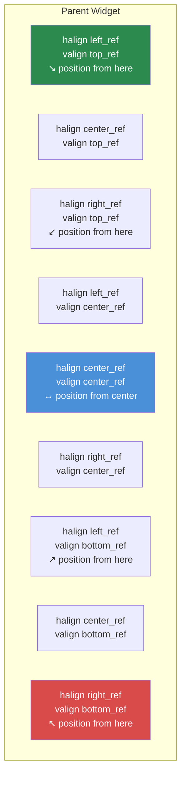

# Chapter 3.3: Sizing & Positioning

[Home](../README.md) | [<< Previous: Layout File Format](02-layout-files.md) | **Sizing & Positioning** | [Next: Container Widgets >>](04-containers.md)

---

The DayZ layout system uses a **dual coordinate mode** -- every dimension can be either proportional (relative to the parent) or pixel-based (absolute screen pixels). Misunderstanding this system is the number one source of layout bugs. This chapter explains it thoroughly.

---

## The Core Concept: Proportional vs. Pixel

Every widget has a position (`x, y`) and a size (`width, height`). Each of these four values can independently be either:

- **Proportional** (0.0 to 1.0) -- relative to the parent widget's dimensions
- **Pixel** (any positive number) -- absolute screen pixels

The mode for each axis is controlled by four flags:

| Flag | Controls | `0` = Proportional | `1` = Pixel |
|---|---|---|---|
| `hexactpos` | X position | Fraction of parent width | Pixels from left |
| `vexactpos` | Y position | Fraction of parent height | Pixels from top |
| `hexactsize` | Width | Fraction of parent width | Pixel width |
| `vexactsize` | Height | Fraction of parent height | Pixel height |

This means you can mix modes freely. For example, a widget can have proportional width but pixel height -- a very common pattern for rows and bars.

---

## Understanding Proportional Mode

When a flag is `0` (proportional), the value represents a **fraction of the parent's dimension**:

- `size 1 1` with `hexactsize 0` and `vexactsize 0` means "100% of parent width, 100% of parent height" -- the child fills the parent.
- `size 0.5 0.3` means "50% of parent width, 30% of parent height."
- `position 0.5 0` with `hexactpos 0` means "start at 50% of parent width from the left."

Proportional mode is resolution-independent. The widget scales automatically when the parent changes size or when the game runs at a different resolution.

```
// A widget that fills the left half of its parent
FrameWidgetClass LeftHalf {
 position 0 0
 size 0.5 1
 hexactpos 0
 vexactpos 0
 hexactsize 0
 vexactsize 0
}
```

---

## Understanding Pixel Mode

When a flag is `1` (pixel/exact), the value is in **screen pixels**:

- `size 200 40` with `hexactsize 1` and `vexactsize 1` means "200 pixels wide, 40 pixels tall."
- `position 10 10` with `hexactpos 1` and `vexactpos 1` means "10 pixels from parent's left edge, 10 pixels from parent's top edge."

Pixel mode gives you exact control but does NOT automatically scale with resolution.

```
// A fixed-size button: 120x30 pixels
ButtonWidgetClass MyButton {
 position 10 10
 size 120 30
 hexactpos 1
 vexactpos 1
 hexactsize 1
 vexactsize 1
 text "Click Me"
}
```

---

## Mixing Modes: The Most Common Pattern

The real power comes from mixing proportional and pixel modes. The most common pattern in professional DayZ mods is:

**Proportional width, pixel height** -- for bars, rows, and headers.

```
// Full-width row, exactly 30 pixels tall
FrameWidgetClass Row {
 position 0 0
 size 1 30
 hexactpos 0
 vexactpos 0
 hexactsize 0        // Width: proportional (100% of parent)
 vexactsize 1        // Height: pixel (30px)
}
```

**Proportional width and height, pixel position** -- for centered panels offset by a fixed amount.

```
// 60% x 70% panel, offset 0px from center
FrameWidgetClass Dialog {
 position 0 0
 size 0.6 0.7
 halign center_ref
 valign center_ref
 hexactpos 1         // Position: pixel (0px offset from center)
 vexactpos 1
 hexactsize 0        // Size: proportional (60% x 70%)
 vexactsize 0
}
```

---

## Alignment References: halign and valign

The `halign` and `valign` attributes change the **reference point** for positioning:

| Value | Effect |
|---|---|
| `left_ref` (default) | Position is measured from parent's left edge |
| `center_ref` | Position is measured from parent's center |
| `right_ref` | Position is measured from parent's right edge |
| `top_ref` (default) | Position is measured from parent's top edge |
| `center_ref` | Position is measured from parent's center |
| `bottom_ref` | Position is measured from parent's bottom edge |

### Alignment Reference Points



When combined with pixel position (`hexactpos 1`), alignment references make centering trivial:

```
// Centered on screen with no offset
FrameWidgetClass CenteredDialog {
 position 0 0
 size 0.4 0.5
 halign center_ref
 valign center_ref
 hexactpos 1
 vexactpos 1
 hexactsize 0
 vexactsize 0
}
```

With `center_ref`, a position of `0 0` means "centered in parent." A position of `10 0` means "10 pixels right of center."

### Right-Aligned Elements

```
// Icon pinned to the right edge, 5px from the edge
ImageWidgetClass StatusIcon {
 position 5 5
 size 24 24
 halign right_ref
 valign top_ref
 hexactpos 1
 vexactpos 1
 hexactsize 1
 vexactsize 1
}
```

### Bottom-Aligned Elements

```
// Status bar at the bottom of its parent
FrameWidgetClass StatusBar {
 position 0 0
 size 1 30
 halign left_ref
 valign bottom_ref
 hexactpos 1
 vexactpos 1
 hexactsize 0
 vexactsize 1
}
```

---

## CRITICAL: No Negative Size Values

**Never use negative values for widget size in layout files.** Negative sizes cause undefined behavior -- widgets may become invisible, render incorrectly, or crash the UI system. If you need a widget to be hidden, use `visible 0` instead.

This is one of the most common layout mistakes. If your widget is not showing up, check that you have not accidentally set a negative size value.

---

## Common Sizing Patterns

### Full Screen Overlay

```
FrameWidgetClass Overlay {
 position 0 0
 size 1 1
 hexactpos 0
 vexactpos 0
 hexactsize 0
 vexactsize 0
}
```

### Centered Dialog (60% x 70%)

```
FrameWidgetClass Dialog {
 position 0 0
 size 0.6 0.7
 halign center_ref
 valign center_ref
 hexactpos 1
 vexactpos 1
 hexactsize 0
 vexactsize 0
}
```

### Right-Aligned Side Panel (25% Width)

```
FrameWidgetClass SidePanel {
 position 0 0
 size 0.25 1
 halign right_ref
 hexactpos 1
 vexactpos 0
 hexactsize 0
 vexactsize 0
}
```

### Top Bar (Full Width, Fixed Height)

```
FrameWidgetClass TopBar {
 position 0 0
 size 1 40
 hexactpos 0
 vexactpos 0
 hexactsize 0
 vexactsize 1
}
```

### Bottom-Right Corner Badge

```
FrameWidgetClass Badge {
 position 10 10
 size 80 24
 halign right_ref
 valign bottom_ref
 hexactpos 1
 vexactpos 1
 hexactsize 1
 vexactsize 1
}
```

### Fixed-Size Centered Icon

```
ImageWidgetClass Icon {
 position 0 0
 size 64 64
 halign center_ref
 valign center_ref
 hexactpos 1
 vexactpos 1
 hexactsize 1
 vexactsize 1
}
```

---

## Programmatic Position & Size

In code, you can read and set position and size using both proportional and pixel (screen) coordinates:

```c
// Proportional coordinates (0-1 range)
float x, y, w, h;
widget.GetPos(x, y);           // Read proportional position
widget.SetPos(0.5, 0.1);      // Set proportional position
widget.GetSize(w, h);          // Read proportional size
widget.SetSize(0.3, 0.2);     // Set proportional size

// Pixel/screen coordinates
widget.GetScreenPos(x, y);     // Read pixel position
widget.SetScreenPos(100, 50);  // Set pixel position
widget.GetScreenSize(w, h);    // Read pixel size
widget.SetScreenSize(400, 300);// Set pixel size
```

To center a widget on screen programmatically:

```c
int screen_w, screen_h;
GetScreenSize(screen_w, screen_h);

float w, h;
widget.GetScreenSize(w, h);
widget.SetScreenPos((screen_w - w) / 2, (screen_h - h) / 2);
```

---

## The `scaled` Attribute

When `scaled 1` is set, the widget respects DayZ's UI scaling setting (Options > Video > HUD Size). This is important for HUD elements that should scale with the user's preference.

Without `scaled`, pixel-sized widgets will be the same physical size regardless of the UI scaling option.

---

## The `fixaspect` Attribute

Use `fixaspect` to maintain a widget's aspect ratio:

- `fixaspect fixwidth` -- Height adjusts to maintain aspect ratio based on width
- `fixaspect fixheight` -- Width adjusts to maintain aspect ratio based on height

This is primarily useful for `ImageWidget` to prevent image distortion.

---

## Z-Order and Priority

The `priority` attribute controls which widgets render on top when they overlap. Higher values render on top of lower values.

| Priority Range | Typical Use |
|----------------|-------------|
| 0-5 | Background elements, decorative panels |
| 10-50 | Normal UI elements, HUD components |
| 50-100 | Overlay elements, floating panels |
| 100-200 | Notifications, tooltips |
| 998-999 | Modal dialogs, blocking overlays |

```
FrameWidget myBackground {
    priority 1
    // ...
}

FrameWidget myDialog {
    priority 999
    // ...
}
```

**Important:** Priority only affects rendering order among siblings within the same parent. Nested children are always drawn on top of their parent regardless of priority values.

---

## Debugging Sizing Issues

When a widget is not appearing where you expect:

1. **Check exact flags** -- Is `hexactsize` set to `0` when you meant pixels? A value of `200` in proportional mode means 200x the parent width (way off screen).
2. **Check for negative sizes** -- Any negative value in `size` will cause problems.
3. **Check the parent size** -- A proportional child of a zero-size parent is zero-size.
4. **Check `visible`** -- Widgets default to visible, but if a parent is hidden, all children are too.
5. **Check `priority`** -- A widget with lower priority may be hidden behind another.
6. **Use `clipchildren`** -- If a parent has `clipchildren 1`, children outside its bounds are not visible.

---

## Best Practices

- Always specify all four exact flags explicitly (`hexactpos`, `vexactpos`, `hexactsize`, `vexactsize`). Omitting them leads to unpredictable behavior because defaults vary between widget types.
- Use the proportional-width + pixel-height pattern for rows and bars. This is the most resolution-safe combination and the standard across professional mods.
- Center dialogs with `halign center_ref` + `valign center_ref` + pixel position `0 0`, not with proportional position `0.5 0.5`. The alignment reference approach remains centered regardless of widget size.
- Avoid pixel sizes for full-screen or near-full-screen elements. Use proportional sizing so the UI adapts to any resolution (1080p, 1440p, 4K).
- When using `SetScreenPos()` / `SetScreenSize()` in code, call them after the widget is attached to its parent. Calling before attachment can produce incorrect coordinates.

---

## Theory vs Practice

> What the documentation says versus how things actually work at runtime.

| Concept | Theory | Reality |
|---------|--------|---------|
| Proportional sizing | Values 0.0-1.0 scale relative to parent | If the parent has a pixel size, child proportional values are relative to that pixel value, not the screen -- a child of a 200px-wide parent at `size 0.5` is 100px |
| `center_ref` alignment | Widget centers itself within parent | The widget's top-left corner is placed at the center point -- the widget hangs right and down from center unless position is `0 0` with pixel mode |
| `priority` z-ordering | Higher values render on top | Priority only affects siblings within the same parent. A child always renders on top of its parent regardless of priority values |
| `scaled` attribute | Widget respects HUD Size setting | Only affects pixel-mode dimensions. Proportional dimensions already scale with the parent and ignore the `scaled` flag |
| Negative position values | Should offset in reverse direction | Works for position (offset left/up from reference), but negative size values cause undefined rendering behavior -- never use them |

---

## Compatibility & Impact

- **Multi-Mod:** Sizing and positioning are per-widget and cannot conflict between mods. However, mods that use full-screen overlays (`size 1 1` on root) with `priority 999` can block other mods' UI elements from receiving input.
- **Performance:** Proportional sizing requires parent-relative recalculation each frame for animated or dynamic widgets. For static layouts, there is no measurable difference between proportional and pixel modes.
- **Version:** The dual coordinate system (proportional vs pixel) has been stable since DayZ 0.63 Experimental. The `scaled` attribute behavior was refined in DayZ 1.14 to better respect the HUD Size slider.

---

## Next Steps

- [3.4 Container Widgets](04-containers.md) -- How spacers and scroll widgets handle layout automatically
- [3.5 Programmatic Widget Creation](05-programmatic-widgets.md) -- Setting size and position from code
