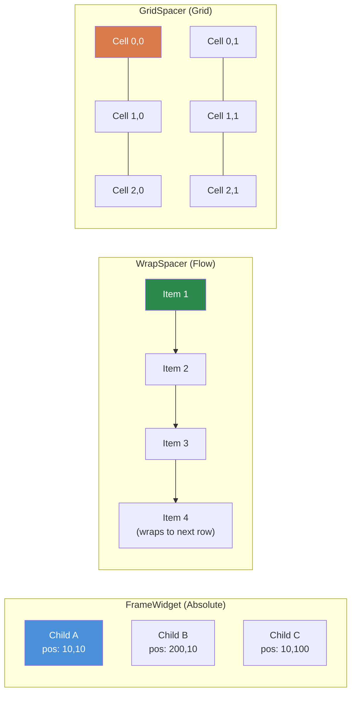
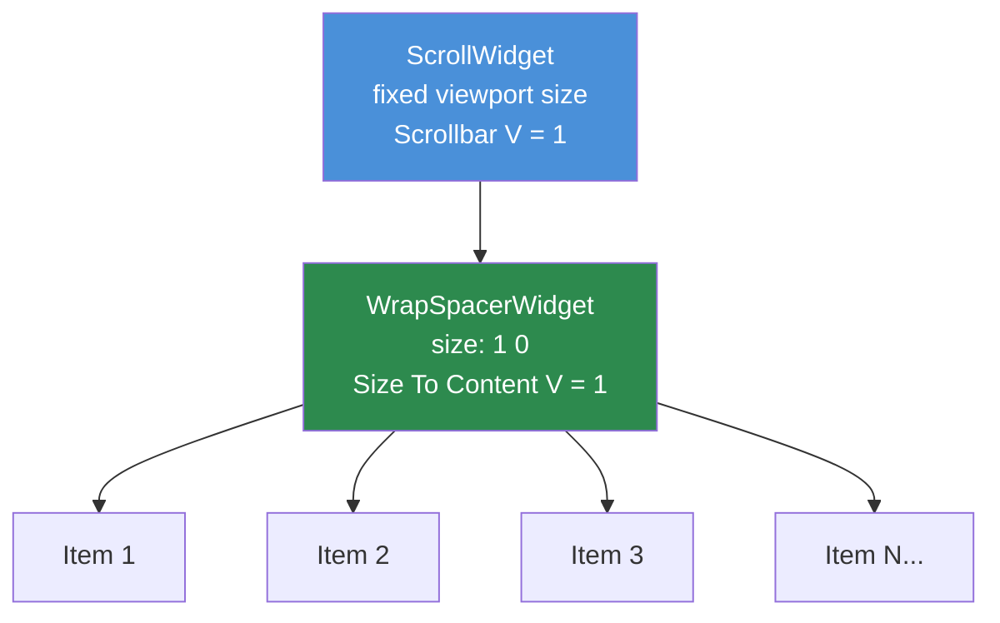

# Chapter 3.4: Container Widgets

[Home](../README.md) | [<< Previous: Sizing & Positioning](03-sizing-positioning.md) | **Container Widgets** | [Next: Programmatic Widgets >>](05-programmatic-widgets.md)

---

Container widgets organize child widgets within them. While `FrameWidget` is the simplest (invisible box, manual positioning), DayZ provides three specialized containers that handle layout automatically: `WrapSpacerWidget`, `GridSpacerWidget`, and `ScrollWidget`.

### Container Comparison



---

## FrameWidget -- Structural Container

`FrameWidget` is the most basic container. It draws nothing on screen and does not arrange its children -- you must position each child manually.

**When to use:**
- Grouping related widgets so they can be shown/hidden together
- Root widget of a panel or dialog
- Any structural grouping where you handle positioning yourself

```
FrameWidgetClass MyPanel {
 size 0.5 0.5
 halign center_ref
 valign center_ref
 hexactpos 1
 vexactpos 1
 hexactsize 0
 vexactsize 0
 {
  TextWidgetClass Header {
   position 0 0
   size 1 0.1
   text "Panel Title"
   "text halign" center
  }
  PanelWidgetClass Divider {
   position 0 0.1
   size 1 2
   hexactsize 0
   vexactsize 1
   color 1 1 1 0.3
  }
  FrameWidgetClass Content {
   position 0 0.12
   size 1 0.88
  }
 }
}
```

**Key characteristics:**
- No visual appearance (transparent)
- Children positioned relative to the frame's bounds
- No automatic layout -- every child needs explicit position/size
- Lightweight -- zero rendering cost beyond its children

---

## WrapSpacerWidget -- Flow Layout

`WrapSpacerWidget` automatically arranges its children in a flow sequence. Children are placed one after another horizontally, wrapping to the next row when they exceed the available width. This is the widget to use for dynamic lists where the number of children changes at runtime.

### Layout Attributes

| Attribute | Values | Description |
|---|---|---|
| `Padding` | integer (pixels) | Space between the spacer's edge and its children |
| `Margin` | integer (pixels) | Space between individual children |
| `"Size To Content H"` | `0` or `1` | Resize width to fit all children |
| `"Size To Content V"` | `0` or `1` | Resize height to fit all children |
| `content_halign` | `left`, `center`, `right` | Horizontal alignment of the child group |
| `content_valign` | `top`, `center`, `bottom` | Vertical alignment of the child group |

### Basic Flow Layout

```
WrapSpacerWidgetClass TagList {
 size 1 0
 hexactsize 0
 "Size To Content V" 1
 Padding 5
 Margin 3
 {
  ButtonWidgetClass Tag1 {
   size 80 24
   hexactsize 1
   vexactsize 1
   text "Weapons"
  }
  ButtonWidgetClass Tag2 {
   size 60 24
   hexactsize 1
   vexactsize 1
   text "Food"
  }
  ButtonWidgetClass Tag3 {
   size 90 24
   hexactsize 1
   vexactsize 1
   text "Medical"
  }
 }
}
```

In this example:
- The spacer is full parent width (`size 1`), but its height adjusts to fit children (`"Size To Content V" 1`).
- Children are 80px, 60px, and 90px wide buttons.
- If the available width cannot fit all three on one row, the spacer wraps them to the next row.
- `Padding 5` adds 5px of space inside the spacer edges.
- `Margin 3` adds 3px between each child.

### Vertical List with WrapSpacer

To create a vertical list (one item per row), make children full-width:

```
WrapSpacerWidgetClass ItemList {
 size 1 0
 hexactsize 0
 "Size To Content V" 1
 Margin 2
 {
  FrameWidgetClass Item1 {
   size 1 30
   hexactsize 0
   vexactsize 1
  }
  FrameWidgetClass Item2 {
   size 1 30
   hexactsize 0
   vexactsize 1
  }
 }
}
```

Each child is 100% width (`size 1` with `hexactsize 0`), so only one fits per row, creating a vertical stack.

### Dynamic Children

`WrapSpacerWidget` is ideal for programmatically added children. When you add or remove children, call `Update()` on the spacer to trigger a re-layout:

```c
WrapSpacerWidget spacer;

// Add a child from a layout file
Widget child = GetGame().GetWorkspace().CreateWidgets("MyMod/gui/layouts/ListItem.layout", spacer);

// Force the spacer to recalculate
spacer.Update();
```

---

## GridSpacerWidget -- Grid Layout

`GridSpacerWidget` arranges children in a uniform grid. You define the number of columns and rows, and each cell gets equal space.

### Layout Attributes

| Attribute | Values | Description |
|---|---|---|
| `Columns` | integer | Number of grid columns |
| `Rows` | integer | Number of grid rows |
| `Margin` | integer (pixels) | Space between grid cells |
| `"Size To Content V"` | `0` or `1` | Resize height to fit content |

### Basic Grid

```
GridSpacerWidgetClass InventoryGrid {
 size 0.5 0.5
 hexactsize 0
 vexactsize 0
 Columns 4
 Rows 3
 Margin 2
 {
  // 12 cells (4 columns x 3 rows)
  // Children are placed in order: left-to-right, top-to-bottom
  FrameWidgetClass Slot1 { }
  FrameWidgetClass Slot2 { }
  FrameWidgetClass Slot3 { }
  FrameWidgetClass Slot4 { }
  FrameWidgetClass Slot5 { }
  FrameWidgetClass Slot6 { }
  FrameWidgetClass Slot7 { }
  FrameWidgetClass Slot8 { }
  FrameWidgetClass Slot9 { }
  FrameWidgetClass Slot10 { }
  FrameWidgetClass Slot11 { }
  FrameWidgetClass Slot12 { }
 }
}
```

### Single-Column Grid (Vertical List)

Setting `Columns 1` creates a simple vertical stack where each child gets the full width:

```
GridSpacerWidgetClass SettingsList {
 size 1 0
 hexactsize 0
 "Size To Content V" 1
 Columns 1
 {
  FrameWidgetClass Setting1 {
   size 150 30
   hexactsize 1
   vexactsize 1
  }
  FrameWidgetClass Setting2 {
   size 150 30
   hexactsize 1
   vexactsize 1
  }
  FrameWidgetClass Setting3 {
   size 150 30
   hexactsize 1
   vexactsize 1
  }
 }
}
```

### GridSpacer vs. WrapSpacer

| Feature | GridSpacer | WrapSpacer |
|---|---|---|
| Cell size | Uniform (equal) | Each child keeps its own size |
| Layout mode | Fixed grid (columns x rows) | Flow with wrapping |
| Best for | Inventory slots, uniform galleries | Dynamic lists, tag clouds |
| Children sizing | Ignored (grid controls it) | Respected (child size matters) |

---

## ScrollWidget -- Scrollable Viewport

`ScrollWidget` wraps content that may be taller (or wider) than the visible area, providing scrollbars for navigation.

### Layout Attributes

| Attribute | Values | Description |
|---|---|---|
| `"Scrollbar V"` | `0` or `1` | Show vertical scrollbar |
| `"Scrollbar H"` | `0` or `1` | Show horizontal scrollbar |

### Script API

```c
ScrollWidget sw;
sw.VScrollToPos(float pos);     // Scroll to vertical position (0 = top)
sw.GetVScrollPos();             // Get current scroll position
sw.GetContentHeight();          // Get total content height
sw.VScrollStep(int step);       // Scroll by a step amount
```

### Basic Scrollable List

```
ScrollWidgetClass ListScroll {
 size 1 300
 hexactsize 0
 vexactsize 1
 "Scrollbar V" 1
 {
  WrapSpacerWidgetClass ListContent {
   size 1 0
   hexactsize 0
   "Size To Content V" 1
   {
    // Many children here...
    FrameWidgetClass Item1 {
     size 1 30
     hexactsize 0
     vexactsize 1
    }
    FrameWidgetClass Item2 {
     size 1 30
     hexactsize 0
     vexactsize 1
    }
    // ... more items
   }
  }
 }
}
```

---

## The ScrollWidget + WrapSpacer Pattern

### ScrollWidget + WrapSpacer Pattern



This is **the** pattern for scrollable dynamic lists in DayZ mods. It combines a fixed-height `ScrollWidget` with a `WrapSpacerWidget` that grows to fit its children.

```
// Fixed-height scroll viewport
ScrollWidgetClass DialogScroll {
 size 0.97 235
 hexactsize 0
 vexactsize 1
 "Scrollbar V" 1
 {
  // Content grows vertically to fit all children
  WrapSpacerWidgetClass DialogContent {
   size 1 0
   hexactsize 0
   "Size To Content V" 1
  }
 }
}
```

How it works:

1. The `ScrollWidget` has a **fixed** height (235 pixels in this example).
2. Inside it, the `WrapSpacerWidget` has `"Size To Content V" 1`, so its height grows as children are added.
3. When the spacer's content exceeds 235 pixels, the scrollbar appears and the user can scroll.

This is the standard pattern used in virtually every DayZ mod with scrollable lists.

### Adding Items Programmatically

```c
ScrollWidget m_Scroll;
WrapSpacerWidget m_Content;

void AddItem(string text)
{
    // Create a new child inside the WrapSpacer
    Widget item = GetGame().GetWorkspace().CreateWidgets(
        "MyMod/gui/layouts/ListItem.layout", m_Content);

    // Configure the new item
    TextWidget tw = TextWidget.Cast(item.FindAnyWidget("Label"));
    tw.SetText(text);

    // Force layout recalculation
    m_Content.Update();
}

void ScrollToBottom()
{
    m_Scroll.VScrollToPos(m_Scroll.GetContentHeight());
}

void ClearAll()
{
    // Remove all children
    Widget child = m_Content.GetChildren();
    while (child)
    {
        Widget next = child.GetSibling();
        child.Unlink();
        child = next;
    }
    m_Content.Update();
}
```

---

## Nesting Rules

Containers can be nested to create complex layouts. Some guidelines:

1. **FrameWidget inside anything** -- Always works. Use frames to group sub-sections within spacers or grids.

2. **WrapSpacer inside ScrollWidget** -- The standard pattern for scrollable lists. The spacer grows; the scroll clips.

3. **GridSpacer inside WrapSpacer** -- Works. Useful for putting a fixed grid as one item in a flow layout.

4. **ScrollWidget inside WrapSpacer** -- Possible but requires a fixed height on the scroll widget (`vexactsize 1`). Without a fixed height, the scroll widget will try to grow to fit its content (defeating the purpose of scrolling).

5. **Avoid deep nesting** -- Every level of nesting adds layout computation cost. Three or four levels deep is typical for complex UIs; going beyond six levels suggests the layout should be restructured.

---

## When to Use Each Container

| Scenario | Best Container |
|---|---|
| Static panel with manually positioned elements | `FrameWidget` |
| Dynamic list of varying-size items | `WrapSpacerWidget` |
| Uniform grid (inventory, gallery) | `GridSpacerWidget` |
| Vertical list with one item per row | `WrapSpacerWidget` (full-width children) or `GridSpacerWidget` (`Columns 1`) |
| Content taller than available space | `ScrollWidget` wrapping a spacer |
| Tab content area | `FrameWidget` (swap children visibility) |
| Toolbar buttons | `WrapSpacerWidget` or `GridSpacerWidget` |

---

## Complete Example: Scrollable Settings Panel

A settings panel with a title bar, scrollable content area containing grid-arranged options, and a bottom button bar:

```
FrameWidgetClass SettingsPanel {
 size 0.4 0.6
 halign center_ref
 valign center_ref
 hexactpos 1
 vexactpos 1
 hexactsize 0
 vexactsize 0
 {
  // Title bar
  PanelWidgetClass TitleBar {
   position 0 0
   size 1 30
   hexactsize 0
   vexactsize 1
   color 0.2 0.4 0.8 1
  }

  // Scrollable settings area
  ScrollWidgetClass SettingsScroll {
   position 0 30
   size 1 0
   hexactpos 0
   vexactpos 1
   hexactsize 0
   vexactsize 0
   "Scrollbar V" 1
   {
    GridSpacerWidgetClass SettingsGrid {
     size 1 0
     hexactsize 0
     "Size To Content V" 1
     Columns 1
     Margin 2
    }
   }
  }

  // Button bar at bottom
  FrameWidgetClass ButtonBar {
   size 1 40
   halign left_ref
   valign bottom_ref
   hexactpos 0
   vexactpos 1
   hexactsize 0
   vexactsize 1
  }
 }
}
```

---

## Gotchas

- You **must** call `Update()` manually on a `WrapSpacerWidget` after `CreateWidgets()` or `Unlink()`. The layout does not auto-recalculate. This is the most common spacer bug.
- `"Size To Content V"` only works if children have explicit sizes (pixel height or known proportional parent). If children are also `Size To Content`, you get zero height.
- `GridSpacerWidget` overrides children's size attributes entirely. Setting `size` on a grid child has no effect.
- After adding children to a `ScrollWidget`, you may need to defer `VScrollToPos()` by one frame (via `CallLater`) because the content height has not yet been recalculated.
- A `WrapSpacer` inside a `WrapSpacer` works, but `Size To Content` on both levels can cause infinite layout loops that freeze the UI.
- For lists with 100+ items, call `Update()` once after batch operations, not after each individual add.
- If two mods inject children into the same vanilla `ScrollWidget` (via `modded class`), child ordering is unpredictable.
- For high-volume lists, pre-create a pool of list-item widgets and show/hide them instead of creating/destroying, to avoid repeated `Update()` overhead.
- Always set `clipchildren 1` on `ScrollWidget`. Without it, overflowing content renders outside the viewport bounds.
- Prefer `WrapSpacerWidget` with full-width children over `GridSpacerWidget Columns 1` for vertical lists where items have varying heights.
- Avoid nesting more than 4-5 container levels deep.

---

## Next Steps

- [3.5 Programmatic Widget Creation](05-programmatic-widgets.md) -- Create widgets from code
- [3.6 Event Handling](06-event-handling.md) -- Respond to clicks, changes, and other events
