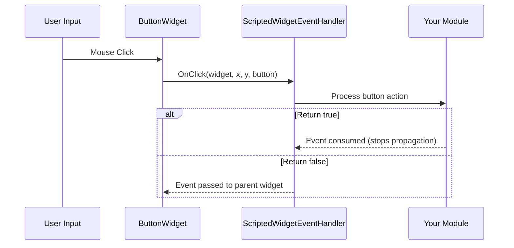

# Chapter 3.6: Event Handling

[Home](../README.md) | [<< Previous: Programmatic Widget Creation](05-programmatic-widgets.md) | **Event Handling** | [Next: Styles, Fonts & Images >>](07-styles-fonts.md)

---

Widgets generate events when the user interacts with them -- clicking buttons, typing in edit boxes, moving the mouse, dragging elements. This chapter covers how to receive and handle those events.

---

## ScriptedWidgetEventHandler

The `ScriptedWidgetEventHandler` class is the foundation of all widget event handling in DayZ. It provides override methods for every possible widget event.

To receive events from a widget, create a class that extends `ScriptedWidgetEventHandler`, override the event methods you care about, and attach the handler to the widget with `SetHandler()`.

### Complete Event Method List

```c
class ScriptedWidgetEventHandler
{
    // Click events
    bool OnClick(Widget w, int x, int y, int button);
    bool OnDoubleClick(Widget w, int x, int y, int button);

    // Selection events
    bool OnSelect(Widget w, int x, int y);
    bool OnItemSelected(Widget w, int x, int y, int row, int column,
                         int oldRow, int oldColumn);

    // Focus events
    bool OnFocus(Widget w, int x, int y);
    bool OnFocusLost(Widget w, int x, int y);

    // Mouse events
    bool OnMouseEnter(Widget w, int x, int y);
    bool OnMouseLeave(Widget w, Widget enterW, int x, int y);
    bool OnMouseWheel(Widget w, int x, int y, int wheel);
    bool OnMouseButtonDown(Widget w, int x, int y, int button);
    bool OnMouseButtonUp(Widget w, int x, int y, int button);

    // Keyboard events
    bool OnKeyDown(Widget w, int x, int y, int key);
    bool OnKeyUp(Widget w, int x, int y, int key);
    bool OnKeyPress(Widget w, int x, int y, int key);

    // Change events (sliders, checkboxes, editboxes)
    bool OnChange(Widget w, int x, int y, bool finished);

    // Drag and drop events
    bool OnDrag(Widget w, int x, int y);
    bool OnDragging(Widget w, int x, int y, Widget receiver);
    bool OnDraggingOver(Widget w, int x, int y, Widget receiver);
    bool OnDrop(Widget w, int x, int y, Widget receiver);
    bool OnDropReceived(Widget w, int x, int y, Widget receiver);

    // Controller (gamepad) events
    bool OnController(Widget w, int control, int value);

    // Layout events
    bool OnResize(Widget w, int x, int y);
    bool OnChildAdd(Widget w, Widget child);
    bool OnChildRemove(Widget w, Widget child);

    // Other
    bool OnUpdate(Widget w);
    bool OnModalResult(Widget w, int x, int y, int code, int result);
}
```

### Return Value: Consumed vs. Pass-Through

Every event handler returns a `bool`:

- **`return true;`** -- The event is **consumed**. No other handler will receive it. The event stops propagating up the widget hierarchy.
- **`return false;`** -- The event is **passed through** to the parent widget's handler (if any).

This is critical for building layered UIs. For example, a button click handler should return `true` to prevent the click from also triggering a panel behind it.

### Event Flow



---

## Registering Handlers with SetHandler()

The simplest way to handle events is to call `SetHandler()` on a widget:

```c
class MyPanel : ScriptedWidgetEventHandler
{
    protected Widget m_Root;
    protected ButtonWidget m_SaveBtn;
    protected ButtonWidget m_CancelBtn;

    void MyPanel()
    {
        m_Root = GetGame().GetWorkspace().CreateWidgets(
            "MyMod/gui/layouts/panel.layout");

        m_SaveBtn = ButtonWidget.Cast(m_Root.FindAnyWidget("SaveButton"));
        m_CancelBtn = ButtonWidget.Cast(m_Root.FindAnyWidget("CancelButton"));

        // Register this class as the event handler for both buttons
        m_SaveBtn.SetHandler(this);
        m_CancelBtn.SetHandler(this);
    }

    override bool OnClick(Widget w, int x, int y, int button)
    {
        if (w == m_SaveBtn)
        {
            Save();
            return true;  // Consumed
        }

        if (w == m_CancelBtn)
        {
            Cancel();
            return true;
        }

        return false;  // Not our widget, pass through
    }
}
```

A single handler instance can be registered on multiple widgets. Inside the event method, compare `w` (the widget that generated the event) against your cached references to determine which widget was interacted with.

---

## Common Events in Detail

### OnClick

```c
bool OnClick(Widget w, int x, int y, int button)
```

Fired when a `ButtonWidget` is clicked (mouse released over the widget).

- `w` -- The clicked widget
- `x, y` -- Mouse cursor position (screen pixels)
- `button` -- Mouse button index: `0` = left, `1` = right, `2` = middle

```c
override bool OnClick(Widget w, int x, int y, int button)
{
    if (button != 0) return false;  // Only handle left click

    if (w == m_MyButton)
    {
        DoAction();
        return true;
    }
    return false;
}
```

### OnChange

```c
bool OnChange(Widget w, int x, int y, bool finished)
```

Fired by `SliderWidget`, `CheckBoxWidget`, `EditBoxWidget`, and other value-based widgets when their value changes.

- `w` -- The widget whose value changed
- `finished` -- For sliders: `true` when the user releases the slider handle. For edit boxes: `true` when Enter is pressed.

```c
override bool OnChange(Widget w, int x, int y, bool finished)
{
    if (w == m_VolumeSlider)
    {
        SliderWidget slider = SliderWidget.Cast(w);
        float value = slider.GetCurrent();

        // Only apply when user finishes dragging
        if (finished)
        {
            ApplyVolume(value);
        }
        else
        {
            // Preview while dragging
            PreviewVolume(value);
        }
        return true;
    }

    if (w == m_NameInput)
    {
        EditBoxWidget edit = EditBoxWidget.Cast(w);
        string text = edit.GetText();

        if (finished)
        {
            // User pressed Enter
            SubmitName(text);
        }
        return true;
    }

    if (w == m_EnableCheckbox)
    {
        CheckBoxWidget cb = CheckBoxWidget.Cast(w);
        bool checked = cb.IsChecked();
        ToggleFeature(checked);
        return true;
    }

    return false;
}
```

### OnMouseEnter / OnMouseLeave

```c
bool OnMouseEnter(Widget w, int x, int y)
bool OnMouseLeave(Widget w, Widget enterW, int x, int y)
```

Fired when the mouse cursor enters or leaves a widget's bounds. The `enterW` parameter in `OnMouseLeave` is the widget the cursor moved to.

Common use: hover effects.

```c
override bool OnMouseEnter(Widget w, int x, int y)
{
    if (w == m_HoverPanel)
    {
        m_HoverPanel.SetColor(ARGB(255, 80, 130, 200));  // Highlight
        return true;
    }
    return false;
}

override bool OnMouseLeave(Widget w, Widget enterW, int x, int y)
{
    if (w == m_HoverPanel)
    {
        m_HoverPanel.SetColor(ARGB(255, 50, 50, 50));  // Default
        return true;
    }
    return false;
}
```

### OnFocus / OnFocusLost

```c
bool OnFocus(Widget w, int x, int y)
bool OnFocusLost(Widget w, int x, int y)
```

Fired when a widget gains or loses keyboard focus. Important for edit boxes and other text input widgets.

```c
override bool OnFocus(Widget w, int x, int y)
{
    if (w == m_SearchBox)
    {
        m_SearchBox.SetColor(ARGB(255, 100, 160, 220));
        return true;
    }
    return false;
}

override bool OnFocusLost(Widget w, int x, int y)
{
    if (w == m_SearchBox)
    {
        m_SearchBox.SetColor(ARGB(255, 60, 60, 60));
        return true;
    }
    return false;
}
```

### OnMouseWheel

```c
bool OnMouseWheel(Widget w, int x, int y, int wheel)
```

Fired when the mouse wheel scrolls over a widget. `wheel` is positive for scroll up, negative for scroll down.

### OnKeyDown / OnKeyUp / OnKeyPress

```c
bool OnKeyDown(Widget w, int x, int y, int key)
bool OnKeyUp(Widget w, int x, int y, int key)
bool OnKeyPress(Widget w, int x, int y, int key)
```

Keyboard events. The `key` parameter corresponds to `KeyCode` constants (e.g., `KeyCode.KC_ESCAPE`, `KeyCode.KC_RETURN`).

### OnDrag / OnDrop / OnDropReceived

```c
bool OnDrag(Widget w, int x, int y)
bool OnDrop(Widget w, int x, int y, Widget receiver)
bool OnDropReceived(Widget w, int x, int y, Widget receiver)
```

Drag and drop events. The widget must have `draggable 1` in its layout (or `WidgetFlags.DRAGGABLE` set in code).

- `OnDrag` -- User started dragging widget `w`
- `OnDrop` -- Widget `w` was dropped; `receiver` is the widget underneath
- `OnDropReceived` -- Widget `w` received a drop; `receiver` is the dropped widget

### OnItemSelected

```c
bool OnItemSelected(Widget w, int x, int y, int row, int column,
                     int oldRow, int oldColumn)
```

Fired by `TextListboxWidget` when a row is selected.

---

## Vanilla WidgetEventHandler (Callback Registration)

DayZ's vanilla code uses an alternative pattern: `WidgetEventHandler`, a singleton that routes events to named callback functions. This is commonly used in vanilla menus.

```c
WidgetEventHandler handler = WidgetEventHandler.GetInstance();

// Register event callbacks by function name
handler.RegisterOnClick(myButton, this, "OnMyButtonClick");
handler.RegisterOnMouseEnter(myWidget, this, "OnHoverStart");
handler.RegisterOnMouseLeave(myWidget, this, "OnHoverEnd");
handler.RegisterOnDoubleClick(myWidget, this, "OnDoubleClick");
handler.RegisterOnMouseButtonDown(myWidget, this, "OnMouseDown");
handler.RegisterOnMouseButtonUp(myWidget, this, "OnMouseUp");
handler.RegisterOnMouseWheel(myWidget, this, "OnWheel");
handler.RegisterOnFocus(myWidget, this, "OnFocusGained");
handler.RegisterOnFocusLost(myWidget, this, "OnFocusLost");
handler.RegisterOnDrag(myWidget, this, "OnDragStart");
handler.RegisterOnDrop(myWidget, this, "OnDropped");
handler.RegisterOnDropReceived(myWidget, this, "OnDropReceived");
handler.RegisterOnDraggingOver(myWidget, this, "OnDragOver");
handler.RegisterOnChildAdd(myWidget, this, "OnChildAdded");
handler.RegisterOnChildRemove(myWidget, this, "OnChildRemoved");

// Unregister all callbacks for a widget
handler.UnregisterWidget(myWidget);
```

The callback function signatures must match the event type:

```c
void OnMyButtonClick(Widget w, int x, int y, int button)
{
    // Handle click
}

void OnHoverStart(Widget w, int x, int y)
{
    // Handle mouse enter
}

void OnHoverEnd(Widget w, Widget enterW, int x, int y)
{
    // Handle mouse leave
}
```

### SetHandler() vs. WidgetEventHandler

| Aspect | SetHandler() | WidgetEventHandler |
|---|---|---|
| Pattern | Override virtual methods | Register named callbacks |
| Handler per widget | One handler per widget | Multiple callbacks per event |
| Used by | DabsFramework, Expansion, custom mods | Vanilla DayZ menus |
| Flexibility | Must handle all events in one class | Can register different targets for different events |
| Cleanup | Implicit when handler is destroyed | Must call `UnregisterWidget()` |

For new mods, `SetHandler()` with `ScriptedWidgetEventHandler` is the recommended approach.

---

## Complete Example: Interactive Button Panel

A panel with three buttons that change color on hover and perform actions on click:

```c
class InteractivePanel : ScriptedWidgetEventHandler
{
    protected Widget m_Root;
    protected ButtonWidget m_BtnStart;
    protected ButtonWidget m_BtnStop;
    protected ButtonWidget m_BtnReset;
    protected TextWidget m_StatusText;

    protected int m_DefaultColor = ARGB(255, 60, 60, 60);
    protected int m_HoverColor   = ARGB(255, 80, 130, 200);
    protected int m_ActiveColor  = ARGB(255, 50, 180, 80);

    void InteractivePanel()
    {
        m_Root = GetGame().GetWorkspace().CreateWidgets(
            "MyMod/gui/layouts/interactive_panel.layout");

        m_BtnStart  = ButtonWidget.Cast(m_Root.FindAnyWidget("BtnStart"));
        m_BtnStop   = ButtonWidget.Cast(m_Root.FindAnyWidget("BtnStop"));
        m_BtnReset  = ButtonWidget.Cast(m_Root.FindAnyWidget("BtnReset"));
        m_StatusText = TextWidget.Cast(m_Root.FindAnyWidget("StatusText"));

        // Register this handler on all interactive widgets
        m_BtnStart.SetHandler(this);
        m_BtnStop.SetHandler(this);
        m_BtnReset.SetHandler(this);
    }

    override bool OnClick(Widget w, int x, int y, int button)
    {
        if (button != 0) return false;

        if (w == m_BtnStart)
        {
            m_StatusText.SetText("Started");
            m_StatusText.SetColor(m_ActiveColor);
            return true;
        }
        if (w == m_BtnStop)
        {
            m_StatusText.SetText("Stopped");
            m_StatusText.SetColor(ARGB(255, 200, 50, 50));
            return true;
        }
        if (w == m_BtnReset)
        {
            m_StatusText.SetText("Ready");
            m_StatusText.SetColor(ARGB(255, 200, 200, 200));
            return true;
        }
        return false;
    }

    override bool OnMouseEnter(Widget w, int x, int y)
    {
        if (w == m_BtnStart || w == m_BtnStop || w == m_BtnReset)
        {
            w.SetColor(m_HoverColor);
            return true;
        }
        return false;
    }

    override bool OnMouseLeave(Widget w, Widget enterW, int x, int y)
    {
        if (w == m_BtnStart || w == m_BtnStop || w == m_BtnReset)
        {
            w.SetColor(m_DefaultColor);
            return true;
        }
        return false;
    }

    void Show(bool visible)
    {
        m_Root.Show(visible);
    }

    void ~InteractivePanel()
    {
        if (m_Root)
        {
            m_Root.Unlink();
            m_Root = null;
        }
    }
}
```

---

## Event Handling Best Practices

1. **Always return `true` when you handle an event** -- Otherwise the event propagates to parent widgets and may trigger unintended behavior.

2. **Return `false` for events you do not handle** -- This allows parent widgets to process the event.

3. **Cache widget references** -- Do not call `FindAnyWidget()` inside event handlers. Look up widgets once in the constructor and store references.

4. **Null-check widgets in events** -- The widget `w` is usually valid, but defensive coding prevents crashes.

5. **Clean up handlers** -- When destroying a panel, unlink the root widget. If using `WidgetEventHandler`, call `UnregisterWidget()`.

6. **Use `finished` parameter wisely** -- For sliders, only apply expensive operations when `finished` is `true` (user released the handle). Use non-finished events for previewing.

7. **Defer heavy work** -- If an event handler needs to do expensive computation, use `CallLater` to defer it:

```c
override bool OnClick(Widget w, int x, int y, int button)
{
    if (w == m_HeavyActionBtn)
    {
        GetGame().GetCallQueue(CALL_CATEGORY_GUI).CallLater(DoHeavyWork, 0, false);
        return true;
    }
    return false;
}
```

---

## Theory vs Practice

> What the documentation says versus how things actually work at runtime.

| Concept | Theory | Reality |
|---------|--------|---------|
| `OnClick` fires on any widget | Any widget can receive click events | Only `ButtonWidget` reliably fires `OnClick`. For other widget types, use `OnMouseButtonDown` / `OnMouseButtonUp` instead |
| `SetHandler()` replaces the handler | Setting a new handler replaces the old one | Correct, but the old handler is not notified. If it held resources, they leak. Always clean up before replacing handlers |
| `OnChange` `finished` parameter | `true` when user finishes interaction | For `EditBoxWidget`, `finished` is `true` on Enter key only -- tabbing away or clicking elsewhere does NOT set `finished` to `true` |
| Event return value propagation | `return false` passes event to parent | Events propagate up the widget tree, not to sibling widgets. A `return false` from a child goes to its parent, never to an adjacent widget |
| `WidgetEventHandler` callback names | Any function name works | The function must exist on the target object at registration time. If the function name is misspelled, registration silently succeeds but the callback never fires |

---

## Compatibility & Impact

- **Multi-Mod:** `SetHandler()` allows only one handler per widget. If mod A and mod B both call `SetHandler()` on the same vanilla widget (via `modded class`), the last one wins and the other silently stops receiving events. Use `WidgetEventHandler.RegisterOnClick()` for additive multi-mod compatibility.
- **Performance:** Event handlers fire on the game's main thread. A slow `OnClick` handler (e.g., file I/O or complex calculations) causes visible frame hitching. Defer heavy work with `GetGame().GetCallQueue(CALL_CATEGORY_GUI).CallLater()`.
- **Version:** The `ScriptedWidgetEventHandler` API has been stable since DayZ 1.0. `WidgetEventHandler` singleton callbacks are vanilla patterns present since early Enforce Script versions and remain unchanged.

---

## Observed in Real Mods

| Pattern | Mod | Detail |
|---------|-----|--------|
| Single handler for entire panel | COT, VPP Admin Tools | One `ScriptedWidgetEventHandler` subclass handles all buttons in a panel, dispatching by comparing `w` against cached widget references |
| `WidgetEventHandler.RegisterOnClick` for modular buttons | Expansion Market | Each dynamically created buy/sell button registers its own callback, allowing per-item handler functions |
| `OnMouseEnter` / `OnMouseLeave` for hover tooltips | DayZ Editor | Hover events trigger tooltip widgets that follow cursor position via `GetMousePos()` |
| `CallLater` deferral in `OnClick` | DabsFramework | Heavy operations (config save, RPC send) are deferred by 0ms via `CallLater` to avoid blocking the UI thread during the event |

---

## Next Steps

- [3.7 Styles, Fonts & Images](07-styles-fonts.md) -- Visual styling with styles, fonts, and imageset references
- [3.5 Programmatic Widget Creation](05-programmatic-widgets.md) -- Creating widgets that generate events
