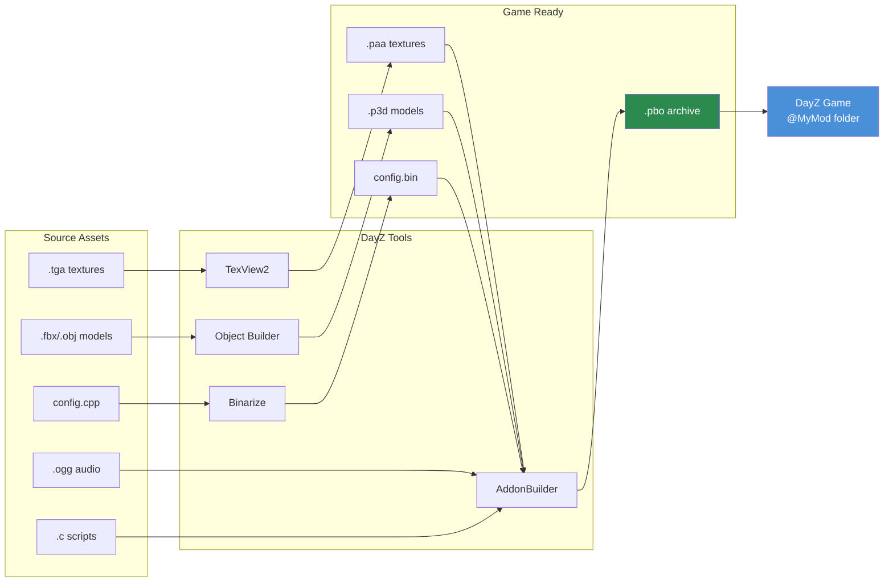

# Chapter 4.5: DayZ Tools Workflow

[Home](../README.md) | [<< Previous: Audio](04-audio.md) | **DayZ Tools** | [Next: PBO Packing >>](06-pbo-packing.md)

---

## Introduction

DayZ Tools is a free suite of development applications distributed through Steam, provided by Bohemia Interactive for modders. It contains everything needed to create, convert, and package game assets: a 3D model editor, texture viewer, terrain editor, script debugger, and the binarization pipeline that transforms human-readable source files into optimized game-ready formats. No DayZ mod can be built without at least some interaction with these tools.

This chapter provides an overview of each tool in the suite, explains the P: drive (workdrive) system that underpins the entire workflow, covers file patching for rapid development iteration, and walks through the complete asset pipeline from source files to playable mod.

---

## Table of Contents

- [DayZ Tools Suite Overview](#dayz-tools-suite-overview)
- [Installation and Setup](#installation-and-setup)
- [P: Drive (Workdrive)](#p-drive-workdrive)
- [Object Builder](#object-builder)
- [TexView2](#texview2)
- [Terrain Builder](#terrain-builder)
- [Binarize](#binarize)
- [AddonBuilder](#addonbuilder)
- [Workbench](#workbench)
- [File Patching Mode](#file-patching-mode)
- [Complete Workflow: Source to Game](#complete-workflow-source-to-game)
- [Common Mistakes](#common-mistakes)
- [Best Practices](#best-practices)

---

## DayZ Tools Suite Overview

DayZ Tools is available as a free download on Steam under the **Tools** category. It installs a collection of applications, each serving a specific role in the modding pipeline.

| Tool | Purpose | Primary Users |
|------|---------|---------------|
| **Object Builder** | 3D model creation and editing (.p3d) | 3D artists, modelers |
| **TexView2** | Texture viewing and conversion (.paa, .tga, .png) | Texture artists, all modders |
| **Terrain Builder** | Terrain/map creation and editing | Map makers |
| **Binarize** | Source-to-game format conversion | Build pipeline (usually automated) |
| **AddonBuilder** | PBO packing with optional binarization | All modders |
| **Workbench** | Script debugging, testing, profiling | Scripters |
| **DayZ Tools Launcher** | Central hub for launching tools and configuring P: drive | All modders |

### Where They Live on Disk

After Steam installation, the tools are typically located at:

```
C:\Program Files (x86)\Steam\steamapps\common\DayZ Tools\
  Bin\
    AddonBuilder\
      AddonBuilder.exe          <-- PBO packer
    Binarize\
      Binarize.exe              <-- Asset converter
    TexView2\
      TexView2.exe              <-- Texture tool
    ObjectBuilder\
      ObjectBuilder.exe         <-- 3D model editor
    Workbench\
      workbenchApp.exe          <-- Script debugger
  TerrainBuilder\
    TerrainBuilder.exe          <-- Terrain editor
```

---

## Installation and Setup

### Step 1: Install DayZ Tools from Steam

1. Open Steam Library.
2. Enable **Tools** filter in the dropdown.
3. Search for "DayZ Tools".
4. Install (free, approximately 2 GB).

### Step 2: Launch DayZ Tools

1. Launch "DayZ Tools" from Steam.
2. The DayZ Tools Launcher opens -- a central hub application.
3. From here you can launch any individual tool and configure settings.

### Step 3: Configure P: Drive

The launcher provides a button to create and mount the P: drive (workdrive). This is the virtual drive that all DayZ tools use as their root path.

1. Click **Setup Workdrive** (or the P: drive configuration button).
2. The tool creates a subst-mapped P: drive pointing to a directory on your real disk.
3. Extract or symlink vanilla DayZ data to P: so the tools can reference game assets.

---

## P: Drive (Workdrive)

The **P: drive** is a Windows virtual drive (created via `subst` or junction) that serves as the unified root path for all DayZ modding. Every path in P3D models, RVMAT materials, config.cpp references, and build scripts is relative to P:.

### Why P: Drive Exists

DayZ's asset pipeline was designed around a fixed root path. When a material references `MyMod\data\texture_co.paa`, the engine looks for `P:\MyMod\data\texture_co.paa`. This convention ensures:

- All tools agree on where files are.
- Paths in packed PBOs match paths during development.
- Multiple mods can coexist under one root.

### Structure

```
P:\
  DZ\                          <-- Vanilla DayZ extracted data
    characters\
    weapons\
    data\
    ...
  DayZ Tools\                  <-- Tools installation (or symlink)
  MyMod\                       <-- Your mod source
    config.cpp
    Scripts\
    data\
  AnotherMod\                  <-- Another mod's source
    ...
```

### SetupWorkdrive.bat

Many mod projects include a `SetupWorkdrive.bat` script that automates P: drive creation and junction setup. A typical script:

```batch
@echo off
REM Create P: drive pointing to the workspace
subst P: "D:\DayZModding"

REM Create junctions for vanilla game data
mklink /J "P:\DZ" "C:\Program Files (x86)\Steam\steamapps\common\DayZ\dta"

REM Create junction for tools
mklink /J "P:\DayZ Tools" "C:\Program Files (x86)\Steam\steamapps\common\DayZ Tools"

echo Workdrive P: configured.
pause
```

> **Tip:** The workdrive must be mounted before launching any DayZ tool. If Object Builder or Binarize cannot find files, the first thing to check is whether P: is mounted.

---

## Object Builder

Object Builder is the 3D model editor for P3D files. It is covered in detail in [Chapter 4.2: 3D Models](02-models.md). Here is a summary of its role in the toolchain.

### Key Capabilities

- Create and edit P3D model files.
- Define LODs (Level of Detail) for visual, collision, and shadow meshes.
- Assign materials (RVMAT) and textures (PAA) to model faces.
- Create named selections for animations and texture swaps.
- Place memory points and proxy objects.
- Import geometry from FBX, OBJ, and 3DS formats.
- Validate models for engine compatibility.

### Launching

```
DayZ Tools Launcher --> Object Builder
```

Or directly: `P:\DayZ Tools\Bin\ObjectBuilder\ObjectBuilder.exe`

### Integration with Other Tools

- **References TexView2** for texture previews (double-click a texture in face properties).
- **Outputs P3D files** consumed by Binarize and AddonBuilder.
- **Reads P3D files** from vanilla data on P: drive for reference.

---

## TexView2

TexView2 is the texture viewing and conversion utility. It handles all texture format conversions needed for DayZ modding.

### Key Capabilities

- Open and preview PAA, TGA, PNG, EDDS, and DDS files.
- Convert between formats (TGA/PNG to PAA, PAA to TGA, etc.).
- View individual channels (R, G, B, A) separately.
- Display mipmap levels.
- Show texture dimensions and compression type.
- Batch conversion via command line.

### Launching

```
DayZ Tools Launcher --> TexView2
```

Or directly: `P:\DayZ Tools\Bin\TexView2\TexView2.exe`

### Common Operations

**Convert TGA to PAA:**
1. File --> Open --> select your TGA file.
2. Verify the image looks correct.
3. File --> Save As --> choose PAA format.
4. Select compression (DXT1 for opaque, DXT5 for alpha).
5. Save.

**Inspect a vanilla PAA texture:**
1. File --> Open --> browse to `P:\DZ\...` and select a PAA file.
2. View the image. Click channel buttons (R, G, B, A) to inspect individual channels.
3. Note the dimensions and compression type shown in the status bar.

**Command-line conversion:**
```bash
TexView2.exe -i "P:\MyMod\data\texture_co.tga" -o "P:\MyMod\data\texture_co.paa"
```

---

## Terrain Builder

Terrain Builder is a specialized tool for creating custom maps (terrains). Map making is one of the most complex modding tasks in DayZ, involving satellite imagery, height maps, surface masks, and object placement.

### Key Capabilities

- Import satellite imagery and height maps.
- Define terrain layers (grass, dirt, rock, sand, etc.).
- Place objects (buildings, trees, rocks) on the map.
- Configure surface textures and materials.
- Export terrain data for Binarize.

### When You Need Terrain Builder

- Creating a new map from scratch.
- Modifying an existing terrain (adding/removing objects, changing terrain shape).
- Terrain Builder is NOT needed for item mods, weapon mods, UI mods, or script-only mods.

### Launching

```
DayZ Tools Launcher --> Terrain Builder
```

> **Note:** Terrain creation is an advanced topic that warrants its own dedicated guide. This chapter covers Terrain Builder only as part of the tools overview.

---

## Binarize

Binarize is the core conversion engine that transforms human-readable source files into optimized, game-ready binary formats. It runs behind the scenes during PBO packing (via AddonBuilder) but can also be invoked directly.

### What Binarize Converts

| Source Format | Output Format | Description |
|---------------|---------------|-------------|
| MLOD `.p3d` | ODOL `.p3d` | Optimized 3D model |
| `.tga` / `.png` / `.edds` | `.paa` | Compressed texture |
| `.cpp` (config) | `.bin` | Binarized config (faster parsing) |
| `.rvmat` | `.rvmat` (processed) | Material with resolved paths |
| `.wrp` | `.wrp` (optimized) | Terrain world |

### When Binarization is Needed

| Content Type | Binarize? | Reason |
|-------------|-----------|--------|
| Config.cpp with CfgVehicles | **Yes** | Engine requires binarized configs for item definitions |
| Config.cpp (scripts only) | Optional | Script-only configs work unbinarized |
| P3D models | **Yes** | ODOL is faster to load, smaller, engine-optimized |
| Textures (TGA/PNG) | **Yes** | PAA is required at runtime |
| Scripts (.c files) | **No** | Scripts are loaded as-is (text) |
| Audio (.ogg) | **No** | OGG is already game-ready |
| Layouts (.layout) | **No** | Loaded as-is |

### Direct Invocation

```bash
Binarize.exe -targetPath="P:\build\MyMod" -sourcePath="P:\MyMod" -noLogs
```

In practice, you rarely call Binarize directly -- AddonBuilder wraps it as part of the PBO packing process.

---

## AddonBuilder

AddonBuilder is the PBO packing tool. It takes a source directory and creates a `.pbo` archive, optionally running Binarize on the content first. This is covered in detail in [Chapter 4.6: PBO Packing](06-pbo-packing.md).

### Quick Reference

```bash
# Pack with binarization (for item/weapon mods with configs, models, textures)
AddonBuilder.exe "P:\MyMod" "P:\output" -prefix="MyMod" -sign="MyKey"

# Pack without binarization (for script-only mods)
AddonBuilder.exe "P:\MyMod" "P:\output" -prefix="MyMod" -packonly
```

### Launching

From the DayZ Tools Launcher, or directly:
```
P:\DayZ Tools\Bin\AddonBuilder\AddonBuilder.exe
```

AddonBuilder has both a GUI mode and a command-line mode. The GUI provides a visual file browser and option checkboxes. The command-line mode is used by automated build scripts.

---

## Workbench

Workbench is a script development environment included with DayZ Tools. It provides script editing, debugging, and profiling capabilities.

### Key Capabilities

- **Script editing** with syntax highlighting for Enforce Script.
- **Debugging** with breakpoints, step execution, and variable inspection.
- **Profiling** to identify performance bottlenecks in scripts.
- **Console** for evaluating expressions and testing snippets.
- **Resource browser** for inspecting game data.

### Launching

```
DayZ Tools Launcher --> Workbench
```

Or directly: `P:\DayZ Tools\Bin\Workbench\workbenchApp.exe`

### Debugging Workflow

1. Open Workbench.
2. Configure the project to point at your mod's scripts.
3. Set breakpoints in your `.c` files.
4. Launch the game through Workbench (it starts DayZ in debug mode).
5. When execution hits a breakpoint, Workbench pauses the game and shows the call stack, local variables, and allows step-through.

### Limitations

- Workbench's Enforce Script support has some gaps -- not all engine APIs are fully documented in its autocomplete.
- Some modders prefer external editors (VS Code with community Enforce Script extensions) for writing code and use Workbench only for debugging.
- Workbench can be unstable with large mods or complex breakpoint configurations.

---

## File Patching Mode

**File patching** is a development shortcut that allows the game to load loose files from disk instead of requiring them to be packed into PBOs. This dramatically speeds up iteration during development.

### How File Patching Works

When DayZ is launched with the `-filePatching` parameter, the engine checks the P: drive for files before looking in PBOs. If a file exists on P:, the loose version is loaded instead of the PBO version.

```
Normal mode:   Game loads --> PBO --> files
File patching: Game loads --> P: drive (if file exists) --> PBO (fallback)
```

### Enabling File Patching

Add the `-filePatching` launch parameter to DayZ:

```bash
# Client
DayZDiag_x64.exe -filePatching -mod="MyMod" -connect=127.0.0.1

# Server
DayZDiag_x64.exe -filePatching -server -mod="MyMod" -config=serverDZ.cfg
```

> **Important:** File patching requires the **Diag** (diagnostic) executable (`DayZDiag_x64.exe`), not the retail executable. The retail build ignores `-filePatching` for security.

### What File Patching Can Do

| Asset Type | File Patching Works? | Notes |
|------------|---------------------|-------|
| Scripts (.c) | **Yes** | Fastest iteration -- edit, restart, test |
| Layouts (.layout) | **Yes** | UI changes without rebuild |
| Textures (.paa) | **Yes** | Swap textures without rebuild |
| Config.cpp | **Partial** | Unbinarized configs only |
| Models (.p3d) | **Yes** | Unbinarized MLOD P3D only |
| Audio (.ogg) | **Yes** | Swap sounds without rebuild |

### Workflow with File Patching

1. Set up P: drive with your mod's source files.
2. Launch server and client with `-filePatching`.
3. Edit a script file in your editor.
4. Restart the game (or reconnect) to pick up the changes.
5. No PBO rebuild needed.

> **Tip:** For script-only changes, file patching eliminates the build step entirely. You edit `.c` files, restart, and test. This is the fastest development loop available.

### Limitations

- **No binarized content.** Config.cpp with `CfgVehicles` entries may not work correctly without binarization. Script-only configs work fine.
- **No key signing.** File-patched content is not signed, so it only works in development (not on public servers).
- **Diag build only.** The retail executable ignores file patching.
- **P: drive must be mounted.** If the workdrive is not mounted, file patching has nothing to read from.

---

## Complete Workflow: Source to Game

Here is the end-to-end pipeline for turning source assets into a playable mod:

### Complete Asset Pipeline



### Phase 1: Create Source Assets

```
3D Software (Blender/3dsMax)  -->  FBX export
Image Editor (Photoshop/GIMP) -->  TGA/PNG export
Audio Editor (Audacity)       -->  OGG export
Text Editor (VS Code)         -->  .c scripts, config.cpp, .layout files
```

### Phase 2: Import and Convert

```
FBX  -->  Object Builder  -->  P3D (with LODs, selections, materials)
TGA  -->  TexView2         -->  PAA (compressed texture)
PNG  -->  TexView2         -->  PAA (compressed texture)
OGG  -->  (no conversion needed, game-ready)
```

### Phase 3: Organize on P: Drive

```
P:\MyMod\
  config.cpp                    <-- Mod configuration
  Scripts\
    3_Game\                     <-- Early-load scripts
    4_World\                    <-- Entity/manager scripts
    5_Mission\                  <-- UI/mission scripts
  data\
    models\
      my_item.p3d               <-- 3D model
    textures\
      my_item_co.paa            <-- Diffuse texture
      my_item_nohq.paa          <-- Normal map
      my_item_smdi.paa          <-- Specular map
    materials\
      my_item.rvmat             <-- Material definition
  sound\
    my_sound.ogg                <-- Audio file
  GUI\
    layouts\
      my_panel.layout           <-- UI layout
```

### Phase 4: Test with File Patching (Development)

```
Launch DayZDiag with -filePatching
  |
  |--> Engine reads loose files from P:\MyMod\
  |--> Test in-game
  |--> Edit files directly on P:
  |--> Restart to pick up changes
  |--> Iterate rapidly
```

### Phase 5: Pack PBO (Release)

```
AddonBuilder / build script
  |
  |--> Reads source from P:\MyMod\
  |--> Binarize converts: P3D-->ODOL, TGA-->PAA, config.cpp-->.bin
  |--> Packs everything into MyMod.pbo
  |--> Signs with key: MyMod.pbo.MyKey.bisign
  |--> Output: @MyMod\addons\MyMod.pbo
```

### Phase 6: Distribute

```
@MyMod\
  addons\
    MyMod.pbo                   <-- The packed mod
    MyMod.pbo.MyKey.bisign      <-- Signature for server verification
  keys\
    MyKey.bikey                 <-- Public key for server admins
  mod.cpp                       <-- Mod metadata (name, author, etc.)
```

Players subscribe to the mod on Steam Workshop, or server admins install it manually.

---

## Common Mistakes

### 1. P: Drive Not Mounted

**Symptom:** All tools report "file not found" errors. Object Builder shows blank textures.
**Fix:** Run your `SetupWorkdrive.bat` or mount P: via DayZ Tools Launcher before launching any tool.

### 2. Wrong Tool for the Job

**Symptom:** Trying to edit a PAA file in a text editor, or opening a P3D in Notepad.
**Fix:** PAA is binary -- use TexView2. P3D is binary -- use Object Builder. Config.cpp is text -- use any text editor.

### 3. Forgetting to Extract Vanilla Data

**Symptom:** Object Builder cannot display vanilla textures on referenced models. Materials show pink/magenta.
**Fix:** Extract vanilla DayZ data to `P:\DZ\` so tools can resolve cross-references to game content.

### 4. File Patching with Retail Executable

**Symptom:** Changes to files on P: drive are not reflected in-game.
**Fix:** Use `DayZDiag_x64.exe`, not `DayZ_x64.exe`. Only the Diag build supports `-filePatching`.

### 5. Building Without P: Drive

**Symptom:** AddonBuilder or Binarize fails with path resolution errors.
**Fix:** Mount P: drive before running any build tool. All paths in models and materials are P:-relative.

---

## Best Practices

1. **Always use the P: drive.** Resist the temptation to use absolute paths. P: is the standard and all tools expect it.

2. **Use file patching during development.** It cuts iteration time from minutes (PBO rebuild) to seconds (game restart). Only build PBOs for release testing and distribution.

3. **Automate your build pipeline.** Use scripts (`build_pbos.bat`, `dev.py`) to automate the AddonBuilder invocation. Manual GUI packing is error-prone and slow for multi-PBO mods.

4. **Keep source and output separate.** Source files live on P:. Built PBOs go to a separate output directory. Never mix them.

5. **Learn keyboard shortcuts.** Object Builder and TexView2 have extensive keyboard shortcuts that dramatically speed up work. Invest time learning them.

6. **Extract and study vanilla data.** The best way to learn how DayZ assets are structured is to examine existing ones. Extract vanilla PBOs and open models, materials, and textures in the appropriate tools.

7. **Use Workbench for debugging, external editors for writing.** VS Code with Enforce Script extensions provides better editing. Workbench provides better debugging. Use both.

---

## Observed in Real Mods

| Pattern | Mod | Detail |
|---------|-----|--------|
| P: drive junctions via `SetupWorkdrive.bat` | COT / Community Online Tools | Ships a batch script that creates junction links from the mod source to P: drive for consistent path resolution |
| `.gproj` Workbench project files | Dabs Framework | Includes Workbench project files for debugging Enforce Script with breakpoints and variable inspection |
| Automated `dev.py` build orchestrator | StarDZ (all mods) | Python script wraps AddonBuilder calls, manages multi-PBO builds, launches server/client, and monitors logs |

---

## Compatibility & Impact

- **Multi-Mod:** All DayZ tools share the P: drive. Multiple mod projects coexist under `P:\` without conflict as long as folder names differ. Junction collisions happen if two mods use the same P: path.
- **Performance:** Binarize is CPU-intensive and single-threaded per file. Large mods with many P3D models and textures can take 5-10 minutes to binarize. Splitting into multiple PBOs and using `-packonly` for scripts reduces build time significantly.
- **Version:** DayZ Tools are updated alongside major DayZ patches. Object Builder and Binarize occasionally receive fixes, but the overall workflow has been stable since DayZ 1.0. Always keep DayZ Tools updated via Steam.

---

## Navigation

| Previous | Up | Next |
|----------|----|------|
| [4.4 Audio](04-audio.md) | [Part 4: File Formats & DayZ Tools](01-textures.md) | [4.6 PBO Packing](06-pbo-packing.md) |
