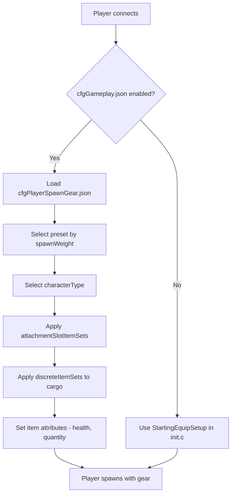

# Chapter 5.6: Spawning Gear Configuration

[Home](../README.md) | [<< Previous: Server Configuration Files](05-server-configs.md) | **Spawning Gear Configuration**

---

> **Summary:** DayZ has two complementary systems that control how players enter the world: **spawn points** determine *where* a character appears on the map, and **spawn gear** determines *what equipment* they carry. This chapter covers both systems in depth, including file structure, field reference, practical presets, and mod integration.

---

## Table of Contents

- [Overview](#overview)
- [The Two Systems](#the-two-systems)
- [Spawn Gear: cfgPlayerSpawnGear.json](#spawn-gear-cfgplayerspawngearjson)
  - [Enabling Spawn Gear Presets](#enabling-spawn-gear-presets)
  - [Preset Structure](#preset-structure)
  - [attachmentSlotItemSets](#attachmentslotitemsets)
  - [DiscreteItemSets](#discreteitemsets)
  - [discreteUnsortedItemSets](#discreteunsorteditemsets)
  - [ComplexChildrenTypes](#complexchildrentypes)
  - [SimpleChildrenTypes](#simplechildrentypes)
  - [Attributes](#attributes)
- [Spawn Points: cfgplayerspawnpoints.xml](#spawn-points-cfgplayerspawnpointsxml)
  - [File Structure](#file-structure)
  - [spawn_params](#spawn_params)
  - [generator_params](#generator_params)
  - [Spawning Groups](#spawning-groups)
  - [Map-Specific Configs](#map-specific-configs)
- [Practical Examples](#practical-examples)
  - [Default Survivor Loadout](#default-survivor-loadout)
  - [Military Spawn Kit](#military-spawn-kit)
  - [Medical Spawn Kit](#medical-spawn-kit)
  - [Random Gear Selection](#random-gear-selection)
- [Integration with Mods](#integration-with-mods)
- [Best Practices](#best-practices)
- [Common Mistakes](#common-mistakes)

---

## Overview



When a player spawns as a fresh character in DayZ, two questions are answered by the server:

1. **Where does the character appear?** --- Controlled by `cfgplayerspawnpoints.xml`.
2. **What does the character carry?** --- Controlled by spawn gear preset JSON files, registered through `cfggameplay.json`.

Both systems are server-side only. Clients never see these configuration files and cannot tamper with them. The spawn gear system was introduced as an alternative to scripting loadouts in `init.c`, allowing server admins to define multiple weighted presets in JSON without writing any Enforce Script code.

> **Important:** The spawn gear preset system **completely overrides** the `StartingEquipSetup()` method in your mission `init.c`. If you enable spawn gear presets in `cfggameplay.json`, your scripted loadout code will be ignored. Similarly, character types defined in the presets override the character model chosen in the main menu.

---

## The Two Systems

| System | File | Format | Controls |
|--------|------|--------|----------|
| Spawn Points | `cfgplayerspawnpoints.xml` | XML | **Where** --- map positions, distance scoring, spawn groups |
| Spawn Gear | Custom preset JSON files | JSON | **What** --- character model, clothing, weapons, cargo, quickbar |

The two systems are independent. You can use custom spawn points with vanilla gear, custom gear with vanilla spawn points, or customize both.

---

## Spawn Gear: cfgPlayerSpawnGear.json

### Enabling Spawn Gear Presets

Spawn gear presets are **not** enabled by default. To use them, you must:

1. Create one or more JSON preset files in your mission folder (e.g., `mpmissions/dayzOffline.chernarusplus/`).
2. Register them in `cfggameplay.json` under `PlayerData.spawnGearPresetFiles`.
3. Ensure `enableCfgGameplayFile = 1` is set in `serverDZ.cfg`.

```json
{
  "version": 122,
  "PlayerData": {
    "spawnGearPresetFiles": [
      "survivalist.json",
      "casual.json",
      "military.json"
    ]
  }
}
```

Preset files can be nested in subdirectories under the mission folder:

```json
"spawnGearPresetFiles": [
  "custom/survivalist.json",
  "custom/casual.json",
  "custom/military.json"
]
```

Each JSON file contains a single preset object. All registered presets are pooled together, and the server selects one based on `spawnWeight` each time a fresh character spawns.

### Preset Structure

A preset is the top-level JSON object with these fields:

| Field | Type | Description |
|-------|------|-------------|
| `name` | string | Human-readable name for the preset (any string, used for identification only) |
| `spawnWeight` | integer | Weight for random selection. Minimum is `1`. Higher values make this preset more likely to be chosen |
| `characterTypes` | array | Array of character type classnames (e.g., `"SurvivorM_Mirek"`). One is picked at random when this preset spawns |
| `attachmentSlotItemSets` | array | Array of `AttachmentSlots` structures defining what the character wears (clothing, weapons on shoulders, etc.) |
| `discreteUnsortedItemSets` | array | Array of `DiscreteUnsortedItemSets` structures defining cargo items placed into any available inventory space |

> **Note:** If `characterTypes` is empty or omitted, the character model last selected in the main menu character creation screen will be used for that preset.

Minimal example:

```json
{
  "spawnWeight": 1,
  "name": "Basic Survivor",
  "characterTypes": [
    "SurvivorM_Mirek",
    "SurvivorF_Eva"
  ],
  "attachmentSlotItemSets": [],
  "discreteUnsortedItemSets": []
}
```

### attachmentSlotItemSets

This array defines items that go into specific character attachment slots --- body, legs, feet, head, back, vest, shoulders, eyewear, etc.

Each entry targets one slot:

| Field | Type | Description |
|-------|------|-------------|
| `slotName` | string | The attachment slot name. Derived from CfgSlots. Common values: `"Body"`, `"Legs"`, `"Feet"`, `"Head"`, `"Back"`, `"Vest"`, `"Eyewear"`, `"Gloves"`, `"Hips"`, `"shoulderL"`, `"shoulderR"` |
| `discreteItemSets` | array | Array of item variants that can fill this slot (one is chosen based on `spawnWeight`) |

> **Shoulder shortcuts:** You can use `"shoulderL"` and `"shoulderR"` as slot names. The engine automatically translates these to the correct internal CfgSlots names.

```json
{
  "slotName": "Body",
  "discreteItemSets": [
    {
      "itemType": "TShirt_Beige",
      "spawnWeight": 1,
      "attributes": {
        "healthMin": 0.45,
        "healthMax": 0.65,
        "quantityMin": 1.0,
        "quantityMax": 1.0
      },
      "quickBarSlot": -1
    },
    {
      "itemType": "TShirt_Black",
      "spawnWeight": 1,
      "attributes": {
        "healthMin": 0.45,
        "healthMax": 0.65,
        "quantityMin": 1.0,
        "quantityMax": 1.0
      },
      "quickBarSlot": -1
    }
  ]
}
```

### DiscreteItemSets

Each entry in `discreteItemSets` represents one possible item for that slot. The server picks one entry at random, weighted by `spawnWeight`. This structure is used inside both `attachmentSlotItemSets` (for slot-based items) and is the mechanism for random selection.

| Field | Type | Description |
|-------|------|-------------|
| `itemType` | string | Item classname (typename). Use `""` (empty string) to represent "nothing" --- the slot remains empty |
| `spawnWeight` | integer | Weight for selection. Minimum `1`. Higher = more likely |
| `attributes` | object | Health and quantity ranges for this item. See [Attributes](#attributes) |
| `quickBarSlot` | integer | Quick bar slot assignment (0-based). Use `-1` for no quickbar assignment |
| `complexChildrenTypes` | array | Items to spawn nested inside this item. See [ComplexChildrenTypes](#complexchildrentypes) |
| `simpleChildrenTypes` | array | Item classnames to spawn inside this item using default or parent attributes |
| `simpleChildrenUseDefaultAttributes` | bool | If `true`, simple children use the parent's `attributes`. If `false`, they use configuration defaults |

**Empty item trick:** To make a slot have a 50/50 chance of being empty or filled, use an empty `itemType`:

```json
{
  "slotName": "Eyewear",
  "discreteItemSets": [
    {
      "itemType": "AviatorGlasses",
      "spawnWeight": 1,
      "attributes": {
        "healthMin": 1.0,
        "healthMax": 1.0
      },
      "quickBarSlot": -1
    },
    {
      "itemType": "",
      "spawnWeight": 1
    }
  ]
}
```

### discreteUnsortedItemSets

This top-level array defines items that go into the character's **cargo** --- any available inventory space across all attached clothing and containers. Unlike `attachmentSlotItemSets`, these items are not placed into a specific slot; the engine finds room automatically.

Each entry represents one cargo variant, and the server selects one based on `spawnWeight`.

| Field | Type | Description |
|-------|------|-------------|
| `name` | string | Human-readable name (for identification only) |
| `spawnWeight` | integer | Weight for selection. Minimum `1` |
| `attributes` | object | Default health/quantity ranges. Used by children when `simpleChildrenUseDefaultAttributes` is `true` |
| `complexChildrenTypes` | array | Items to spawn into cargo, each with their own attributes and nesting |
| `simpleChildrenTypes` | array | Item classnames to spawn into cargo |
| `simpleChildrenUseDefaultAttributes` | bool | If `true`, simple children use this structure's `attributes`. If `false`, they use configuration defaults |

```json
{
  "name": "Cargo1",
  "spawnWeight": 1,
  "attributes": {
    "healthMin": 1.0,
    "healthMax": 1.0,
    "quantityMin": 1.0,
    "quantityMax": 1.0
  },
  "complexChildrenTypes": [
    {
      "itemType": "BandageDressing",
      "attributes": {
        "healthMin": 1.0,
        "healthMax": 1.0,
        "quantityMin": 1.0,
        "quantityMax": 1.0
      },
      "quickBarSlot": 2
    }
  ],
  "simpleChildrenUseDefaultAttributes": false,
  "simpleChildrenTypes": [
    "Rag",
    "Apple"
  ]
}
```

### ComplexChildrenTypes

Complex children are items spawned **inside** a parent item with full control over their attributes, quickbar assignment, and their own nested children. The primary use case is spawning items with contents --- for example, a weapon with attachments, or a cooking pot with food inside.

| Field | Type | Description |
|-------|------|-------------|
| `itemType` | string | Item classname |
| `attributes` | object | Health/quantity ranges for this specific item |
| `quickBarSlot` | integer | Quick bar slot assignment. `-1` = don't assign |
| `simpleChildrenUseDefaultAttributes` | bool | Whether simple children inherit these attributes |
| `simpleChildrenTypes` | array | Item classnames to spawn inside this item |

Example --- a weapon with attachments and magazine:

```json
{
  "itemType": "AKM",
  "attributes": {
    "healthMin": 0.5,
    "healthMax": 1.0,
    "quantityMin": 1.0,
    "quantityMax": 1.0
  },
  "quickBarSlot": 1,
  "complexChildrenTypes": [
    {
      "itemType": "AK_PlasticBttstck",
      "attributes": {
        "healthMin": 0.4,
        "healthMax": 0.6
      },
      "quickBarSlot": -1
    },
    {
      "itemType": "PSO1Optic",
      "attributes": {
        "healthMin": 0.1,
        "healthMax": 0.2
      },
      "quickBarSlot": -1,
      "simpleChildrenUseDefaultAttributes": true,
      "simpleChildrenTypes": [
        "Battery9V"
      ]
    },
    {
      "itemType": "Mag_AKM_30Rnd",
      "attributes": {
        "healthMin": 0.5,
        "healthMax": 0.5,
        "quantityMin": 1.0,
        "quantityMax": 1.0
      },
      "quickBarSlot": -1
    }
  ],
  "simpleChildrenUseDefaultAttributes": false,
  "simpleChildrenTypes": [
    "AK_PlasticHndgrd",
    "AK_Bayonet"
  ]
}
```

In this example, the AKM spawns with a buttstock, optic (with battery inside), and a loaded magazine as complex children, plus a handguard and bayonet as simple children. The simple children use configuration defaults because `simpleChildrenUseDefaultAttributes` is `false`.

### SimpleChildrenTypes

Simple children are a shorthand for spawning items inside a parent without specifying individual attributes. They are an array of item classnames (strings).

Their attributes are determined by the `simpleChildrenUseDefaultAttributes` flag:

- **`true`** --- Items use the `attributes` defined on the parent structure.
- **`false`** --- Items use the engine's configuration defaults (typically full health and quantity).

Simple children cannot have their own nested children or quickbar assignments. For those capabilities, use `complexChildrenTypes` instead.

### Attributes

Attributes control the condition and quantity of spawned items. All values are floating point between `0.0` and `1.0`:

| Field | Type | Description |
|-------|------|-------------|
| `healthMin` | float | Minimum health percentage. `1.0` = pristine, `0.0` = ruined |
| `healthMax` | float | Maximum health percentage. A random value between min and max is applied |
| `quantityMin` | float | Minimum quantity percentage. For magazines: fill level. For food: remaining bites |
| `quantityMax` | float | Maximum quantity percentage |

When both min and max are specified, the engine picks a random value in that range. This creates natural variation --- for example, health between `0.45` and `0.65` means items spawn in worn to damaged condition.

```json
"attributes": {
  "healthMin": 0.45,
  "healthMax": 0.65,
  "quantityMin": 1.0,
  "quantityMax": 1.0
}
```

---

## Spawn Points: cfgplayerspawnpoints.xml

This XML file defines where players appear on the map. It is located in the mission folder (e.g., `mpmissions/dayzOffline.chernarusplus/cfgplayerspawnpoints.xml`).

### File Structure

The root element contains up to three sections:

| Section | Purpose |
|---------|---------|
| `<fresh>` | **Required.** Spawn points for newly created characters |
| `<hop>` | Spawn points for players hopping from another server on the same map (official servers only) |
| `<travel>` | Spawn points for players traveling from a different map (official servers only) |

Each section contains the same three sub-elements: `<spawn_params>`, `<generator_params>`, and `<generator_posbubbles>`.

```xml
<?xml version="1.0" encoding="UTF-8" standalone="yes" ?>
<playerspawnpoints>
    <fresh>
        <spawn_params>...</spawn_params>
        <generator_params>...</generator_params>
        <generator_posbubbles>...</generator_posbubbles>
    </fresh>
    <hop>
        <spawn_params>...</spawn_params>
        <generator_params>...</generator_params>
        <generator_posbubbles>...</generator_posbubbles>
    </hop>
    <travel>
        <spawn_params>...</spawn_params>
        <generator_params>...</generator_params>
        <generator_posbubbles>...</generator_posbubbles>
    </travel>
</playerspawnpoints>
```

### spawn_params

Runtime parameters that score candidate spawn points against nearby entities. Points below `min_dist` are invalidated. Points between `min_dist` and `max_dist` are preferred over points beyond `max_dist`.

```xml
<spawn_params>
    <min_dist_infected>30</min_dist_infected>
    <max_dist_infected>70</max_dist_infected>
    <min_dist_player>65</min_dist_player>
    <max_dist_player>150</max_dist_player>
    <min_dist_static>0</min_dist_static>
    <max_dist_static>2</max_dist_static>
</spawn_params>
```

| Parameter | Description |
|-----------|-------------|
| `min_dist_infected` | Minimum meters from infected. Points closer than this are penalized |
| `max_dist_infected` | Maximum scoring distance from infected |
| `min_dist_player` | Minimum meters from other players. Keeps fresh spawns from appearing on top of existing players |
| `max_dist_player` | Maximum scoring distance from other players |
| `min_dist_static` | Minimum meters from buildings/objects |
| `max_dist_static` | Maximum scoring distance from buildings/objects |

The Sakhal map also adds `min_dist_trigger` and `max_dist_trigger` parameters with a 6x weight multiplier for trigger zone distances.

**Scoring logic:** The engine calculates a score for each candidate point. Distance `0` to `min_dist` scores `-1` (nearly invalidated). Distance `min_dist` to midpoint scores up to `1.1`. Distance midpoint to `max_dist` scores down from `1.1` to `0.1`. Beyond `max_dist` scores `0`. Higher total score = more likely spawn location.

### generator_params

Controls how the grid of candidate spawn points is generated around each position bubble:

```xml
<generator_params>
    <grid_density>4</grid_density>
    <grid_width>200</grid_width>
    <grid_height>200</grid_height>
    <min_dist_static>0</min_dist_static>
    <max_dist_static>2</max_dist_static>
    <min_steepness>-45</min_steepness>
    <max_steepness>45</max_steepness>
</generator_params>
```

| Parameter | Description |
|-----------|-------------|
| `grid_density` | Sample frequency. `4` means a 4x4 grid of candidate points. Higher = more candidates, more CPU cost. Must be at least `1`. When `0`, only the center point is used |
| `grid_width` | Total width of the sampling rectangle in meters |
| `grid_height` | Total height of the sampling rectangle in meters |
| `min_dist_static` | Minimum distance from buildings for a valid candidate |
| `max_dist_static` | Maximum distance from buildings used for scoring |
| `min_steepness` | Minimum terrain slope in degrees. Points on steeper terrain are discarded |
| `max_steepness` | Maximum terrain slope in degrees |

Around every `<pos>` defined in `generator_posbubbles`, the engine creates a rectangle of `grid_width` x `grid_height` meters, samples it at `grid_density` frequency, and discards points that overlap with objects, water, or exceed slope limits.

### Spawning Groups

Groups allow you to cluster spawn points and rotate through them over time. This prevents all players from always spawning at the same locations.

Groups are enabled through `<group_params>` inside each section:

```xml
<group_params>
    <enablegroups>true</enablegroups>
    <groups_as_regular>true</groups_as_regular>
    <lifetime>240</lifetime>
    <counter>-1</counter>
</group_params>
```

| Parameter | Description |
|-----------|-------------|
| `enablegroups` | `true` to enable group rotation, `false` for a flat list of points |
| `groups_as_regular` | When `enablegroups` is `false`, treat group points as regular spawn points instead of ignoring them. Default: `true` |
| `lifetime` | Seconds a group stays active before rotating to another. Use `-1` to disable the timer |
| `counter` | Number of spawns that reset the lifetime. Each player spawning in the group resets the timer. Use `-1` to disable the counter |

Positions are organized into named groups within `<generator_posbubbles>`:

```xml
<generator_posbubbles>
    <group name="WestCherno">
        <pos x="6063.018555" z="1931.907227" />
        <pos x="5933.964844" z="2171.072998" />
        <pos x="6199.782715" z="2241.805176" />
    </group>
    <group name="EastCherno">
        <pos x="8040.858398" z="3332.236328" />
        <pos x="8207.115234" z="3115.650635" />
    </group>
</generator_posbubbles>
```

Individual groups can override global lifetime and counter values:

```xml
<group name="Tents" lifetime="300" counter="25">
    <pos x="4212.421875" z="11038.256836" />
</group>
```

**Without groups**, positions are listed directly under `<generator_posbubbles>`:

```xml
<generator_posbubbles>
    <pos x="4212.421875" z="11038.256836" />
    <pos x="4712.299805" z="10595" />
    <pos x="5334.310059" z="9850.320313" />
</generator_posbubbles>
```

> **Position format:** The `x` and `z` attributes use DayZ world coordinates. `x` is east-west, `z` is north-south. The `y` (height) coordinate is not specified --- the engine places the point on the terrain surface. You can find coordinates using the in-game debug monitor or the DayZ Editor mod.

### Map-Specific Configs

Each map has its own `cfgplayerspawnpoints.xml` in its mission folder:

| Map | Mission Folder | Notes |
|-----|----------------|-------|
| Chernarus | `dayzOffline.chernarusplus/` | Coastal spawns: Cherno, Elektro, Kamyshovo, Berezino, Svetlojarsk |
| Livonia | `dayzOffline.enoch/` | Spread across map with different group names |
| Sakhal | `dayzOffline.sakhal/` | Added `min_dist_trigger`/`max_dist_trigger` params, more detailed comments |

When creating a custom map or modifying spawn locations, always work from the vanilla file as a starting point and adjust positions to match your map's geography.

---

## Practical Examples

### Default Survivor Loadout

The vanilla preset gives fresh spawns a random t-shirt, canvas pants, athletic shoes, plus cargo containing a bandage, chemlight (random color), and a fruit (random between pear, plum, or apple). All items spawn in worn-to-damaged condition.

```json
{
  "spawnWeight": 1,
  "name": "Player",
  "characterTypes": [
    "SurvivorM_Mirek",
    "SurvivorM_Boris",
    "SurvivorM_Denis",
    "SurvivorF_Eva",
    "SurvivorF_Frida",
    "SurvivorF_Gabi"
  ],
  "attachmentSlotItemSets": [
    {
      "slotName": "Body",
      "discreteItemSets": [
        {
          "itemType": "TShirt_Beige",
          "spawnWeight": 1,
          "attributes": {
            "healthMin": 0.45,
            "healthMax": 0.65,
            "quantityMin": 1.0,
            "quantityMax": 1.0
          },
          "quickBarSlot": -1
        },
        {
          "itemType": "TShirt_Black",
          "spawnWeight": 1,
          "attributes": {
            "healthMin": 0.45,
            "healthMax": 0.65,
            "quantityMin": 1.0,
            "quantityMax": 1.0
          },
          "quickBarSlot": -1
        }
      ]
    },
    {
      "slotName": "Legs",
      "discreteItemSets": [
        {
          "itemType": "CanvasPantsMidi_Beige",
          "spawnWeight": 1,
          "attributes": {
            "healthMin": 0.45,
            "healthMax": 0.65,
            "quantityMin": 1.0,
            "quantityMax": 1.0
          },
          "quickBarSlot": -1
        }
      ]
    },
    {
      "slotName": "Feet",
      "discreteItemSets": [
        {
          "itemType": "AthleticShoes_Black",
          "spawnWeight": 1,
          "attributes": {
            "healthMin": 0.45,
            "healthMax": 0.65,
            "quantityMin": 1.0,
            "quantityMax": 1.0
          },
          "quickBarSlot": -1
        }
      ]
    }
  ],
  "discreteUnsortedItemSets": [
    {
      "name": "Cargo1",
      "spawnWeight": 1,
      "attributes": {
        "healthMin": 1.0,
        "healthMax": 1.0,
        "quantityMin": 1.0,
        "quantityMax": 1.0
      },
      "complexChildrenTypes": [
        {
          "itemType": "BandageDressing",
          "attributes": {
            "healthMin": 1.0,
            "healthMax": 1.0,
            "quantityMin": 1.0,
            "quantityMax": 1.0
          },
          "quickBarSlot": 2
        },
        {
          "itemType": "Chemlight_Red",
          "attributes": {
            "healthMin": 1.0,
            "healthMax": 1.0,
            "quantityMin": 1.0,
            "quantityMax": 1.0
          },
          "quickBarSlot": 1
        },
        {
          "itemType": "Pear",
          "attributes": {
            "healthMin": 1.0,
            "healthMax": 1.0,
            "quantityMin": 1.0,
            "quantityMax": 1.0
          },
          "quickBarSlot": 3
        }
      ]
    }
  ]
}
```

### Military Spawn Kit

A heavily equipped preset with an AKM (with attachments), plate carrier, gorka uniform, backpack with extra magazines, and unsorted cargo including a sidearm and food. This uses multiple `spawnWeight` values to create rarity tiers for weapon variants.

```json
{
  "spawnWeight": 1,
  "name": "Military - AKM",
  "characterTypes": [
    "SurvivorF_Judy",
    "SurvivorM_Lewis"
  ],
  "attachmentSlotItemSets": [
    {
      "slotName": "shoulderL",
      "discreteItemSets": [
        {
          "itemType": "AKM",
          "spawnWeight": 3,
          "attributes": {
            "healthMin": 0.5,
            "healthMax": 1.0,
            "quantityMin": 1.0,
            "quantityMax": 1.0
          },
          "quickBarSlot": 1,
          "complexChildrenTypes": [
            {
              "itemType": "AK_PlasticBttstck",
              "attributes": { "healthMin": 0.4, "healthMax": 0.6 },
              "quickBarSlot": -1
            },
            {
              "itemType": "PSO1Optic",
              "attributes": { "healthMin": 0.1, "healthMax": 0.2 },
              "quickBarSlot": -1,
              "simpleChildrenUseDefaultAttributes": true,
              "simpleChildrenTypes": ["Battery9V"]
            },
            {
              "itemType": "Mag_AKM_30Rnd",
              "attributes": {
                "healthMin": 0.5,
                "healthMax": 0.5,
                "quantityMin": 1.0,
                "quantityMax": 1.0
              },
              "quickBarSlot": -1
            }
          ],
          "simpleChildrenUseDefaultAttributes": false,
          "simpleChildrenTypes": ["AK_PlasticHndgrd", "AK_Bayonet"]
        },
        {
          "itemType": "AKM",
          "spawnWeight": 1,
          "attributes": {
            "healthMin": 1.0,
            "healthMax": 1.0,
            "quantityMin": 1.0,
            "quantityMax": 1.0
          },
          "quickBarSlot": 1,
          "complexChildrenTypes": [
            {
              "itemType": "AK_WoodBttstck",
              "attributes": { "healthMin": 1.0, "healthMax": 1.0 },
              "quickBarSlot": -1
            },
            {
              "itemType": "Mag_AKM_30Rnd",
              "attributes": {
                "healthMin": 1.0,
                "healthMax": 1.0,
                "quantityMin": 1.0,
                "quantityMax": 1.0
              },
              "quickBarSlot": -1
            }
          ],
          "simpleChildrenUseDefaultAttributes": false,
          "simpleChildrenTypes": ["AK_WoodHndgrd"]
        }
      ]
    },
    {
      "slotName": "Vest",
      "discreteItemSets": [
        {
          "itemType": "PlateCarrierVest",
          "spawnWeight": 1,
          "attributes": { "healthMin": 1.0, "healthMax": 1.0 },
          "quickBarSlot": -1,
          "simpleChildrenUseDefaultAttributes": false,
          "simpleChildrenTypes": ["PlateCarrierHolster"]
        }
      ]
    },
    {
      "slotName": "Back",
      "discreteItemSets": [
        {
          "itemType": "TaloonBag_Blue",
          "spawnWeight": 1,
          "attributes": { "healthMin": 0.5, "healthMax": 0.8 },
          "quickBarSlot": 3,
          "simpleChildrenUseDefaultAttributes": false,
          "simpleChildrenTypes": ["Mag_AKM_Drum75Rnd"]
        },
        {
          "itemType": "TaloonBag_Orange",
          "spawnWeight": 1,
          "attributes": { "healthMin": 0.5, "healthMax": 0.8 },
          "quickBarSlot": 3,
          "simpleChildrenUseDefaultAttributes": true,
          "simpleChildrenTypes": ["Mag_AKM_30Rnd", "Mag_AKM_30Rnd"]
        }
      ]
    },
    {
      "slotName": "Body",
      "discreteItemSets": [
        {
          "itemType": "GorkaEJacket_Flat",
          "spawnWeight": 1,
          "attributes": { "healthMin": 1.0, "healthMax": 1.0 },
          "quickBarSlot": -1
        }
      ]
    },
    {
      "slotName": "Legs",
      "discreteItemSets": [
        {
          "itemType": "GorkaPants_Flat",
          "spawnWeight": 1,
          "attributes": { "healthMin": 1.0, "healthMax": 1.0 },
          "quickBarSlot": -1
        }
      ]
    },
    {
      "slotName": "Feet",
      "discreteItemSets": [
        {
          "itemType": "MilitaryBoots_Bluerock",
          "spawnWeight": 1,
          "attributes": { "healthMin": 1.0, "healthMax": 1.0 },
          "quickBarSlot": -1
        }
      ]
    }
  ],
  "discreteUnsortedItemSets": [
    {
      "name": "Military Cargo",
      "spawnWeight": 1,
      "attributes": {
        "healthMin": 0.5,
        "healthMax": 1.0,
        "quantityMin": 0.6,
        "quantityMax": 0.8
      },
      "complexChildrenTypes": [
        {
          "itemType": "Mag_AKM_30Rnd",
          "attributes": {
            "healthMin": 0.1,
            "healthMax": 0.8,
            "quantityMin": 1.0,
            "quantityMax": 1.0
          },
          "quickBarSlot": -1
        }
      ],
      "simpleChildrenUseDefaultAttributes": false,
      "simpleChildrenTypes": [
        "Rag",
        "BoarSteakMeat",
        "FNX45",
        "Mag_FNX45_15Rnd",
        "AmmoBox_45ACP_25rnd"
      ]
    }
  ]
}
```

Key points about this example:

- **Two weapon variants** for the same shoulder slot: the `spawnWeight: 3` variant (plastic furniture, PSO1 optic) spawns 3x more often than the `spawnWeight: 1` variant (wood furniture, no optic).
- **Nested children**: the PSO1Optic has `simpleChildrenTypes: ["Battery9V"]` so the optic spawns with a battery inside.
- **Backpack contents**: the blue backpack gets a drum magazine while the orange one gets two standard magazines.

### Medical Spawn Kit

A medic-themed preset with scrubs, first aid kit containing medical supplies, and a melee weapon for defense.

```json
{
  "spawnWeight": 1,
  "name": "Medic",
  "attachmentSlotItemSets": [
    {
      "slotName": "shoulderR",
      "discreteItemSets": [
        {
          "itemType": "PipeWrench",
          "spawnWeight": 2,
          "attributes": { "healthMin": 0.5, "healthMax": 0.8 },
          "quickBarSlot": 2
        },
        {
          "itemType": "Crowbar",
          "spawnWeight": 1,
          "attributes": { "healthMin": 0.5, "healthMax": 0.8 },
          "quickBarSlot": 2
        }
      ]
    },
    {
      "slotName": "Vest",
      "discreteItemSets": [
        {
          "itemType": "PressVest_LightBlue",
          "spawnWeight": 1,
          "attributes": { "healthMin": 1.0, "healthMax": 1.0 },
          "quickBarSlot": -1
        }
      ]
    },
    {
      "slotName": "Back",
      "discreteItemSets": [
        {
          "itemType": "TortillaBag",
          "spawnWeight": 1,
          "attributes": { "healthMin": 0.5, "healthMax": 0.8 },
          "quickBarSlot": 1
        },
        {
          "itemType": "CoyoteBag_Green",
          "spawnWeight": 1,
          "attributes": { "healthMin": 0.5, "healthMax": 0.8 },
          "quickBarSlot": 1
        }
      ]
    },
    {
      "slotName": "Body",
      "discreteItemSets": [
        {
          "itemType": "MedicalScrubsShirt_Blue",
          "spawnWeight": 1,
          "attributes": { "healthMin": 1.0, "healthMax": 1.0 },
          "quickBarSlot": -1
        }
      ]
    },
    {
      "slotName": "Legs",
      "discreteItemSets": [
        {
          "itemType": "MedicalScrubsPants_Blue",
          "spawnWeight": 1,
          "attributes": { "healthMin": 1.0, "healthMax": 1.0 },
          "quickBarSlot": -1
        }
      ]
    },
    {
      "slotName": "Feet",
      "discreteItemSets": [
        {
          "itemType": "WorkingBoots_Yellow",
          "spawnWeight": 1,
          "attributes": { "healthMin": 1.0, "healthMax": 1.0 },
          "quickBarSlot": -1
        }
      ]
    }
  ],
  "discreteUnsortedItemSets": [
    {
      "name": "Medic Cargo 1",
      "spawnWeight": 1,
      "attributes": {
        "healthMin": 0.5,
        "healthMax": 1.0,
        "quantityMin": 0.6,
        "quantityMax": 0.8
      },
      "complexChildrenTypes": [
        {
          "itemType": "FirstAidKit",
          "attributes": {
            "healthMin": 0.7,
            "healthMax": 0.8,
            "quantityMin": 0.05,
            "quantityMax": 0.1
          },
          "quickBarSlot": 3,
          "simpleChildrenUseDefaultAttributes": false,
          "simpleChildrenTypes": ["BloodBagIV", "BandageDressing"]
        }
      ],
      "simpleChildrenUseDefaultAttributes": false,
      "simpleChildrenTypes": ["Rag", "SheepSteakMeat"]
    },
    {
      "name": "Medic Cargo 2",
      "spawnWeight": 1,
      "attributes": {
        "healthMin": 0.5,
        "healthMax": 1.0,
        "quantityMin": 0.6,
        "quantityMax": 0.8
      },
      "complexChildrenTypes": [
        {
          "itemType": "FirstAidKit",
          "attributes": {
            "healthMin": 0.7,
            "healthMax": 0.8,
            "quantityMin": 0.05,
            "quantityMax": 0.1
          },
          "quickBarSlot": 3,
          "simpleChildrenUseDefaultAttributes": false,
          "simpleChildrenTypes": ["TetracyclineAntibiotics", "BandageDressing"]
        }
      ],
      "simpleChildrenUseDefaultAttributes": false,
      "simpleChildrenTypes": ["Canteen", "Rag", "Apple"]
    }
  ]
}
```

Note how `characterTypes` is omitted --- this preset uses whatever character the player selected in the main menu. Two cargo variants offer different first aid kit contents (blood bag vs. antibiotics), selected by `spawnWeight`.

### Random Gear Selection

You can create randomized loadouts by using multiple presets with different weights, and within each preset using multiple `discreteItemSets` per slot:

**File: `cfggameplay.json`**

```json
"spawnGearPresetFiles": [
  "presets/common_survivor.json",
  "presets/rare_military.json",
  "presets/uncommon_hunter.json"
]
```

**Probability calculation example:**

| Preset File | spawnWeight | Chance |
|-------------|------------|--------|
| `common_survivor.json` | 5 | 5/8 = 62.5% |
| `uncommon_hunter.json` | 2 | 2/8 = 25.0% |
| `rare_military.json` | 1 | 1/8 = 12.5% |

Within each preset, each slot also has its own randomization. If the Body slot has three t-shirt options with `spawnWeight: 1` each, each has a 33% chance. A shirt with `spawnWeight: 3` in a pool with two `spawnWeight: 1` items would have a 60% chance (3/5).

---

## Integration with Mods

### Using the JSON Preset System from Mods

The spawn gear preset system is designed for mission-level configuration. Mods that want to provide custom loadouts should:

1. **Ship a template JSON** file with the mod's documentation, not embedded in the PBO.
2. **Document the classnames** so server admins can add mod items to their own preset files.
3. Let server admins register the preset file through their `cfggameplay.json`.

### Overriding with init.c

If you need programmatic control over spawning (e.g., role selection, database-driven loadouts, or conditional gear based on player state), override `StartingEquipSetup()` in `init.c` instead:

```c
override void StartingEquipSetup(PlayerBase player, bool clothesChosen)
{
    player.RemoveAllItems();

    EntityAI jacket = player.GetInventory().CreateInInventory("GorkaEJacket_Flat");
    player.GetInventory().CreateInInventory("GorkaPants_Flat");
    player.GetInventory().CreateInInventory("MilitaryBoots_Bluerock");

    if (jacket)
    {
        jacket.GetInventory().CreateInInventory("BandageDressing");
        jacket.GetInventory().CreateInInventory("Rag");
    }

    EntityAI weapon = player.GetHumanInventory().CreateInHands("AKM");
    if (weapon)
    {
        weapon.GetInventory().CreateInInventory("Mag_AKM_30Rnd");
        weapon.GetInventory().CreateInInventory("AK_PlasticBttstck");
        weapon.GetInventory().CreateInInventory("AK_PlasticHndgrd");
    }
}
```

> **Remember:** If `spawnGearPresetFiles` is configured in `cfggameplay.json`, the JSON presets take priority and `StartingEquipSetup()` will not be called.

### Mod Items in Presets

Modded items work identically to vanilla items in preset files. Use the item's classname as defined in the mod's `config.cpp`:

```json
{
  "itemType": "MyMod_CustomRifle",
  "spawnWeight": 1,
  "attributes": {
    "healthMin": 1.0,
    "healthMax": 1.0
  },
  "quickBarSlot": 1,
  "simpleChildrenUseDefaultAttributes": false,
  "simpleChildrenTypes": [
    "MyMod_CustomMag_30Rnd",
    "MyMod_CustomOptic"
  ]
}
```

If the mod is not loaded on the server, items with unknown classnames will silently fail to spawn. The rest of the preset still applies.

---

## Best Practices

1. **Start from vanilla.** Copy the vanilla preset from the official documentation as your base and modify it, rather than writing from scratch.

2. **Use multiple preset files.** Separate presets by theme (survivor, military, medic) in individual JSON files. This makes maintenance easier than a single monolithic file.

3. **Test incrementally.** Add one preset at a time and verify in-game. A JSON syntax error in any preset file will cause all presets to fail silently.

4. **Use weighted probabilities deliberately.** Plan your spawn weight distribution on paper. With 5 presets, a `spawnWeight: 10` on one will dominate all others.

5. **Validate JSON syntax.** Use a JSON validator before deploying. The DayZ engine does not provide helpful error messages for malformed JSON --- it simply ignores the file.

6. **Assign quickbar slots intentionally.** Quickbar slots are 0-indexed. Assigning multiple items to the same slot will overwrite. Use `-1` for items that should not be on the quickbar.

7. **Keep spawn points away from water.** The generator discards points in water, but points very close to the shoreline can place players in awkward positions. Move position bubbles a few meters inland.

8. **Use groups for coastal maps.** Spawning groups on Chernarus spread fresh spawns across the coast, preventing overcrowding at popular locations like Elektro.

9. **Match clothing and cargo capacity.** Unsorted cargo items can only spawn if the player has inventory space. If you define too many cargo items but only give the player a t-shirt (small inventory), excess items will not spawn.

---

## Common Mistakes

| Mistake | Consequence | Fix |
|---------|-------------|-----|
| Forgetting `enableCfgGameplayFile = 1` in `serverDZ.cfg` | `cfggameplay.json` is not loaded, presets are ignored | Add the flag and restart the server |
| Invalid JSON syntax (trailing comma, missing bracket) | All presets in that file silently fail | Validate JSON with an external tool before deploying |
| Using `spawnGearPresetFiles` without removing `StartingEquipSetup()` code | The scripted loadout is silently overridden by the JSON preset. The init.c code runs but its items are replaced | This is expected behavior, not a bug. Remove or comment out the init.c loadout code to avoid confusion |
| Setting `spawnWeight: 0` | Value below minimum. Behavior is undefined | Always use `spawnWeight: 1` or higher |
| Referencing a classname that does not exist | That specific item silently fails to spawn, but the rest of the preset works | Double-check classnames against the mod's `config.cpp` or types.xml |
| Assigning an item to a slot it cannot occupy | Item does not spawn. No error logged | Verify the item's `inventorySlot[]` in config.cpp matches the `slotName` |
| Spawning too many cargo items for available inventory space | Excess items are silently dropped (not spawned) | Ensure clothing has enough capacity, or reduce the number of cargo items |
| Using `characterTypes` classnames that do not exist | Character creation fails, player may spawn as default model | Use only valid survivor classnames from CfgVehicles |
| Placing spawn points in water or on steep cliffs | Points are discarded, reducing available spawns. If too many are invalid, players may fail to spawn | Test coordinates in-game with the debug monitor |
| Mixing up `x`/`z` coordinates in spawn points | Players spawn at wrong map locations | `x` = east-west, `z` = north-south. There is no `y` (vertical) in spawn point definitions |

---

## Data Flow Summary

```
serverDZ.cfg
  └─ enableCfgGameplayFile = 1
       └─ cfggameplay.json
            └─ PlayerData.spawnGearPresetFiles: ["preset1.json", "preset2.json"]
                 ├─ preset1.json  (spawnWeight: 3)  ── 75% chance
                 └─ preset2.json  (spawnWeight: 1)  ── 25% chance
                      ├─ characterTypes[]         → random character model
                      ├─ attachmentSlotItemSets[] → slot-based equipment
                      │    └─ discreteItemSets[]  → weighted random per slot
                      │         ├─ complexChildrenTypes[] → nested items with attributes
                      │         └─ simpleChildrenTypes[]  → nested items, simple
                      └─ discreteUnsortedItemSets[] → cargo items
                           ├─ complexChildrenTypes[]
                           └─ simpleChildrenTypes[]

cfgplayerspawnpoints.xml
  ├─ <fresh>   → new characters (required)
  ├─ <hop>     → server hoppers (official only)
  └─ <travel>  → map travelers (official only)
       ├─ spawn_params   → scoring vs infected/players/buildings
       ├─ generator_params → grid density, size, slope limits
       └─ generator_posbubbles → positions (optionally in named groups)
```

---

[Home](../README.md) | [<< Previous: Server Configuration Files](05-server-configs.md) | **Spawning Gear Configuration**
