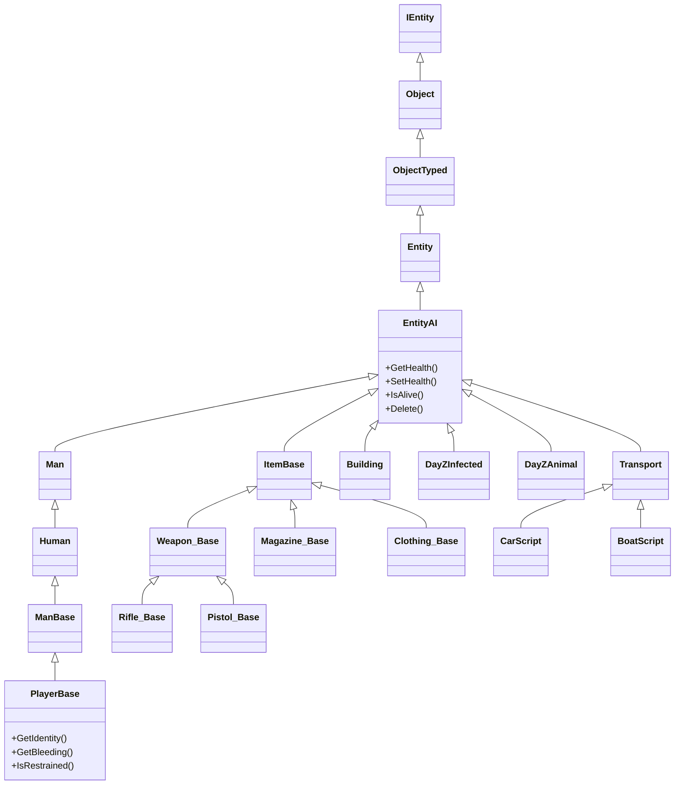

# Chapter 6.1: Entity System

[Home](../README.md) | **Entity System** | [Next: Vehicles >>](02-vehicles.md)

---

Every object in the DayZ world --- items, players, zombies, animals, buildings, vehicles --- descends from a single class hierarchy rooted at `IEntity`. This chapter is an API reference for the core entity classes: what methods exist, what their signatures are, and how to use them correctly.

---

## Class Hierarchy

```
Class (root of all Enforce Script classes)
└── Managed
    └── IEntity                              // 1_Core/proto/enentity.c
        └── Object                           // 3_Game/entities/object.c
            └── ObjectTyped
                └── Entity
                    └── EntityAI             // 3_Game/entities/entityai.c
                        ├── InventoryItem    // 3_Game/entities/inventoryitem.c
                        │   └── ItemBase     // 4_World/entities/itembase.c
                        │       ├── Weapon_Base, Magazine_Base
                        │       └── (all inventory items)
                        ├── Man              // 3_Game/entities/man.c
                        │   └── Human       // engine native (proto)
                        │       └── DayZPlayer
                        │       └── DayZPlayerImplement
                        │           └── ManBase
                        │               └── PlayerBase  // 4_World/entities/manbase/playerbase.c
                        ├── Building         // 3_Game/entities/building.c
                        ├── DayZInfected
                        │   └── ZombieBase   // 4_World/entities/creatures/infected/zombiebase.c
                        ├── DayZAnimal
                        │   └── AnimalBase   // 4_World
                        └── AdvancedCommunication
```

### Complete Entity Hierarchy



Key points:

- **IEntity** is the engine-level base. It provides transform, physics, and hierarchy methods.
- **Object** adds position/orientation helpers, health, config access, hidden selections, and type checking (`IsMan()`, `IsBuilding()`, etc.).
- **EntityAI** adds inventory, damage zones, attachments, energy manager, net sync variables, and lifecycle events (`EEInit`, `EEKilled`, `EEHitBy`).
- **ItemBase**, **PlayerBase**, **ZombieBase**, and **AnimalBase** are the concrete bases you work with daily.

---

## IEntity

**File:** `1_Core/proto/enentity.c`

The engine-native entity. All proto native methods --- you cannot see their implementation in script.

### Transform

| Method | Signature | Description |
|--------|-----------|-------------|
| `GetOrigin` | `proto native vector GetOrigin()` | World position of the entity |
| `SetOrigin` | `proto native external void SetOrigin(vector orig)` | Set world position |
| `GetYawPitchRoll` | `proto native vector GetYawPitchRoll()` | Rotation as yaw/pitch/roll in degrees |
| `GetTransform` | `proto native external void GetTransform(out vector mat[4])` | Full 4x3 transform matrix |
| `SetTransform` | `proto native external void SetTransform(vector mat[4])` | Set full transform |

### Coordinate Conversion

| Method | Signature | Description |
|--------|-----------|-------------|
| `VectorToParent` | `proto native vector VectorToParent(vector vec)` | Transform direction from local to world space |
| `CoordToParent` | `proto native vector CoordToParent(vector coord)` | Transform point from local to world space |
| `VectorToLocal` | `proto native vector VectorToLocal(vector vec)` | Transform direction from world to local space |
| `CoordToLocal` | `proto native vector CoordToLocal(vector coord)` | Transform point from world to local space |

### Hierarchy

| Method | Signature | Description |
|--------|-----------|-------------|
| `AddChild` | `proto native external void AddChild(IEntity child, int pivot, bool positionOnly = false)` | Attach child entity to a bone pivot |
| `RemoveChild` | `proto native external void RemoveChild(IEntity child, bool keepTransform = false)` | Detach child entity |
| `GetParent` | `proto native IEntity GetParent()` | Parent entity (or null) |
| `GetChildren` | `proto native IEntity GetChildren()` | First child entity |
| `GetSibling` | `proto native IEntity GetSibling()` | Next sibling entity |

### Events

| Method | Signature | Description |
|--------|-----------|-------------|
| `SetEventMask` | `proto native external void SetEventMask(EntityEvent e)` | Enable event callbacks |
| `ClearEventMask` | `proto native external void ClearEventMask(EntityEvent e)` | Disable event callbacks |
| `SetFlags` | `proto native external EntityFlags SetFlags(EntityFlags flags, bool recursivelyApply)` | Set entity flags (VISIBLE, SOLID, etc.) |
| `ClearFlags` | `proto native external EntityFlags ClearFlags(EntityFlags flags, bool recursivelyApply)` | Clear entity flags |

### Event Callbacks

These are called by the engine when the corresponding event mask is set:

```c
// Per-frame callback (requires EntityEvent.FRAME)
event protected void EOnFrame(IEntity other, float timeSlice);

// Contact callback (requires EntityEvent.CONTACT)
event protected void EOnContact(IEntity other, Contact extra);

// Trigger callbacks (requires EntityEvent.ENTER / EntityEvent.LEAVE)
event protected void EOnEnter(IEntity other, int extra);
event protected void EOnLeave(IEntity other, int extra);
```

---

## Object

**File:** `3_Game/entities/object.c` (1455 lines)

Base class for all spatial objects in the game world. This is the first script-accessible level of the hierarchy --- `IEntity` is purely engine-native.

### Position & Orientation

```c
proto native void SetPosition(vector pos);
proto native vector GetPosition();
proto native void SetOrientation(vector ori);     // ori = "yaw pitch roll" in degrees
proto native vector GetOrientation();              // returns "yaw pitch roll"
proto native void SetDirection(vector direction);
proto native vector GetDirection();                // forward direction vector
```

**Example --- teleport an object:**

```c
Object obj = GetSomeObject();
vector newPos = Vector(6543.0, 0, 2872.0);
newPos[1] = GetGame().SurfaceY(newPos[0], newPos[2]);
obj.SetPosition(newPos);
```

### Health & Damage

```c
// Zone-based health system. Use "" for global zone, "Health" for default health type.
proto native float GetHealth(string zoneName, string healthType);
proto native float GetMaxHealth(string zoneName, string healthType);
proto native void  SetHealth(string zoneName, string healthType, float value);
proto native void  SetHealthMax(string zoneName, string healthType);
proto native void  DecreaseHealth(string zoneName, string healthType, float value);
// NOTE: A 4-param overload with auto_delete exists as a regular script method, not proto native.
proto native void  AddHealth(string zoneName, string healthType, float value);
proto native void  SetAllowDamage(bool val);
proto native bool  GetAllowDamage();
```

| Parameter | Meaning |
|-----------|---------|
| `zoneName` | Damage zone name (e.g., `""` for global, `"Engine"`, `"FuelTank"`, `"LeftArm"`) |
| `healthType` | Type of health stat (usually `"Health"`, but also `"Blood"`, `"Shock"` for players) |

**Example --- set an item to half health:**

```c
float maxHP = obj.GetMaxHealth("", "Health");
obj.SetHealth("", "Health", maxHP * 0.5);
```

### IsAlive

```c
bool IsAlive();
```

`IsAlive()` is a regular script method on `Object`, not a proto native. It checks whether the object's health is above zero. Note that only `IsDamageDestroyed()` is proto native on `Object`.

> **Gotcha:** In practice many modders have found `IsAlive()` unreliable on the base `Object` class. The safe pattern is to cast to `EntityAI` first:

```c
EntityAI eai;
if (Class.CastTo(eai, obj) && eai.IsAlive())
{
    // Confirmed alive
}
```

### Type Checking

```c
bool IsMan();
bool IsDayZCreature();
bool IsBuilding();
bool IsTransport();
bool IsKindOf(string type);     // Check config inheritance
```

These are regular script methods on `Object`, not proto native. Only `IsDamageDestroyed()` is proto native on `Object`.

**Example:**

```c
if (obj.IsKindOf("Weapon_Base"))
{
    Print("This is a weapon!");
}
```

### Type & Display Name

```c
// GetType() returns the config class name (e.g., "AKM", "SurvivorM_Mirek")
string GetType();

// GetDisplayName() returns the localized display name
string GetDisplayName();
```

### Scale

```c
proto native void  SetScale(float scale);
proto native float GetScale();
```

### Bone Positions

```c
proto native vector GetBonePositionLS(int pivot);   // Local space
proto native vector GetBonePositionMS(int pivot);   // Model space
proto native vector GetBonePositionWS(int pivot);   // World space
```

### Hidden Selections (Texture/Material Swaps)

```c
TStringArray GetHiddenSelections();
TStringArray GetHiddenSelectionsTextures();
TStringArray GetHiddenSelectionsMaterials();
```

### Config Access (on the entity itself)

```c
proto native bool   ConfigGetBool(string entryName);
proto native int    ConfigGetInt(string entryName);
proto native float  ConfigGetFloat(string entryName);
proto native owned string ConfigGetString(string entryName);
proto native void   ConfigGetTextArray(string entryName, out TStringArray values);
proto native void   ConfigGetIntArray(string entryName, out TIntArray values);
proto native void   ConfigGetFloatArray(string entryName, out TFloatArray values);
proto native bool   ConfigIsExisting(string entryName);
```

### Network ID

```c
proto native int GetNetworkID(out int id_low, out int id_high);
```

### Deletion

```c
void Delete();                    // Deferred delete (next frame, via CallQueue)
proto native bool ToDelete();     // Is this object marked for deletion?
```

### Geometry & Components

```c
proto native owned string GetActionComponentName(int componentIndex, string geometry = "");
proto native owned vector GetActionComponentPosition(int componentIndex, string geometry = "");
proto native owned string GetDamageZoneNameByComponentIndex(int componentIndex);
proto native vector GetBoundingCenter();
```

---

## EntityAI

**File:** `3_Game/entities/entityai.c` (4719 lines)

The workhorse base for all interactive game entities. Adds inventory, damage events, temperature, energy management, and network synchronization.

### Inventory Access

```c
proto native GameInventory GetInventory();
```

Common inventory operations through the returned `GameInventory`:

```c
// Enumerate all items in this entity's inventory
array<EntityAI> items = new array<EntityAI>;
eai.GetInventory().EnumerateInventory(InventoryTraversalType.PREORDER, items);

// Count items
int count = eai.GetInventory().CountInventory();

// Check if entity has a specific item
bool has = eai.GetInventory().HasEntityInInventory(someItem);

// Create item in cargo
EntityAI newItem = eai.GetInventory().CreateEntityInCargo("BandageDressing");

// Create item as attachment
EntityAI attachment = eai.GetInventory().CreateAttachment("ACOGOptic");

// Find attachment by slot name
EntityAI att = eai.GetInventory().FindAttachmentByName("Hands");

// Get attachment count and iterate
int attCount = eai.GetInventory().AttachmentCount();
for (int i = 0; i < attCount; i++)
{
    EntityAI att = eai.GetInventory().GetAttachmentFromIndex(i);
}
```

### Inventory & Slot System

Every EntityAI has a `GameInventory` accessed via `GetInventory()`. The inventory manages cargo space, attachments, and hands. The full class is defined in `3_Game/systems/inventory/inventory.c`.

#### Slot System

DayZ uses numbered slots for attachments. Each slot has a name and ID, defined in `DZ/data/config.cpp` under `CfgSlots`. The `InventorySlots` class (in `3_Game/systems/inventory/inventoryslots.c`) provides slot lookup:

```c
// Find slot ID by name
int slotId = InventorySlots.GetSlotIdFromString("Shoulder");
int headSlot = InventorySlots.GetSlotIdFromString("Headgear");

// Convert slot ID back to name
string name = InventorySlots.GetSlotName(slotId);

// Get display name for UI
string displayName = InventorySlots.GetSlotDisplayName(slotId);

// Validate a slot ID
if (InventorySlots.IsSlotIdValid(slotId))
{
    // slot exists
}

// Invalid slot constant
if (slotId == InventorySlots.INVALID)
{
    Print("Slot not found!");
}
```

Common slot names: `"Shoulder"`, `"Melee"`, `"Headgear"`, `"Mask"`, `"Eyewear"`, `"Gloves"`, `"Armband"`, `"Body"`, `"Vest"`, `"Back"`, `"Hips"`, `"Legs"`, `"Feet"`, `"Hands"`

#### Finding Attachments

```c
GameInventory inv = entity.GetInventory();

// Find attachment by slot ID
int slotId = InventorySlots.GetSlotIdFromString("Shoulder");
EntityAI attachment = inv.FindAttachment(slotId);

// Find attachment by slot name (convenience method)
EntityAI att = inv.FindAttachmentByName("Shoulder");

// Check if a slot is occupied
bool occupied = inv.FindAttachment(slotId) != null;

// Check if entity is attached to this inventory
bool isAttached = inv.HasAttachment(someEntity);

// Check if attachment can be added
bool canAttach = inv.CanAddAttachment(someEntity);
bool canAttachSlot = inv.CanAddAttachmentEx(someEntity, slotId);

// Create attachment by type name
EntityAI optic = inv.CreateAttachment("ACOGOptic");

// Create attachment in a specific slot
EntityAI grip = inv.CreateAttachmentEx("AK_WoodHndgrd", slotId);

// Iterate all attachments
int attCount = inv.AttachmentCount();
for (int i = 0; i < attCount; i++)
{
    EntityAI item = inv.GetAttachmentFromIndex(i);
    // NOTE: index is NOT slot ID --- use FindAttachment(slotId) for slot-based lookup
}
```

#### Cargo Operations

```c
GameInventory inv = entity.GetInventory();

// Get cargo container
CargoBase cargo = inv.GetCargo();
if (cargo)
{
    // Count items in cargo
    int count = cargo.GetItemCount();

    // Iterate cargo items
    for (int i = 0; i < cargo.GetItemCount(); i++)
    {
        EntityAI item = cargo.GetItem(i);
        // process item
    }
}

// Check if item can fit in cargo
bool canFit = inv.CanAddEntityInCargo(item, false);

// Create item directly in cargo
EntityAI newItem = inv.CreateEntityInCargo("BandageDressing");

// Create item at specific cargo position
EntityAI placed = inv.CreateEntityInCargoEx("Rag", 0, 0, 0, false);

// Create item anywhere in inventory (cargo or attachment slot, whichever fits first)
EntityAI anywhere = inv.CreateInInventory("Rag");
```

#### InventoryLocation

For precise placement control, use `InventoryLocation` (defined in `3_Game/systems/inventory/inventorylocation.c`). Every item has a current location, and you create new locations to move items:

```c
InventoryLocation il = new InventoryLocation();

// Set as attachment in a specific slot
il.SetAttachment(parentEntity, item, slotId);

// Set as cargo at specific grid position
il.SetCargo(parentEntity, item, idx, row, col, flip);

// Set as ground position (requires full transform matrix)
vector transform[4];
item.GetTransform(transform);
il.SetGround(item, transform);

// Set in hands
il.SetHands(playerEntity, item);
```

**Reading current location:**

```c
InventoryLocation currentLoc = new InventoryLocation();
if (item.GetInventory().GetCurrentInventoryLocation(currentLoc))
{
    int locType = currentLoc.GetType();  // InventoryLocationType enum

    if (locType == InventoryLocationType.ATTACHMENT)
    {
        EntityAI parent = currentLoc.GetParent();
        int slot = currentLoc.GetSlot();
    }
    else if (locType == InventoryLocationType.CARGO)
    {
        int row = currentLoc.GetRow();
        int col = currentLoc.GetCol();
    }
}
```

**InventoryLocationType enum:**

| Type | Description |
|------|-------------|
| `UNKNOWN` | Freshly created, no location set |
| `GROUND` | On the ground in the world |
| `ATTACHMENT` | Attached to another entity's slot |
| `CARGO` | In another entity's cargo grid |
| `HANDS` | In a player's hands |
| `PROXYCARGO` | Cargo of a large object (building furniture) |
| `VEHICLE` | Player seated in a vehicle |

**Finding free locations:**

```c
// Find first free location for an existing item
InventoryLocation freeLoc = new InventoryLocation();
if (player.GetInventory().FindFreeLocationFor(item, FindInventoryLocationType.ANY, freeLoc))
{
    // freeLoc now contains a valid destination
}

// Find first free location for a new item type (before creating it)
InventoryLocation newLoc = new InventoryLocation();
if (player.GetInventory().FindFirstFreeLocationForNewEntity("BandageDressing", FindInventoryLocationType.CARGO, newLoc))
{
    // Can create item at newLoc
    EntityAI created = GameInventory.LocationCreateEntity(newLoc, "BandageDressing", ECE_IN_INVENTORY, RF_DEFAULT);
}
```

#### Inventory Events

```c
// Called on PARENT when a child is attached to it
override void EEItemAttached(EntityAI item, string slot_name)
{
    super.EEItemAttached(item, slot_name);
    Print("Attached " + item.GetType() + " to slot " + slot_name);
}

// Called on PARENT when a child is detached from it
override void EEItemDetached(EntityAI item, string slot_name)
{
    super.EEItemDetached(item, slot_name);
    Print("Detached " + item.GetType() + " from slot " + slot_name);
}
```

#### Inventory State Checks

```c
GameInventory inv = entity.GetInventory();

// Check if this entity is currently in cargo of something
bool inCargo = inv.IsInCargo();

// Check how many attachment slots this entity defines
int slotCount = inv.GetAttachmentSlotsCount();
for (int i = 0; i < slotCount; i++)
{
    int sid = inv.GetAttachmentSlotId(i);
    string sname = InventorySlots.GetSlotName(sid);
    Print("Slot: " + sname);
}

// Check which slots this item CAN go into (as a child)
int fitCount = inv.GetSlotIdCount();
for (int j = 0; j < fitCount; j++)
{
    int fitSlot = inv.GetSlotId(j);
    Print("Can fit in slot: " + InventorySlots.GetSlotName(fitSlot));
}
```

### Damage System

```c
proto native void SetHealth(string zoneName, string healthType, float value);
proto native float GetHealth(string zoneName, string healthType);
proto native float GetMaxHealth(string zoneName, string healthType);
proto native void SetHealthMax(string zoneName, string healthType);
proto native void DecreaseHealth(string zoneName, string healthType, float value);
// NOTE: A 4-param overload with auto_delete exists as a regular script method, not proto native.
proto native void ProcessDirectDamage(int damageType, EntityAI source, string component,
                                       string ammoType, vector modelPos,
                                       float damageCoef = 1.0, int flags = 0);
```

### Damage System Deep Dive

The damage system in DayZ is zone-based. Each entity can define multiple damage zones (e.g., a car has Engine, FuelTank, Radiator zones; a player has Head, Torso, LeftArm, etc.).

#### ProcessDirectDamage

The core method for applying damage:

```c
// Apply damage to a specific zone
proto native void ProcessDirectDamage(int damageType, EntityAI source, string componentName, string ammoName, vector modelPos, float damageCoef = 1.0, int flags = 0);
```

| Parameter | Description |
|-----------|-------------|
| `damageType` | `DamageType.CLOSE_COMBAT` (0), `DamageType.FIRE_ARM` (1), `DamageType.EXPLOSION` (2), `DamageType.STUN` (3), `DamageType.CUSTOM` (4) |
| `source` | The entity that caused the damage (weapon, player, null for environmental) |
| `componentName` | The damage zone name (e.g., `"Zone_Head"`, `"Engine"`) or empty string `""` for global |
| `ammoName` | Ammo class name from CfgAmmo config (determines damage values, e.g., `"Bullet_762x39"`, `"MeleeFist"`, `"FallDamageHealth"`) |
| `modelPos` | Hit position in model space (use `vector.Zero` or `"0 0 0"` when not applicable) |
| `damageCoef` | Damage multiplier (1.0 = normal, values from CfgAmmo are multiplied by this) |
| `flags` | `ProcessDirectDamageFlags` controlling damage transfer behavior |

#### DamageType Enum

Defined in `3_Game/damagesystem.c`:

```c
enum DamageType
{
    CLOSE_COMBAT,   // 0 - Player melee, animals, infected
    FIRE_ARM,       // 1 - Player ranged (firearms)
    EXPLOSION,      // 2 - Explosions (grenades, mines)
    STUN,           // 3 - Stun damage (currently unused in vanilla)
    CUSTOM          // 4 - Everything else (vehicle hit, fall, fireplace, barbed wire, environmental)
}
```

> **Note:** Older vanilla code (entityai.c, object.c) uses the constants `DT_CLOSE_COMBAT`, `DT_FIRE_ARM`, `DT_EXPLOSION`, `DT_CUSTOM` as integer aliases. Newer code uses the `DamageType` enum. Both refer to the same values.

#### ProcessDirectDamageFlags

Controls how damage transfers between zones and attachments:

```c
enum ProcessDirectDamageFlags
{
    ALL_TRANSFER,              // Default: damage transfers to attachments and global health
    NO_ATTACHMENT_TRANSFER,    // Do not transfer damage to attachments
    NO_GLOBAL_TRANSFER,        // Do not transfer damage to global health
    NO_TRANSFER                // NO_ATTACHMENT_TRANSFER | NO_GLOBAL_TRANSFER
}
```

#### DamageSystem Helper Class

The `DamageSystem` class provides static helpers for common damage operations:

```c
// Close combat damage by component index (from physics hit detection)
static proto native void CloseCombatDamage(EntityAI source, Object targetObject, int targetComponentIndex, string ammoTypeName, vector worldPos, int directDamageFlags = ProcessDirectDamageFlags.ALL_TRANSFER);

// Close combat damage by component name
static proto native void CloseCombatDamageName(EntityAI source, Object targetObject, string targetComponentName, string ammoTypeName, vector worldPos, int directDamageFlags = ProcessDirectDamageFlags.ALL_TRANSFER);

// Area explosion damage
static proto native void ExplosionDamage(EntityAI source, Object directHitObject, string ammoTypeName, vector worldPos, int damageType);
```

#### TotalDamageResult

When `EEHitBy` is called, the engine passes a `TotalDamageResult` object containing the computed damage:

```c
class TotalDamageResult: Managed
{
    // Get damage dealt to a specific zone and health type
    proto native float GetDamage(string zoneName, string healthType);

    // Get the highest damage dealt to any zone for a health type
    proto native float GetHighestDamage(string healthType);
}
```

#### Damage Zones

Damage zones are defined in an entity's `config.cpp` class:

```cpp
class DamageSystem
{
    class GlobalHealth
    {
        class Health
        {
            hitpoints = 100;
            healthLevels[] = {
                {1.0, {"mat_pristine.rvmat"}},
                {0.7, {"mat_worn.rvmat"}},
                {0.5, {"mat_damaged.rvmat"}},
                {0.3, {"mat_badly_damaged.rvmat"}},
                {0.0, {"mat_ruined.rvmat"}}
            };
        };
    };
    class DamageZones
    {
        class Zone_Head
        {
            class Health { hitpoints = 50; };
            componentNames[] = {"head"};  // Named selection in P3D model
            fatalInjuryCoef = 1.0;
        };
    };
};
```

You can enumerate an entity's damage zones at runtime:

```c
TStringArray zoneNames = new TStringArray;
entity.GetDamageZones(zoneNames);

for (int i = 0; i < zoneNames.Count(); i++)
{
    string zone = zoneNames.Get(i);
    float hp = entity.GetHealth(zone, "Health");
    float maxHP = entity.GetMaxHealth(zone, "Health");
    Print(string.Format("Zone %1: %2 / %3", zone, hp, maxHP));
}
```

#### Reading Zone Health

```c
// Get zone health (returns current HP value)
float hp = entity.GetHealth("Zone_Head", "Health");

// Get zone health as fraction (0.0 = ruined, 1.0 = pristine)
float fraction = entity.GetHealth01("Zone_Head", "Health");

// Set zone health directly
entity.SetHealth("Zone_Head", "Health", 50.0);

// Get max health for a zone
float maxHP = entity.GetMaxHealth("Zone_Head", "Health");

// Get the health level (integer 0-4, where 0 = pristine, 4 = ruined)
int level = entity.GetHealthLevel("Zone_Head");

// Shorthand for global zone
float globalFraction = entity.GetHealth01();   // equivalent to GetHealth01("", "")
float globalMax = entity.GetMaxHealth();       // equivalent to GetMaxHealth("", "")
```

#### EEHitBy --- Reacting to Damage

```c
override void EEHitBy(TotalDamageResult damageResult, int damageType, EntityAI source, int component, string dmgZone, string ammo, vector modelPos, float speedCoef)
{
    super.EEHitBy(damageResult, damageType, source, component, dmgZone, ammo, modelPos, speedCoef);

    float damage = damageResult.GetDamage(dmgZone, "Health");
    Print("[MyMod] Hit in zone: " + dmgZone + " for " + damage + " damage");

    // Check damage type
    if (damageType == DamageType.FIRE_ARM)
    {
        Print("[MyMod] Hit by firearm, ammo: " + ammo);
    }
}
```

#### Practical Damage Examples

**Apply environmental damage (server-side):**

```c
// Fall damage pattern (from vanilla DayZPlayerImplementFallDamage)
player.ProcessDirectDamage(DamageType.CUSTOM, player, "", "FallDamageHealth", vector.Zero, healthCoef);

// Heat/fire damage
entity.ProcessDirectDamage(DamageType.CUSTOM, this, "", "HeatDamage", "0 0 0", 1000);

// Vehicle engine wear (no transfer to attachments)
ProcessDirectDamage(DamageType.CUSTOM, null, "Engine", "EnviroDmg", vector.Zero, dmg, ProcessDirectDamageFlags.NO_TRANSFER);
```

**Reset all damage zones to full health:**

```c
// Using DamageSystem helper (resets all zones + global Health/Shock/Blood)
DamageSystem.ResetAllZones(entity);
```

### Lifecycle Events

Override these in your subclass to hook into the entity lifecycle:

```c
void EEInit();                                    // Called after entity initialization
void EEDelete(EntityAI parent);                   // Called before deletion
void EEKilled(Object killer);                     // Called when entity dies
void EEHitBy(TotalDamageResult damageResult,      // Called when entity takes damage
             int damageType, EntityAI source,
             int component, string dmgZone,
             string ammo, vector modelPos,
             float speedCoef);
void EEItemAttached(EntityAI item, string slot_name);   // Attachment added
void EEItemDetached(EntityAI item, string slot_name);   // Attachment removed
```

### Network Sync Variables

Register variables in the constructor to automatically synchronize them between server and client:

```c
proto native void RegisterNetSyncVariableBool(string variableName);
proto native void RegisterNetSyncVariableInt(string variableName, int minValue = 0, int maxValue = 0);
proto native void RegisterNetSyncVariableFloat(string variableName, float minValue = 0, float maxValue = 0);
```

Override `OnVariablesSynchronized()` on the client to react to changes:

```c
void OnVariablesSynchronized();
```

**Example --- synced state variable:**

```c
class MyItem extends ItemBase
{
    protected int m_State;

    void MyItem()
    {
        RegisterNetSyncVariableInt("m_State", 0, 5);
    }

    override void OnVariablesSynchronized()
    {
        super.OnVariablesSynchronized();
        // Update visuals based on m_State
        UpdateVisualState();
    }
}
```

### Energy Manager

```c
proto native ComponentEnergyManager GetCompEM();
```

Usage:

```c
ComponentEnergyManager em = eai.GetCompEM();
if (em)
{
    bool working = em.IsWorking();
    float energy = em.GetEnergy();
    em.SwitchOn();
    em.SwitchOff();
}
```

### ScriptInvokers (Event Hooks)

```c
protected ref ScriptInvoker m_OnItemAttached;
protected ref ScriptInvoker m_OnItemDetached;
protected ref ScriptInvoker m_OnItemAddedIntoCargo;
protected ref ScriptInvoker m_OnItemRemovedFromCargo;
protected ref ScriptInvoker m_OnHitByInvoker;
protected ref ScriptInvoker m_OnKilledInvoker;
```

### Type Checks

```c
bool IsItemBase();
bool IsClothing();
bool IsContainer();
bool IsWeapon();
bool IsMagazine();
bool IsTransport();
bool IsFood();
```

### Spawning Entities

```c
EntityAI SpawnEntityOnGroundPos(string object_name, vector pos);
EntityAI SpawnEntity(string object_name, notnull InventoryLocation inv_loc,
                     int iSetupFlags, int iRotation);
```

---

## ItemBase

**File:** `4_World/entities/itembase.c` (4986 lines)

Base for all inventory items. `typedef ItemBase Inventory_Base;` is used throughout vanilla code.

### Quantity System

```c
void  SetQuantity(float value, bool destroy_config = true, bool destroy_forced = false);
float GetQuantity();
int   GetQuantityMin();
int   GetQuantityMax();
float GetQuantityNormalized();   // 0.0 - 1.0
bool  CanBeSplit();
void  SplitIntoStackMax(EntityAI destination_entity, int slot_id, PlayerBase player);
```

**Example --- fill a canteen:**

```c
ItemBase canteen = ItemBase.Cast(player.GetInventory().CreateInInventory("Canteen"));
if (canteen)
{
    canteen.SetQuantity(canteen.GetQuantityMax());
}
```

### Condition / Wetness / Temperature

```c
// Wetness
float m_VarWet, m_VarWetMin, m_VarWetMax;

// Temperature
float m_VarTemperature;

// Cleanness
int m_Cleanness;

// Liquid
int m_VarLiquidType;
```

### Actions

```c
void SetActions();                     // Override to register actions for this item
void AddAction(typename actionName);   // Register an action
void RemoveAction(typename actionName);
```

**Example --- custom item with action:**

```c
class MyItem extends ItemBase
{
    override void SetActions()
    {
        super.SetActions();
        AddAction(ActionDrinkSelf);
    }
}
```

### Sound

```c
void PlaySoundSet(out EffectSound effect_sound, string sound_set,
                  float fade_in, float fade_out);
void PlaySoundSetLoop(out EffectSound effect_sound, string sound_set,
                      float fade_in, float fade_out);
void StopSoundSet(EffectSound effect_sound);
```

### Economy / Persistence

```c
override void InitItemVariables();     // Reads all config values (quantity, wet, etc.)
```

Items inherit CE (Central Economy) lifetime and persistence from their `types.xml` entry. Use `ECE_NOLIFETIME` flag when creating objects that should never despawn.

### ItemBase Lifecycle

ItemBase extends the entity lifecycle with item-specific initialization, actions, and inventory callbacks. Understanding the order of these events is essential for custom items.

#### Initialization Order

When an ItemBase is created, the following methods are called in order:

1. **Constructor** (`void MyItem()`) --- Register net sync variables here
2. **`InitItemVariables()`** --- Engine calls this to read config values (quantity, wetness, temperature, liquid type)
3. **`EEInit()`** --- Called after full entity initialization (inventory ready, attachments loaded)
4. **`SetActions()`** --- Register player actions that can be performed with this item

```c
class MyCustomItem extends ItemBase
{
    protected bool m_IsActivated;

    void MyCustomItem()
    {
        // Constructor: register net sync variables
        RegisterNetSyncVariableBool("m_IsActivated");
    }

    // Called during initialization to set up item variables
    override void InitItemVariables()
    {
        super.InitItemVariables();
        // Variables like quantity, temperature, wetness are read from config here
        // You can override defaults after calling super
    }

    // Called after entity is fully initialized
    override void EEInit()
    {
        super.EEInit();
        // Safe to access inventory, attachments, and other subsystems here
    }

    // Register actions that players can perform with this item
    override void SetActions()
    {
        super.SetActions();
        // super.SetActions() registers: ActionTakeItem, ActionTakeItemToHands,
        // ActionWorldCraft, ActionDropItem, ActionAttachWithSwitch
        AddAction(ActionEat);
        AddAction(MyCustomAction);
    }
}
```

#### Inventory Enter / Exit

Called when an item moves into or out of a player's inventory (including being picked up or dropped):

```c
// Called when item enters any player's inventory
override void OnInventoryEnter(Man player)
{
    super.OnInventoryEnter(player);
    // player is the Man who now holds this item
}

// Called when item exits any player's inventory
override void OnInventoryExit(Man player)
{
    super.OnInventoryExit(player);
    // player is the Man who no longer holds this item
}
```

#### Cargo & Hands Permissions

Override these to control where an item can be placed:

```c
// Can this item be placed in cargo of the given parent?
override bool CanPutInCargo(EntityAI parent)
{
    if (!super.CanPutInCargo(parent))
        return false;

    // Custom logic (e.g., prevent putting in infected cargo)
    return true;
}

// Can this item be put into a player's hands?
override bool CanPutIntoHands(EntityAI parent)
{
    if (!super.CanPutIntoHands(parent))
        return false;

    return true;
}
```

#### Death & Deletion

```c
// Called when this item is destroyed (health reaches 0)
override void EEKilled(Object killer)
{
    super.EEKilled(killer);
    // Spawn debris, play effects, etc.
}

// Called before this item is deleted from the world
override void EEDelete(EntityAI parent)
{
    super.EEDelete(parent);
    // Clean up references, stop effects, etc.
}
```

#### Complete ItemBase Lifecycle Example

```c
class MyModdedKnife extends ItemBase
{
    protected int m_UsesRemaining;

    void MyModdedKnife()
    {
        RegisterNetSyncVariableInt("m_UsesRemaining", 0, 100);
    }

    override void InitItemVariables()
    {
        super.InitItemVariables();
        m_UsesRemaining = 50;
    }

    override void EEInit()
    {
        super.EEInit();
        // Item is fully ready
    }

    override void SetActions()
    {
        super.SetActions();
        AddAction(ActionSkinning);
        AddAction(ActionMineBush);
    }

    override void OnInventoryEnter(Man player)
    {
        super.OnInventoryEnter(player);
    }

    override void OnInventoryExit(Man player)
    {
        super.OnInventoryExit(player);
    }

    override bool CanPutInCargo(EntityAI parent)
    {
        return true;
    }

    override bool CanPutIntoHands(EntityAI parent)
    {
        return true;
    }

    override void EEKilled(Object killer)
    {
        super.EEKilled(killer);
    }

    override void OnVariablesSynchronized()
    {
        super.OnVariablesSynchronized();
        // React to m_UsesRemaining changing (client-side)
    }
}
```

---

## PlayerBase

**File:** `4_World/entities/manbase/playerbase.c` (9776 lines)

The player entity. The largest class in the codebase.

### Identity

```c
PlayerIdentity GetIdentity();
```

From `PlayerIdentity`:

```c
string GetName();       // Steam/platform display name
string GetId();         // Unique player ID (BI ID)
string GetPlainId();    // Steam64 ID
int    GetPlayerId();   // Session player ID (int)
```

**Example --- get player info on server:**

```c
PlayerBase player;  // from event
PlayerIdentity identity = player.GetIdentity();
if (identity)
{
    string name = identity.GetName();
    string steamId = identity.GetPlainId();
    Print(string.Format("Player: %1 (Steam: %2)", name, steamId));
}
```

### Health / Blood / Shock

Player uses the zone-based health system from EntityAI, with special health types:

```c
// Global health (0-100 by default)
float hp = player.GetHealth("", "Health");

// Blood (0-5000)
float blood = player.GetHealth("", "Blood");

// Shock (0-100)
float shock = player.GetHealth("", "Shock");

// Set values
player.SetHealth("", "Health", 100);
player.SetHealth("", "Blood", 5000);
player.SetHealth("", "Shock", 0);
```

### Position & Inventory

```c
vector pos = player.GetPosition();
player.SetPosition(newPos);

// Item in hands
EntityAI inHands = player.GetHumanInventory().GetEntityInHands();

// Driving vehicle
EntityAI vehicle = player.GetDrivingVehicle();
bool inVehicle = player.IsInVehicle();
```

### State Checks

```c
bool IsAlive();
bool IsUnconscious();
bool IsRestrained();
bool IsInVehicle();
```

### Managers

`PlayerBase` holds references to many gameplay subsystems:

```c
ref ModifiersManager   m_ModifiersManager;
ref ActionManagerBase  m_ActionManager;
ref PlayerAgentPool    m_AgentPool;
ref Environment        m_Environment;
ref EmoteManager       m_EmoteManager;
ref StaminaHandler     m_StaminaHandler;
ref WeaponManager      m_WeaponManager;
```

### Server Lifecycle Events

```c
void OnConnect();
void OnDisconnect();
void OnScheduledTick(float deltaTime);
override void OnRPC(PlayerIdentity sender, int rpc_type, ParamsReadContext ctx);
```

### Spawning Items Near Player

```c
EntityAI SpawnEntityOnGroundOnCursorDir(string object_name, float distance);
```

---

## ZombieBase

**File:** `4_World/entities/creatures/infected/zombiebase.c` (1150 lines)

Base for all infected (zombie) entities.

### Key Properties

```c
protected int   m_MindState;       // AI state (-1 to 4)
protected float m_MovementSpeed;   // Movement speed (-1 to 3)
protected bool  m_IsCrawling;      // Crawler zombie
```

### Initialization

```c
void Init()
{
    RegisterNetSyncVariableInt("m_MindState", -1, 4);
    RegisterNetSyncVariableFloat("m_MovementSpeed", -1, 3);
    RegisterNetSyncVariableBool("m_IsCrawling");

    m_TargetableObjects.Insert(PlayerBase);
    m_TargetableObjects.Insert(AnimalBase);
}
```

---

## AnimalBase

**File:** `4_World/entities/creatures/animals/`

Base for all animal entities. Extends `DayZAnimal` which extends `EntityAI`.

Animals use the same health, position, and damage APIs as other entities. Their behavior is driven by the AI system and CE-configured territory files.

---

## Creating Entities

### GetGame().CreateObject()

```c
proto native Object CreateObject(string type, vector pos,
                                  bool create_local = false,
                                  bool init_ai = false,
                                  bool create_physics = true);
```

| Parameter | Description |
|-----------|-------------|
| `type` | Config class name (e.g., `"AKM"`, `"ZmbF_JournalistNormal_Blue"`) |
| `pos` | World position |
| `create_local` | `true` = client-only, not replicated to server |
| `init_ai` | `true` = initialize AI (for zombies, animals) |
| `create_physics` | `true` = create collision geometry |

**Example:**

```c
Object obj = GetGame().CreateObject("AKM", player.GetPosition(), false, false, true);
```

### GetGame().CreateObjectEx()

```c
proto native Object CreateObjectEx(string type, vector pos, int iFlags,
                                    int iRotation = RF_DEFAULT);
```

This is the preferred API. The `iFlags` parameter uses ECE (Entity Creation Event) flags.

### ECE Flags

| Flag | Value | Description |
|------|-------|-------------|
| `ECE_NONE` | `0` | No special behavior |
| `ECE_SETUP` | `2` | Full entity setup |
| `ECE_TRACE` | `4` | Trace placement to surface |
| `ECE_CENTER` | `8` | Use center from model shape |
| `ECE_UPDATEPATHGRAPH` | `32` | Update navigation mesh |
| `ECE_CREATEPHYSICS` | `1024` | Create physics/collision |
| `ECE_INITAI` | `2048` | Initialize AI |
| `ECE_EQUIP_ATTACHMENTS` | `8192` | Spawn configured attachments |
| `ECE_EQUIP_CARGO` | `16384` | Spawn configured cargo |
| `ECE_EQUIP` | `24576` | `ATTACHMENTS + CARGO` |
| `ECE_LOCAL` | `1073741824` | Create locally only (not replicated) |
| `ECE_NOSURFACEALIGN` | `262144` | Do not align to surface normal |
| `ECE_KEEPHEIGHT` | `524288` | Keep Y position (no trace) |
| `ECE_NOLIFETIME` | `4194304` | No CE lifetime (will not despawn) |
| `ECE_DYNAMIC_PERSISTENCY` | `33554432` | Persistent only after player interaction |

### Pre-defined Flag Combinations

| Constant | Flags | Use Case |
|----------|-------|----------|
| `ECE_IN_INVENTORY` | `CREATEPHYSICS \| KEEPHEIGHT \| NOSURFACEALIGN` | Items created in inventory |
| `ECE_PLACE_ON_SURFACE` | `CREATEPHYSICS \| UPDATEPATHGRAPH \| TRACE` | Items placed on ground |
| `ECE_FULL` | `SETUP \| TRACE \| ROTATIONFLAGS \| UPDATEPATHGRAPH \| EQUIP` | Full setup with equipment |

### RF (Rotation) Flags

| Flag | Value | Description |
|------|-------|-------------|
| `RF_DEFAULT` | `512` | Use default config placement |
| `RF_ORIGINAL` | `128` | Use default config placement |
| `RF_IGNORE` | `64` | Spawn as model was created |
| `RF_ALL` | `63` | All rotation directions |

### Common Patterns

**Spawn item on ground:**

```c
vector pos = player.GetPosition();
Object item = GetGame().CreateObjectEx("AKM", pos, ECE_PLACE_ON_SURFACE);
```

**Spawn zombie with AI:**

```c
EntityAI zombie = EntityAI.Cast(
    GetGame().CreateObjectEx("ZmbF_JournalistNormal_Blue", pos,
                              ECE_PLACE_ON_SURFACE | ECE_INITAI)
);
```

**Spawn persistent building:**

```c
int flags = ECE_SETUP | ECE_UPDATEPATHGRAPH | ECE_CREATEPHYSICS | ECE_NOLIFETIME;
Object building = GetGame().CreateObjectEx("Land_House", pos, flags, RF_IGNORE);
```

**Spawn local-only (client side):**

```c
Object local = GetGame().CreateObjectEx("HelpDeskItem", pos, ECE_LOCAL | ECE_CREATEPHYSICS);
```

**Spawn item directly into player inventory:**

```c
EntityAI item = player.GetInventory().CreateInInventory("BandageDressing");
```

---

## Destroying Entities

### Object.Delete()

```c
void Delete();
```

Deferred deletion --- the object is removed on the next frame via `CallQueue`. This is the safest way to delete objects because it avoids issues with deleting objects while they are being iterated.

### GetGame().ObjectDelete()

```c
proto native void ObjectDelete(Object obj);
```

Immediate server-authoritative deletion. Removes the object from the server and replicates the removal to all clients.

### GetGame().ObjectDeleteOnClient()

```c
proto native void ObjectDeleteOnClient(Object obj);
```

Deletes the object only on clients. The server still keeps the object.

**Example --- cleanup spawned objects:**

```c
// Preferred: deferred delete
obj.Delete();

// Immediate: when you need it gone right now
GetGame().ObjectDelete(obj);
```

---

## Practical Examples

### Find All Players Near a Position

```c
void FindNearbyPlayers(vector center, float radius, out array<PlayerBase> result)
{
    result = new array<PlayerBase>;
    array<Man> allPlayers = new array<Man>;
    GetGame().GetPlayers(allPlayers);

    foreach (Man man : allPlayers)
    {
        if (vector.Distance(man.GetPosition(), center) <= radius)
        {
            PlayerBase pb;
            if (Class.CastTo(pb, man))
            {
                result.Insert(pb);
            }
        }
    }
}
```

### Spawn a Fully Equipped Weapon

```c
void SpawnEquippedAKM(vector pos)
{
    EntityAI weapon = EntityAI.Cast(
        GetGame().CreateObjectEx("AKM", pos, ECE_PLACE_ON_SURFACE)
    );
    if (!weapon)
        return;

    // Add attachments
    weapon.GetInventory().CreateAttachment("AK_WoodBttstck");
    weapon.GetInventory().CreateAttachment("AK_WoodHndgrd");

    // Create a magazine in cargo
    weapon.GetInventory().CreateEntityInCargo("Mag_AKM_30Rnd");
}
```

### Damage and Kill an Entity

```c
void DamageEntity(EntityAI target, float amount)
{
    float currentHP = target.GetHealth("", "Health");
    float newHP = currentHP - amount;

    if (newHP <= 0)
    {
        target.SetHealth("", "Health", 0);
        // EEKilled will be called automatically by the engine
    }
    else
    {
        target.SetHealth("", "Health", newHP);
    }
}
```

---

## Summary

| Concept | Key Point |
|---------|-----------|
| Hierarchy | `IEntity` > `Object` > `EntityAI` > `ItemBase` / `PlayerBase` / `ZombieBase` |
| Position | `GetPosition()` / `SetPosition()` available from `Object` upward |
| Health | Zone-based: `GetHealth(zone, type)` / `SetHealth(zone, type, value)` |
| IsAlive | Use on `EntityAI` or cast first: `EntityAI eai; Class.CastTo(eai, obj)` |
| Inventory | `eai.GetInventory()` returns `GameInventory` with full CRUD |
| Creating | `GetGame().CreateObjectEx(type, pos, ECE_flags)` is the preferred API |
| Deleting | `obj.Delete()` (deferred) or `GetGame().ObjectDelete(obj)` (immediate) |
| Net Sync | `RegisterNetSyncVariable*()` in constructor, react in `OnVariablesSynchronized()` |
| Type Check | `obj.IsKindOf("ClassName")`, `obj.IsMan()`, `obj.IsBuilding()` |

---

## Best Practices

- **Always call `super` in lifecycle overrides.** Every `EEInit()`, `EEKilled()`, `EEHitBy()`, `EEItemAttached()`, and `OnVariablesSynchronized()` override must call `super` first, or you break the inheritance chain for vanilla and other mods.
- **Use `CreateObjectEx()` with explicit ECE flags instead of `CreateObject()`.** The flags-based API gives you precise control over physics, AI, surface alignment, and persistence. Always include `ECE_CREATEPHYSICS` for items that need collision.
- **Register net sync variables only in the constructor, never conditionally.** The registration order must be identical on server and client. Adding variables outside the constructor or behind `if` checks causes desync.
- **Prefer `obj.Delete()` (deferred) over `GetGame().ObjectDelete()` (immediate).** Immediate deletion during iteration or event processing can cause null pointer crashes. Deferred deletion is safe in all contexts.
- **Cast with `Class.CastTo()` instead of direct casts.** `Class.CastTo(result, source)` returns false on failure without crashing, while a direct cast to a wrong type produces undefined behavior.

---

## Multi-Mod Considerations

- If two mods both `modded class ItemBase` and override `EEInit()`, only the last-loaded mod's code runs unless both call `super`. This is the most common source of mod conflicts.
- `RegisterNetSyncVariable*()` adds network traffic per entity. Keep synced variable count under 8 per entity. Use RPCs for infrequent updates.
- `SetHealth()`, `ProcessDirectDamage()`, and `Delete()` are server-authoritative. Calling them on the client causes desync. `GetHealth()`, `GetPosition()`, and type checks are safe on both sides.

---

[Home](../README.md) | **Entity System** | [Next: Vehicles >>](02-vehicles.md)
