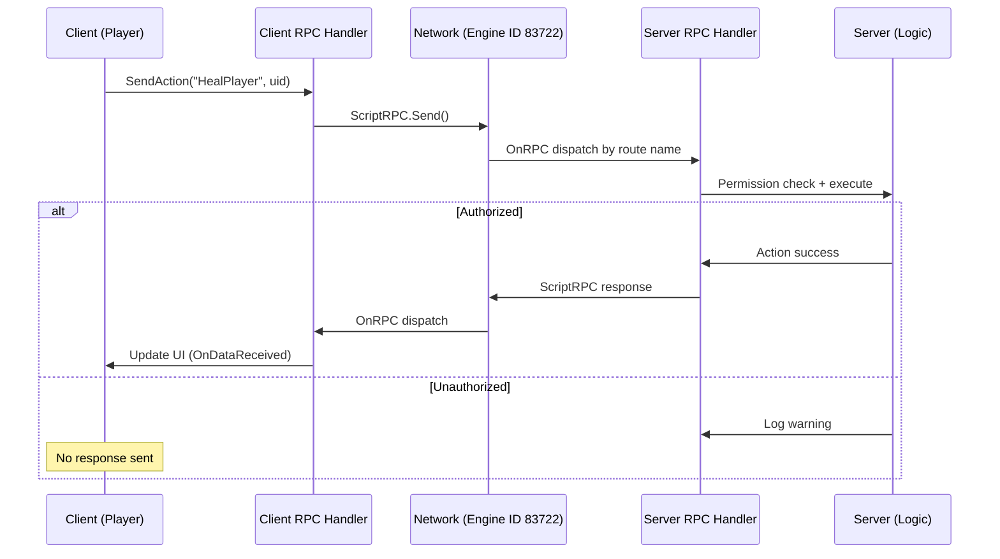

# Chapter 6.9: Networking & RPC

[Home](../README.md) | [<< Previous: File I/O & JSON](08-file-io.md) | **Networking & RPC** | [Next: Central Economy >>](10-central-economy.md)

---

DayZ is a client-server game. All authoritative logic runs on the server, and clients communicate with it through Remote Procedure Calls (RPCs). This chapter covers `ScriptRPC`, the serialization context classes, the legacy `CGame.RPC()` method, and `ScriptInputUserData` for input-verified client-to-server messages.

---

## Client-Server Architecture


### Environment Checks

```c
proto native bool GetGame().IsServer();          // true on server and listen-server host
proto native bool GetGame().IsClient();          // true on client
proto native bool GetGame().IsMultiplayer();      // true in multiplayer
proto native bool GetGame().IsDedicatedServer();  // true only on dedicated server
```

**Typical guard pattern:**

```c
if (GetGame().IsServer())
{
    // Server-only logic
}

if (!GetGame().IsServer())
{
    // Client-only logic
}
```

### RPC Communication Flow



---

## ScriptRPC

**File:** `3_Game/gameplay.c:104`

The primary RPC class for sending custom data between client and server. `ScriptRPC` extends `ParamsWriteContext`, so you call `.Write()` on it directly to serialize data.

### Class Definition

```c
class ScriptRPC : ParamsWriteContext
{
    void ScriptRPC();
    void ~ScriptRPC();
    proto native void Reset();
    proto native void Send(Object target, int rpc_type, bool guaranteed,
                           PlayerIdentity recipient = NULL);
}
```

### Send Parameters

| Parameter | Description |
|-----------|-------------|
| `target` | The object this RPC is associated with (can be `null` for global RPCs) |
| `rpc_type` | Integer RPC ID (must match between sender and receiver) |
| `guaranteed` | `true` = TCP-like reliable delivery; `false` = UDP-like unreliable |
| `recipient` | `PlayerIdentity` of the target client; `null` = broadcast to all clients (server only) |

### Writing Data

`ParamsWriteContext` (which `ScriptRPC` extends) provides:

```c
proto bool Write(void value_out);
```

Supports all primitive types, arrays, and serializable objects:

```c
ScriptRPC rpc = new ScriptRPC();
rpc.Write(42);                          // int
rpc.Write(3.14);                        // float
rpc.Write(true);                        // bool
rpc.Write("hello");                     // string
rpc.Write(Vector(100, 0, 200));         // vector

array<string> names = {"Alice", "Bob"};
rpc.Write(names);                       // array<string>
```

### Sending: Server to Client

```c
// Send to a specific player
void SendDataToPlayer(PlayerBase player, int value, string message)
{
    if (!GetGame().IsServer())
        return;

    ScriptRPC rpc = new ScriptRPC();
    rpc.Write(value);
    rpc.Write(message);
    rpc.Send(player, MY_RPC_ID, true, player.GetIdentity());
}

// Broadcast to all players
void BroadcastData(string message)
{
    if (!GetGame().IsServer())
        return;

    ScriptRPC rpc = new ScriptRPC();
    rpc.Write(message);
    rpc.Send(null, MY_RPC_ID, true, null);  // null recipient = all clients
}
```

### Sending: Client to Server

```c
void SendRequestToServer(int requestType)
{
    if (!GetGame().IsClient())
        return;

    PlayerBase player = PlayerBase.Cast(GetGame().GetPlayer());
    if (!player)
        return;

    ScriptRPC rpc = new ScriptRPC();
    rpc.Write(requestType);
    rpc.Send(player, MY_REQUEST_RPC, true, null);
    // When sent from client, recipient is ignored — it always goes to server
}
```

---

## Receiving RPCs

RPCs are received by overriding `OnRPC` on the target object (or any parent class in the hierarchy).

### OnRPC Signature

```c
override void OnRPC(PlayerIdentity sender, int rpc_type, ParamsReadContext ctx)
{
    super.OnRPC(sender, rpc_type, ctx);

    if (rpc_type == MY_RPC_ID)
    {
        // Read data in the same order it was written
        int value;
        string message;

        if (!ctx.Read(value))
            return;
        if (!ctx.Read(message))
            return;

        // Process the data
        HandleData(value, message);
    }
}
```

### ParamsReadContext

`ParamsReadContext` is a typedef for `Serializer`:

```c
typedef Serializer ParamsReadContext;
typedef Serializer ParamsWriteContext;
```

The `Read` method:

```c
proto bool Read(void value_in);
```

Returns `true` on success, `false` if the read fails (wrong type, insufficient data). Always check the return value.

### Where to Override OnRPC

| Target Object | Receives RPCs For |
|---------------|-------------------|
| `PlayerBase` | RPCs sent with `target = player` |
| `ItemBase` | RPCs sent with `target = item` |
| Any `Object` | RPCs sent with that object as target |
| `MissionGameplay` / `MissionServer` | Global RPCs (`target = null`) via `OnRPC` in mission |

**Example --- full client-server exchange:**

```c
// Shared constant (3_Game layer)
const int RPC_MY_CUSTOM_DATA = 87001;

// Server-side: send data to client (4_World or 5_Mission)
class MyServerHandler
{
    void SendScore(PlayerBase player, int score)
    {
        ScriptRPC rpc = new ScriptRPC();
        rpc.Write(score);
        rpc.Send(player, RPC_MY_CUSTOM_DATA, true, player.GetIdentity());
    }
}

// Client-side: receive data (modded PlayerBase)
modded class PlayerBase
{
    override void OnRPC(PlayerIdentity sender, int rpc_type, ParamsReadContext ctx)
    {
        super.OnRPC(sender, rpc_type, ctx);

        if (rpc_type == RPC_MY_CUSTOM_DATA)
        {
            int score;
            if (!ctx.Read(score))
                return;

            Print(string.Format("Received score: %1", score));
        }
    }
}
```

---

## CGame.RPC (Legacy API)

The older array-based RPC system. Still used in vanilla code but `ScriptRPC` is preferred for new mods.

### Signatures

```c
// Send with array of Param objects
proto native void GetGame().RPC(Object target, int rpcType,
                                 notnull array<ref Param> params,
                                 bool guaranteed,
                                 PlayerIdentity recipient = null);

// Send with a single Param
proto native void GetGame().RPCSingleParam(Object target, int rpc_type,
                                            Param param, bool guaranteed,
                                            PlayerIdentity recipient = null);
```

### Param Classes

```c
class Param1<Class T1> extends Param { T1 param1; };
class Param2<Class T1, Class T2> extends Param { T1 param1; T2 param2; };
// ... up to Param8
```

**Example --- legacy RPC:**

```c
// Send
Param1<string> data = new Param1<string>("Hello World");
GetGame().RPCSingleParam(null, MY_RPC_ID, data, true, player.GetIdentity());

// Receive (in OnRPC)
if (rpc_type == MY_RPC_ID)
{
    Param1<string> data = new Param1<string>("");
    if (ctx.Read(data))
    {
        Print(data.param1);  // "Hello World"
    }
}
```

---

## ScriptInputUserData

**File:** `3_Game/gameplay.c`

A specialized write context for sending client-to-server input messages that go through the engine's input validation pipeline. Used for actions that need anti-cheat verification.

```c
class ScriptInputUserData : ParamsWriteContext
{
    proto native void Reset();
    proto native void Send();
    proto native static bool CanStoreInputUserData();
}
```

### Usage Pattern

```c
// Client side
void SendAction(int actionId)
{
    if (!ScriptInputUserData.CanStoreInputUserData())
    {
        Print("Cannot send input data right now");
        return;
    }

    ScriptInputUserData ctx = new ScriptInputUserData();
    ctx.Write(actionId);
    ctx.Send();  // Automatically routed to server
}
```

> **Note:** `ScriptInputUserData` has rate limiting. Always check `CanStoreInputUserData()` before sending.

---

## RPC ID Management

### Choosing RPC IDs

Vanilla DayZ uses the `ERPCs` enum for built-in RPCs. Custom mods should use IDs that do not conflict with vanilla.

**Best practices:**

```c
// Define in 3_Game layer (shared between client and server)
const int MY_MOD_RPC_BASE = 87000;  // Choose a high number unlikely to conflict
const int RPC_MY_FEATURE_A = MY_MOD_RPC_BASE + 1;
const int RPC_MY_FEATURE_B = MY_MOD_RPC_BASE + 2;
const int RPC_MY_FEATURE_C = MY_MOD_RPC_BASE + 3;
```

### Single Engine ID Pattern (Used by MyFramework)

For mods with many RPC types, use a single engine RPC ID and route internally by a string identifier:

```c
// Single engine ID
const int MyRPC_ENGINE_ID = 83722;

// Send with string routing
ScriptRPC rpc = new ScriptRPC();
rpc.Write("MyFeature.DoAction");  // String route
rpc.Write(payload);
rpc.Send(target, MyRPC_ENGINE_ID, true, recipient);

// Receive and route
override void OnRPC(PlayerIdentity sender, int rpc_type, ParamsReadContext ctx)
{
    if (rpc_type == MyRPC_ENGINE_ID)
    {
        string route;
        if (!ctx.Read(route))
            return;

        // Route to handler based on string
        HandleRoute(route, sender, ctx);
    }
}
```

---

## Network Sync Variables (Alternative to RPC)

For simple state synchronization, `RegisterNetSyncVariable*()` is often simpler than RPCs. See [Chapter 6.1](01-entity-system.md) for details.

RPCs are better when:
- You need to send one-time events (not continuous state)
- The data does not belong to a specific entity
- You need to send complex or variable-length data
- You need client-to-server communication

Net sync variables are better when:
- You have a small number of variables on an entity that change periodically
- You want automatic interpolation
- The data naturally belongs to the entity

---

## Security Considerations

### Server-Side Validation

**Never trust client data.** Always validate RPC data on the server:

```c
override void OnRPC(PlayerIdentity sender, int rpc_type, ParamsReadContext ctx)
{
    super.OnRPC(sender, rpc_type, ctx);

    if (rpc_type == RPC_PLAYER_REQUEST && GetGame().IsServer())
    {
        int requestedAmount;
        if (!ctx.Read(requestedAmount))
            return;

        // VALIDATE: clamp to allowed range
        requestedAmount = Math.Clamp(requestedAmount, 0, 100);

        // VALIDATE: check sender identity matches the player object
        PlayerBase senderPlayer = GetPlayerBySender(sender);
        if (!senderPlayer || !senderPlayer.IsAlive())
            return;

        // Now process the validated request
        ProcessRequest(senderPlayer, requestedAmount);
    }
}
```

### Rate Limiting

The engine has built-in rate limiting for RPCs. Sending too many RPCs per frame can cause them to be dropped. For high-frequency data, consider:

- Using net sync variables instead
- Batching multiple values into a single RPC
- Throttling send frequency with a timer

---

## Summary

| Concept | Key Point |
|---------|-----------|
| ScriptRPC | Primary RPC class: `Write()` data, then `Send(target, id, guaranteed, recipient)` |
| OnRPC | Override on target object to receive: `OnRPC(sender, rpc_type, ctx)` |
| Read/Write | `ctx.Write(value)` / `ctx.Read(value)` --- always check Read return value |
| Direction | Client sends to server; server sends to specific client or broadcasts |
| Recipient | `null` = broadcast (server), ignored (client) |
| Guaranteed | `true` = reliable delivery, `false` = unreliable (faster) |
| Legacy | `GetGame().RPC()` / `RPCSingleParam()` with Param objects |
| Input data | `ScriptInputUserData` for validated client input |
| IDs | Use high numbers (87000+) to avoid vanilla conflicts |
| Security | Always validate client data on the server |

---

## Best Practices

- Always check `ctx.Read()` return values. Skipping the check leads to reading garbage data from the buffer, corrupting all subsequent reads.
- Define RPC ID constants in `3_Game` so both client and server compile them. Placing them in `4_World` or `5_Mission` means only one side sees them.
- Use `guaranteed = true` for state-changing RPCs, `false` only for cosmetic/frequent updates.
- Validate all client-sent data on the server. Clamp numeric ranges, verify identity, check permissions.
- Prefer `ScriptRPC` over the legacy `GetGame().RPC()` for new code. It avoids `Param` object allocation overhead and supports arbitrary data via `Write`.

---

## Multi-Mod Considerations

- **RPC ID collisions** are the primary risk. Two mods using the same integer RPC ID will intercept each other's messages, causing silent data corruption or crashes. Use high base numbers (80000+).
- Always call `super.OnRPC()` in `modded class` overrides so other mods in the chain can process their own IDs. Forgetting `super` breaks all other mods' RPCs.
- Each `ScriptRPC.Send()` with `guaranteed = true` creates a reliable network packet. Batch data into fewer, larger RPCs to avoid saturating bandwidth.
- `ScriptRPC.Send()` from client always goes to server (recipient parameter is ignored). From server, `null` recipient broadcasts to all clients.
- For mods with many RPC types, use a single engine RPC ID and route internally by a string identifier instead of consuming many integer IDs.

---

[<< Previous: File I/O & JSON](08-file-io.md) | **Networking & RPC** | [Next: Central Economy >>](10-central-economy.md)
