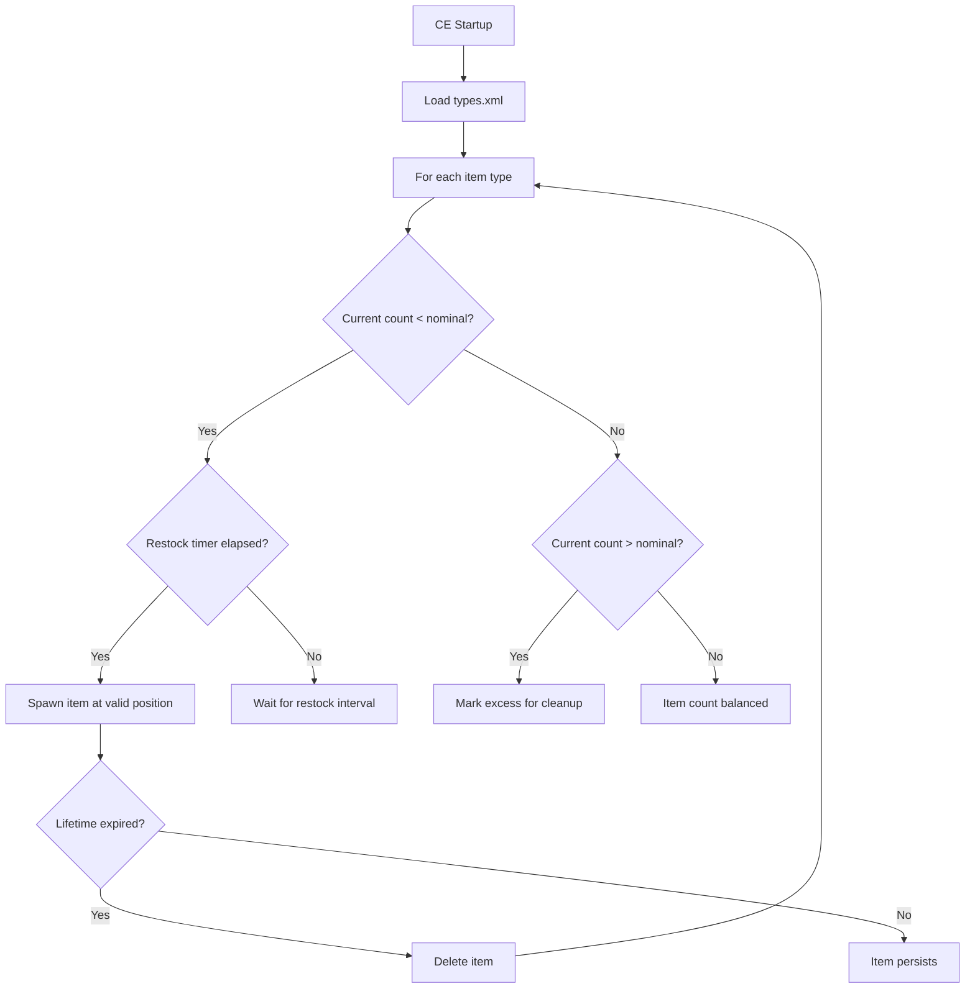

# Chapter 6.10: Central Economy

[Home](../README.md) | [<< Previous: Networking & RPC](09-networking.md) | **Central Economy** | [Next: Mission Hooks >>](11-mission-hooks.md)

---

## Introduction

The Central Economy (CE) is DayZ's server-side system for managing all spawnable entities in the world: loot, vehicles, infected, animals, and dynamic events. It is configured entirely through XML files in the mission folder. While the CE itself is an engine system (not directly scriptable), understanding its configuration files is essential for any server mod. This chapter covers all CE configuration files, their structure, key parameters, and how they interact.

---

## How the CE Works

1. The server reads `types.xml` to learn every item's **nominal** (target count) and **min** (minimum before restock).
2. Items are assigned **usage flags** (e.g., `Military`, `Town`) that map to building/location types.
3. Items are assigned **value flags** (e.g., `Tier1` through `Tier4`) that restrict them to map zones.
4. The CE periodically scans the world, counts existing items, and spawns new ones when counts fall below `min`.
5. Items untouched for their `lifetime` (seconds) are cleaned up.
6. Dynamic events (`events.xml`) spawn vehicles, helicopter crashes, and infected groups on their own schedule.

---

## File Overview

All CE files live in the mission folder (e.g., `dayzOffline.chernarusplus/`).

| File | Purpose |
|------|---------|
| `db/types.xml` | Every spawnable item's parameters |
| `db/events.xml` | Dynamic event definitions (vehicles, crashes, infected) |
| `db/globals.xml` | Global CE parameters (timers, limits) |
| `db/economy.xml` | Subsystem toggle switches |
| `cfgeconomycore.xml` | Root classes, defaults, CE logging |
| `cfgspawnabletypes.xml` | Per-item attachment and cargo rules |
| `cfgrandompresets.xml` | Random loot preset pools |
| `cfgeventspawns.xml` | World coordinates for event spawn positions |
| `cfglimitsdefinition.xml` | All valid category, usage, and value flag names |
| `cfgplayerspawnpoints.xml` | Fresh spawn locations |

---

## Spawn Cycle



---

## types.xml

The most critical CE file. Every item that can exist in the world must have an entry here.

### Structure

```xml
<types>
    <type name="AKM">
        <nominal>10</nominal>
        <lifetime>14400</lifetime>
        <restock>0</restock>
        <min>5</min>
        <quantmin>-1</quantmin>
        <quantmax>-1</quantmax>
        <cost>100</cost>
        <flags count_in_cargo="0" count_in_hoarder="0"
               count_in_map="1" count_in_player="0" crafted="0" deloot="0"/>
        <category name="weapons"/>
        <usage name="Military"/>
        <value name="Tier3"/>
        <value name="Tier4"/>
    </type>
</types>
```

### Parameters

| Parameter | Description | Typical Values |
|-----------|-------------|----------------|
| `nominal` | Target count on the entire map | 1 - 200 |
| `lifetime` | Seconds before untouched items despawn | 3600 (1h) - 14400 (4h) |
| `restock` | Seconds before CE attempts to respawn after item is taken | 0 (immediate) - 1800 |
| `min` | Minimum count before CE spawns more | Usually `nominal / 2` |
| `quantmin` | Minimum quantity % (ammo, liquids); -1 = not applicable | -1, 0 - 100 |
| `quantmax` | Maximum quantity %; -1 = not applicable | -1, 0 - 100 |
| `cost` | Priority cost (always 100 in vanilla) | 100 |

### Flags

| Flag | Description |
|------|-------------|
| `count_in_cargo` | Count items inside player/container cargo toward nominal |
| `count_in_hoarder` | Count items in storage (tents, barrels, buried stashes) |
| `count_in_map` | Count items on the ground and in buildings |
| `count_in_player` | Count items on player characters |
| `crafted` | Item is craftable (CE does not spawn it naturally) |
| `deloot` | Dynamic event loot (spawned by events, not CE) |

### Category, Usage, and Value

- **category**: Item category (e.g., `weapons`, `tools`, `food`, `clothes`, `containers`)
- **usage**: Where the item spawns (e.g., `Military`, `Police`, `Town`, `Village`, `Farm`, `Hunting`, `Coast`)
- **value**: Map tier restriction (e.g., `Tier1` = coast, `Tier2` = inland, `Tier3` = military, `Tier4` = deep inland)

An item can have multiple `<usage>` and `<value>` tags to spawn in multiple locations and tiers.

**Example --- add a custom item to the economy:**

```xml
<type name="MyCustomRifle">
    <nominal>5</nominal>
    <lifetime>14400</lifetime>
    <restock>1800</restock>
    <min>2</min>
    <quantmin>-1</quantmin>
    <quantmax>-1</quantmax>
    <cost>100</cost>
    <flags count_in_cargo="0" count_in_hoarder="0"
           count_in_map="1" count_in_player="0" crafted="0" deloot="0"/>
    <category name="weapons"/>
    <usage name="Military"/>
    <value name="Tier3"/>
    <value name="Tier4"/>
</type>
```

---

## globals.xml

Global CE parameters that affect all items.

```xml
<variables>
    <var name="AnimalMaxCount" type="0" value="200"/>
    <var name="CleanupAvoidance" type="0" value="100"/>
    <var name="CleanupLifetimeDeadAnimal" type="0" value="1200"/>
    <var name="CleanupLifetimeDeadInfected" type="0" value="330"/>
    <var name="CleanupLifetimeDeadPlayer" type="0" value="3600"/>
    <var name="CleanupLifetimeDefault" type="0" value="45"/>
    <var name="CleanupLifetimeLimit" type="0" value="50"/>
    <var name="CleanupLifetimeRuined" type="0" value="330"/>
    <var name="FlagRefreshFrequency" type="0" value="432000"/>
    <var name="FlagRefreshMaxDuration" type="0" value="3456000"/>
    <var name="IdleModeCountdown" type="0" value="60"/>
    <var name="IdleModeStartup" type="0" value="1"/>
    <var name="InitialSpawn" type="0" value="100"/>
    <var name="LootDamageMax" type="1" value="0.82"/>
    <var name="LootDamageMin" type="1" value="0.0"/>
    <var name="RespawnAttempt" type="0" value="2"/>
    <var name="RespawnLimit" type="0" value="20"/>
    <var name="RespawnTypes" type="0" value="12"/>
    <var name="RestartSpawn" type="0" value="0"/>
    <var name="SpawnInitial" type="0" value="1200"/>
    <var name="TimeHopping" type="0" value="60"/>
    <var name="TimeLogin" type="0" value="15"/>
    <var name="TimeLogout" type="0" value="15"/>
    <var name="TimePenalty" type="0" value="20"/>
    <var name="WorldWetTempUpdate" type="0" value="1"/>
    <var name="ZombieMaxCount" type="0" value="1000"/>
</variables>
```

### Key Parameters

| Variable | Description |
|----------|-------------|
| `AnimalMaxCount` | Maximum animals alive simultaneously |
| `ZombieMaxCount` | Maximum infected alive simultaneously |
| `CleanupLifetimeDeadPlayer` | Seconds before dead player body despawns |
| `CleanupLifetimeDeadInfected` | Seconds before dead zombie despawns |
| `InitialSpawn` | Number of items to spawn on server startup |
| `SpawnInitial` | Number of spawn attempts on startup |
| `LootDamageMin` / `LootDamageMax` | Damage range applied to spawned loot (0.0-1.0 float, type="1") |
| `RespawnAttempt` | Seconds between respawn checks |
| `FlagRefreshFrequency` | Territory flag refresh interval (seconds) |
| `TimeLogin` / `TimeLogout` | Login/logout timer (seconds) |

---

## events.xml

Defines dynamic events: infected spawn zones, vehicle spawns, helicopter crashes, and other world events.

### Structure

```xml
<events>
    <event name="StaticHeliCrash">
        <nominal>3</nominal>
        <min>0</min>
        <max>0</max>
        <lifetime>2100</lifetime>
        <restock>0</restock>
        <saferadius>1000</saferadius>
        <distanceradius>1000</distanceradius>
        <cleanupradius>1000</cleanupradius>
        <flags deletable="1" init_random="0" remove_damaged="0"/>
        <position>fixed</position>
        <limit>child</limit>
        <active>1</active>
        <children>
            <child lootmax="10" lootmin="5" max="3" min="1"
                   type="Wreck_UH1Y"/>
        </children>
    </event>
</events>
```

### Event Parameters

| Parameter | Description |
|-----------|-------------|
| `nominal` | Target number of active events |
| `min` / `max` | Minimum and maximum active at once |
| `lifetime` | Seconds before event despawns |
| `saferadius` | Minimum distance from players when spawning |
| `distanceradius` | Minimum distance between event instances |
| `cleanupradius` | Radius for cleanup checks |
| `position` | `"fixed"` (from cfgeventspawns.xml) or `"player"` (near players) |
| `active` | `1` = enabled, `0` = disabled |

### Children (Event Objects)

Each event can spawn one or more child objects:

| Attribute | Description |
|-----------|-------------|
| `type` | Class name of the object to spawn |
| `min` / `max` | Count range for this child |
| `lootmin` / `lootmax` | Number of loot items spawned with this child |

---

## cfgspawnabletypes.xml

Defines what attachments and cargo spawn with specific items.

```xml
<spawnabletypes>
    <type name="AKM">
        <attachments chance="0.3">
            <item name="AK_WoodBttstck" chance="0.5"/>
            <item name="AK_PlasticBttstck" chance="0.3"/>
            <item name="AK_FoldingBttstck" chance="0.2"/>
        </attachments>
        <attachments chance="0.2">
            <item name="AK_WoodHndgrd" chance="0.6"/>
            <item name="AK_PlasticHndgrd" chance="0.4"/>
        </attachments>
        <cargo chance="0.15">
            <item name="Mag_AKM_30Rnd" chance="0.7"/>
            <item name="Mag_AKM_Drum75Rnd" chance="0.3"/>
        </cargo>
    </type>
</spawnabletypes>
```

### How It Works

- Each `<attachments>` block has a `chance` (0.0 - 1.0) of being applied.
- Within a block, items are selected by their individual `chance` values (normalized to 100% within the block).
- Multiple `<attachments>` blocks allow different attachment slots to be independently rolled.
- `<cargo>` blocks work the same way for items placed in the entity's cargo.

---

## cfgrandompresets.xml

Defines reusable loot preset pools referenced by `cfgspawnabletypes.xml`.

```xml
<randompresets>
    <cargo name="foodGeneral" chance="0.5">
        <item name="Apple" chance="0.15"/>
        <item name="Pear" chance="0.15"/>
        <item name="BakedBeansCan" chance="0.3"/>
        <item name="SardinesCan" chance="0.3"/>
        <item name="WaterBottle" chance="0.1"/>
    </cargo>
</randompresets>
```

These presets can be referenced by name in `cfgspawnabletypes.xml`:

```xml
<type name="Barrel_Green">
    <cargo preset="foodGeneral"/>
</type>
```

---

## cfgeconomycore.xml

Root-level CE configuration. Defines default values, CE classes, and logging flags.

```xml
<economycore>
    <classes>
        <rootclass name="CfgVehicles" act="character" reportMemoryLOD="no"/>
        <rootclass name="CfgVehicles" act="car"/>
        <rootclass name="CfgVehicles" act="deployable"/>
        <rootclass name="CfgAmmo" act="none" reportMemoryLOD="no"/>
    </classes>
    <defaults>
        <default name="dyn_radius" value="40"/>
        <default name="dyn_smin" value="0"/>
        <default name="dyn_smax" value="0"/>
        <default name="dyn_dmin" value="0"/>
        <default name="dyn_dmax" value="10"/>
    </defaults>
    <ce folder="db"/>
</economycore>
```

The `<ce folder="db"/>` tag tells the CE where to find `types.xml`, `events.xml`, and `globals.xml`.

---

## cfglimitsdefinition.xml

Defines all valid category, usage, tag, and value flag names that can be used in `types.xml`.

```xml
<lists>
    <categories>
        <category name="weapons"/>
        <category name="tools"/>
        <category name="food"/>
        <category name="clothes"/>
        <category name="containers"/>
        <category name="vehiclesparts"/>
        <category name="explosives"/>
    </categories>
    <usageflags>
        <usage name="Military"/>
        <usage name="Police"/>
        <usage name="Hunting"/>
        <usage name="Town"/>
        <usage name="Village"/>
        <usage name="Farm"/>
        <usage name="Coast"/>
        <usage name="Industrial"/>
        <usage name="Medic"/>
        <usage name="Firefighter"/>
        <usage name="School"/>
        <usage name="Office"/>
        <usage name="Prison"/>
        <usage name="Lunapark"/>
        <usage name="ContaminatedArea"/>
    </usageflags>
    <valueflags>
        <value name="Tier1"/>
        <value name="Tier2"/>
        <value name="Tier3"/>
        <value name="Tier4"/>
    </valueflags>
</lists>
```

Custom mods can add new flags here and reference them in their `types.xml` entries.

---

## ECE Flags in Script

When spawning entities from script, the ECE flags (covered in [Chapter 6.1](01-entity-system.md)) determine how the entity interacts with the CE:

| Flag | CE Behavior |
|------|-------------|
| `ECE_NOLIFETIME` | Entity will never despawn (not tracked by CE lifetime) |
| `ECE_DYNAMIC_PERSISTENCY` | Entity becomes persistent only after player interaction |
| `ECE_EQUIP_ATTACHMENTS` | CE spawns configured attachments from `cfgspawnabletypes.xml` |
| `ECE_EQUIP_CARGO` | CE spawns configured cargo from `cfgspawnabletypes.xml` |

**Example --- spawn an item that persists forever:**

```c
int flags = ECE_PLACE_ON_SURFACE | ECE_NOLIFETIME;
Object obj = GetGame().CreateObjectEx("Barrel_Green", pos, flags);
```

**Example --- spawn with CE-configured attachments:**

```c
int flags = ECE_PLACE_ON_SURFACE | ECE_EQUIP_ATTACHMENTS | ECE_EQUIP_CARGO;
Object obj = GetGame().CreateObjectEx("AKM", pos, flags);
// The AKM will spawn with random attachments per cfgspawnabletypes.xml
```

---

## Script API for CE Interaction

While the CE is primarily XML-configured, there are some script-side interactions:

### Reading Config Values

```c
// Check if an item exists in CfgVehicles
bool exists = GetGame().ConfigIsExisting("CfgVehicles MyCustomItem");

// Read config properties
string displayName;
GetGame().ConfigGetText("CfgVehicles AKM displayName", displayName);

int weight = GetGame().ConfigGetInt("CfgVehicles AKM weight");
```

### Querying Objects in the World

```c
// Get objects near a position
array<Object> objects = new array<Object>;
array<CargoBase> proxyCargos = new array<CargoBase>;
GetGame().GetObjectsAtPosition(pos, 50.0, objects, proxyCargos);
```

### Surface and Position Queries

```c
// Get terrain height (for placing items on ground)
float surfaceY = GetGame().SurfaceY(x, z);

// Get surface type at position
string surfaceType;
GetGame().SurfaceGetType(x, z, surfaceType);
```

---

## Modding the Central Economy

### Adding Custom Items

1. Define the item class in your mod's `config.cpp` under `CfgVehicles`.
2. Add a `<type>` entry in `types.xml` with nominal, lifetime, usage, and value flags.
3. Optionally add attachment/cargo rules in `cfgspawnabletypes.xml`.
4. If using new usage/value flags, define them in `cfglimitsdefinition.xml`.

### Modifying Existing Items

Edit the `<type>` entry in `types.xml` to change spawn rates, lifetimes, or location restrictions. Changes take effect on server restart.

### Disabling Items

Set `nominal` and `min` to `0`:

```xml
<type name="UnwantedItem">
    <nominal>0</nominal>
    <min>0</min>
    <!-- rest of parameters -->
</type>
```

### Adding Custom Events

Add a new `<event>` block in `events.xml` and corresponding spawn positions in `cfgeventspawns.xml`:

```xml
<!-- events.xml -->
<event name="MyCustomEvent">
    <nominal>5</nominal>
    <min>2</min>
    <max>5</max>
    <lifetime>3600</lifetime>
    <restock>0</restock>
    <saferadius>300</saferadius>
    <distanceradius>800</distanceradius>
    <cleanupradius>100</cleanupradius>
    <flags deletable="1" init_random="1" remove_damaged="1"/>
    <position>fixed</position>
    <limit>child</limit>
    <active>1</active>
    <children>
        <child lootmax="5" lootmin="2" max="1" min="1"
               type="MyCustomObject"/>
    </children>
</event>
```

```xml
<!-- cfgeventspawns.xml -->
<event name="MyCustomEvent">
    <pos x="6543.2" z="2872.5" a="180"/>
    <pos x="7821.0" z="3100.8" a="90"/>
    <pos x="4200.5" z="8500.3" a="0"/>
</event>
```

---

## Summary

| File | Purpose | Key Parameters |
|------|---------|----------------|
| `types.xml` | Item spawn definitions | `nominal`, `min`, `lifetime`, `usage`, `value` |
| `globals.xml` | Global CE variables | `ZombieMaxCount`, `AnimalMaxCount`, cleanup timers |
| `events.xml` | Dynamic events | `nominal`, `lifetime`, `position`, `children` |
| `cfgspawnabletypes.xml` | Attachment/cargo rules per item | `attachments`, `cargo`, `chance` |
| `cfgrandompresets.xml` | Reusable loot pools | `cargo`/`attachments` presets |
| `cfgeconomycore.xml` | Root CE configuration | `classes`, `defaults`, CE folder |
| `cfglimitsdefinition.xml` | Valid flag definitions | `categories`, `usageflags`, `valueflags` |

| Concept | Key Point |
|---------|-----------|
| Nominal/Min | CE spawns items when count drops below `min`, targeting `nominal` |
| Lifetime | Seconds before untouched items despawn |
| Usage flags | Where items spawn (Military, Town, etc.) |
| Value flags | Map tier restriction (Tier1 = coast through Tier4 = deep inland) |
| Count flags | Which items count toward nominal (cargo, hoarder, map, player) |
| Events | Dynamic spawns with their own lifecycle (crashes, vehicles, infected) |
| ECE flags | `ECE_NOLIFETIME`, `ECE_EQUIP` for script-spawned items |

---

## Best Practices

- **Set `count_in_hoarder="1"` for high-value items.** Without this flag, players can hoard rare weapons in stashes without reducing the world spawn count, leading to item duplication in practice.
- **Keep `restock` at 0 for most items.** Non-zero restock values delay respawning after an item is picked up. Use it only for items that should not immediately reappear (e.g., rare military gear).
- **Test nominal/min ratios on a live server with players.** Static testing does not reveal real CE behavior. Items interact with player movement patterns, container storage, and cleanup timers in ways that are only visible under real load.
- **Always define new items in both `config.cpp` and `types.xml`.** A config entry without a types.xml entry means the item will never spawn naturally. A types.xml entry without a config class causes CE errors.
- **Use `cfgspawnabletypes.xml` to create weapon variety.** Instead of spawning naked weapons, define attachment presets so players find weapons with random stocks, handguards, and magazines -- this dramatically improves loot quality perception.

---

## Compatibility & Impact

- **Multi-Mod:** Multiple mods can add entries to `types.xml`. If two mods define the same `<type name="">`, the last loaded file wins. Use unique class names to avoid collisions. Merge types.xml entries carefully on community servers.
- **Performance:** High `nominal` values (200+) for many item types strain the CE's spawn loop. The CE runs periodic scans that scale with total tracked entity count. Keep nominals realistic -- 5-20 for weapons, 20-100 for common items.
- **Server/Client:** The CE runs entirely on the server. Clients have no visibility into CE state. All XML files are server-side only and are not distributed to clients.

---

[Home](../README.md) | [<< Previous: Networking & RPC](09-networking.md) | **Central Economy** | [Next: Mission Hooks >>](11-mission-hooks.md)
