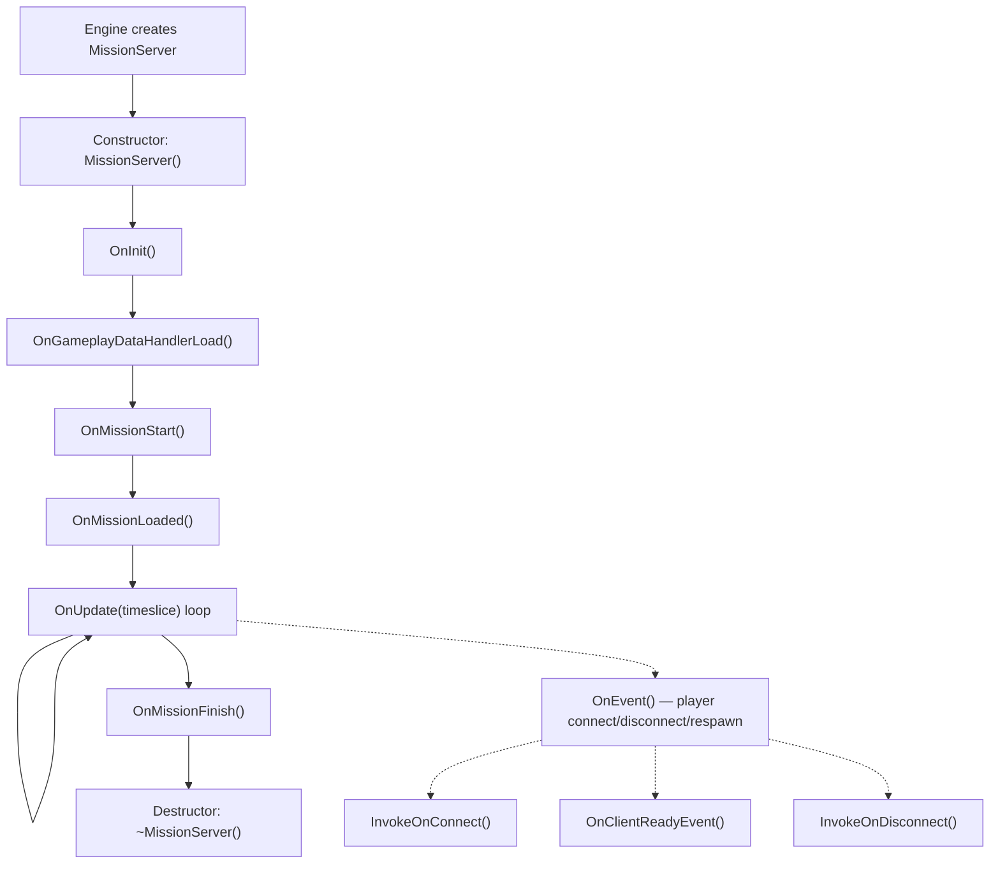
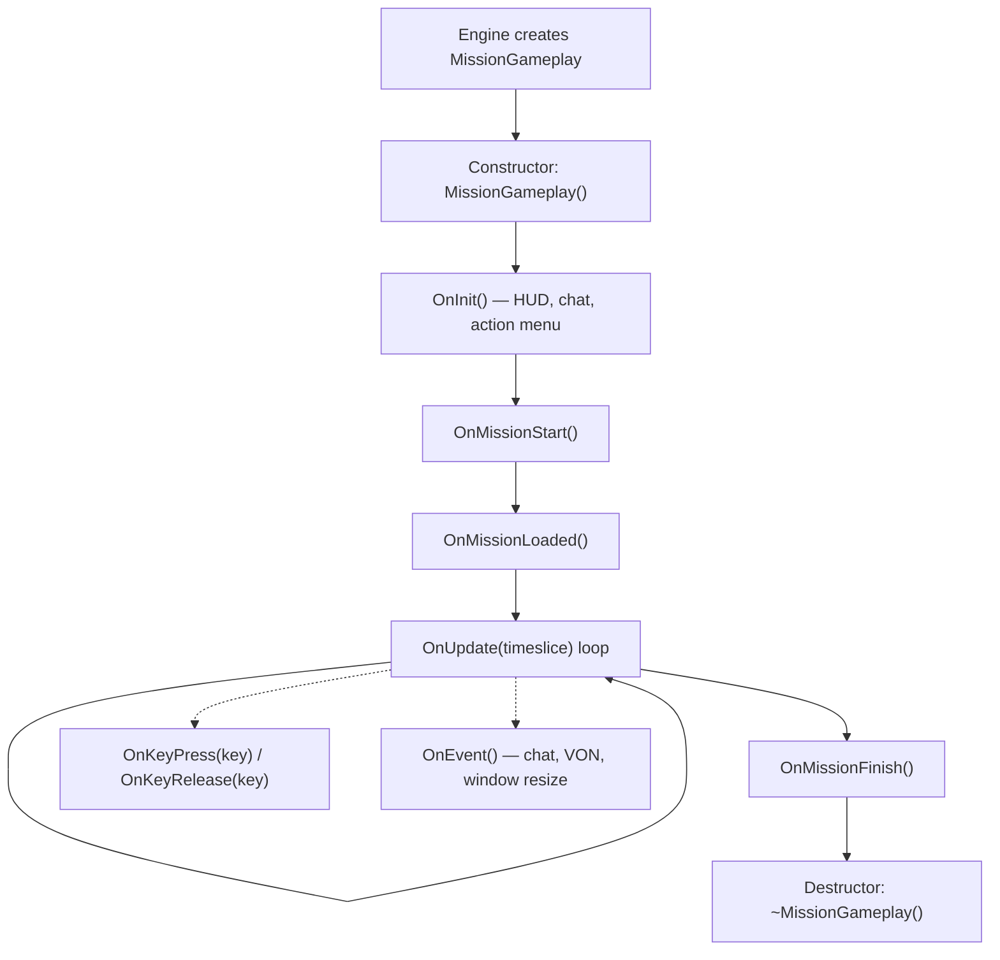
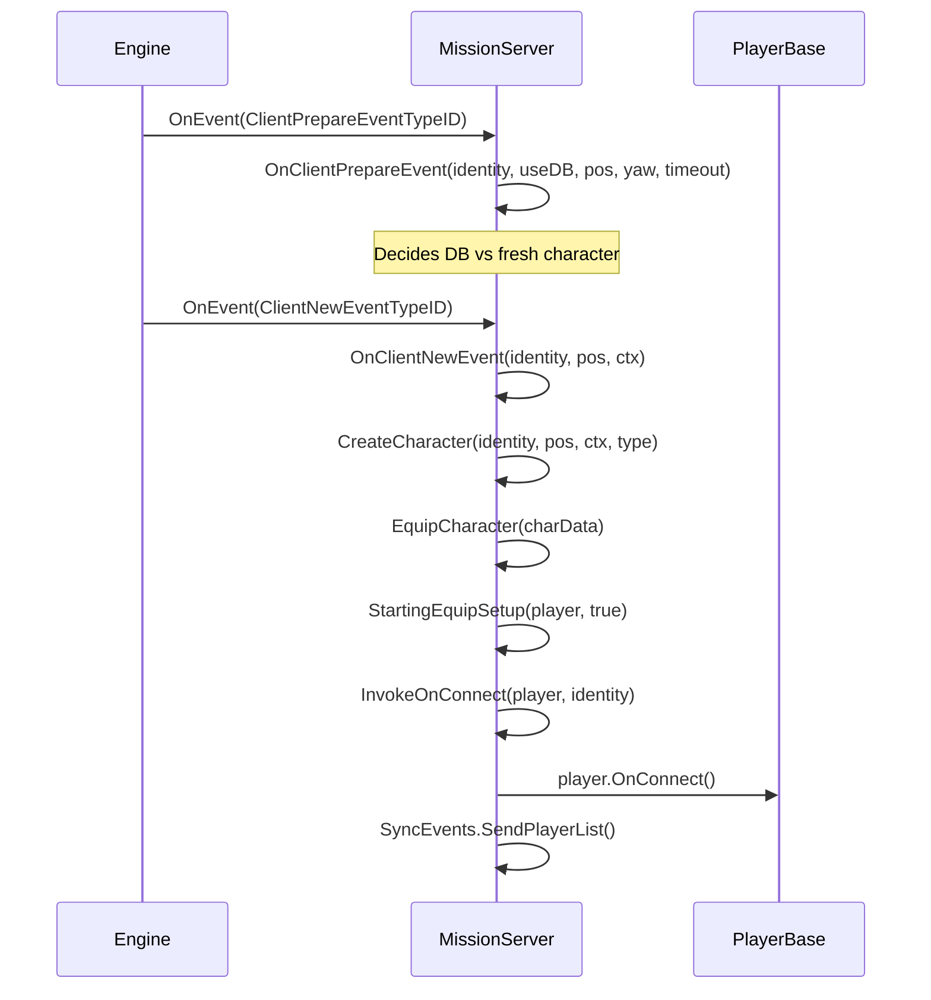
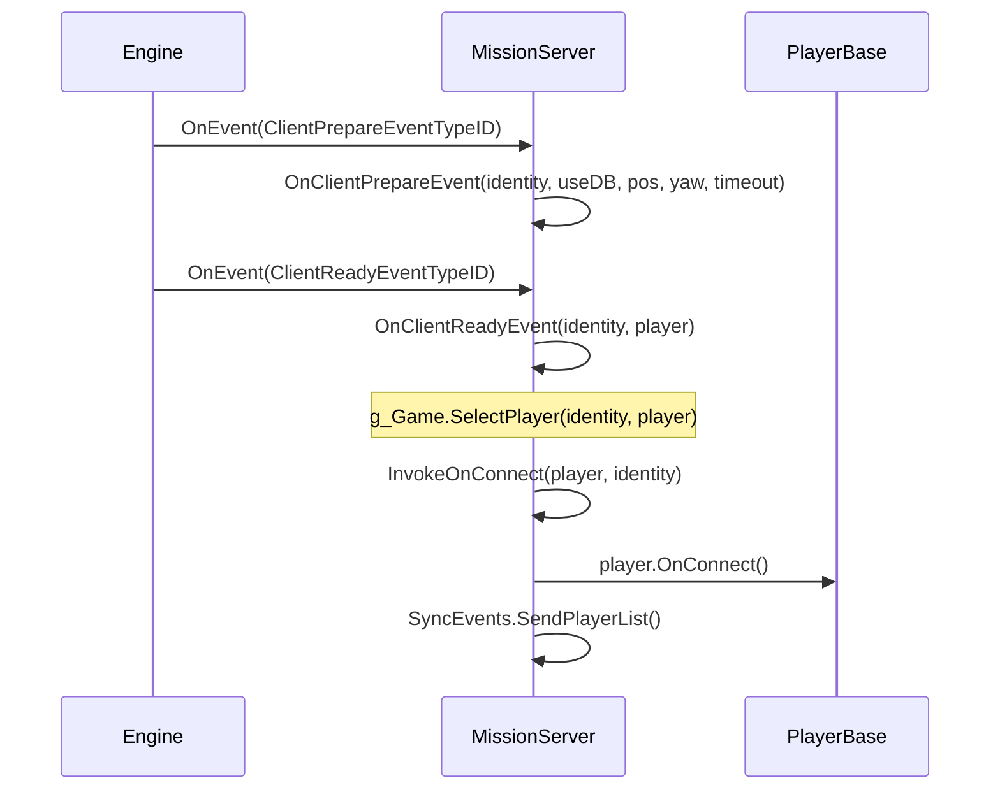
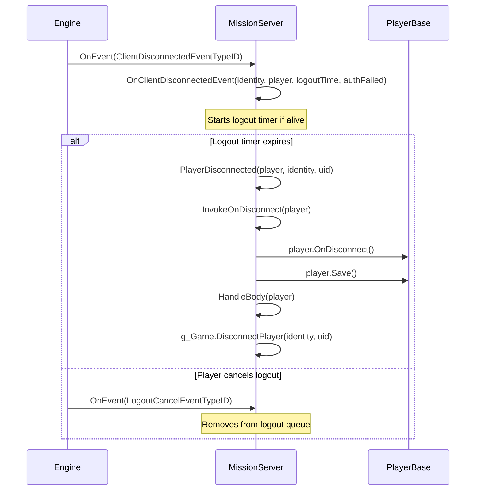

# Chapter 6.11: Mission Hooks

[Home](../README.md) | [<< Previous: Central Economy](10-central-economy.md) | **Mission Hooks** | [Next: Action System >>](12-action-system.md)

---

## Introduction

Every DayZ mod needs an entry point --- a place where it initializes managers, registers RPC handlers, hooks into player connections, and cleans up on shutdown. That entry point is the **Mission** class. The engine creates exactly one Mission instance when a scenario loads: `MissionServer` on a dedicated server, `MissionGameplay` on a client, or both on a listen server. These classes provide lifecycle hooks that fire in a guaranteed order, giving mods a reliable place to inject behavior.

This chapter covers the full Mission class hierarchy, every hookable method, the correct `modded class` pattern for extending them, and real-world examples from vanilla DayZ, COT, and Expansion.

---

## Class Hierarchy

```
Mission                      // 3_Game/gameplay.c (base, defines all hook signatures)
└── MissionBaseWorld         // 4_World/classes/missionbaseworld.c (minimal bridge)
    └── MissionBase          // 5_Mission/mission/missionbase.c (shared setup: HUD, menus, plugins)
        ├── MissionServer    // 5_Mission/mission/missionserver.c (server-side)
        └── MissionGameplay  // 5_Mission/mission/missiongameplay.c (client-side)
```

- **Mission** defines all hook signatures as empty methods: `OnInit()`, `OnUpdate()`, `OnEvent()`, `OnMissionStart()`, `OnMissionFinish()`, `OnKeyPress()`, `OnKeyRelease()`, etc.
- **MissionBase** initializes the plugin manager, widget event handler, world data, dynamic music, sound sets, and input device tracking. It is the common parent for both server and client.
- **MissionServer** handles player connections, disconnections, respawns, corpse management, tick scheduling, and artillery.
- **MissionGameplay** handles HUD creation, chat, action menus, voice-over-network UI, inventory, input exclusion, and client-side player scheduling.

---

## Lifecycle Overview

### MissionServer Lifecycle (Server-Side)



### MissionGameplay Lifecycle (Client-Side)



---

## Mission Base Class Methods

**File:** `3_Game/gameplay.c`

The `Mission` base class defines every hookable method. All are virtual with empty default implementations unless noted.

### Lifecycle Hooks

| Method | Signature | When It Fires |
|--------|-----------|---------------|
| `OnInit` | `void OnInit()` | After constructor, before mission starts. Primary setup point. |
| `OnMissionStart` | `void OnMissionStart()` | After OnInit. The mission world is active. |
| `OnMissionLoaded` | `void OnMissionLoaded()` | After OnMissionStart. All vanilla systems are initialized. |
| `OnGameplayDataHandlerLoad` | `void OnGameplayDataHandlerLoad()` | Server: after gameplay data (cfggameplay.json) is loaded. |
| `OnUpdate` | `void OnUpdate(float timeslice)` | Every frame. `timeslice` is seconds since last frame (typically 0.016-0.033). |
| `OnMissionFinish` | `void OnMissionFinish()` | On shutdown or disconnect. Clean up everything here. |

### Input Hooks (Client-Side)

| Method | Signature | When It Fires |
|--------|-----------|---------------|
| `OnKeyPress` | `void OnKeyPress(int key)` | Physical key pressed. `key` is a `KeyCode` constant. |
| `OnKeyRelease` | `void OnKeyRelease(int key)` | Physical key released. |
| `OnMouseButtonPress` | `void OnMouseButtonPress(int button)` | Mouse button pressed. |
| `OnMouseButtonRelease` | `void OnMouseButtonRelease(int button)` | Mouse button released. |

### Event Hook

| Method | Signature | When It Fires |
|--------|-----------|---------------|
| `OnEvent` | `void OnEvent(EventType eventTypeId, Param params)` | Engine events: chat, VON, player connect/disconnect, window resize, etc. |

### Utility Methods

| Method | Signature | Description |
|--------|-----------|-------------|
| `GetHud` | `Hud GetHud()` | Returns the HUD instance (client only). |
| `GetWorldData` | `WorldData GetWorldData()` | Returns world-specific data (temperature curves, etc.). |
| `IsPaused` | `bool IsPaused()` | Whether the game is paused (single player / listen server). |
| `IsServer` | `bool IsServer()` | `true` for MissionServer, `false` for MissionGameplay. |
| `IsMissionGameplay` | `bool IsMissionGameplay()` | `true` for MissionGameplay, `false` for MissionServer. |
| `PlayerControlEnable` | `void PlayerControlEnable(bool bForceSuppress)` | Re-enable player input after disabling. |
| `PlayerControlDisable` | `void PlayerControlDisable(int mode)` | Disable player input (e.g., `INPUT_EXCLUDE_ALL`). |
| `IsControlDisabled` | `bool IsControlDisabled()` | Whether player controls are currently disabled. |
| `GetControlDisabledMode` | `int GetControlDisabledMode()` | Returns the current input exclusion mode. |

---

## MissionServer Hooks (Server-Side)

**File:** `5_Mission/mission/missionserver.c`

MissionServer is instantiated by the engine on dedicated servers. It handles everything related to player lifecycle on the server.

### Key Vanilla Behavior

- **Constructor**: Sets up `CallQueue` for player stats (30-second interval), dead players array, logout tracking maps, rain procurement handler.
- **OnInit**: Loads `CfgGameplayHandler`, `PlayerSpawnHandler`, `CfgPlayerRestrictedAreaHandler`, `UndergroundAreaLoader`, artillery firing positions.
- **OnMissionStart**: Creates effect area zones (contaminated zones, etc.).
- **OnUpdate**: Runs tick scheduler, processes logout timers, updates base environment temperature, rain procurement, random artillery.

### OnEvent --- Player Connection Events

The server's `OnEvent` is the central dispatcher for all player lifecycle events. The engine sends events with typed `Param` objects. Vanilla handles them via a `switch` block:

| Event | Param Type | What Happens |
|-------|-----------|--------------|
| `ClientPrepareEventTypeID` | `ClientPrepareEventParams` | Decides DB vs fresh character |
| `ClientNewEventTypeID` | `ClientNewEventParams` | Creates + equips new character, calls `InvokeOnConnect` |
| `ClientReadyEventTypeID` | `ClientReadyEventParams` | Existing character loaded, calls `OnClientReadyEvent` + `InvokeOnConnect` |
| `ClientRespawnEventTypeID` | `ClientRespawnEventParams` | Player respawn request, kills old character if unconscious |
| `ClientReconnectEventTypeID` | `ClientReconnectEventParams` | Player reconnected to alive character |
| `ClientDisconnectedEventTypeID` | `ClientDisconnectedEventParams` | Player disconnecting, starts logout timer |
| `LogoutCancelEventTypeID` | `LogoutCancelEventParams` | Player cancelled logout countdown |

### Player Connection Methods

Called from within `OnEvent` when player-related events fire:

| Method | Signature | Vanilla Behavior |
|--------|-----------|-----------------|
| `InvokeOnConnect` | `void InvokeOnConnect(PlayerBase player, PlayerIdentity identity)` | Calls `player.OnConnect()`. Primary "player joined" hook. |
| `InvokeOnDisconnect` | `void InvokeOnDisconnect(PlayerBase player)` | Calls `player.OnDisconnect()`. Player fully disconnected. |
| `OnClientReadyEvent` | `void OnClientReadyEvent(PlayerIdentity identity, PlayerBase player)` | Calls `g_Game.SelectPlayer()`. Existing character loaded from DB. |
| `OnClientNewEvent` | `PlayerBase OnClientNewEvent(PlayerIdentity identity, vector pos, ParamsReadContext ctx)` | Creates + equips new character. Returns `PlayerBase`. |
| `OnClientRespawnEvent` | `void OnClientRespawnEvent(PlayerIdentity identity, PlayerBase player)` | Kills old character if unconscious/restrained. |
| `OnClientReconnectEvent` | `void OnClientReconnectEvent(PlayerIdentity identity, PlayerBase player)` | Calls `player.OnReconnect()`. |
| `PlayerDisconnected` | `void PlayerDisconnected(PlayerBase player, PlayerIdentity identity, string uid)` | Calls `InvokeOnDisconnect`, saves player, exits hive, handles body, removes from server. |

### Character Setup

| Method | Signature | Description |
|--------|-----------|-------------|
| `CreateCharacter` | `PlayerBase CreateCharacter(PlayerIdentity identity, vector pos, ParamsReadContext ctx, string characterName)` | Creates player entity via `g_Game.CreatePlayer()` + `g_Game.SelectPlayer()`. |
| `EquipCharacter` | `void EquipCharacter(MenuDefaultCharacterData char_data)` | Iterates attachment slots, randomizes if custom respawn disabled. Calls `StartingEquipSetup()`. |
| `StartingEquipSetup` | `void StartingEquipSetup(PlayerBase player, bool clothesChosen)` | **Empty in vanilla** --- your entry point for starter kits. |

---

## MissionGameplay Hooks (Client-Side)

**File:** `5_Mission/mission/missiongameplay.c`

MissionGameplay is instantiated on the client when connecting to a server or starting single player. It manages all client-side UI and input.

### Key Vanilla Behavior

- **Constructor**: Destroys existing menus, creates Chat, ActionMenu, IngameHud, VoN state, fade timers, SyncEvents registration.
- **OnInit**: Guards against double init with `m_Initialized`. Creates HUD root widget from `"gui/layouts/day_z_hud.layout"`, chat widget, action menu, microphone icon, VoN voice level widgets, chat channel area. Calls `PPEffects.Init()` and `MapMarkerTypes.Init()`.
- **OnMissionStart**: Hides cursor, sets mission state to `MISSION_STATE_GAME`, loads effect areas in singleplayer.
- **OnUpdate**: Tick scheduler for local player, hologram updates, radial quickbar (console), gesture menu, input handling for inventory/chat/VoN, debug monitor, pause behavior.
- **OnMissionFinish**: Hides dialog, destroys all menus and chat, deletes HUD root widget, stops all PPE effects, re-enables all inputs, sets mission state to `MISSION_STATE_FINNISH`.

### Input Hooks

```c
override void OnKeyPress(int key)
{
    super.OnKeyPress(key);
    // Vanilla forwards to Hud.KeyPress(key)
    // key values are KeyCode constants (e.g., KeyCode.KC_F1 = 59)
}

override void OnKeyRelease(int key)
{
    super.OnKeyRelease(key);
}
```

### Event Hook

Vanilla `MissionGameplay.OnEvent()` handles `ChatMessageEventTypeID` (adds to chat widget), `ChatChannelEventTypeID` (updates channel indicator), `WindowsResizeEventTypeID` (rebuilds menus/HUD), `SetFreeCameraEventTypeID` (debug camera), and `VONStateEventTypeID` (voice state). Override it with the same `switch` pattern and always call `super.OnEvent()`.

### Input Control

`PlayerControlDisable(int mode)` activates an input exclude group (e.g., `INPUT_EXCLUDE_ALL`, `INPUT_EXCLUDE_INVENTORY`). `PlayerControlEnable(bool bForceSuppress)` removes it. These map to exclude groups defined in `specific.xml`. Override them if your mod needs custom input exclusion behavior (as Expansion does for its menus).

---

## Server-Side Event Flow: Player Joins

Understanding the exact sequence of events when a player connects is critical for knowing where to hook your code.

### New Character (First Join or After Death)



### Existing Character (Reconnect After Disconnect)



### Player Disconnect



---

## How to Hook: The modded class Pattern

The correct way to extend Mission classes is the `modded class` pattern. This uses Enforce Script's class inheritance mechanism where `modded class` extends the existing class without replacing it, allowing multiple mods to coexist.

### Basic Server Hook

```c
// Your mod: Scripts/5_Mission/YourMod/MissionServer.c
modded class MissionServer
{
    ref MyServerManager m_MyManager;

    override void OnInit()
    {
        super.OnInit();  // ALWAYS call super first

        m_MyManager = new MyServerManager();
        m_MyManager.Init();
        Print("[MyMod] Server manager initialized");
    }

    override void OnMissionFinish()
    {
        if (m_MyManager)
        {
            m_MyManager.Cleanup();
            m_MyManager = null;
        }

        super.OnMissionFinish();  // Call super (before or after your cleanup)
    }
}
```

### Basic Client Hook

```c
// Your mod: Scripts/5_Mission/YourMod/MissionGameplay.c
modded class MissionGameplay
{
    ref MyHudWidget m_MyHud;

    override void OnInit()
    {
        super.OnInit();  // ALWAYS call super first

        // Create custom HUD elements
        m_MyHud = new MyHudWidget();
        m_MyHud.Init();
    }

    override void OnUpdate(float timeslice)
    {
        super.OnUpdate(timeslice);

        // Update custom HUD every frame
        if (m_MyHud)
        {
            m_MyHud.Update(timeslice);
        }
    }

    override void OnMissionFinish()
    {
        if (m_MyHud)
        {
            m_MyHud.Destroy();
            m_MyHud = null;
        }

        super.OnMissionFinish();
    }
}
```

### Hooking Player Connection

```c
modded class MissionServer
{
    override void InvokeOnConnect(PlayerBase player, PlayerIdentity identity)
    {
        super.InvokeOnConnect(player, identity);

        // Your code runs AFTER vanilla and all earlier mods
        if (player && identity)
        {
            string uid = identity.GetId();
            string name = identity.GetName();
            Print("[MyMod] Player connected: " + name + " (" + uid + ")");

            // Load player data, send settings, etc.
            MyPlayerData.Load(uid);
        }
    }

    override void InvokeOnDisconnect(PlayerBase player)
    {
        // Save data BEFORE super (player may be deleted after)
        if (player && player.GetIdentity())
        {
            string uid = player.GetIdentity().GetId();
            MyPlayerData.Save(uid);
        }

        super.InvokeOnDisconnect(player);
    }
}
```

### Hooking Chat Messages (Server-Side OnEvent)

```c
modded class MissionServer
{
    override void OnEvent(EventType eventTypeId, Param params)
    {
        // Intercept BEFORE super to potentially block events
        if (eventTypeId == ClientNewEventTypeID)
        {
            ClientNewEventParams newParams;
            Class.CastTo(newParams, params);
            PlayerIdentity identity = newParams.param1;

            if (IsPlayerBanned(identity))
            {
                // Block the connection by not calling super
                return;
            }
        }

        super.OnEvent(eventTypeId, params);
    }
}
```

### Hooking Keyboard Input (Client-Side)

```c
modded class MissionGameplay
{
    override void OnKeyPress(int key)
    {
        super.OnKeyPress(key);

        // Open custom menu on F6
        if (key == KeyCode.KC_F6)
        {
            if (!GetGame().GetUIManager().GetMenu())
            {
                MyCustomMenu.Open();
            }
        }
    }
}
```

### Where to Register RPC Handlers

RPC handlers should be registered in `OnInit`, not in the constructor. By `OnInit` time, all script modules are loaded and the networking layer is ready.

```c
modded class MissionServer
{
    override void OnInit()
    {
        super.OnInit();

        // Register RPC handlers here
        GetDayZGame().Event_OnRPC.Insert(OnMyRPC);
    }

    override void OnMissionFinish()
    {
        GetDayZGame().Event_OnRPC.Remove(OnMyRPC);
        super.OnMissionFinish();
    }

    void OnMyRPC(PlayerIdentity sender, Object target, int rpc_type,
                 ParamsReadContext ctx)
    {
        // Handle your RPCs
    }
}
```

---

## Common Hooks by Purpose

| I want to... | Hook this method | On which class |
|--------------|------------------|----------------|
| Initialize my mod on server | `OnInit()` | `MissionServer` |
| Initialize my mod on client | `OnInit()` | `MissionGameplay` |
| Run code every frame (server) | `OnUpdate(float timeslice)` | `MissionServer` |
| Run code every frame (client) | `OnUpdate(float timeslice)` | `MissionGameplay` |
| React to player join | `InvokeOnConnect(player, identity)` | `MissionServer` |
| React to player leave | `InvokeOnDisconnect(player)` | `MissionServer` |
| Send initial data to new client | `OnClientReadyEvent(identity, player)` | `MissionServer` |
| React to new character spawn | `OnClientNewEvent(identity, pos, ctx)` | `MissionServer` |
| Give starter equipment | `StartingEquipSetup(player, clothesChosen)` | `MissionServer` |
| React to player respawn | `OnClientRespawnEvent(identity, player)` | `MissionServer` |
| React to player reconnect | `OnClientReconnectEvent(identity, player)` | `MissionServer` |
| Handle disconnect/logout logic | `OnClientDisconnectedEvent(identity, player, logoutTime, authFailed)` | `MissionServer` |
| Intercept server events (connect, chat) | `OnEvent(eventTypeId, params)` | `MissionServer` |
| Intercept client events (chat, VON) | `OnEvent(eventTypeId, params)` | `MissionGameplay` |
| Handle keyboard input | `OnKeyPress(key)` / `OnKeyRelease(key)` | `MissionGameplay` |
| Create HUD elements | `OnInit()` | `MissionGameplay` |
| Clean up on server shutdown | `OnMissionFinish()` | `MissionServer` |
| Clean up on client disconnect | `OnMissionFinish()` | `MissionGameplay` |
| Run code once after all systems loaded | `OnMissionLoaded()` | Either |
| Disable/enable player input | `PlayerControlDisable(mode)` / `PlayerControlEnable(bForceSuppress)` | `MissionGameplay` |

---

## Server vs Client: Which Hooks Fire Where

| Hook | Server | Client | Notes |
|------|--------|--------|-------|
| Constructor | Yes | Yes | Different class on each side |
| `OnInit()` | Yes | Yes | |
| `OnMissionStart()` | Yes | Yes | |
| `OnMissionLoaded()` | Yes | Yes | |
| `OnGameplayDataHandlerLoad()` | Yes | No | cfggameplay.json loaded |
| `OnUpdate(timeslice)` | Yes | Yes | Both run their own frame loop |
| `OnMissionFinish()` | Yes | Yes | |
| `OnEvent()` | Yes | Yes | Different event types on each side |
| `InvokeOnConnect()` | Yes | No | Server only |
| `InvokeOnDisconnect()` | Yes | No | Server only |
| `OnClientReadyEvent()` | Yes | No | Server only |
| `OnClientNewEvent()` | Yes | No | Server only |
| `OnClientRespawnEvent()` | Yes | No | Server only |
| `OnClientReconnectEvent()` | Yes | No | Server only |
| `OnClientDisconnectedEvent()` | Yes | No | Server only |
| `PlayerDisconnected()` | Yes | No | Server only |
| `StartingEquipSetup()` | Yes | No | Server only |
| `EquipCharacter()` | Yes | No | Server only |
| `OnKeyPress()` | No | Yes | Client only |
| `OnKeyRelease()` | No | Yes | Client only |
| `OnMouseButtonPress()` | No | Yes | Client only |
| `OnMouseButtonRelease()` | No | Yes | Client only |
| `PlayerControlDisable()` | No | Yes | Client only |
| `PlayerControlEnable()` | No | Yes | Client only |

---

## EventType Constants Reference

All event constants are defined in `3_Game/gameplay.c` and dispatched through `OnEvent()`.

| Constant | Side | Description |
|----------|------|-------------|
| `ClientPrepareEventTypeID` | Server | Player identity received, decide DB vs fresh |
| `ClientNewEventTypeID` | Server | New character being created |
| `ClientReadyEventTypeID` | Server | Existing character loaded from DB |
| `ClientRespawnEventTypeID` | Server | Player requested respawn |
| `ClientReconnectEventTypeID` | Server | Player reconnected to alive character |
| `ClientDisconnectedEventTypeID` | Server | Player disconnecting |
| `LogoutCancelEventTypeID` | Server | Player cancelled logout countdown |
| `ChatMessageEventTypeID` | Client | Chat message received (`ChatMessageEventParams`) |
| `ChatChannelEventTypeID` | Client | Chat channel changed (`ChatChannelEventParams`) |
| `VONStateEventTypeID` | Client | Voice-over-network state changed |
| `VONStartSpeakingEventTypeID` | Client | Player started speaking |
| `VONStopSpeakingEventTypeID` | Client | Player stopped speaking |
| `MPSessionStartEventTypeID` | Both | Multiplayer session started |
| `MPSessionEndEventTypeID` | Both | Multiplayer session ended |
| `MPConnectionLostEventTypeID` | Client | Connection to server lost |
| `PlayerDeathEventTypeID` | Both | Player died |
| `SetFreeCameraEventTypeID` | Client | Free camera toggled (debug) |

---

## Real-World Examples

### Example 1: Server Manager Initialization

A typical pattern for initializing a server-side manager that needs to run periodic tasks.

```c
modded class MissionServer
{
    ref MyTraderManager m_TraderManager;
    float m_TraderUpdateTimer;
    const float TRADER_UPDATE_INTERVAL = 5.0; // seconds

    override void OnInit()
    {
        super.OnInit();

        m_TraderManager = new MyTraderManager();
        m_TraderManager.LoadConfig();
        m_TraderManager.SpawnTraders();
        m_TraderUpdateTimer = 0;

        Print("[MyMod] Trader manager initialized");
    }

    override void OnUpdate(float timeslice)
    {
        super.OnUpdate(timeslice);

        // Frame-limit the trader update to every 5 seconds
        m_TraderUpdateTimer += timeslice;
        if (m_TraderUpdateTimer >= TRADER_UPDATE_INTERVAL)
        {
            m_TraderUpdateTimer = 0;
            m_TraderManager.Update();
        }
    }

    override void OnMissionFinish()
    {
        if (m_TraderManager)
        {
            m_TraderManager.SaveState();
            m_TraderManager.DespawnTraders();
            m_TraderManager = null;
        }

        super.OnMissionFinish();
    }
}
```

### Example 2: Player Data Loading on Connect

```c
modded class MissionServer
{
    override void InvokeOnConnect(PlayerBase player, PlayerIdentity identity)
    {
        super.InvokeOnConnect(player, identity);
        if (!player || !identity)
            return;

        string uid = identity.GetId();
        string path = "$profile:MyMod/Players/" + uid + ".json";
        ref MyPlayerStats stats = new MyPlayerStats();

        if (FileExist(path))
            JsonFileLoader<MyPlayerStats>.JsonLoadFile(path, stats);
        else
            stats.SetDefaults();

        player.m_MyStats = stats;

        // Send initial data to client
        ScriptRPC rpc = new ScriptRPC();
        rpc.Write(stats.GetKills());
        rpc.Write(stats.GetDeaths());
        rpc.Send(player, MY_RPC_SYNC_STATS, true, identity);
    }

    override void InvokeOnDisconnect(PlayerBase player)
    {
        if (player && player.GetIdentity() && player.m_MyStats)
        {
            string path = "$profile:MyMod/Players/" + player.GetIdentity().GetId() + ".json";
            JsonFileLoader<MyPlayerStats>.JsonSaveFile(path, player.m_MyStats);
        }
        super.InvokeOnDisconnect(player);
    }
}
```

### Example 3: Client HUD Creation

Creating a custom HUD element that updates every frame.

```c
modded class MissionGameplay
{
    ref Widget m_MyHudRoot;
    ref TextWidget m_MyStatusText;
    float m_HudUpdateTimer;

    override void OnInit()
    {
        super.OnInit();

        // Create HUD from layout file
        m_MyHudRoot = GetGame().GetWorkspace().CreateWidgets(
            "MyMod/gui/layouts/my_hud.layout"
        );

        if (m_MyHudRoot)
        {
            m_MyStatusText = TextWidget.Cast(
                m_MyHudRoot.FindAnyWidget("StatusText")
            );
            m_MyHudRoot.Show(true);
        }

        m_HudUpdateTimer = 0;
    }

    override void OnUpdate(float timeslice)
    {
        super.OnUpdate(timeslice);

        // Update HUD text twice per second, not every frame
        m_HudUpdateTimer += timeslice;
        if (m_HudUpdateTimer >= 0.5)
        {
            m_HudUpdateTimer = 0;
            UpdateMyHud();
        }
    }

    void UpdateMyHud()
    {
        PlayerBase player = PlayerBase.Cast(GetGame().GetPlayer());
        if (!player || !m_MyStatusText)
            return;

        string status = "Health: " + player.GetHealth("", "").ToString();
        m_MyStatusText.SetText(status);
    }

    override void OnMissionFinish()
    {
        if (m_MyHudRoot)
        {
            m_MyHudRoot.Unlink();
            m_MyHudRoot = null;
        }

        super.OnMissionFinish();
    }
}
```

### Example 4: Chat Command Interception (Server-Side)

Intercepting player connections to implement a ban system. This pattern is used by COT.

```c
modded class MissionServer
{
    override void OnEvent(EventType eventTypeId, Param params)
    {
        // Check bans BEFORE super processes the connection
        if (eventTypeId == ClientNewEventTypeID)
        {
            ClientNewEventParams newParams;
            Class.CastTo(newParams, params);
            PlayerIdentity identity = newParams.param1;

            if (identity && IsBanned(identity.GetId()))
            {
                Print("[MyMod] Blocked banned player: " + identity.GetId());
                // Do not call super --- connection is blocked
                return;
            }
        }

        super.OnEvent(eventTypeId, params);
    }

    bool IsBanned(string uid)
    {
        string path = "$profile:MyMod/Bans/" + uid + ".json";
        return FileExist(path);
    }
}
```

### Example 5: Starter Kit via StartingEquipSetup

The cleanest way to give new players equipment without touching `OnClientNewEvent`.

```c
modded class MissionServer
{
    override void StartingEquipSetup(PlayerBase player, bool clothesChosen)
    {
        super.StartingEquipSetup(player, clothesChosen);

        if (!player)
            return;

        // Give every new character a knife and bandage
        EntityAI knife = player.GetInventory().CreateInInventory("KitchenKnife");
        EntityAI bandage = player.GetInventory().CreateInInventory("BandageDressing");

        // Give food in their backpack (if they have one)
        EntityAI backpack = player.FindAttachmentBySlotName("Back");
        if (backpack)
        {
            backpack.GetInventory().CreateInInventory("SardinesCan");
            backpack.GetInventory().CreateInInventory("Canteen");
        }
    }
}
```

### Pattern: Delegate to a Central Manager

Both COT and Expansion follow the same pattern: their mission hooks are thin wrappers that delegate to a singleton manager. COT creates `g_cotBase = new CommunityOnlineTools` in the constructor, then calls `g_cotBase.OnStart()` / `OnUpdate()` / `OnFinish()` from the corresponding hooks. Expansion does the same with `GetDayZExpansion().OnStart()` / `OnLoaded()` / `OnFinish()`. Your mod should follow this pattern --- keep mission hook code thin and push logic into dedicated manager classes.

---

## OnInit vs OnMissionStart vs OnMissionLoaded

| Hook | When | Use For |
|------|------|---------|
| `OnInit()` | First. Script modules loaded, world not yet active. | Creating managers, registering RPCs, loading configs. |
| `OnMissionStart()` | Second. World is active, entities can be spawned. | Spawning entities, starting gameplay systems, creating triggers. |
| `OnMissionLoaded()` | Third. All vanilla systems fully initialized. | Cross-mod queries, finalization that depends on everything being ready. |

Always call `super` on all three. Use `OnInit` as your primary initialization point. Use `OnMissionLoaded` only when you need to guarantee other mods have already initialized.

---

## Accessing the Current Mission

```c
Mission mission = GetGame().GetMission();                                    // Base class
MissionServer serverMission = MissionServer.Cast(GetGame().GetMission());   // Server cast
MissionGameplay clientMission = MissionGameplay.Cast(GetGame().GetMission()); // Client cast
PlayerBase player = PlayerBase.Cast(GetGame().GetPlayer());                  // CLIENT ONLY (null on server)
```

---

## Common Mistakes

### 1. Forgetting super.OnInit()

Every `override` **must** call `super`. Forgetting it breaks vanilla and every other mod in the chain. This is the single most common modding mistake.

```c
// WRONG                                    // CORRECT
override void OnInit()                      override void OnInit()
{                                           {
    m_MyManager = new MyManager();              super.OnInit();  // Always first!
}                                               m_MyManager = new MyManager();
                                            }
```

### 2. Using GetGame().GetPlayer() on the Server

`GetGame().GetPlayer()` is **always null** on a dedicated server. There is no "local" player. Use `GetGame().GetPlayers(array)` to iterate all connected players.

```c
// CORRECT way to iterate players on server
array<Man> players = new array<Man>();
GetGame().GetPlayers(players);
foreach (Man man : players)
{
    PlayerBase player = PlayerBase.Cast(man);
    if (player) { /* process */ }
}
```

### 3. Not Cleaning Up in OnMissionFinish

Always clean up widgets, callbacks, and references in `OnMissionFinish()`. Without cleanup, widgets leak into the next mission load (client), and stale references persist across server restarts.

```c
override void OnMissionFinish()
{
    if (m_MyWidget) { m_MyWidget.Unlink(); m_MyWidget = null; }
    super.OnMissionFinish();
}
```

### 4. OnUpdate Without Frame Limiting

`OnUpdate` fires every frame (15-60+ FPS). Use a timer accumulator for any non-trivial work.

```c
m_Timer += timeslice;
if (m_Timer >= 10.0)  // Every 10 seconds
{
    m_Timer = 0;
    DoExpensiveWork();
}
```

### 5. Registering RPCs in the Constructor

The constructor runs before all script modules are loaded. Register callbacks in `OnInit()` (earliest safe point) and unregister in `OnMissionFinish()`.

### 6. Accessing Identity on a Disconnecting Player

`player.GetIdentity()` can return `null` during disconnect. Always null-check both `player` and `identity` before accessing.

```c
override void InvokeOnDisconnect(PlayerBase player)
{
    if (player)
    {
        PlayerIdentity identity = player.GetIdentity();
        if (identity)
            Print("[MyMod] Disconnected: " + identity.GetId());
    }
    super.InvokeOnDisconnect(player);
}
```

---

## Summary

| Concept | Key Point |
|---------|-----------|
| Mission hierarchy | `Mission` > `MissionBaseWorld` > `MissionBase` > `MissionServer` / `MissionGameplay` |
| Server class | `MissionServer` --- handles player connections, spawns, tick scheduling |
| Client class | `MissionGameplay` --- handles HUD, input, chat, menus |
| Lifecycle order | Constructor > `OnInit()` > `OnMissionStart()` > `OnMissionLoaded()` > `OnUpdate()` loop > `OnMissionFinish()` > Destructor |
| Player join (server) | `OnEvent(ClientNewEventTypeID/ClientReadyEventTypeID)` > `InvokeOnConnect()` |
| Player leave (server) | `OnEvent(ClientDisconnectedEventTypeID)` > `PlayerDisconnected()` > `InvokeOnDisconnect()` |
| Hooking pattern | `modded class MissionServer/MissionGameplay` with `override` and `super` calls |
| Input handling | `OnKeyPress(key)` / `OnKeyRelease(key)` on `MissionGameplay` (client only) |
| Event handling | `OnEvent(EventType, Param)` on both sides, different event types per side |
| super calls | **Always call super** on every override, or you break the entire mod chain |
| Cleanup | **Always clean up** in `OnMissionFinish()` --- remove RPC handlers, destroy widgets, null references |
| Frame limiting | Use timer accumulators in `OnUpdate()` for any non-trivial work |
| GetPlayer() | Only works on client; always returns `null` on dedicated server |
| RPC registration | Register in `OnInit()`, not constructor; unregister in `OnMissionFinish()` |

---

## Best Practices

- **Always call `super` as the first line in every Mission override.** This is the single most common DayZ modding mistake. Forgetting `super.OnInit()` silently breaks vanilla initialization and every other mod in the chain.
- **Keep mission hook code thin --- delegate to manager classes.** Create a singleton manager (e.g., `MyModManager`) and call `manager.Init()` / `manager.Update()` / `manager.Cleanup()` from the hooks. This mirrors the pattern used by COT and Expansion.
- **Use timer accumulators in `OnUpdate()` for any work that does not need to run every frame.** `OnUpdate` fires 15-60+ times per second. Running database queries, file I/O, or player iteration at frame rate wastes server CPU.
- **Register RPCs and event handlers in `OnInit()`, not in the constructor.** The constructor runs before all script modules are loaded. The networking layer is not ready until `OnInit()`.
- **Always clean up in `OnMissionFinish()`.** Destroy widgets, remove `CallLater` registrations, unregister RPC handlers, and null manager references. Failure to clean up causes stale references across mission reloads.

---

## Compatibility & Impact

> **Mod Compatibility:** `MissionServer` and `MissionGameplay` are the two most commonly modded classes in DayZ. Every mod that has server logic or client UI hooks into them.

- **Load Order:** The last-loaded mod's `modded class` override runs outermost in the call chain. If a mod forgets `super`, it silently blocks all mods loaded before it. This is the #1 cause of multi-mod incompatibility.
- **Modded Class Conflicts:** `InvokeOnConnect`, `InvokeOnDisconnect`, `OnInit`, `OnUpdate`, and `OnMissionFinish` are the most contested override points. Conflicts are rare as long as every mod calls `super`.
- **Performance Impact:** Heavy logic in `OnUpdate()` without frame limiting directly reduces server/client FPS. A single mod doing `GetGame().GetPlayers()` iteration every frame on a 60-player server adds measurable overhead.
- **Server/Client:** `MissionServer` hooks only fire on dedicated servers. `MissionGameplay` hooks only fire on clients. On a listen server, both classes exist. `GetGame().GetPlayer()` is always null on dedicated servers.

---

## Observed in Real Mods

> These patterns were confirmed by studying the source code of professional DayZ mods.

| Pattern | Mod | File/Location |
|---------|-----|---------------|
| Thin `modded class MissionServer.OnInit()` delegating to singleton manager | COT | `CommunityOnlineTools` init in MissionServer |
| `InvokeOnConnect` override to load per-player JSON data | Expansion | Player settings sync on connect |
| `StartingEquipSetup` override for custom starter kits | Multiple community mods | MissionServer starter kit hooks |
| `OnEvent` interception before `super` to block banned players | COT | Ban system in MissionServer |
| `OnMissionFinish` cleanup with widget `Unlink()` and null assignments | Expansion | HUD and menu cleanup |

---

[Home](../README.md) | [<< Previous: Central Economy](10-central-economy.md) | **Mission Hooks** | [Next: Action System >>](12-action-system.md)
