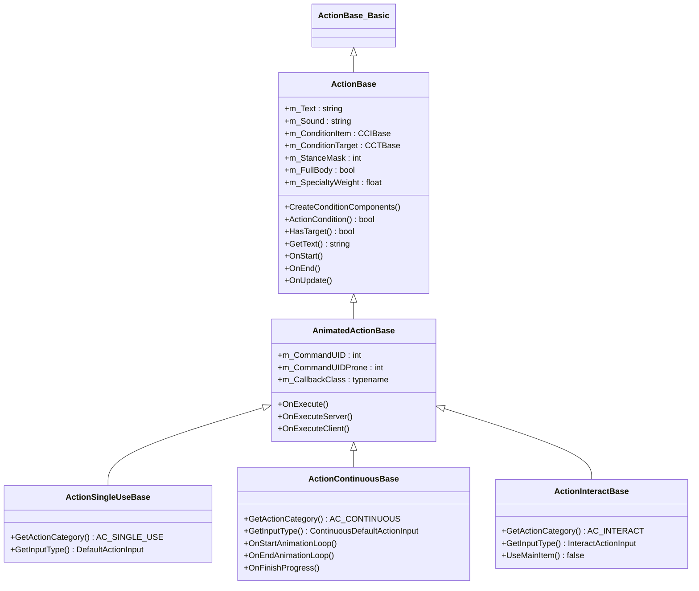
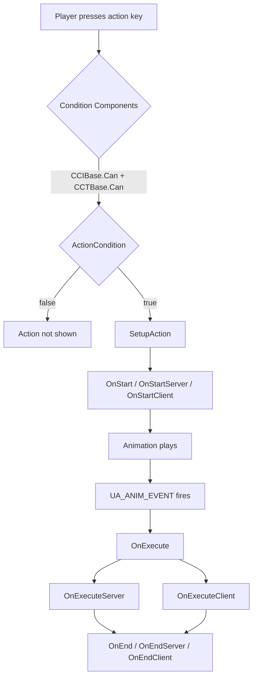
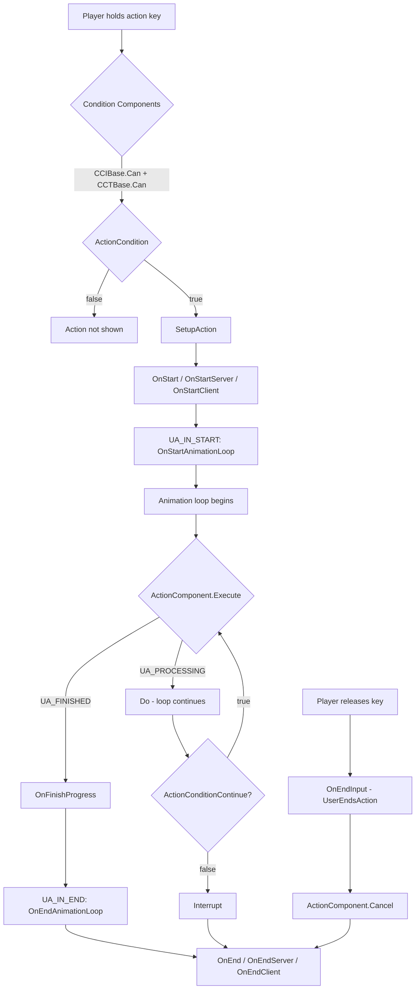
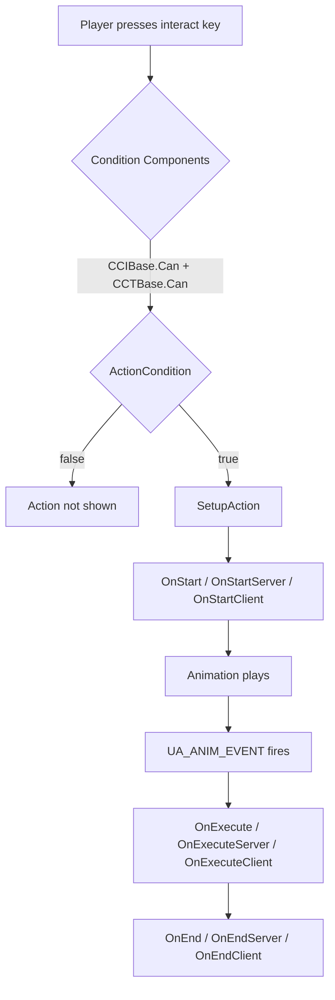

# Chapter 6.12: Action System

[Home](../README.md) | [<< Previous: Mission Hooks](11-mission-hooks.md) | **Action System** | [Next: Input System >>](13-input-system.md)

---

## Introduction

The Action System is how DayZ handles all player interactions with items and the world. Every time a player eats food, opens a door, bandages a wound, repairs a wall, or turns on a flashlight, the engine runs through the action pipeline. Understanding this pipeline --- from condition checks to animation callbacks to server execution --- is fundamental to creating any interactive gameplay mod.

The system lives primarily in `4_World/classes/useractionscomponent/` and is built around three pillars:

1. **Action classes** that define what happens (logic, conditions, animations)
2. **Condition components** that gate when an action can appear (distance, item state, target type)
3. **Action components** that control how the action progresses (time, quantity, repeating cycles)

This chapter covers the full API, class hierarchy, lifecycle, and practical patterns for creating custom actions.

---

## Class Hierarchy

```
ActionBase_Basic                         // 3_Game — empty shell, compilation anchor
└── ActionBase                           // 4_World — core logic, conditions, events
    └── AnimatedActionBase               // 4_World — animation callbacks, OnExecute
        ├── ActionSingleUseBase          // instant actions (eat pill, turn on light)
        ├── ActionContinuousBase         // progress bar actions (bandage, repair, eat)
        └── ActionInteractBase           // world interactions (open door, toggle switch)
```



### Key Differences Between Action Types

| Property | SingleUse | Continuous | Interact |
|----------|-----------|------------|----------|
| Category constant | `AC_SINGLE_USE` | `AC_CONTINUOUS` | `AC_INTERACT` |
| Input type | `DefaultActionInput` | `ContinuousDefaultActionInput` | `InteractActionInput` |
| Progress bar | No | Yes | No |
| Uses main item | Yes | Yes | No (default) |
| Has target | Varies | Varies | Yes (default) |
| Typical use | Eat pill, toggle flashlight | Bandage, repair, eat food | Open door, turn on generator |
| Callback class | `ActionSingleUseBaseCB` | `ActionContinuousBaseCB` | `ActionInteractBaseCB` |

---

## Action Lifecycle

### State Constants

The action state machine uses these constants defined in `3_Game/constants.c`:

| Constant | Value | Meaning |
|----------|-------|---------|
| `UA_NONE` | 0 | No action running |
| `UA_PROCESSING` | 2 | Action in progress |
| `UA_FINISHED` | 4 | Action completed successfully |
| `UA_CANCEL` | 5 | Action cancelled by player |
| `UA_INTERRUPT` | 6 | Action interrupted externally |
| `UA_INITIALIZE` | 12 | Continuous action initializing |
| `UA_ERROR` | 24 | Error state --- action aborted |
| `UA_ANIM_EVENT` | 11 | Animation execute event fired |
| `UA_IN_START` | 17 | Animation loop start event |
| `UA_IN_END` | 18 | Animation loop end event |

### SingleUse Action Flow



### Continuous Action Flow



### Interact Action Flow



### Lifecycle Methods Reference

These methods are called in order during an action's lifetime. Override them in your custom actions:

| Method | Called on | Purpose |
|--------|-----------|---------|
| `CreateConditionComponents()` | Both | Set `m_ConditionItem` and `m_ConditionTarget` |
| `ActionCondition()` | Both | Custom validation (distance, state, type checks) |
| `ActionConditionContinue()` | Both | Continuous-only: re-checked each frame during progress |
| `SetupAction()` | Both | Internal: builds `ActionData`, reserves inventory |
| `OnStart()` | Both | Action begins (cancels placing if active) |
| `OnStartServer()` | Server | Server-side start logic |
| `OnStartClient()` | Client | Client-side start effects |
| `OnExecute()` | Both | Animation event fired --- main execution |
| `OnExecuteServer()` | Server | Server-side execution logic |
| `OnExecuteClient()` | Client | Client-side execution effects |
| `OnFinishProgress()` | Both | Continuous-only: one cycle completed |
| `OnFinishProgressServer()` | Server | Continuous-only: server cycle complete |
| `OnFinishProgressClient()` | Client | Continuous-only: client cycle complete |
| `OnStartAnimationLoop()` | Both | Continuous-only: loop animation begins |
| `OnEndAnimationLoop()` | Both | Continuous-only: loop animation ends |
| `OnEnd()` | Both | Action finished (success or cancel) |
| `OnEndServer()` | Server | Server-side cleanup |
| `OnEndClient()` | Client | Client-side cleanup |

---

## ActionData

Every running action carries an `ActionData` instance that holds the runtime context. This is passed to every lifecycle method:

```c
class ActionData
{
    ref ActionBase       m_Action;          // the action class being performed
    ItemBase             m_MainItem;        // item in player's hands (or null)
    ActionBaseCB         m_Callback;        // animation callback handler
    ref CABase           m_ActionComponent;  // progress component (time, quantity)
    int                  m_State;           // current state (UA_PROCESSING, etc.)
    ref ActionTarget     m_Target;          // target object + hit info
    PlayerBase           m_Player;          // player performing the action
    bool                 m_WasExecuted;     // true after OnExecute fires
    bool                 m_WasActionStarted; // true after action loop starts
}
```

You can extend `ActionData` for custom data. Override `CreateActionData()` in your action:

```c
class MyCustomActionData : ActionData
{
    int m_CustomValue;
}

class MyCustomAction : ActionContinuousBase
{
    override ActionData CreateActionData()
    {
        return new MyCustomActionData;
    }

    override void OnFinishProgressServer(ActionData action_data)
    {
        MyCustomActionData data = MyCustomActionData.Cast(action_data);
        data.m_CustomValue = data.m_CustomValue + 1;
        // ... use custom data
    }
}
```

---

## ActionTarget

The `ActionTarget` class represents what the player is aiming at:

**File:** `4_World/classes/useractionscomponent/actiontargets.c`

```c
class ActionTarget
{
    Object GetObject();         // the direct object under cursor (or proxy child)
    Object GetParent();         // parent object (if target is a proxy/attachment)
    bool   IsProxy();           // true if target has a parent
    int    GetComponentIndex(); // geometry component (named selection) index
    float  GetUtility();        // priority score
    vector GetCursorHitPos();   // exact world position of cursor hit
}
```

### How Targets Are Selected

The `ActionTargets` class runs each frame on the client, gathering potential targets:

1. **Raycast** from camera position along camera direction (`c_RayDistance`)
2. **Vicinity scan** for nearby objects around the player
3. For each candidate, the engine calls `GetActions()` on the object to find registered actions
4. Each action's condition components (`CCIBase.Can()`, `CCTBase.Can()`) and `ActionCondition()` are tested
5. Valid actions are ranked by utility and displayed in the HUD

---

## Condition Components

Every action has two condition components set in `CreateConditionComponents()`. These are checked **before** `ActionCondition()` and determine whether the action can appear in the player's HUD at all.

### Item Conditions (CCIBase)

Controls whether the item in the player's hand qualifies for this action.

**File:** `4_World/classes/useractionscomponent/itemconditioncomponents/`

| Class | Behavior |
|-------|----------|
| `CCINone` | Always passes --- no item requirement |
| `CCIDummy` | Passes if item is not null (item must exist) |
| `CCINonRuined` | Passes if item exists AND is not ruined |
| `CCINotPresent` | Passes if item is null (hands must be empty) |
| `CCINotRuinedAndEmpty` | Passes if item exists, not ruined, and not empty |

```c
// CCINone — no item needed, always true
class CCINone : CCIBase
{
    override bool Can(PlayerBase player, ItemBase item) { return true; }
    override bool CanContinue(PlayerBase player, ItemBase item) { return true; }
}

// CCINotPresent — hands must be empty
class CCINotPresent : CCIBase
{
    override bool Can(PlayerBase player, ItemBase item) { return !item; }
}

// CCINonRuined — item must exist and not be destroyed
class CCINonRuined : CCIBase
{
    override bool Can(PlayerBase player, ItemBase item)
    {
        return (item && !item.IsDamageDestroyed());
    }
}
```

### Target Conditions (CCTBase)

Controls whether the target object (what the player is looking at) qualifies.

**File:** `4_World/classes/useractionscomponent/targetconditionscomponents/`

| Class | Constructor | Behavior |
|-------|-------------|----------|
| `CCTNone` | `CCTNone()` | Always passes --- no target needed |
| `CCTDummy` | `CCTDummy()` | Passes if target object exists |
| `CCTSelf` | `CCTSelf()` | Passes if player exists and is alive |
| `CCTObject` | `CCTObject(float dist)` | Target object within distance |
| `CCTCursor` | `CCTCursor(float dist)` | Cursor hit position within distance |
| `CCTNonRuined` | `CCTNonRuined(float dist)` | Target within distance AND not ruined |
| `CCTCursorParent` | `CCTCursorParent(float dist)` | Cursor on parent object within distance |

Distance is measured from **both** the player's root position and head bone position (whichever is closer). The `CCTObject` check:

```c
class CCTObject : CCTBase
{
    protected float m_MaximalActionDistanceSq;

    void CCTObject(float maximal_target_distance = UAMaxDistances.DEFAULT)
    {
        m_MaximalActionDistanceSq = maximal_target_distance * maximal_target_distance;
    }

    override bool Can(PlayerBase player, ActionTarget target)
    {
        Object targetObject = target.GetObject();
        if (!targetObject || !player)
            return false;

        vector playerHeadPos;
        MiscGameplayFunctions.GetHeadBonePos(player, playerHeadPos);

        float distanceRoot = vector.DistanceSq(targetObject.GetPosition(), player.GetPosition());
        float distanceHead = vector.DistanceSq(targetObject.GetPosition(), playerHeadPos);

        return (distanceRoot <= m_MaximalActionDistanceSq || distanceHead <= m_MaximalActionDistanceSq);
    }
}
```

### Distance Constants

**File:** `4_World/classes/useractionscomponent/actions/actionconstants.c`

| Constant | Value (meters) | Typical use |
|----------|---------------|-------------|
| `UAMaxDistances.SMALL` | 1.3 | Close interactions, ladders |
| `UAMaxDistances.DEFAULT` | 2.0 | Standard actions |
| `UAMaxDistances.REPAIR` | 3.0 | Repair actions |
| `UAMaxDistances.LARGE` | 8.0 | Large area actions |
| `UAMaxDistances.BASEBUILDING` | 20.0 | Base building |
| `UAMaxDistances.EXPLOSIVE_REMOTE_ACTIVATION` | 100.0 | Remote detonation |

---

## Registering Actions on Items

Actions are registered on entities through the `SetActions()` / `AddAction()` / `RemoveAction()` pattern. The engine calls `GetActions()` on an entity to retrieve its action list; the first time this happens, `InitializeActions()` builds the map via `SetActions()`.

### On ItemBase (Inventory Items)

The most common pattern. Override `SetActions()` in a `modded class`:

```c
modded class MyCustomItem extends ItemBase
{
    override void SetActions()
    {
        super.SetActions();          // CRITICAL: keep all vanilla actions
        AddAction(MyCustomAction);   // add your action
    }
}
```

To remove a vanilla action and add your own replacement:

```c
modded class Bandage_Basic extends ItemBase
{
    override void SetActions()
    {
        super.SetActions();
        RemoveAction(ActionBandageTarget);       // remove vanilla
        AddAction(MyImprovedBandageAction);      // add replacement
    }
}
```

### On BuildingBase (World Buildings)

Buildings use the same pattern but through `BuildingBase`:

```c
// Vanilla example: Well registers water actions
class Well extends BuildingSuper
{
    override void SetActions()
    {
        super.SetActions();
        AddAction(ActionWashHandsWell);
        AddAction(ActionDrinkWellContinuous);
    }
}
```

### On PlayerBase (Player Actions)

Player-level actions (drinking from ponds, opening doors, etc.) are registered in `PlayerBase.SetActions()`. There are two signatures:

```c
// Modern approach (recommended) — uses InputActionMap parameter
void SetActions(out TInputActionMap InputActionMap)
{
    AddAction(ActionOpenDoors, InputActionMap);
    AddAction(ActionCloseDoors, InputActionMap);
    // ...
}

// Legacy approach (backwards compatibility) — not recommended
void SetActions()
{
    // ...
}
```

Player also has `SetActionsRemoteTarget()` for actions performed **on** a player by another player (CPR, checking pulse, etc.):

```c
void SetActionsRemoteTarget(out TInputActionMap InputActionMap)
{
    AddAction(ActionCPR, InputActionMap);
    AddAction(ActionCheckPulseTarget, InputActionMap);
}
```

### How the Registration System Works Internally

Each entity type maintains a static `TInputActionMap` (a `map<typename, ref array<ActionBase_Basic>>`) keyed by input type. When `AddAction()` is called:

1. The action singleton is fetched from `ActionManagerBase.GetAction()`
2. The action's input type is queried (`GetInputType()`)
3. The action is inserted into the array for that input type
4. At runtime, the engine queries all actions for the matching input type

This means actions are shared per **type** (class), not per instance. All items of the same class share the same action list.

---

## Creating a Custom Action --- Step by Step

### Example 1: Simple Single-Use Action

A custom action that instantly heals the player when they use a special item:

```c
// File: 4_World/actions/ActionHealInstant.c

class ActionHealInstant : ActionSingleUseBase
{
    void ActionHealInstant()
    {
        m_CommandUID = DayZPlayerConstants.CMD_ACTIONMOD_EAT_PILL;
        m_CommandUIDProne = DayZPlayerConstants.CMD_ACTIONFB_EAT_PILL;
        m_Text = "#heal";  // stringtable key, or plain text: "Heal"
    }

    override void CreateConditionComponents()
    {
        m_ConditionItem = new CCINonRuined;    // item must not be ruined
        m_ConditionTarget = new CCTSelf;       // self-action
    }

    override bool HasTarget()
    {
        return false;  // no external target needed
    }

    override bool HasProneException()
    {
        return true;  // allow different animation when prone
    }

    override bool ActionCondition(PlayerBase player, ActionTarget target, ItemBase item)
    {
        // Only show if player is actually hurt
        if (player.GetHealth("GlobalHealth", "Health") >= player.GetMaxHealth("GlobalHealth", "Health"))
            return false;

        return true;
    }

    override void OnExecuteServer(ActionData action_data)
    {
        // Heal the player on server
        PlayerBase player = action_data.m_Player;
        player.SetHealth("GlobalHealth", "Health", player.GetMaxHealth("GlobalHealth", "Health"));

        // Consume the item (reduce quantity by 1)
        ItemBase item = action_data.m_MainItem;
        if (item)
        {
            item.AddQuantity(-1);
        }
    }

    override void OnExecuteClient(ActionData action_data)
    {
        // Optional: play a client-side effect, sound, or notification
    }
}
```

Register it on an item:

```c
// File: 4_World/entities/HealingKit.c

modded class HealingKit extends ItemBase
{
    override void SetActions()
    {
        super.SetActions();
        AddAction(ActionHealInstant);
    }
}
```

### Example 2: Continuous Action with Progress Bar

A custom repair action that takes time and consumes item durability:

```c
// File: 4_World/actions/ActionRepairCustom.c

// Step 1: Define the callback with an action component
class ActionRepairCustomCB : ActionContinuousBaseCB
{
    override void CreateActionComponent()
    {
        // CAContinuousTime(seconds) — single progress bar that completes once
        m_ActionData.m_ActionComponent = new CAContinuousTime(UATimeSpent.DEFAULT_REPAIR_CYCLE);
    }
}

// Step 2: Define the action
class ActionRepairCustom : ActionContinuousBase
{
    void ActionRepairCustom()
    {
        m_CallbackClass = ActionRepairCustomCB;
        m_CommandUID = DayZPlayerConstants.CMD_ACTIONFB_ASSEMBLE;
        m_FullBody = true;  // full body animation (player cannot move)
        m_StanceMask = DayZPlayerConstants.STANCEMASK_ERECT;
        m_SpecialtyWeight = UASoftSkillsWeight.ROUGH_HIGH;
        m_Text = "#repair";
    }

    override void CreateConditionComponents()
    {
        m_ConditionItem = new CCINonRuined;
        m_ConditionTarget = new CCTObject(UAMaxDistances.REPAIR);
    }

    override bool ActionCondition(PlayerBase player, ActionTarget target, ItemBase item)
    {
        Object obj = target.GetObject();
        if (!obj)
            return false;

        // Only allow repairing damaged (but not ruined) objects
        EntityAI entity = EntityAI.Cast(obj);
        if (!entity)
            return false;

        float health = entity.GetHealth("", "Health");
        float maxHealth = entity.GetMaxHealth("", "Health");

        // Must be damaged but not ruined
        if (health >= maxHealth || entity.IsDamageDestroyed())
            return false;

        return true;
    }

    override void OnFinishProgressServer(ActionData action_data)
    {
        // Called when the progress bar completes
        Object target = action_data.m_Target.GetObject();
        if (target)
        {
            EntityAI entity = EntityAI.Cast(target);
            if (entity)
            {
                // Restore some health
                float currentHealth = entity.GetHealth("", "Health");
                entity.SetHealth("", "Health", currentHealth + 25);
            }
        }

        // Damage the tool
        action_data.m_MainItem.DecreaseHealth(UADamageApplied.REPAIR, false);
    }
}
```

### Example 3: Interact Action (World Object Toggle)

An interact action for toggling a custom device on/off:

```c
// File: 4_World/actions/ActionToggleMyDevice.c

class ActionToggleMyDevice : ActionInteractBase
{
    void ActionToggleMyDevice()
    {
        m_CommandUID = DayZPlayerConstants.CMD_ACTIONMOD_INTERACTONCE;
        m_StanceMask = DayZPlayerConstants.STANCEMASK_CROUCH | DayZPlayerConstants.STANCEMASK_ERECT;
        m_Text = "#switch_on";
    }

    override void CreateConditionComponents()
    {
        m_ConditionItem = new CCINone;     // no item needed in hands
        m_ConditionTarget = new CCTCursor(UAMaxDistances.DEFAULT);
    }

    override bool ActionCondition(PlayerBase player, ActionTarget target, ItemBase item)
    {
        Object obj = target.GetObject();
        if (!obj)
            return false;

        // Check if target is our custom device type
        MyCustomDevice device = MyCustomDevice.Cast(obj);
        if (!device)
            return false;

        // Update display text based on current state
        if (device.IsActive())
            m_Text = "#switch_off";
        else
            m_Text = "#switch_on";

        return true;
    }

    override void OnExecuteServer(ActionData action_data)
    {
        MyCustomDevice device = MyCustomDevice.Cast(action_data.m_Target.GetObject());
        if (device)
        {
            if (device.IsActive())
                device.Deactivate();
            else
                device.Activate();
        }
    }
}
```

Register it on the building/device:

```c
class MyCustomDevice extends BuildingBase
{
    override void SetActions()
    {
        super.SetActions();
        AddAction(ActionToggleMyDevice);
    }
}
```

### Example 4: Action with Specific Item Requirement

An action that requires the player to hold a specific tool type while targeting a specific object:

```c
class ActionUnlockWithKey : ActionInteractBase
{
    void ActionUnlockWithKey()
    {
        m_CommandUID = DayZPlayerConstants.CMD_ACTIONMOD_INTERACTONCE;
        m_Text = "Unlock";
    }

    override void CreateConditionComponents()
    {
        m_ConditionItem = new CCINonRuined;   // must hold a non-ruined item
        m_ConditionTarget = new CCTObject(UAMaxDistances.DEFAULT);
    }

    override bool UseMainItem()
    {
        return true;  // action requires an item in hand
    }

    override bool MainItemAlwaysInHands()
    {
        return true;  // item must be in hands, not just inventory
    }

    override bool ActionCondition(PlayerBase player, ActionTarget target, ItemBase item)
    {
        // Item must be a key
        if (!item || !item.IsInherited(MyKeyItem))
            return false;

        // Target must be a locked container
        MyLockedContainer container = MyLockedContainer.Cast(target.GetObject());
        if (!container || !container.IsLocked())
            return false;

        return true;
    }

    override void OnExecuteServer(ActionData action_data)
    {
        MyLockedContainer container = MyLockedContainer.Cast(action_data.m_Target.GetObject());
        if (container)
        {
            container.Unlock();
        }
    }
}
```

---

## Action Components (Progress Control)

Action components control _how_ the action progresses over time. They are created in the callback's `CreateActionComponent()` method.

**File:** `4_World/classes/useractionscomponent/actioncomponents/`

### Available Components

| Component | Parameters | Behavior |
|-----------|------------|----------|
| `CASingleUse` | none | Instant execution, no progress |
| `CAInteract` | none | Instant execution for interact actions |
| `CAContinuousTime` | `float time` | Progress bar, completes after `time` seconds |
| `CAContinuousRepeat` | `float time` | Repeating cycles, fires `OnFinishProgress` each cycle |
| `CAContinuousQuantity` | `float quantity, float time` | Consumes quantity over time |
| `CAContinuousQuantityEdible` | `float quantity, float time` | Like Quantity but applies food/drink modifiers |

### CAContinuousTime

Single progress bar that completes once:

```c
class MyActionCB : ActionContinuousBaseCB
{
    override void CreateActionComponent()
    {
        // 5-second progress bar
        m_ActionData.m_ActionComponent = new CAContinuousTime(UATimeSpent.DEFAULT_CONSTRUCT);
    }
}
```

### CAContinuousRepeat

Repeating cycles --- `OnFinishProgressServer()` is called each time a cycle completes, and the action continues until the player releases the key:

```c
class MyRepeatActionCB : ActionContinuousBaseCB
{
    override void CreateActionComponent()
    {
        // Each cycle takes 5 seconds, repeats until player stops
        m_ActionData.m_ActionComponent = new CAContinuousRepeat(UATimeSpent.DEFAULT_REPAIR_CYCLE);
    }
}
```

### Time Constants

**File:** `4_World/classes/useractionscomponent/actions/actionconstants.c`

| Constant | Value (seconds) | Use |
|----------|----------------|-----|
| `UATimeSpent.DEFAULT` | 1.0 | General |
| `UATimeSpent.DEFAULT_CONSTRUCT` | 5.0 | Construction |
| `UATimeSpent.DEFAULT_REPAIR_CYCLE` | 5.0 | Repair per cycle |
| `UATimeSpent.DEFAULT_DEPLOY` | 5.0 | Deploying items |
| `UATimeSpent.BANDAGE` | 4.0 | Bandaging |
| `UATimeSpent.RESTRAIN` | 10.0 | Restraining |
| `UATimeSpent.SHAVE` | 12.75 | Shaving |
| `UATimeSpent.SKIN` | 10.0 | Skinning animals |
| `UATimeSpent.DIG_STASH` | 10.0 | Digging stash |

---

## Vanilla Examples Annotated

### ActionOpenDoors (Interact)

**File:** `4_World/classes/useractionscomponent/actions/interact/actionopendoors.c`

```c
class ActionOpenDoors : ActionInteractBase
{
    void ActionOpenDoors()
    {
        m_CommandUID  = DayZPlayerConstants.CMD_ACTIONMOD_OPENDOORFW;
        m_StanceMask  = DayZPlayerConstants.STANCEMASK_CROUCH | DayZPlayerConstants.STANCEMASK_ERECT;
        m_Text        = "#open";   // stringtable reference
    }

    override void CreateConditionComponents()
    {
        m_ConditionItem   = new CCINone();      // no item needed
        m_ConditionTarget = new CCTCursor();     // cursor must be on something
    }

    override bool ActionCondition(PlayerBase player, ActionTarget target, ItemBase item)
    {
        if (!target)
            return false;

        Building building;
        if (Class.CastTo(building, target.GetObject()))
        {
            int doorIndex = building.GetDoorIndex(target.GetComponentIndex());
            if (doorIndex != -1)
            {
                if (!IsInReach(player, target, UAMaxDistances.DEFAULT))
                    return false;
                return building.CanDoorBeOpened(doorIndex, true);
            }
        }
        return false;
    }

    override void OnStartServer(ActionData action_data)
    {
        super.OnStartServer(action_data);
        Building building;
        if (Class.CastTo(building, action_data.m_Target.GetObject()))
        {
            int doorIndex = building.GetDoorIndex(action_data.m_Target.GetComponentIndex());
            if (doorIndex != -1 && building.CanDoorBeOpened(doorIndex, true))
                building.OpenDoor(doorIndex);
        }
    }
}
```

Key takeaways:
- Uses `OnStartServer()` (not `OnExecuteServer()`) because interact actions fire immediately
- `GetComponentIndex()` retrieves which door the player is looking at
- Distance check done manually with `IsInReach()` as well as via `CCTCursor`

### ActionTurnOnPowerGenerator (Interact)

**File:** `4_World/classes/useractionscomponent/actions/interact/actionturnonpowergenerator.c`

```c
class ActionTurnOnPowerGenerator : ActionInteractBase
{
    void ActionTurnOnPowerGenerator()
    {
        m_CommandUID = DayZPlayerConstants.CMD_ACTIONMOD_INTERACTONCE;
        m_Text = "#switch_on";
    }

    override bool ActionCondition(PlayerBase player, ActionTarget target, ItemBase item)
    {
        PowerGeneratorBase pg = PowerGeneratorBase.Cast(target.GetObject());
        if (pg)
        {
            return pg.HasEnergyManager()
                && pg.GetCompEM().CanSwitchOn()
                && pg.HasSparkplug()
                && pg.GetCompEM().CanWork();
        }
        return false;
    }

    override void OnExecuteServer(ActionData action_data)
    {
        ItemBase target_IB = ItemBase.Cast(action_data.m_Target.GetObject());
        if (target_IB)
        {
            target_IB.GetCompEM().SwitchOn();
            target_IB.GetCompEM().InteractBranch(target_IB);
        }
    }
}
```

Key takeaways:
- Inherits default `CreateConditionComponents()` from `ActionInteractBase` (`CCINone` + `CCTObject(DEFAULT)`)
- Uses `OnExecuteServer()` for the actual toggle --- this fires on the animation event
- Multiple condition checks chained in `ActionCondition()`

### ActionEat (Continuous)

**File:** `4_World/classes/useractionscomponent/actions/continuous/actioneat.c`

```c
class ActionEatBigCB : ActionContinuousBaseCB
{
    override void CreateActionComponent()
    {
        m_ActionData.m_ActionComponent = new CAContinuousQuantityEdible(
            UAQuantityConsumed.EAT_BIG,   // 25 units consumed per cycle
            UATimeSpent.DEFAULT            // 1 second per cycle
        );
    }
}

class ActionEatBig : ActionConsume
{
    void ActionEatBig()
    {
        m_CallbackClass = ActionEatBigCB;
        m_Text = "#eat";
    }

    override void CreateConditionComponents()
    {
        m_ConditionItem = new CCINonRuined;
        m_ConditionTarget = new CCTSelf;
    }

    override bool HasTarget()
    {
        return false;
    }
}
```

Key takeaways:
- The callback class controls the pacing (`CAContinuousQuantityEdible`)
- `ActionConsume` (the parent) handles all the food consumption logic
- `HasTarget()` returns false --- eating is a self-action
- Different eat sizes just swap the callback class with different `UAQuantityConsumed` values

---

## Advanced Topics

### Action Condition Masks

Actions can be restricted to specific player states using `ActionConditionMask`:

```c
enum ActionConditionMask
{
    ACM_NO_EXEPTION    = 0,     // no special conditions
    ACM_IN_VEHICLE     = 1,     // can use in vehicle
    ACM_ON_LADDER      = 2,     // can use on ladder
    ACM_SWIMMING       = 4,     // can use while swimming
    ACM_RESTRAIN       = 8,     // can use while restrained
    ACM_RAISED         = 16,    // can use with weapon raised
    ACM_ON_BACK        = 32,    // can use while on back
    ACM_THROWING       = 64,    // can use while throwing
    ACM_LEANING        = 128,   // can use while leaning
    ACM_BROKEN_LEGS    = 256,   // can use with broken legs
    ACM_IN_FREELOOK    = 512,   // can use in freelook
}
```

Override the corresponding methods in your action to enable these:

```c
class MyVehicleAction : ActionSingleUseBase
{
    override bool CanBeUsedInVehicle()  { return true; }
    override bool CanBeUsedSwimming()   { return false; }
    override bool CanBeUsedOnLadder()   { return false; }
    override bool CanBeUsedInRestrain() { return false; }
}
```

### Full Body vs Additive Animations

Actions can be **additive** (player can walk) or **full body** (player is locked in place):

```c
class MyFullBodyAction : ActionContinuousBase
{
    void MyFullBodyAction()
    {
        m_FullBody = true;   // player cannot move during action
        m_CommandUID = DayZPlayerConstants.CMD_ACTIONFB_ASSEMBLE;
        m_StanceMask = DayZPlayerConstants.STANCEMASK_ERECT;
    }
}
```

- **Additive** (`m_FullBody = false`): Uses `CMD_ACTIONMOD_*` command UIDs. Player can walk.
- **Full body** (`m_FullBody = true`): Uses `CMD_ACTIONFB_*` command UIDs. Player is stationary.

### Prone Exception

Some actions need different animations when prone vs standing:

```c
override bool HasProneException()
{
    return true;  // uses m_CommandUIDProne when player is prone
}
```

When `HasProneException()` returns true, the engine uses `m_CommandUIDProne` instead of `m_CommandUID` if the player is in prone stance.

### Action Interruption

Actions can be interrupted server-side through the callback:

```c
override void OnFinishProgressServer(ActionData action_data)
{
    // Check if action should be interrupted
    if (SomeConditionFailed())
    {
        if (action_data.m_Callback)
            action_data.m_Callback.Interrupt();
        return;
    }

    // Normal execution...
}
```

### Inventory and Quickbar Execution

Actions can be configured to run from the inventory screen or quickbar:

```c
override bool CanBePerformedFromInventory()
{
    return true;   // action appears in inventory item context menu
}

override bool CanBePerformedFromQuickbar()
{
    return true;   // action can be triggered via quickbar
}
```

### Lock Target On Use

By default, actions with targets lock the target so only one player can interact at a time:

```c
override bool IsLockTargetOnUse()
{
    return false;  // allow multiple players to interact simultaneously
}
```

---

## Action Category Constants

**File:** `4_World/classes/useractionscomponent/_constants.c`

| Constant | Value | Description |
|----------|-------|-------------|
| `AC_UNCATEGORIZED` | 0 | Default --- should not be used |
| `AC_SINGLE_USE` | 1 | Single-use actions |
| `AC_CONTINUOUS` | 2 | Continuous (progress bar) actions |
| `AC_INTERACT` | 3 | Interact actions |

---

## Common Mistakes

### 1. Forgetting `super.SetActions()`

**Wrong:**
```c
modded class Apple extends ItemBase
{
    override void SetActions()
    {
        // Missing super.SetActions()!
        AddAction(MyCustomEatAction);
    }
}
```

This **removes all vanilla actions** from the item. The player will no longer be able to eat, drop, or otherwise interact with apples through standard actions.

**Correct:**
```c
modded class Apple extends ItemBase
{
    override void SetActions()
    {
        super.SetActions();          // preserve vanilla actions
        AddAction(MyCustomEatAction);
    }
}
```

### 2. Putting Server Logic in OnExecuteClient

**Wrong:**
```c
override void OnExecuteClient(ActionData action_data)
{
    action_data.m_Player.SetHealth("GlobalHealth", "Health", 100);  // NO EFFECT
    action_data.m_MainItem.Delete();  // client-side only, will desync
}
```

Health changes and inventory operations must happen on the server. `OnExecuteClient` is only for visual feedback (sounds, particle effects, UI updates).

**Correct:**
```c
override void OnExecuteServer(ActionData action_data)
{
    action_data.m_Player.SetHealth("GlobalHealth", "Health", 100);
    action_data.m_MainItem.Delete();
}

override void OnExecuteClient(ActionData action_data)
{
    // Visual feedback only
}
```

### 3. Not Checking for Null in ActionCondition

**Wrong:**
```c
override bool ActionCondition(PlayerBase player, ActionTarget target, ItemBase item)
{
    return target.GetObject().IsInherited(MyClass);  // CRASH if target or object is null
}
```

**Correct:**
```c
override bool ActionCondition(PlayerBase player, ActionTarget target, ItemBase item)
{
    if (!target)
        return false;

    Object obj = target.GetObject();
    if (!obj)
        return false;

    return obj.IsInherited(MyClass);
}
```

### 4. Wrong Condition Components (Action Never Appears)

**Problem:** Action does not show up in the HUD.

Common causes:
- `CCIDummy` requires an item in hand, but the action should work with empty hands --- use `CCINone` instead
- `CCTDummy` requires a target object, but the action is a self-action --- use `CCTSelf` or `CCTNone`
- `CCTObject` distance too small for the target type --- increase distance parameter
- `HasTarget()` returns true but there is no valid target condition --- either add `CCTCursor`/`CCTObject` or set `HasTarget()` to false

### 5. Mixing Up OnStart vs OnExecute

- `OnStart` / `OnStartServer`: Called when the action **begins** (animation starts). Use for setup, reserving items.
- `OnExecute` / `OnExecuteServer`: Called when the animation **event fires** (the "do" moment). Use for the actual effect.

For interact actions, `OnStartServer` is commonly used because the action is instantaneous. For single-use actions, `OnExecuteServer` fires at the animation event. Choose the right one based on when you need the effect to happen.

### 6. Continuous Action Not Repeating

If your continuous action completes once and stops instead of repeating, you are using `CAContinuousTime` (single completion). Switch to `CAContinuousRepeat` for repeating cycles:

```c
// Single completion — progress bar fills once then action ends
m_ActionData.m_ActionComponent = new CAContinuousTime(5.0);

// Repeating — progress bar fills, fires OnFinishProgress, resets, continues
m_ActionData.m_ActionComponent = new CAContinuousRepeat(5.0);
```

### 7. Action Shows on Wrong Items

Remember: `SetActions()` is called per **class type**, not per instance. If you add an action in a parent class, all children inherit it. If you only want the action on specific subclasses, either:
- Add it only in the specific subclass's `SetActions()`
- Add a type check in `ActionCondition()` as a guard

### 8. Forgetting HasTarget() Override

If your action is a self-action (eating, healing, toggling held item), you must override:

```c
override bool HasTarget()
{
    return false;
}
```

Without this, the engine expects a target object and may not show the action, or will try to sync a non-existent target to the server.

---

## File Locations Quick Reference

| File | Purpose |
|------|---------|
| `4_World/classes/useractionscomponent/actionbase.c` | `ActionBase` --- core action class |
| `4_World/classes/useractionscomponent/animatedactionbase.c` | `AnimatedActionBase` + `ActionBaseCB` |
| `4_World/classes/useractionscomponent/actions/actionsingleusebase.c` | `ActionSingleUseBase` |
| `4_World/classes/useractionscomponent/actions/actioncontinuousbase.c` | `ActionContinuousBase` |
| `4_World/classes/useractionscomponent/actions/actioninteractbase.c` | `ActionInteractBase` |
| `4_World/classes/useractionscomponent/actions/actionconstants.c` | `UATimeSpent`, `UAMaxDistances`, `UAQuantityConsumed` |
| `4_World/classes/useractionscomponent/_constants.c` | `AC_SINGLE_USE`, `AC_CONTINUOUS`, `AC_INTERACT` |
| `4_World/classes/useractionscomponent/actiontargets.c` | `ActionTarget`, `ActionTargets` |
| `4_World/classes/useractionscomponent/itemconditioncomponents/` | `CCI*` classes |
| `4_World/classes/useractionscomponent/targetconditionscomponents/` | `CCT*` classes |
| `4_World/classes/useractionscomponent/actioncomponents/` | `CA*` progress components |
| `3_Game/constants.c` | `UA_NONE`, `UA_PROCESSING`, `UA_FINISHED`, etc. |

---

## Summary

The DayZ Action System follows a consistent pattern:

1. **Choose your base class**: `ActionSingleUseBase` for instant, `ActionContinuousBase` for timed, `ActionInteractBase` for world toggles
2. **Set condition components** in `CreateConditionComponents()`: CCI for item requirements, CCT for target requirements
3. **Add custom validation** in `ActionCondition()`: type checks, state checks, distance checks
4. **Implement server logic** in `OnExecuteServer()` or `OnFinishProgressServer()`
5. **Register the action** via `AddAction()` in the appropriate entity's `SetActions()`
6. **Always call `super.SetActions()`** to preserve vanilla actions

The system is designed to be modular: condition components handle "can this happen?", action components handle "how long does it take?", and your overrides handle "what does it do?". Keep server logic on the server, visual feedback on the client, and always null-check your targets.

---

## Best Practices

- **Always call `super.SetActions()` when modding existing items.** Omitting it removes all vanilla actions (eat, drop, inspect) from the item, breaking core gameplay.
- **Put all state-changing logic in `OnExecuteServer` or `OnFinishProgressServer`.** Health changes, item deletion, and inventory manipulation must run server-side. `OnExecuteClient` is only for visual feedback.
- **Use `CCTObject` with appropriate distance constants.** Hardcoding distance checks in `ActionCondition()` is fragile. The built-in condition components handle distance gating, cursor alignment, and item state checks consistently.
- **Null-check every object in `ActionCondition()`.** The method is called frequently with potentially null targets. Accessing `.GetObject()` without a guard causes crashes that are hard to diagnose.
- **Prefer `CAContinuousRepeat` over `CAContinuousTime` for repair-style actions.** Repeat fires `OnFinishProgressServer` each cycle and continues until the player releases the key, which feels more natural for ongoing tasks.

---

## Compatibility & Impact

- **Multi-Mod:** Actions are registered per class type via `SetActions()`. Two mods adding different actions to the same item class both work -- actions accumulate. However, if both mods override `SetActions()` without calling `super`, only the last-loaded mod's actions survive.
- **Performance:** `ActionCondition()` is evaluated every frame for every candidate action on the player's current target. Keep it lightweight -- avoid expensive raycasts, config lookups, or array iterations inside condition checks.
- **Server/Client:** The action pipeline is split: condition checks and UI display run on the client, execution callbacks run on the server. The engine handles synchronization via internal RPCs. Never rely on client-side state for authoritative game logic.
