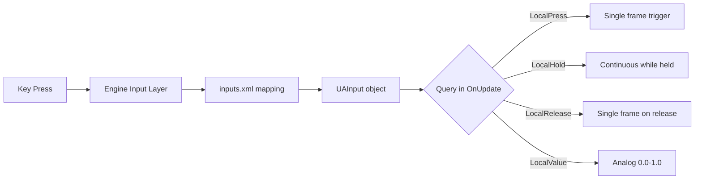

# Chapter 6.13: Input System

[Home](../README.md) | [<< Previous: Action System](12-action-system.md) | **Input System** | [Next: Player System >>](14-player-system.md)

---

## Introduction

The DayZ input system connects hardware inputs --- keyboard, mouse, and gamepad --- to named actions that scripts can query. It operates in two layers:

1. **inputs.xml** (config layer) --- declares named actions, assigns default keybindings, and organizes them into groups for the player's Controls settings menu. See [Chapter 5.2: inputs.xml](../05-config-files/02-inputs-xml.md) for full coverage.

2. **UAInput API** (script layer) --- queries input state at runtime. This is what your scripts call every frame to detect presses, releases, holds, and analog values.

This chapter covers the script layer: the classes, methods, and patterns you use to read and control inputs from Enforce Script.

---

## Core Classes

The input system is built on three main classes:

```
UAInputAPI         Global singleton (accessed via GetUApi())
├── UAInput        Represents a single named input action
└── Input          Lower-level input access (accessed via GetGame().GetInput())
```

| Class | Source File | Purpose |
|-------|-----------|---------|
| `UAInputAPI` | `3_Game/inputapi/uainput.c` | Global input manager. Retrieves inputs by name/ID, manages excludes, presets, and backlit. |
| `UAInput` | `3_Game/inputapi/uainput.c` | Single input action. Provides state queries (press, hold, release) and control (disable, suppress, lock). |
| `Input` | `3_Game/tools/input.c` | Engine-level input class. String-based state queries, device management, game focus control. |
| `InputUtils` | `3_Game/tools/inpututils.c` | Static helper class. Button name/icon resolution for UI display. |

---

## Accessing the Input API

### UAInputAPI (Recommended)

The primary way to access inputs. `GetUApi()` is a global function that returns the `UAInputAPI` singleton:

```c
// Get the global input API
UAInputAPI inputAPI = GetUApi();

// Get a specific input action by its name (as defined in inputs.xml)
UAInput input = inputAPI.GetInputByName("UAMyAction");

// Get a specific input action by its numeric ID
UAInput input = inputAPI.GetInputByID(someID);
```

### Input Class (Alternative)

The `Input` class provides string-based state queries directly, without needing a `UAInput` reference first:

```c
// Get the Input instance
Input input = GetGame().GetInput();

// Query by action name string
if (input.LocalPress("UAMyAction", false))
{
    // Key was just pressed
}
```

The `bool check_focus` parameter (second argument) controls whether the check respects game focus. Pass `true` (default) to return false when the game window is unfocused. Pass `false` to always return the raw input state.

### When to Use Which

- **`GetUApi().GetInputByName()`** --- Use when you need to query the same input multiple times, suppress/disable it, or inspect its bindings. You get a `UAInput` object you can reuse.
- **`GetGame().GetInput().LocalPress()`** --- Use for one-off checks where you do not need to manipulate the input itself. Simpler syntax but slightly less efficient for repeated queries.

---

## Reading Input State --- UAInput Methods

Once you have a `UAInput` reference, these methods query its current state:

```c
UAInput input = GetUApi().GetInputByName("UAMyAction");

// Frame-precise checks
bool justPressed   = input.LocalPress();        // True on the FIRST frame the key goes down
bool justReleased  = input.LocalRelease();       // True on the FIRST frame the key comes up
bool holdStarted   = input.LocalHoldBegin();     // True on the first frame hold threshold is met
bool isHeld        = input.LocalHold();          // True EVERY frame while key is held past threshold
bool clicked       = input.LocalClick();         // True on press-and-release before hold threshold
bool doubleClicked = input.LocalDoubleClick();   // True when a double-tap is detected

// Analog value
float value = input.LocalValue();                // 0.0 or 1.0 for digital; 0.0-1.0 for analog axes
```

---

## Reading Input State --- Input Class Methods

The `Input` class (from `GetGame().GetInput()`) offers equivalent string-based methods:

```c
Input input = GetGame().GetInput();

bool pressed  = input.LocalPress("UAMyAction", false);
bool released = input.LocalRelease("UAMyAction", false);
bool held     = input.LocalHold("UAMyAction", false);
bool dblClick = input.LocalDbl("UAMyAction", false);
float value   = input.LocalValue("UAMyAction", false);
```

Note the slight naming difference: `LocalDoubleClick()` on `UAInput` vs `LocalDbl()` on `Input`.

Both classes also provide `_ID` variants that accept integer action IDs instead of strings (e.g., `LocalPress_ID(int action)`).

---

## Input Query Methods Reference

### UAInput Methods

| Method | Returns | When True | Use Case |
|--------|---------|-----------|----------|
| `LocalPress()` | `bool` | First frame the key goes down | Toggle actions, one-shot triggers |
| `LocalRelease()` | `bool` | First frame the key comes up | End continuous actions |
| `LocalClick()` | `bool` | Key pressed and released before hold timer | Quick tap detection |
| `LocalHoldBegin()` | `bool` | First frame hold threshold is reached | Start hold-based actions |
| `LocalHold()` | `bool` | Every frame while held past threshold | Continuous hold actions |
| `LocalDoubleClick()` | `bool` | Double-tap detected | Special/alternate actions |
| `LocalValue()` | `float` | Always (returns current value) | Mouse axes, gamepad triggers, analog input |

### Input Class Methods

| Method | Returns | Signature | Equivalent UAInput Method |
|--------|---------|-----------|--------------------------|
| `LocalPress()` | `bool` | `LocalPress(string action, bool check_focus = true)` | `UAInput.LocalPress()` |
| `LocalRelease()` | `bool` | `LocalRelease(string action, bool check_focus = true)` | `UAInput.LocalRelease()` |
| `LocalHold()` | `bool` | `LocalHold(string action, bool check_focus = true)` | `UAInput.LocalHold()` |
| `LocalDbl()` | `bool` | `LocalDbl(string action, bool check_focus = true)` | `UAInput.LocalDoubleClick()` |
| `LocalValue()` | `float` | `LocalValue(string action, bool check_focus = true)` | `UAInput.LocalValue()` |

### Important Timing Notes

- **`LocalPress()`** fires on exactly **one frame** --- the frame the key transitions from up to down. If you check it on any other frame, it returns false.
- **`LocalClick()`** fires when the key is pressed and released quickly (before the hold timer kicks in). It is NOT the same as `LocalPress()`. Use `LocalPress()` for immediate key-down detection.
- **`LocalHold()`** does NOT fire immediately. It waits for the engine's hold threshold to be met first. Use `LocalPress()` if you need instant response.
- **`LocalHoldBegin()`** fires once when the hold threshold is first met. `LocalHold()` then fires every subsequent frame.

---

## Checking Inputs in OnUpdate

The standard pattern for polling custom inputs is inside `MissionGameplay.OnUpdate()`:

```c
modded class MissionGameplay
{
    override void OnUpdate(float timeslice)
    {
        super.OnUpdate(timeslice);

        // Guard: need a live player
        PlayerBase player = PlayerBase.Cast(GetGame().GetPlayer());
        if (!player)
            return;

        // Guard: no input while a menu is open
        if (GetGame().GetUIManager().GetMenu())
            return;

        UAInput myInput = GetUApi().GetInputByName("UAMyModOpenMenu");
        if (myInput && myInput.LocalPress())
        {
            OpenMyModMenu();
        }
    }
}
```

### Using the Input Class Instead

```c
modded class MissionGameplay
{
    override void OnUpdate(float timeslice)
    {
        super.OnUpdate(timeslice);

        Input input = GetGame().GetInput();

        if (input.LocalPress("UAMyModOpenMenu", false))
        {
            OpenMyModMenu();
        }
    }
}
```

### Where Else Can You Check Inputs?

Inputs can technically be checked in any per-frame callback, but `MissionGameplay.OnUpdate()` is the canonical location. Other valid places include:

- `PlayerBase.CommandHandler()` --- runs every frame for the local player
- `ScriptedWidgetEventHandler.Update()` --- for UI-specific input (but prefer widget event handlers)
- `PluginBase.OnUpdate()` --- for plugin-scoped input

Avoid checking inputs in server-side code, entity constructors, or one-off event handlers where frame timing is not guaranteed.

---

## Alternative: OnKeyPress and OnKeyRelease

For simple hardcoded key detection, `MissionBase` provides `OnKeyPress()` and `OnKeyRelease()` callbacks:

```c
modded class MissionGameplay
{
    override void OnKeyPress(int key)
    {
        super.OnKeyPress(key);

        if (key == KeyCode.KC_F5)
        {
            // F5 was pressed --- not rebindable!
            ToggleDebugOverlay();
        }
    }

    override void OnKeyRelease(int key)
    {
        super.OnKeyRelease(key);

        if (key == KeyCode.KC_F5)
        {
            // F5 was released
        }
    }
}
```

### UAInput vs OnKeyPress: When to Use Which

| Feature | UAInput (GetUApi) | OnKeyPress |
|---------|-------------------|------------|
| Player can rebind | Yes | No |
| Supports modifiers | Yes (Ctrl+Key combos via inputs.xml) | Manual checking required |
| Gamepad support | Yes | No |
| Appears in Controls menu | Yes | No |
| Analog values | Yes | No |
| Simplicity | Requires inputs.xml setup | Just check KeyCode |
| Best for | All player-facing actions | Debug tools, hardcoded dev shortcuts |

**Rule of thumb:** If a player will ever press this key, use UAInput with inputs.xml. Only use OnKeyPress for internal debug tools or prototype testing.

---

## KeyCode Reference

The `KeyCode` enum is defined in `1_Core/proto/ensystem.c`. These constants are used with `OnKeyPress()`, `OnKeyRelease()`, `KeyState()`, and `DisableKey()`.

### Commonly Used Keys

| Category | Constants |
|----------|-----------|
| Escape | `KC_ESCAPE` |
| Function keys | `KC_F1` through `KC_F12` |
| Number row | `KC_1`, `KC_2`, `KC_3`, `KC_4`, `KC_5`, `KC_6`, `KC_7`, `KC_8`, `KC_9`, `KC_0` |
| Letters | `KC_A` through `KC_Z` (e.g., `KC_Q`, `KC_W`, `KC_E`, `KC_R`, `KC_T`) |
| Modifiers | `KC_LSHIFT`, `KC_RSHIFT`, `KC_LCONTROL`, `KC_RCONTROL`, `KC_LMENU` (left Alt), `KC_RMENU` (right Alt) |
| Navigation | `KC_UP`, `KC_DOWN`, `KC_LEFT`, `KC_RIGHT` |
| Editing | `KC_SPACE`, `KC_RETURN`, `KC_TAB`, `KC_BACK` (Backspace), `KC_DELETE`, `KC_INSERT` |
| Page control | `KC_HOME`, `KC_END`, `KC_PRIOR` (Page Up), `KC_NEXT` (Page Down) |
| Numpad | `KC_NUMPAD0` through `KC_NUMPAD9`, `KC_NUMPADENTER`, `KC_ADD`, `KC_SUBTRACT`, `KC_MULTIPLY`, `KC_DIVIDE`, `KC_DECIMAL` |
| Locks | `KC_CAPITAL` (Caps Lock), `KC_NUMLOCK`, `KC_SCROLL` (Scroll Lock) |
| Punctuation | `KC_MINUS`, `KC_EQUALS`, `KC_LBRACKET`, `KC_RBRACKET`, `KC_SEMICOLON`, `KC_APOSTROPHE`, `KC_GRAVE`, `KC_BACKSLASH`, `KC_COMMA`, `KC_PERIOD`, `KC_SLASH` |

### MouseState Enum

For raw mouse button state checking (not through the UAInput system):

```c
enum MouseState
{
    LEFT,
    RIGHT,
    MIDDLE,
    X,        // Horizontal axis
    Y,        // Vertical axis
    WHEEL     // Scroll wheel
};

// Usage:
int state = GetMouseState(MouseState.LEFT);
// Bit 15 (MB_PRESSED_MASK) is set when pressed
```

### Low-Level Key State

```c
// Check raw key state (returns bitmask, bit 15 = currently pressed)
int state = KeyState(KeyCode.KC_LSHIFT);

// Clear the key state (prevents auto-repeat until next physical press)
ClearKey(KeyCode.KC_RETURN);

// Disable a key for the rest of this frame
GetGame().GetInput().DisableKey(KeyCode.KC_RETURN);
```

---

## Suppressing and Disabling Inputs

### Suppress (Per-Input, One Frame)

Prevents the input from firing on the next frame. Useful during transitions (closing a menu) to prevent one-frame input bleed:

```c
UAInput input = GetUApi().GetInputByName("UAMyAction");
input.Supress();  // Note: single 's' in the method name
```

### Suppress All Inputs (Global, One Frame)

Suppresses ALL inputs for the next frame. Call this when leaving menus or transitioning between input contexts:

```c
GetUApi().SupressNextFrame(true);
```

This is commonly used by vanilla when closing the main menu to prevent the escape key from immediately re-opening something.

### ForceDisable (Per-Input, Persistent)

Completely disables a specific input until re-enabled. The input will not fire any events while disabled:

```c
// Disable while menu is open
GetUApi().GetInputByName("UAMyAction").ForceDisable(true);

// Re-enable when menu closes
GetUApi().GetInputByName("UAMyAction").ForceDisable(false);
```

### Lock / Unlock (Per-Input, Persistent)

Similar to ForceDisable but uses a different mechanism. Be cautious --- if multiple systems lock/unlock the same input, they can interfere with each other:

```c
UAInput input = GetUApi().GetInputByName("UAMyAction");
input.Lock();    // Disable until Unlock() is called
input.Unlock();  // Re-enable

bool locked = input.IsLocked();  // Check state
```

The engine documentation recommends using exclude groups instead of Lock/Unlock for most cases.

### ForceDisable All Inputs (Bulk)

When opening a full-screen UI, disable all game inputs except the ones your UI needs. This is the pattern used by COT and Expansion:

```c
void DisableAllInputs(bool state)
{
    TIntArray inputIDs = new TIntArray;
    GetUApi().GetActiveInputs(inputIDs);

    // Inputs to keep active even while UI is open
    TIntArray skipIDs = new TIntArray;
    skipIDs.Insert(GetUApi().GetInputByName("UAUIBack").ID());

    foreach (int inputID : inputIDs)
    {
        if (skipIDs.Find(inputID) == -1)
        {
            GetUApi().GetInputByID(inputID).ForceDisable(state);
        }
    }

    GetUApi().UpdateControls();
}
```

**Important:** Always call `GetUApi().UpdateControls()` after modifying input states in bulk.

### Input Exclude Groups

The mission system provides named exclude groups defined in the engine's `specific.xml`. When activated, they disable categories of inputs:

```c
// Suppress gameplay inputs while a menu is open
GetGame().GetMission().AddActiveInputExcludes({"menu"});

// Restore inputs when closing
GetGame().GetMission().RemoveActiveInputExcludes({"menu"}, true);
```

Method signatures on the `Mission` class:

```c
void AddActiveInputExcludes(array<string> excludes);
void RemoveActiveInputExcludes(array<string> excludes, bool bForceSupress = false);
void EnableAllInputs(bool bForceSupress = false);
bool IsInputExcludeActive(string exclude);
```

The `bForceSupress` parameter on `RemoveActiveInputExcludes` calls `SupressNextFrame` internally to prevent input bleed when re-enabling.

Expansion uses its own custom exclude group registered with the engine:

```c
GetUApi().ActivateExclude("menuexpansion");
GetUApi().UpdateControls();
```

---

## Linking inputs.xml to Script

The connection between the XML config layer and the script layer is the **action name string**.



### The Flow

```
inputs.xml                              Script
──────────────                          ──────────────────────────────
<input name="UAMyModOpenMenu" />   -->  GetUApi().GetInputByName("UAMyModOpenMenu")
       │                                         │
       │  Engine loads at startup                │  Returns UAInput object
       │  Registers in UAInputAPI                │  with bound keys from XML
       ▼                                         ▼
Player sees in Settings > Controls       input.LocalPress() returns true
and can rebind the key                   when player hits the bound key
```

1. At startup, the engine reads all `inputs.xml` files from loaded mods
2. Each `<input name="...">` is registered as a `UAInput` in the global `UAInputAPI`
3. Default key bindings from `<preset>` are applied (unless the player has customized them)
4. In script, `GetUApi().GetInputByName("UAMyModOpenMenu")` retrieves the registered input
5. Calling `LocalPress()` etc. checks against whatever key the player has bound

The name string must match **exactly** (case-sensitive) between the XML and the script call.

For complete inputs.xml syntax, see [Chapter 5.2: inputs.xml](../05-config-files/02-inputs-xml.md).

### Runtime Registration (Advanced)

Inputs can also be registered at runtime from script, without an inputs.xml file:

```c
// Register a new group
GetUApi().RegisterGroup("mymod", "My Mod");

// Register a new input in that group
UAInput input = GetUApi().RegisterInput("UAMyModAction", "STR_MYMOD_ACTION", "mymod");

// Later, if needed:
GetUApi().DeRegisterInput("UAMyModAction");
GetUApi().DeRegisterGroup("mymod");
```

This is rarely used. The inputs.xml approach is preferred because it integrates properly with the Controls settings menu and preset system.

---

## Common Patterns

### Toggle Panel Open/Close

```c
modded class MissionGameplay
{
    protected bool m_MyPanelOpen;

    override void OnUpdate(float timeslice)
    {
        super.OnUpdate(timeslice);

        if (!GetGame().GetPlayer())
            return;

        UAInput input = GetUApi().GetInputByName("UAMyModPanel");
        if (input && input.LocalPress())
        {
            if (m_MyPanelOpen)
                CloseMyPanel();
            else
                OpenMyPanel();
        }
    }

    void OpenMyPanel()
    {
        m_MyPanelOpen = true;
        // Show UI...

        // Disable gameplay inputs while panel is open
        GetGame().GetMission().AddActiveInputExcludes({"menu"});
    }

    void CloseMyPanel()
    {
        m_MyPanelOpen = false;
        // Hide UI...

        // Restore gameplay inputs
        GetGame().GetMission().RemoveActiveInputExcludes({"menu"}, true);
    }
}
```

### Hold-to-Activate, Release-to-Deactivate

```c
override void OnUpdate(float timeslice)
{
    super.OnUpdate(timeslice);

    Input input = GetGame().GetInput();

    if (input.LocalPress("UAMyModSprint", false))
    {
        StartSprinting();
    }

    if (input.LocalRelease("UAMyModSprint", false))
    {
        StopSprinting();
    }
}
```

### Modifier + Key Combo Check

If you defined a Ctrl+Key combo in inputs.xml, the UAInput system handles it automatically. But if you need to check modifier state manually alongside a UAInput:

```c
override void OnUpdate(float timeslice)
{
    super.OnUpdate(timeslice);

    UAInput input = GetUApi().GetInputByName("UAMyModAction");
    if (input && input.LocalPress())
    {
        // Check if Shift is held via raw KeyState
        bool shiftHeld = (KeyState(KeyCode.KC_LSHIFT) != 0);

        if (shiftHeld)
            PerformAlternateAction();
        else
            PerformNormalAction();
    }
}
```

### Suppress Input When UI Consumes It

When your UI handles a key press, suppress the underlying game action to prevent both from firing:

```c
class MyMenuHandler extends ScriptedWidgetEventHandler
{
    override bool OnClick(Widget w, int x, int y, int button)
    {
        if (w == m_ConfirmButton)
        {
            DoConfirm();

            // Suppress the game input that might share this key
            GetUApi().GetInputByName("UAFire").Supress();
            return true;
        }
        return false;
    }
}
```

### Getting the Display Name of a Bound Key

To show the player what key is bound to an action (for UI prompts):

```c
UAInput input = GetUApi().GetInputByName("UAMyModAction");
string keyName = InputUtils.GetButtonNameFromInput("UAMyModAction", EUAINPUT_DEVICE_KEYBOARDMOUSE);
// Returns localized key name like "F5", "Left Ctrl", etc.
```

For controller icons and rich-text formatting:

```c
string richText = InputUtils.GetRichtextButtonIconFromInputAction(
    "UAMyModAction",
    "Open Menu",
    EUAINPUT_DEVICE_CONTROLLER
);
// Returns image tag + label for UI display
```

---

## Game Focus

The `Input` class provides game focus management, which controls whether inputs are processed when the game window is not focused:

```c
Input input = GetGame().GetInput();

// Add to focus counter (positive = unfocused, inputs suppressed)
input.ChangeGameFocus(1);

// Remove from focus counter
input.ChangeGameFocus(-1);

// Reset focus counter to 0 (fully focused)
input.ResetGameFocus();

// Check if game currently has focus (counter == 0)
bool hasFocus = input.HasGameFocus();
```

This is a reference-counted system. Multiple systems can request focus changes, and inputs resume only when all of them release.

---

## Common Mistakes

### Polling Input on the Server

Inputs are **client-only**. The server has no concept of keyboard, mouse, or gamepad state. If you call `GetUApi().GetInputByName()` on the server, the result is meaningless.

```c
// WRONG --- this runs on the server, inputs do not exist here
modded class MissionServer
{
    override void OnUpdate(float timeslice)
    {
        super.OnUpdate(timeslice);
        UAInput input = GetUApi().GetInputByName("UAMyAction");
        if (input.LocalPress())  // Always false on server!
        {
            DoSomething();
        }
    }
}

// CORRECT --- check input on client, send RPC to server
modded class MissionGameplay  // Client-side mission class
{
    override void OnUpdate(float timeslice)
    {
        super.OnUpdate(timeslice);
        UAInput input = GetUApi().GetInputByName("UAMyAction");
        if (input && input.LocalPress())
        {
            // Send RPC to server to perform the action
            GetGame().RPCSingleParam(null, MY_RPC_ID, null, true);
        }
    }
}
```

### Using OnKeyPress for Player-Facing Actions

```c
// WRONG --- hardcoded key, player cannot rebind
override void OnKeyPress(int key)
{
    super.OnKeyPress(key);
    if (key == KeyCode.KC_Y)
        OpenMyMenu();
}

// CORRECT --- uses inputs.xml, player can rebind in Settings
override void OnUpdate(float timeslice)
{
    super.OnUpdate(timeslice);
    UAInput input = GetUApi().GetInputByName("UAMyModOpenMenu");
    if (input && input.LocalPress())
        OpenMyMenu();
}
```

### Not Suppressing Input When UI Is Open

When your mod opens a UI panel, the player's WASD keys will still move the character, the mouse will still aim, and clicking will fire the weapon --- unless you disable game inputs:

```c
// WRONG --- character walks around behind the menu
void OpenMenu()
{
    m_MenuWidget.Show(true);
}

// CORRECT --- disable movement while menu is open
void OpenMenu()
{
    m_MenuWidget.Show(true);
    GetGame().GetMission().AddActiveInputExcludes({"menu"});
    GetGame().GetUIManager().ShowCursor(true);
}

void CloseMenu()
{
    m_MenuWidget.Show(false);
    GetGame().GetMission().RemoveActiveInputExcludes({"menu"}, true);
    GetGame().GetUIManager().ShowCursor(false);
}
```

### Forgetting That LocalPress Fires Only ONE Frame

`LocalPress()` returns `true` for exactly one frame --- the frame the key transitions from released to pressed. If your code path does not execute on that exact frame, you miss the event.

```c
// WRONG --- if DoExpensiveCheck() takes time or skips frames, you miss the press
void SomeCallback()
{
    if (GetUApi().GetInputByName("UAMyAction").LocalPress())
    {
        // This might never fire if SomeCallback is not called every frame
    }
}

// CORRECT --- always check in a per-frame callback
override void OnUpdate(float timeslice)
{
    super.OnUpdate(timeslice);
    if (GetUApi().GetInputByName("UAMyAction").LocalPress())
    {
        DoAction();
    }
}
```

### Confusing LocalClick and LocalPress

`LocalClick()` is NOT the same as `LocalPress()`. `LocalClick()` fires when a key is pressed AND released quickly (before the hold threshold). `LocalPress()` fires immediately on key-down. Most mods want `LocalPress()`.

```c
// Might not fire if player holds the key too long
if (input.LocalClick())  // Requires quick tap

// Fires immediately on key-down, regardless of hold duration
if (input.LocalPress())  // Usually what you want
```

### Forgetting UpdateControls After Bulk Changes

When you `ForceDisable()` multiple inputs, you must call `UpdateControls()` for the changes to take effect:

```c
// WRONG --- changes may not apply immediately
GetUApi().GetInputByName("UAFire").ForceDisable(true);
GetUApi().GetInputByName("UAMoveForward").ForceDisable(true);

// CORRECT --- flush the changes
GetUApi().GetInputByName("UAFire").ForceDisable(true);
GetUApi().GetInputByName("UAMoveForward").ForceDisable(true);
GetUApi().UpdateControls();
```

### Misspelling Supress

The engine method is `Supress()` with a single 's' (not `Suppress`). The global method `SupressNextFrame()` also uses a single 's'. This is a quirk of the engine API:

```c
// WRONG --- will not compile
input.Suppress();

// CORRECT --- single 's'
input.Supress();
GetUApi().SupressNextFrame(true);
```

---

## Quick Reference

```c
// === Getting inputs ===
UAInputAPI api = GetUApi();
UAInput input = api.GetInputByName("UAMyAction");
Input rawInput = GetGame().GetInput();

// === State queries (UAInput) ===
input.LocalPress()        // Key just went down (one frame)
input.LocalRelease()      // Key just came up (one frame)
input.LocalClick()        // Quick tap detected
input.LocalHoldBegin()    // Hold threshold just reached (one frame)
input.LocalHold()         // Held past threshold (every frame)
input.LocalDoubleClick()  // Double-tap detected
input.LocalValue()        // Analog value (float)

// === State queries (Input, string-based) ===
rawInput.LocalPress("UAMyAction", false)
rawInput.LocalRelease("UAMyAction", false)
rawInput.LocalHold("UAMyAction", false)
rawInput.LocalDbl("UAMyAction", false)
rawInput.LocalValue("UAMyAction", false)

// === Suppressing ===
input.Supress()                    // This input, next frame
api.SupressNextFrame(true)         // All inputs, next frame

// === Disabling ===
input.ForceDisable(true)           // Disable persistently
input.ForceDisable(false)          // Re-enable
input.Lock()                       // Lock (use excludes instead)
input.Unlock()                     // Unlock
api.UpdateControls()               // Flush changes

// === Exclude groups ===
GetGame().GetMission().AddActiveInputExcludes({"menu"});
GetGame().GetMission().RemoveActiveInputExcludes({"menu"}, true);
GetGame().GetMission().EnableAllInputs(true);

// === Raw key state ===
int state = KeyState(KeyCode.KC_LSHIFT);
GetGame().GetInput().DisableKey(KeyCode.KC_RETURN);

// === Display helpers ===
string name = InputUtils.GetButtonNameFromInput("UAMyAction", EUAINPUT_DEVICE_KEYBOARDMOUSE);
```

---

*This chapter covers the script-side Input System API. For the XML configuration that registers keybindings, see [Chapter 5.2: inputs.xml](../05-config-files/02-inputs-xml.md).*

---

## Best Practices

- **Always use `UAInput` via inputs.xml for player-facing keybindings.** This allows players to rebind keys, shows actions in the Controls menu, and supports gamepad input. Reserve `OnKeyPress` for debug shortcuts only.
- **Call `AddActiveInputExcludes({"menu"})` when opening full-screen UI.** Without this, player movement keys (WASD), mouse aiming, and weapon firing remain active behind your menu, causing accidental actions.
- **Check inputs only in per-frame callbacks like `OnUpdate()`.** `LocalPress()` returns true for exactly one frame. Checking it in event handlers or callbacks that do not run every frame will miss key presses.
- **Call `GetUApi().UpdateControls()` after bulk `ForceDisable()` changes.** Without this flush call, disable/enable state changes may not take effect until the next frame, causing one-frame input bleed.
- **Remember that `Supress()` uses a single "s".** The engine API spells it `Supress()` and `SupressNextFrame()`. Using the correct English spelling `Suppress` will not compile.

---

## Compatibility & Impact

- **Multi-Mod:** Input action names are global. Two mods registering the same `UAInput` name (e.g., `"UAOpenMenu"`) will collide. Always prefix with your mod name: `"UAMyModOpenMenu"`. Input exclude groups are shared -- one mod activating `"menu"` excludes affects all mods.
- **Performance:** Input polling is lightweight. `GetUApi().GetInputByName()` performs a hash lookup. Caching the `UAInput` reference in a member variable avoids repeated lookups but is not strictly necessary for performance.
- **Server/Client:** Inputs exist only on the client. The server has no keyboard, mouse, or gamepad state. Always detect input on the client and send RPCs to the server for authoritative actions.
