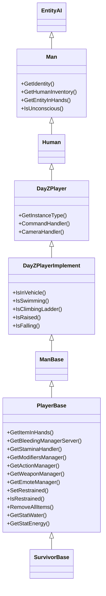

# Chapter 6.14: Player System

[Home](../README.md) | [<< Previous: Input System](13-input-system.md) | **Player System** | [Next: Sound System >>](15-sound-system.md)

---

## Introduction

`PlayerBase` is the single most important class in DayZ modding. Every gameplay system --- health, hunger, bleeding, stamina, inventory, restraints, unconsciousness --- lives on the player entity or one of its manager subsystems. Whether you are writing an admin tool, a survival mechanic, or a PvP mod, you will interact with PlayerBase constantly.

This chapter is an API reference for the player class hierarchy, its identity system, health pools, state checks, equipment access, and the manager objects that drive status effects. All method signatures are taken directly from the vanilla script source.

---

## Class Hierarchy

The player entity sits at the bottom of a deep inheritance chain. Each level adds capabilities:

```
Class (root of all Enforce Script classes)
└── Managed
    └── IEntity                          // 1_Core/proto/enentity.c
        └── Object                       // 3_Game/entities/object.c
            └── ObjectTyped
                └── Entity
                    └── EntityAI         // 3_Game/entities/entityai.c
                        └── Man          // 3_Game/entities/man.c
                            └── Human    // engine native (proto)
                                └── DayZPlayer            // 3_Game/dayzplayer.c
                                └── DayZPlayerImplement  // 4_World/entities/dayzplayerimplement.c
                                    └── ManBase        // 4_World/entities/manbase.c
                                        └── PlayerBase // 4_World/entities/manbase/playerbase.c
                                            └── SurvivorBase  // config-defined
```

### Hierarchy Diagram



### What Each Level Provides

| Class | Key Additions |
|-------|---------------|
| **Object** | `GetPosition()`, `SetPosition()`, `GetHealth()`, `SetHealth()`, `IsAlive()`, `SetAllowDamage()` |
| **EntityAI** | Inventory, attachments, damage zones, `EEInit()`, `EEKilled()`, `EEHitBy()`, net sync variables |
| **Man** | `GetIdentity()`, `GetHumanInventory()`, `GetEntityInHands()`, `IsUnconscious()` |
| **Human** | Engine-native class (proto). Provides low-level animation command interface between Man and DayZPlayer |
| **DayZPlayer** | Instance type, command system, camera system, animation commands |
| **DayZPlayerImplement** | Movement state checks (`IsInVehicle`, `IsSwimming`, `IsRaised`, `IsFalling`) |
| **ManBase** | Base implementation connecting DayZPlayerImplement to PlayerBase |
| **PlayerBase** | All gameplay systems: bleeding, stamina, modifiers, stats, actions, equipment |

---

## PlayerIdentity --- Who Is the Player?

**File:** `3_Game/gameplay.c`

`PlayerIdentity` represents the real person behind a player entity. It holds network and platform identifiers. Access it from any `Man`-derived class via `GetIdentity()`.

### Key Methods

| Method | Return Type | Description |
|--------|-------------|-------------|
| `GetName()` | `string` | Display name (may contain special characters) |
| `GetPlainName()` | `string` | Name without any processing |
| `GetFullName()` | `string` | Full name of the player |
| `GetPlainId()` | `string` | Steam64 ID (unique, persistent across sessions) |
| `GetId()` | `string` | BattlEye GUID (hashed Steam ID --- safe for databases and logs) |
| `GetPlayerId()` | `int` | Network peer ID (session-only, reused after disconnect) |
| `GetPlayer()` | `Man` | The player entity this identity belongs to |
| `GetPingAct()` | `int` | Current ping |
| `GetPingAvg()` | `int` | Average ping |

### Usage Example

```c
void LogPlayerInfo(PlayerBase player)
{
    PlayerIdentity identity = player.GetIdentity();
    if (!identity)
        return;

    string name    = identity.GetName();       // "PlayerNick"
    string steamId = identity.GetPlainId();    // "76561198012345678"
    string beGuid  = identity.GetId();         // hashed BattlEye GUID
    int peerId     = identity.GetPlayerId();   // 2 (session-only)

    Print("Player: " + name + " Steam: " + steamId + " GUID: " + beGuid);
}
```

### GetPlainId() vs GetId()

This is a common source of confusion:

| Method | Value | Use Case |
|--------|-------|----------|
| `GetPlainId()` | Raw Steam64 ID (`"76561198012345678"`) | Linking to Steam profiles, cross-server identity |
| `GetId()` | Hashed BattlEye GUID | Database storage, admin logs (Bohemia's recommended ID for persistence) |

> **Rule of thumb:** Use `GetPlainId()` when you need a human-readable identifier or cross-platform lookup. Use `GetId()` when storing data in databases or logs, as Bohemia designed it for that purpose.

---

## Health System

Player health uses the same zone-based system as all `Object` entities, but with three separate pools that work together to determine survival.

### The Three Pools

| Pool | Zone/Type | Default Max | What Drains It |
|------|-----------|-------------|----------------|
| **Health** | `("", "Health")` | 100 | Starvation, dehydration, falling, melee, explosions |
| **Blood** | `("", "Blood")` | 5000 | Bullet wounds, bleeding, cuts |
| **Shock** | `("", "Shock")` | 100 | Bullet impacts, melee hits, flash grenades |

When **Health** reaches 0, the player dies. When **Blood** drops too low, the player loses consciousness and eventually dies. When **Shock** drops to 0, the player goes unconscious.

### Reading Health Values

```c
// Global health pools (empty string = global zone)
float health = player.GetHealth("", "Health");
float blood  = player.GetHealth("", "Blood");
float shock  = player.GetHealth("", "Shock");

// Maximum values
float maxHealth = player.GetMaxHealth("", "Health");
float maxBlood  = player.GetMaxHealth("", "Blood");
float maxShock  = player.GetMaxHealth("", "Shock");

// Normalized (0..1 range)
float health01 = player.GetHealth01("", "Health");

// Shorthand (equivalent to GetHealth("", ""))
float hp = player.GetHealth();
```

### Modifying Health

All health modification is **server-authoritative**. Only call these on the server.

```c
// Set absolute value
player.SetHealth("", "Health", 100.0);    // Full health
player.SetHealth("", "Blood", 5000.0);    // Full blood
player.SetHealth("", "Shock", 100.0);     // Full shock

// Add (positive) or subtract (negative)
player.AddHealth("", "Health", -25.0);    // Deal 25 damage
player.AddHealth("", "Blood", 500.0);     // Restore 500 blood

// Shorthand (sets global health)
player.SetHealth(100.0);
```

### Zone Health (Body Parts)

Players have damage zones for individual body parts. Each zone has its own "Health" property:

```c
float headHp     = player.GetHealth("Head", "Health");
float torsoHp    = player.GetHealth("Torso", "Health");
float leftArmHp  = player.GetHealth("LeftArm", "Health");
float rightArmHp = player.GetHealth("RightArm", "Health");
float leftLegHp  = player.GetHealth("LeftLeg", "Health");
float rightLegHp = player.GetHealth("RightLeg", "Health");
float leftFootHp = player.GetHealth("LeftFoot", "Health");
float rightFootHp = player.GetHealth("RightFoot", "Health");
```

Broken legs are triggered when leg/foot zone health drops to 1 or below, which activates the `MDF_BROKEN_LEGS` modifier.

### Death and Hit Events

These events fire on the server and can be overridden in modded classes:

```c
// Called when the player is killed
override void EEKilled(Object killer)
{
    super.EEKilled(killer);
    // killer can be null (environment death), another player, or a zombie
    Print("Player died!");
}

// Called when the player takes a hit
override void EEHitBy(TotalDamageResult damageResult, int damageType,
    EntityAI source, int component, string dmgZone,
    string ammo, vector modelPos, float speedCoef)
{
    super.EEHitBy(damageResult, damageType, source, component,
        dmgZone, ammo, modelPos, speedCoef);

    float dmgDealt = damageResult.GetDamage(dmgZone, "Health");
    Print("Hit in " + dmgZone + " for " + dmgDealt + " damage");
}
```

---

## Status Effects and Stats

### Bleeding

Bleeding is managed by `BleedingSourcesManagerServer` (server) and `BleedingSourcesManagerRemote` (client visual). Each wound is a named "bleeding source" tied to a body selection.

```c
// Server only
BleedingSourcesManagerServer bleedMgr = player.GetBleedingManagerServer();
if (bleedMgr)
{
    // Add a bleeding source
    bleedMgr.AttemptAddBleedingSourceBySelection("RightForeArmRoll");

    // Remove all bleeding
    bleedMgr.RemoveAllSources();
}

// Both sides - count of active sources
int sourceCount = player.GetBleedingSourceCount();
```

### Food and Water

Food (energy) and water are stat objects, not health zones. They use a `PlayerStat<float>` wrapper.

```c
// Reading values
float water  = player.GetStatWater().Get();
float energy = player.GetStatEnergy().Get();

// Maximum values
float waterMax  = player.GetStatWater().GetMax();
float energyMax = player.GetStatEnergy().GetMax();

// Setting values (server only)
player.GetStatWater().Set(waterMax);
player.GetStatEnergy().Set(energyMax);
```

Default maximums are defined in `PlayerConstants`:

| Stat | Constant | Default |
|------|----------|---------|
| Water max | `PlayerConstants.SL_WATER_MAX` | 5000 |
| Energy max | `PlayerConstants.SL_ENERGY_MAX` | 20000 |

### Temperature and Heat Comfort

```c
// Heat comfort ranges from negative (freezing) to positive (hot)
float heatComfort = player.GetStatHeatComfort().Get();

// Heat buffer (protection from cold)
float heatBuffer = player.GetStatHeatBuffer().Get();
```

### Stamina

Stamina is handled by a dedicated `StaminaHandler`:

```c
StaminaHandler staminaHandler = player.GetStaminaHandler();

// Check if player can perform an action
bool canSprint = staminaHandler.HasEnoughStaminaFor(EStaminaConsumers.SPRINT);
bool canJump   = staminaHandler.HasEnoughStaminaToStart(EStaminaConsumers.JUMP);
```

### Other Stats

```c
PlayerStat<float> tremor   = player.GetStatTremor();
PlayerStat<float> toxicity = player.GetStatToxicity();
PlayerStat<float> diet     = player.GetStatDiet();
PlayerStat<float> stamina  = player.GetStatStamina();
```

---

## Player State Checks

DayZPlayerImplement and PlayerBase provide a comprehensive set of state queries. These are safe to call on both client and server.

### Movement and Stance

```c
bool inVehicle  = player.IsInVehicle();
bool swimming   = player.IsSwimming();
bool climbing   = player.IsClimbing();       // Vault/climb obstacle
bool onLadder   = player.IsClimbingLadder();
bool falling    = player.IsFalling();
bool raised     = player.IsRaised();         // Weapon raised
```

### Vital States

```c
bool alive       = player.IsAlive();         // Health > 0
bool unconscious = player.IsUnconscious();   // Shock knocked out
bool restrained  = player.IsRestrained();    // Handcuffed
```

### Where These Methods Live

| Method | Defined In | How It Works |
|--------|-----------|--------------|
| `IsAlive()` | `Object` | Returns `!IsDamageDestroyed()` |
| `IsUnconscious()` | `PlayerBase` | Checks command type or `m_IsUnconscious` flag |
| `IsRestrained()` | `PlayerBase` | Returns `m_IsRestrained` (synced variable) |
| `IsInVehicle()` | `DayZPlayerImplement` | Checks `COMMANDID_VEHICLE` or parent is `Transport` |
| `IsSwimming()` | `DayZPlayerImplement` | Checks `COMMANDID_SWIM` |
| `IsClimbing()` | `PlayerBase` | Checks `COMMANDID_CLIMB` |
| `IsClimbingLadder()` | `DayZPlayerImplement` | Checks `COMMANDID_LADDER` |
| `IsFalling()` | `PlayerBase` | Checks `COMMANDID_FALL` |
| `IsRaised()` | `DayZPlayerImplement` | Checks `m_MovementState.IsRaised()` |

### Compound State Check Example

```c
bool CanPerformAction(PlayerBase player)
{
    if (!player || !player.IsAlive())
        return false;

    if (player.IsUnconscious())
        return false;

    if (player.IsRestrained())
        return false;

    if (player.IsSwimming() || player.IsClimbingLadder())
        return false;

    if (player.IsInVehicle())
        return false;

    return true;
}
```

This pattern mirrors how vanilla checks `CanBeRestrained()`:

```c
// Vanilla PlayerBase.CanBeRestrained() - actual code
if (IsInVehicle() || IsRaised() || IsSwimming() || IsClimbing()
    || IsClimbingLadder() || IsRestrained()
    || !GetWeaponManager() || GetWeaponManager().IsRunning()
    || !GetActionManager() || GetActionManager().GetRunningAction() != null
    || IsMapOpen())
{
    return false;
}
```

---

## Equipment and Inventory

### Item in Hands

```c
// Returns ItemBase (cast of GetEntityInHands())
ItemBase itemInHands = player.GetItemInHands();

// Check if holding a weapon
if (itemInHands && itemInHands.IsWeapon())
{
    Weapon_Base weapon = Weapon_Base.Cast(itemInHands);
}

// The lower-level method (returns EntityAI)
EntityAI entityInHands = player.GetEntityInHands();
```

### Finding Attachments by Slot

Clothing and equipment are attached to named slots on the player entity. Use `FindAttachmentBySlotName()` (defined on `EntityAI`):

```c
EntityAI headgear  = player.FindAttachmentBySlotName("Headgear");
EntityAI vest      = player.FindAttachmentBySlotName("Vest");
EntityAI back      = player.FindAttachmentBySlotName("Back");
EntityAI body      = player.FindAttachmentBySlotName("Body");
EntityAI legs      = player.FindAttachmentBySlotName("Legs");
EntityAI feet      = player.FindAttachmentBySlotName("Feet");
EntityAI gloves    = player.FindAttachmentBySlotName("Gloves");
EntityAI armband   = player.FindAttachmentBySlotName("Armband");
EntityAI eyewear   = player.FindAttachmentBySlotName("Eyewear");
EntityAI mask      = player.FindAttachmentBySlotName("Mask");
EntityAI shoulder  = player.FindAttachmentBySlotName("Shoulder");
EntityAI melee     = player.FindAttachmentBySlotName("Melee");
```

### Inventory Access

```c
// Full inventory interface
HumanInventory inventory = player.GetHumanInventory();

// Iterate all attachments
GameInventory gi = player.GetInventory();
for (int i = 0; i < gi.AttachmentCount(); i++)
{
    EntityAI attachment = gi.GetAttachmentFromIndex(i);
    Print("Attachment: " + attachment.GetType());
}
```

---

## Player Actions (Server-Side Operations)

These operations must run on the server. Calling them on the client will either have no effect or cause desync.

### God Mode

```c
// Prevent all damage (defined on Object)
player.SetAllowDamage(false);    // Enable god mode
player.SetAllowDamage(true);     // Disable god mode
```

### Teleport

```c
// Teleport to coordinates
vector destination = Vector(6543.0, 0, 2872.0);
destination[1] = GetGame().SurfaceY(destination[0], destination[2]);
player.SetPosition(destination);
```

### Full Heal

```c
void HealPlayer(PlayerBase player)
{
    // Restore health pools
    player.SetHealth("", "Health", player.GetMaxHealth("", "Health"));
    player.SetHealth("", "Blood", player.GetMaxHealth("", "Blood"));
    player.SetHealth("", "Shock", player.GetMaxHealth("", "Shock"));

    // Restore food and water
    player.GetStatWater().Set(player.GetStatWater().GetMax());
    player.GetStatEnergy().Set(player.GetStatEnergy().GetMax());

    // Stop all bleeding
    if (player.GetBleedingManagerServer())
        player.GetBleedingManagerServer().RemoveAllSources();

    // Reset modifiers (disease, infection, etc.)
    player.GetModifiersManager().ResetAll();
}
```

### Kill

```c
player.SetHealth("", "Health", 0);
```

### Strip (Remove All Items)

```c
player.RemoveAllItems();
```

### Restrain / Unrestrain

```c
player.SetRestrained(true);    // Handcuff
player.SetRestrained(false);   // Release
```

### Disable Status Effects

```c
player.SetModifiers(false);    // Pause all modifiers
player.SetModifiers(true);     // Resume modifiers
```

---

## Networking and Synchronization

### Instance Type

Every player entity has an instance type that tells you whether the current machine is the server, the controlling client, or a remote observer:

```c
DayZPlayerInstanceType instType = player.GetInstanceType();

// Possible values:
// DayZPlayerInstanceType.INSTANCETYPE_SERVER      - Dedicated server
// DayZPlayerInstanceType.INSTANCETYPE_CLIENT      - Controlling client
// DayZPlayerInstanceType.INSTANCETYPE_AI_SERVER   - AI on server
// DayZPlayerInstanceType.INSTANCETYPE_AI_REMOTE   - AI on client
// DayZPlayerInstanceType.INSTANCETYPE_REMOTE      - Other players (remote proxy)
// DayZPlayerInstanceType.INSTANCETYPE_AI_SINGLEPLAYER - Offline AI
```

### What Syncs Automatically

PlayerBase registers numerous variables for automatic network synchronization via `RegisterNetSyncVariable*()`. When the server modifies these variables and calls `SetSynchDirty()`, clients receive updates through `OnVariablesSynchronized()`.

**Automatically synced variables include:**

| Variable | Type | What It Represents |
|----------|------|-------------------|
| `m_IsUnconscious` | `bool` | Unconscious state |
| `m_IsRestrained` | `bool` | Handcuffed state |
| `m_IsInWater` | `bool` | In water state |
| `m_BleedingBits` | `int` | Active bleeding source bitmask |
| `m_ShockSimplified` | `int` | Shock level (0..63) |
| `m_HealthLevel` | `int` | Injury animation level |
| `m_CorpseState` | `int` | Corpse decomposition stage |
| `m_StaminaState` | `int` | Stamina state for animations |
| `m_LifeSpanState` | `int` | Beard growth stage |
| `m_HasBloodTypeVisible` | `bool` | Blood type test done |
| `m_HasHeatBuffer` | `bool` | Heat buffer active |

### OnVariablesSynchronized

This is the client-side callback that fires whenever synced variables change:

```c
// Vanilla PlayerBase.OnVariablesSynchronized()
override void OnVariablesSynchronized()
{
    super.OnVariablesSynchronized();

    // Update lifespan visuals (beard, bloody hands)
    if (m_ModuleLifespan)
        m_ModuleLifespan.SynchLifespanVisual(this, m_LifeSpanState,
            m_HasBloodyHandsVisible, m_HasBloodTypeVisible, m_BloodType);

    // Update bleeding particles on remote clients
    if (GetBleedingManagerRemote() && IsPlayerLoaded())
        GetBleedingManagerRemote().OnVariablesSynchronized(GetBleedingBits());

    // Update corpse visuals
    if (m_CorpseStateLocal != m_CorpseState)
        UpdateCorpseState();
}
```

### Custom Synced Variables in Modded Classes

To add your own synced variable to a `modded class PlayerBase`:

```c
modded class PlayerBase
{
    // 1. Declare the variable
    private bool m_MyCustomFlag;

    // 2. Register it in constructor (after super())
    void PlayerBase()
    {
        RegisterNetSyncVariableBool("m_MyCustomFlag");
    }

    // 3. Set on server and mark dirty
    void SetMyFlag(bool value)
    {
        m_MyCustomFlag = value;
        SetSynchDirty();
    }

    // 4. Read on client in OnVariablesSynchronized
    override void OnVariablesSynchronized()
    {
        super.OnVariablesSynchronized();

        if (m_MyCustomFlag)
            Print("Custom flag is true on client!");
    }
}
```

### Identity and PlayerBase Relationship

`PlayerIdentity` and `PlayerBase` are separate objects linked by the engine:

- `PlayerBase.GetIdentity()` returns the identity (can be null during connect/disconnect)
- `PlayerIdentity.GetPlayer()` returns the `Man` entity (cast to `PlayerBase`)
- A player entity can briefly exist without an identity during initial connection
- After disconnect, the identity is detached before the entity is cleaned up

---

## Manager Subsystems

PlayerBase owns several manager objects that handle specific gameplay systems. All are created in the PlayerBase constructor (server-side).

### ModifiersManager

**Purpose:** Controls all status effect modifiers (disease, hunger, temperature effects, broken legs).

```c
ModifiersManager modMgr = player.GetModifiersManager();

// Activate a specific modifier
modMgr.ActivateModifier(eModifiers.MDF_BROKEN_LEGS);

// Deactivate a modifier
modMgr.DeactivateModifier(eModifiers.MDF_BROKEN_LEGS);

// Check if active
bool isActive = modMgr.IsModifierActive(eModifiers.MDF_BROKEN_LEGS);

// Reset all modifiers
modMgr.ResetAll();

// Enable/disable the entire modifier system
modMgr.SetModifiers(false);  // Pause all
modMgr.SetModifiers(true);   // Resume all
```

### PlayerAgentPool

**Purpose:** Manages disease agents (cholera, influenza, salmonella, etc.).

```c
PlayerAgentPool agentPool = player.m_AgentPool;
```

Agents are typically added through contaminated food/water and removed by the immune system or medication.

### BleedingSourcesManagerServer

**Purpose:** Tracks individual wound locations and their bleeding rate.

```c
BleedingSourcesManagerServer bleedMgr = player.GetBleedingManagerServer();
if (bleedMgr)
{
    bleedMgr.AttemptAddBleedingSourceBySelection("LeftForeArmRoll");
    bleedMgr.RemoveAllSources();
}
```

Bleeding sources are tied to model bone selections (e.g., `"RightForeArmRoll"`, `"LeftLeg"`, `"RightFoot"`, `"Head"`). On the client side, `BleedingSourcesManagerRemote` handles particle effects.

### StaminaHandler

**Purpose:** Manages stamina pool, consumption, and recovery.

```c
StaminaHandler staminaHandler = player.GetStaminaHandler();
```

### ShockHandler

**Purpose:** Manages the shock damage pool and unconsciousness threshold.

```c
// Accessed via member variable
ShockHandler shockHandler = player.m_ShockHandler;
```

### ActionManagerBase

**Purpose:** Manages the action system (continuous actions like eating, bandaging, crafting).

```c
ActionManagerBase actionMgr = player.GetActionManager();
ActionBase runningAction = actionMgr.GetRunningAction();
if (runningAction)
    Print("Currently doing: " + runningAction.GetType().ToString());
```

### WeaponManager

**Purpose:** Handles weapon operations (reload, chamber, unjam).

```c
WeaponManager weaponMgr = player.GetWeaponManager();
bool isBusy = weaponMgr.IsRunning();
```

### EmoteManager

**Purpose:** Controls emote/gesture playback.

```c
EmoteManager emoteMgr = player.GetEmoteManager();
bool locked = emoteMgr.IsControllsLocked();
```

### Other Managers

| Manager | Member Variable | Purpose |
|---------|----------------|---------|
| `SymptomManager` | `m_SymptomManager` | Visual/audio symptoms (coughing, sneezing) |
| `SoftSkillsManager` | `m_SoftSkillsManager` | Soft skill progression |
| `Environment` | `m_Environment` | Temperature, wetness, wind effects |
| `PlayerStomach` | `m_PlayerStomach` | Food/liquid digestion simulation |
| `CraftingManager` | `m_CraftingManager` | Recipe-based crafting |
| `InjuryAnimationHandler` | `m_InjuryHandler` | Limping, injury animations |

---

## Common Patterns

### Finding a Player by Identity

```c
PlayerBase FindPlayerByPlainId(string plainId)
{
    array<Man> players = new array<Man>();
    GetGame().GetPlayers(players);

    foreach (Man man : players)
    {
        PlayerIdentity identity = man.GetIdentity();
        if (identity && identity.GetPlainId() == plainId)
            return PlayerBase.Cast(man);
    }

    return null;
}
```

### Iterating All Online Players

```c
void DoSomethingToAllPlayers()
{
    array<Man> players = new array<Man>();
    GetGame().GetPlayers(players);

    foreach (Man man : players)
    {
        PlayerBase player = PlayerBase.Cast(man);
        if (!player || !player.IsAlive())
            continue;

        // Do something with each living player
        Print("Player: " + player.GetIdentity().GetName());
    }
}
```

### Getting Player Look Direction

```c
// Simple forward direction (from Object)
vector lookDir = player.GetDirection();

// Heading vector for gameplay purposes
vector headingDir = MiscGameplayFunctions.GetHeadingVector(player);

// Full camera-based aiming direction
vector cameraPos;
vector cameraDir;
GetGame().GetCurrentCameraPosition(cameraPos);
GetGame().GetCurrentCameraDirection(cameraDir);
// Use cameraDir for raycast aiming
```

### Safely Getting the Local Player

```c
// On CLIENT only - returns null on dedicated server!
PlayerBase GetLocalPlayer()
{
    return PlayerBase.Cast(GetGame().GetPlayer());
}
```

### Server-Side Player Lookup from RPC

```c
// In an RPC handler, the sender identity tells you who sent it
void OnRPC(PlayerIdentity sender, Object target, int rpc_type, ParamsReadContext ctx)
{
    if (!sender)
        return;

    // Find their player entity
    Man playerMan = sender.GetPlayer();
    PlayerBase player = PlayerBase.Cast(playerMan);
    if (!player)
        return;

    // Now you have both identity and entity
    string name = sender.GetName();
    vector pos = player.GetPosition();
}
```

---

## Common Mistakes

### 1. GetGame().GetPlayer() Returns Null on Server

`GetGame().GetPlayer()` returns the **local** player entity. On a dedicated server, there is no local player --- it always returns `null`.

```c
// WRONG - will crash on dedicated server
PlayerBase player = PlayerBase.Cast(GetGame().GetPlayer());
player.SetHealth(100); // null pointer!

// CORRECT - only use on client
if (!GetGame().IsDedicatedServer())
{
    PlayerBase localPlayer = PlayerBase.Cast(GetGame().GetPlayer());
    if (localPlayer)
    {
        // Client-side only operations
    }
}
```

### 2. PlayerIdentity Can Be Null

During the connection handshake, a player entity can exist briefly before its identity is assigned. Always null-check.

```c
// WRONG
string name = player.GetIdentity().GetName(); // crash if identity is null!

// CORRECT
PlayerIdentity identity = player.GetIdentity();
if (identity)
{
    string name = identity.GetName();
}
```

### 3. Not Checking IsAlive() Before Operations

Dead player entities still exist in the world as corpses. Many operations are meaningless or harmful on dead players.

```c
// WRONG
player.SetHealth("", "Blood", 5000); // Healing a corpse does nothing useful

// CORRECT
if (player.IsAlive())
{
    player.SetHealth("", "Blood", 5000);
}
```

### 4. Modifying Health on Client

Health changes are **server-authoritative**. Setting health on the client will be overwritten by the next server sync, or worse, cause desync.

```c
// WRONG - client-side health change will desync
player.SetHealth("", "Health", 100);

// CORRECT - check that we are on the server
if (GetGame().IsServer())
{
    player.SetHealth("", "Health", 100);
}
```

### 5. Confusing GetPlainId() and GetId()

```c
// GetPlainId() = raw Steam64 ID (human-readable, not hashed)
// GetId()      = BattlEye GUID (hashed, safe for databases)

// WRONG - using GetId() to look up Steam profile
string steamUrl = "https://steamcommunity.com/profiles/" + identity.GetId();
// This won't work - GetId() is a hash, not a Steam64 ID!

// CORRECT
string steamUrl = "https://steamcommunity.com/profiles/" + identity.GetPlainId();
```

### 6. Forgetting SetSynchDirty()

After modifying a synced variable, you must call `SetSynchDirty()` to trigger network synchronization. Without it, clients will never see the change.

```c
// WRONG - clients won't see the restrain state change
m_IsRestrained = true;

// CORRECT - how SetRestrained() actually works
void SetRestrained(bool is_restrained)
{
    m_IsRestrained = is_restrained;
    SetSynchDirty();    // Tells engine to send update to clients
}
```

### 7. Using IsAlive() on Base Object Type

The `Object.IsAlive()` method exists, but if you have a generic `Object` reference that you suspect is a player, you must cast to `EntityAI` first. The `Object` version just checks `!IsDamageDestroyed()`, which works, but `EntityAI` adds the full damage system context.

```c
// When working with generic Object references
Object obj = GetSomeObject();

// Safe approach - cast first
EntityAI entity = EntityAI.Cast(obj);
if (entity && entity.IsAlive())
{
    PlayerBase player = PlayerBase.Cast(entity);
    if (player)
    {
        // Now safely work with the living player
    }
}
```

---

## Quick Reference Table

| Task | Code |
|------|------|
| Get identity | `player.GetIdentity()` |
| Get Steam ID | `player.GetIdentity().GetPlainId()` |
| Get health | `player.GetHealth("", "Health")` |
| Set health | `player.SetHealth("", "Health", value)` |
| Get blood | `player.GetHealth("", "Blood")` |
| Get shock | `player.GetHealth("", "Shock")` |
| Is alive | `player.IsAlive()` |
| Is unconscious | `player.IsUnconscious()` |
| Is restrained | `player.IsRestrained()` |
| Get item in hands | `player.GetItemInHands()` |
| Get headgear | `player.FindAttachmentBySlotName("Headgear")` |
| God mode | `player.SetAllowDamage(false)` |
| Teleport | `player.SetPosition(vector)` |
| Kill | `player.SetHealth("", "Health", 0)` |
| Strip inventory | `player.RemoveAllItems()` |
| Get all players | `GetGame().GetPlayers(array<Man>)` |
| Get local player | `PlayerBase.Cast(GetGame().GetPlayer())` (client only!) |
| Get water stat | `player.GetStatWater().Get()` |
| Get energy stat | `player.GetStatEnergy().Get()` |
| Bleeding count | `player.GetBleedingSourceCount()` |
| Stop bleeding | `player.GetBleedingManagerServer().RemoveAllSources()` |
| Check instance type | `player.GetInstanceType()` |
| Restrain | `player.SetRestrained(true)` |

---

*This chapter covers the PlayerBase API as of DayZ 1.26. Method signatures are sourced from vanilla script files in `3_Game/` and `4_World/`. For the complete entity hierarchy that PlayerBase inherits from, see [Chapter 6.1: Entity System](01-entity-system.md).*

---

## Best Practices

- **Always null-check `GetIdentity()` before accessing player identity fields.** During the connection handshake and disconnect teardown, a `PlayerBase` entity can exist without an identity. Calling `GetIdentity().GetName()` without a null check crashes the server.
- **Use `GetPlainId()` for Steam lookups, `GetId()` for database storage.** `GetPlainId()` returns the raw Steam64 ID suitable for profile URLs. `GetId()` returns the BattlEye GUID hash, which Bohemia recommends for persistent data keys.
- **Guard all health modifications with `GetGame().IsServer()`.** Health, blood, shock, stats, and bleeding are server-authoritative. Client-side changes are overwritten on the next sync and cause desync artifacts.
- **Check `IsAlive()` before performing operations on player entities.** Dead player entities persist as corpses. Healing, teleporting, or equipping a corpse wastes server resources and can cause unexpected behavior.
- **Call `SetSynchDirty()` after modifying any `RegisterNetSyncVariable*` field.** Without this call, clients never receive the updated value. This applies to both vanilla synced variables and your custom ones.

---

## Compatibility & Impact

> **Mod Compatibility:** `PlayerBase` is the single most modded class in DayZ. Admin tools, survival mods, PvP systems, and UI mods all add `modded class PlayerBase` with custom fields, overrides, and synced variables.

- **Load Order:** Multiple `modded class PlayerBase` declarations coexist as long as each calls `super` in every override. The last-loaded mod's overrides wrap all previous ones.
- **Modded Class Conflicts:** Common conflict points are `OnVariablesSynchronized()` (forgetting `super` hides other mods' sync logic), `EEHitBy()` (damage modification mods overriding each other), and the constructor (net sync variable registration order must be consistent).
- **Performance Impact:** Adding many `RegisterNetSyncVariable*` calls to PlayerBase increases per-player network traffic. Each synced variable is checked for changes every time `SetSynchDirty()` is called. Keep custom synced variables under 4-5 per mod.
- **Server/Client:** `GetGame().GetPlayer()` returns null on dedicated servers. Use `GetGame().GetPlayers(array)` to iterate server-side players. Manager subsystems like `GetBleedingManagerServer()` return null on clients; use `GetBleedingManagerRemote()` for client-side particle effects instead.

---

## Observed in Real Mods

> These patterns were confirmed by studying the source code of professional DayZ mods.

| Pattern | Mod | File/Location |
|---------|-----|---------------|
| `modded class PlayerBase` with custom `RegisterNetSyncVariableBool` for group membership | Expansion | Party system player sync |
| `EEHitBy` override to track damage source for killfeed display | Dabs Framework | Hit tracking / killfeed |
| `InvokeOnConnect` player data load from `$profile:` JSON by `GetIdentity().GetId()` | COT | Player permission loading |
| `GetBleedingManagerServer().RemoveAllSources()` in admin heal command | VPP Admin Tools | Player management module |
| `OnVariablesSynchronized` override to update client-side HUD from synced stats | Expansion | Notification and status sync |
