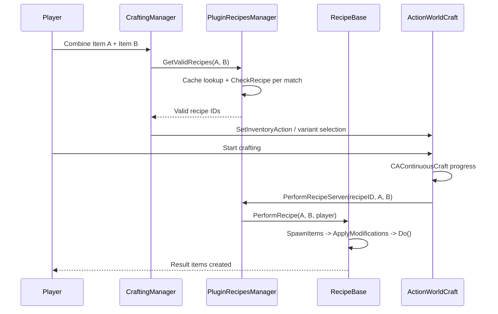

# Chapter 6.16: Crafting System

[Home](../README.md) | [<< Previous: Sound System](15-sound-system.md) | **Crafting System** | [Next: Construction System >>](17-construction-system.md)

---

## Introduction

The Crafting System is how DayZ handles combining items to produce new items --- sharpening sticks with knives, tying rags into rope, sawing off shotgun barrels, assembling splints. It is a data-driven pipeline that sits on top of the Action System (Chapter 6.12) and uses a central recipe registry to discover, validate, and execute item transformations.

There are two fundamental approaches to crafting in DayZ:

1. **Recipe-based crafting** --- Items are combined through `PluginRecipesManager`, which maintains a registry of `RecipeBase` subclasses. Each recipe declares its ingredients, results, conditions, and modifications. The engine automatically discovers valid recipes when two items are combined and presents them to the player via the `ActionWorldCraft` action.

2. **Action-based crafting** --- Custom `ActionContinuousBase` subclasses handle crafting directly without the recipe system. This approach is used for specialized transformations like basebuilding construction, cooking, and gardening where the recipe abstraction does not fit.

This chapter focuses primarily on the recipe system, which handles the vast majority of item crafting in vanilla DayZ (over 150 registered recipes).

---

## System Architecture

### High-Level Flow

```
Player drags Item A onto Item B (inventory)
  or aims at Item B while holding Item A (world)
        |
        v
CraftingManager.OnUpdate() / SetInventoryCraft()
        |
        v
PluginRecipesManager.GetValidRecipes(itemA, itemB)
        |
        v
Recipe cache lookup --> ingredient matching --> CheckRecipe() per candidate
        |
        v
Valid recipe IDs returned --> ActionWorldCraft created with recipe ID
        |
        v
Player initiates crafting --> CAContinuousCraft progress bar
        |
        v
OnFinishProgressServer() --> PluginRecipesManager.PerformRecipeServer()
        |
        v
RecipeBase: SpawnItems() --> ApplyModificationsResults()
         --> ApplyModificationsIngredients() --> Do() --> DeleteIngredientsPass()
```



### Core Classes

| Class | File | Purpose |
|-------|------|---------|
| `RecipeBase` | `4_World/classes/recipes/recipebase.c` | Base class for all recipes. Declares ingredients, results, conditions. |
| `PluginRecipesManagerBase` | `4_World/classes/recipes/recipes/pluginrecipesmanagerbase.c` | Registers all vanilla recipes via `RegisterRecipies()`. |
| `PluginRecipesManager` | `4_World/plugins/pluginbase/pluginrecipesmanager.c` | Runtime manager: cache generation, recipe lookup, validation, execution. |
| `CraftingManager` | `4_World/classes/craftingmanager.c` | Client-side crafting state machine (world vs inventory mode). |
| `CacheObject` | `4_World/classes/recipes/cacheobject.c` | Per-item recipe cache entry with bitmask ingredient positions. |
| `ActionWorldCraft` | `4_World/classes/useractionscomponent/actions/continuous/actionworldcraft.c` | The action that drives all recipe-based crafting. |
| `CAContinuousCraft` | `4_World/classes/useractionscomponent/actioncomponents/cacontinuouscraft.c` | Progress component that reads recipe duration. |

### Constants

```c
// recipebase.c
const int MAX_NUMBER_OF_INGREDIENTS = 2;    // recipes always have exactly 2 ingredient slots
const int MAXIMUM_RESULTS = 10;             // maximum output items per recipe
const float DEFAULT_SPAWN_DISTANCE = 0.6;   // ground spawn offset from player

// constants.c (3_Game)
const float CRAFTING_TIME_UNIT_SIZE = 4.0;  // multiplied by m_AnimationLength to get seconds

// pluginrecipesmanager.c
const int MAX_NUMBER_OF_RECIPES = 2048;     // hard limit on registered recipes
const int MAX_CONCURENT_RECIPES = 128;      // max recipes resolved in a single query
```

> **Key insight:** Every recipe has exactly two ingredient "slots" (index 0 and index 1). Each slot can accept multiple item types (e.g., slot 0 accepts `Rag` OR `BandageDressing` OR `DuctTape`), but the player always combines exactly two items.

---

## RecipeBase --- The Recipe Definition

Every crafting recipe is a class that extends `RecipeBase`. The constructor calls `Init()` automatically, where you configure everything about the recipe.

### Class Fields Reference

#### Recipe Metadata

| Field | Type | Default | Description |
|-------|------|---------|-------------|
| `m_Name` | `string` | `"RecipeBase default name"` | Display name (stringtable key like `"#STR_CraftTorch0"`). |
| `m_IsInstaRecipe` | `bool` | `false` | If `true`, recipe completes instantly without animation. |
| `m_AnimationLength` | `float` | `1.0` | Duration in relative time units. Actual seconds = `m_AnimationLength * 4.0`. |
| `m_Specialty` | `float` | `0.0` | Soft skills: positive = roughness, negative = precision. |
| `m_AnywhereInInventory` | `bool` | `false` | If `true`, neither item needs to be in the player's hands. |

#### Ingredient Conditions (per slot, indexed 0 or 1)

| Field | Default | Description |
|-------|---------|-------------|
| `m_MinDamageIngredient[i]` | `0` | Minimum damage level required. `-1` = disable check. |
| `m_MaxDamageIngredient[i]` | `0` | Maximum damage level allowed. `-1` = disable check. |
| `m_MinQuantityIngredient[i]` | `0` | Minimum quantity required. `-1` = disable check. |
| `m_MaxQuantityIngredient[i]` | `0` | Maximum quantity allowed. `-1` = disable check. |

#### Ingredient Modifications (per slot, applied after crafting)

| Field | Default | Description |
|-------|---------|-------------|
| `m_IngredientAddHealth[i]` | `0` | Health delta applied. `0` = do nothing. |
| `m_IngredientSetHealth[i]` | `0` | Set health to this value. `-1` = do nothing. |
| `m_IngredientAddQuantity[i]` | `0` | Quantity delta applied. `0` = do nothing. Negative values consume. |
| `m_IngredientDestroy[i]` | `false` | If `true`, ingredient is deleted after crafting. |
| `m_IngredientUseSoftSkills[i]` | `false` | Allow soft skills to modify ingredient changes. |

#### Result Configuration (per result, indexed 0 to `MAXIMUM_RESULTS - 1`)

| Field | Default | Description |
|-------|---------|-------------|
| `m_ResultSetFullQuantity[i]` | `false` | If `true`, result spawns at max quantity. |
| `m_ResultSetQuantity[i]` | `0` | Set result quantity to this value. `-1` = do nothing. |
| `m_ResultSetHealth[i]` | `0` | Set result health. `-1` = do nothing. |
| `m_ResultInheritsHealth[i]` | `0` | `-1` = do nothing. `>= 0` = inherit from ingredient N. `-2` = average of all ingredients. |
| `m_ResultInheritsColor[i]` | `0` | `-1` = do nothing. `>= 0` = append ingredient N's `color` config value to classname. |
| `m_ResultToInventory[i]` | `0` | `-2` = spawn on ground. `-1` = player inventory. `>= 0` = swap position with ingredient N. |
| `m_ResultReplacesIngredient[i]` | `0` | `-1` = do nothing. `>= 0` = transfer properties/attachments from ingredient N. |
| `m_ResultUseSoftSkills[i]` | `false` | Allow soft skills to modify result values. |
| `m_ResultSpawnDistance[i]` | `0.6` | Ground spawn offset distance from player. |

---

## Creating a Custom Recipe

### Step 1: Define the Recipe Class

Create a new `.c` file in `4_World/` (recipes are loaded from this layer). Extend `RecipeBase` and override `Init()`:

```c
// File: 4_World/recipes/CraftMyItem.c

class CraftMyItem extends RecipeBase
{
    override void Init()
    {
        m_Name = "#STR_craft_my_item";   // stringtable display name
        m_IsInstaRecipe = false;
        m_AnimationLength = 1.5;         // 1.5 * 4.0 = 6.0 seconds
        m_Specialty = 0.02;              // roughness

        // --- Ingredient conditions ---
        m_MinDamageIngredient[0] = -1;   // no damage check
        m_MaxDamageIngredient[0] = 3;    // not ruined (level 4)
        m_MinQuantityIngredient[0] = 1;
        m_MaxQuantityIngredient[0] = -1;

        m_MinDamageIngredient[1] = -1;
        m_MaxDamageIngredient[1] = 3;
        m_MinQuantityIngredient[1] = 2;  // need at least 2 of ingredient 2
        m_MaxQuantityIngredient[1] = -1;

        // --- Ingredient 1: a knife (tool, not consumed) ---
        InsertIngredient(0, "KitchenKnife");
        InsertIngredient(0, "HuntingKnife");
        InsertIngredient(0, "SteakKnife");

        m_IngredientAddHealth[0] = -5;       // knife loses 5 health
        m_IngredientSetHealth[0] = -1;
        m_IngredientAddQuantity[0] = 0;
        m_IngredientDestroy[0] = false;      // knife survives
        m_IngredientUseSoftSkills[0] = true;

        // --- Ingredient 2: material (partially consumed) ---
        InsertIngredient(1, "WoodenStick");

        m_IngredientAddHealth[1] = 0;
        m_IngredientSetHealth[1] = -1;
        m_IngredientAddQuantity[1] = -2;     // consume 2 quantity
        m_IngredientDestroy[1] = false;
        m_IngredientUseSoftSkills[1] = false;

        // --- Result ---
        AddResult("MyCustomItem");

        m_ResultSetFullQuantity[0] = false;
        m_ResultSetQuantity[0] = -1;
        m_ResultSetHealth[0] = -1;
        m_ResultInheritsHealth[0] = -2;      // average health of both ingredients
        m_ResultInheritsColor[0] = -1;
        m_ResultToInventory[0] = -2;         // spawn on ground
        m_ResultUseSoftSkills[0] = false;
        m_ResultReplacesIngredient[0] = -1;
    }

    override bool CanDo(ItemBase ingredients[], PlayerBase player)
    {
        // Custom validation beyond the built-in condition checks
        return true;
    }

    override void Do(ItemBase ingredients[], PlayerBase player, array<ItemBase> results, float specialty_weight)
    {
        // Custom logic after spawning/modifications
        // ingredients[0] = knife (sorted), ingredients[1] = sticks (sorted)
        // results.Get(0) = the spawned MyCustomItem
    }
}
```

### Step 2: Register the Recipe

Override `RegisterRecipies()` in a modded `PluginRecipesManagerBase`:

```c
// File: 4_World/plugins/PluginRecipesManagerBase.c

modded class PluginRecipesManagerBase extends PluginBase
{
    override void RegisterRecipies()
    {
        super.RegisterRecipies();               // keep all vanilla recipes
        RegisterRecipe(new CraftMyItem);        // add yours
    }
}
```

To remove an existing vanilla recipe:

```c
modded class PluginRecipesManagerBase extends PluginBase
{
    override void RegisterRecipies()
    {
        super.RegisterRecipies();
        UnregisterRecipe("CraftStoneKnife");    // remove by class name string
    }
}
```

> **Official sample:** `DayZ-Samples/Test_Crafting/` demonstrates this exact pattern --- an `ExampleRecipe` that turns any item into stones using a custom `MagicHammer`, registered via a modded `PluginRecipesManagerBase`.

### Step 3: No Further Wiring Needed

Unlike actions (which must be registered on items via `SetActions()`), recipes are automatically discovered. The `PluginRecipesManager` builds a cache on startup by walking all registered recipes and matching them against all config-defined items. When any two items are combined, the cache is queried for matching recipes.

---

## Recipe Methods Reference

### Init()

Called from the `RecipeBase` constructor. Set all field values here. Do not call `super.Init()` --- it is an empty declaration in the base class.

```c
override void Init()
{
    m_Name = "#STR_MyRecipe";
    m_AnimationLength = 1.0;        // 4.0 seconds real time
    m_IsInstaRecipe = false;
    m_Specialty = -0.01;            // precision craft

    // ... ingredient and result configuration ...
}
```

### CanDo(ItemBase ingredients[], PlayerBase player)

Called during `CheckRecipe()` after the built-in condition checks (`CheckConditions()`) pass. Use this for custom validation logic that cannot be expressed through the field-based conditions. The `ingredients[]` array is **sorted** --- index 0 maps to your ingredient slot 0 definition, index 1 to slot 1.

The base implementation checks whether any ingredient has attachments and returns `false` if so:

```c
// Base RecipeBase.CanDo --- ingredients with attachments cannot be crafted
bool CanDo(ItemBase ingredients[], PlayerBase player)
{
    for (int i = 0; i < MAX_NUMBER_OF_INGREDIENTS; i++)
    {
        if (ingredients[i].GetInventory() && ingredients[i].GetInventory().AttachmentCount() > 0)
            return false;
    }
    return true;
}
```

Common patterns in vanilla overrides:

```c
// CraftSplint: different quantity requirements per ingredient type
override bool CanDo(ItemBase ingredients[], PlayerBase player)
{
    ItemBase ingredient1 = ingredients[0];

    if (ingredient1.Type() == Rag)
    {
        if (ingredient1.GetQuantity() >= 4)
            return true;
        return false;
    }

    if (ingredient1.Type() == DuctTape)
    {
        if (ingredient1.GetQuantity() >= (ingredient1.GetQuantityMax() / 2))
            return true;
        return false;
    }

    return true;
}

// CraftImprovisedExplosive: container must be empty
override bool CanDo(ItemBase ingredients[], PlayerBase player)
{
    return ingredients[0].IsEmpty();
}

// PurifyWater: liquid must not be frozen
override bool CanDo(ItemBase ingredients[], PlayerBase player)
{
    return ingredients[1].GetQuantity() > 0 && !ingredients[1].GetIsFrozen();
}

// DisinfectItem: check liquid type bitmask
override bool CanDo(ItemBase ingredients[], PlayerBase player)
{
    if (!ingredients[1].CanBeDisinfected())
        return false;
    if (ingredients[0].GetQuantity() < ingredients[0].GetDisinfectQuantity())
        return false;
    int liquid_type = ingredients[0].GetLiquidType();
    return (liquid_type & LIQUID_DISINFECTANT);
}
```

### Do(ItemBase ingredients[], PlayerBase player, array\<ItemBase\> results, float specialty_weight)

Called after `SpawnItems()` and `ApplyModifications*()` have run. This is where you implement custom post-craft logic --- transferring properties, modifying state, triggering effects. The built-in field system handles most modifications automatically; `Do()` is for anything beyond that.

```c
// CraftTorch: attach rag to torch, set up torch state
override void Do(ItemBase ingredients[], PlayerBase player, array<ItemBase> results, float specialty_weight)
{
    ItemBase rag = ingredients[0];
    rag.SetCleanness(0);
    Torch torch = Torch.Cast(results[0]);
    int quantity = rag.GetQuantity();

    if (torch)
    {
        torch.SetTorchDecraftResult(ingredients[1].GetType());
        if (g_Game.IsMultiplayer() && g_Game.IsServer())
        {
            player.ServerTakeEntityToTargetAttachment(torch, rag);
        }
        torch.StandUp();
        torch.CraftingInit(quantity);
    }
}

// SawoffShotgunIzh43: transform weapon class using TurnItemIntoItemLambda
override void Do(ItemBase ingredients[], PlayerBase player, array<ItemBase> results, float specialty_weight)
{
    MiscGameplayFunctions.TurnItemIntoItemEx(player,
        new TurnItemIntoItemLambda(ingredients[0], "SawedoffIzh43Shotgun", player));
}
```

### IsRepeatable()

Override to return `true` if the recipe should continue repeating after completion (like repair recipes where you keep repairing until the item is fixed or the tool runs out):

```c
override bool IsRepeatable()
{
    return true;    // crafting loops until CanDo returns false
}
```

When repeatable, `CAContinuousCraft` returns `UA_PROCESSING` after each cycle instead of `UA_FINISHED`, causing the progress bar to reset and run again.

### OnSelected(ItemBase item1, ItemBase item2, PlayerBase player)

Called when the player selects this recipe from the recipe list. Rarely overridden --- can be used for preview effects or UI feedback.

---

## Ingredient Configuration

### InsertIngredient(int index, string className, ...)

Adds an accepted item type to an ingredient slot. Call multiple times on the same index to accept multiple item types:

```c
// Slot 0 accepts three different knife types
InsertIngredient(0, "KitchenKnife");
InsertIngredient(0, "HuntingKnife");
InsertIngredient(0, "StoneKnife");

// Slot 1 accepts sticks
InsertIngredient(1, "WoodenStick");
InsertIngredient(1, "Ammo_SharpStick");
```

The full signature supports animation overrides:

```c
void InsertIngredient(int index, string ingredient,
    DayZPlayerConstants uid = BASE_CRAFT_ANIMATION_ID,
    bool showItem = false)
```

- `uid` --- Override the crafting animation when this specific ingredient is used. For example, `CleanWeapon` uses `CMD_ACTIONFB_CLEANING_WEAPON` when the ingredient is a `DefaultWeapon`.
- `showItem` --- If `true`, the item remains visible in the player's hands during the animation. If `false` (default), the item is hidden.

### InsertIngredientEx(int index, string ingredient, string soundCategory, ...)

Extended version that also sets a sound category string for the ingredient:

```c
InsertIngredientEx(0, "SmallProtectorCase", "ImprovisedExplosive");
```

### Inheritance-Based Matching

When you insert a parent class name like `"Inventory_Base"` or `"DefaultWeapon"`, the recipe matches **all subclasses**. The engine uses `g_Game.IsKindOf()` for matching, which walks the config hierarchy:

```c
// This matches ANY inventory item as ingredient 2
InsertIngredient(1, "Inventory_Base");

// This matches any weapon
InsertIngredient(1, "DefaultWeapon");

// This matches any color variant of Shemag
InsertIngredient(0, "Shemag_ColorBase");
```

This is how the `RepairWithTape` recipe can repair almost any item --- its ingredient 2 accepts `Inventory_Base`, `DefaultWeapon`, and `DefaultMagazine`.

### RemoveIngredient(int index, string ingredient)

Removes a previously inserted ingredient type from a slot. Useful in modded subclasses:

```c
RemoveIngredient(1, "WoodenStick");
```

### AddResult(string className)

Adds a result item to the recipe. Call multiple times for recipes that produce multiple outputs:

```c
AddResult("MyItem");           // result index 0
AddResult("MyByproduct");      // result index 1
```

The internal `m_NumberOfResults` counter increments with each call. Configure result fields using the corresponding index.

### SetAnimation(DayZPlayerConstants uid)

Sets the base crafting animation for the entire recipe (different from per-ingredient animation overrides):

```c
SetAnimation(DayZPlayerConstants.CMD_ACTIONFB_SPLITTING_FIREWOOD);
```

---

## Crafting Actions

### ActionWorldCraft

This is the action that drives all recipe-based crafting. Players do not interact with it directly --- the `CraftingManager` creates it automatically when valid recipes exist between two items.

**How it works:**

1. `CraftingManager.OnUpdate()` runs each frame, passing the held item and the look-at target to `PluginRecipesManager.GetValidRecipes()`.
2. If recipes are found, `CraftingManager` sets up `ActionWorldCraft` as a variant action, with one variant per valid recipe.
3. The player sees recipe names in the action prompt and can cycle through them.
4. On start, `CAContinuousCraft` reads the recipe's duration from `PluginRecipesManager.GetRecipeLengthInSecs()`.
5. On completion (`OnFinishProgressServer`), the action calls `PluginRecipesManager.PerformRecipeServer()`.

**Key implementation details:**

```c
class ActionWorldCraft : ActionContinuousBase
{
    void ActionWorldCraft()
    {
        m_CallbackClass = ActionWorldCraftCB;
        m_CommandUID = DayZPlayerConstants.CMD_ACTIONFB_CRAFTING;
        m_FullBody = true;
        m_StanceMask = DayZPlayerConstants.STANCEMASK_CROUCH;
    }

    override void OnFinishProgressServer(ActionData action_data)
    {
        WorldCraftActionData action_data_wc;
        PluginRecipesManager module_recipes_manager;
        ItemBase item2;

        Class.CastTo(action_data_wc, action_data);
        Class.CastTo(module_recipes_manager, GetPlugin(PluginRecipesManager));
        Class.CastTo(item2, action_data.m_Target.GetObject());

        if (action_data.m_MainItem && item2)
        {
            module_recipes_manager.PerformRecipeServer(
                action_data_wc.m_RecipeID,
                action_data.m_MainItem,
                item2,
                action_data.m_Player
            );
        }
    }
}
```

### CraftingManager (Client)

The `CraftingManager` is a client-only class that manages crafting state. It operates in three modes:

| Mode | Constant | Trigger |
|------|----------|---------|
| None | `CM_MODE_NONE` | No crafting active |
| World | `CM_MODE_WORLD` | Player looks at an item while holding another |
| Inventory | `CM_MODE_INVENTORY` | Player drags items together in the inventory screen |

```c
// Inventory crafting is initiated by the UI
bool SetInventoryCraft(int recipeID, ItemBase item1, ItemBase item2)
{
    int recipeCount = m_recipesManager.GetValidRecipes(item1, item2, m_recipes, m_player);
    // ... validates, then either:
    //   - Sends RPC for instant recipes
    //   - Sets up ActionWorldCraft for timed recipes
}
```

### Instant Recipes

When `m_IsInstaRecipe = true`, the crafting skips the animation entirely. The `CraftingManager` sends an RPC (`ERPCs.RPC_CRAFTING_INVENTORY_INSTANT`) directly to the server, which performs the recipe immediately.

### Supporting Actions

| Action | Purpose |
|--------|---------|
| `ActionWorldCraftCancel` | Cancels inventory-initiated crafting. Only appears when `IsInventoryCraft()` is true. |
| `ActionWorldCraftSwitch` | (Deprecated) Cycles to next recipe variant. Replaced by the variant manager system. |

---

## Recipe Execution Pipeline

When `PerformRecipeServer()` is called, the following sequence executes:

### 1. Validation: CheckRecipe()

```c
bool CheckRecipe(ItemBase item1, ItemBase item2, PlayerBase player)
{
    // Verify neither item is null
    // Check: is at least one item in the player's hands? (unless m_AnywhereInInventory)
    // Sort items into m_IngredientsSorted[] to match slot definitions
    // Run CanDo(m_IngredientsSorted, player)
    // Run CheckConditions(m_IngredientsSorted) -- quantity/damage range checks
    return true;  // if all pass
}
```

### 2. Spawn Results: SpawnItems()

For each result defined by `AddResult()`:

- If `m_ResultToInventory[i] == -1`: Try to place in player inventory via `CreateInInventory()`
- If `m_ResultToInventory[i] == -2`: Spawn on ground near player
- If inventory placement fails, fall back to ground spawn via `SpawnEntityOnGroundRaycastDispersed()`
- Color inheritance: if `m_ResultInheritsColor[i] >= 0`, the result classname is composed as `ResultName + ingredient.ConfigGetString("color")`

### 3. Apply Result Modifications: ApplyModificationsResults()

For each result:

- **Quantity:** `m_ResultSetFullQuantity` sets max, `m_ResultSetQuantity` sets a specific value
- **Health:** `m_ResultSetHealth` sets absolute health. `m_ResultInheritsHealth` copies from a specific ingredient (`>= 0`), or averages all ingredients (`-2`)
- **Property transfer:** `m_ResultReplacesIngredient` transfers item properties and inventory contents from an ingredient using `MiscGameplayFunctions.TransferItemProperties()` and `TransferInventory()`

### 4. Apply Ingredient Modifications: ApplyModificationsIngredients()

For each ingredient:

- If `m_IngredientDestroy[i]` is true, queue for deletion
- Otherwise apply `m_IngredientAddHealth`, `m_IngredientSetHealth`, and `m_IngredientAddQuantity`
- Quantity reduction that brings an item to zero automatically destroys it
- Magazine items use `ServerSetAmmoCount()` instead of `AddQuantity()`

### 5. Custom Logic: Do()

Your override runs here with sorted ingredients, results array, and specialty weight.

### 6. Cleanup: DeleteIngredientsPass()

All ingredients queued for deletion are destroyed.

---

## The Recipe Cache

The recipe cache is a performance-critical system that avoids checking every recipe against every item combination at runtime.

### How It Works

On startup, `PluginRecipesManager` builds a `map<string, CacheObject>` keyed by item class name:

1. **WalkRecipes()** --- iterates all registered recipes and maps each ingredient class name to recipe IDs with bitmask positions (`Ingredient.FIRST = 1`, `Ingredient.SECOND = 2`, `Ingredient.BOTH = 3`).

2. **GenerateRecipeCache()** --- walks all items in `CfgVehicles`, `CfgWeapons`, and `CfgMagazines`. For each item, resolves its full config hierarchy and inherits recipe cache entries from parent classes.

This means if you register `"Inventory_Base"` as an ingredient, every item that inherits from `Inventory_Base` gets that recipe in its cache automatically.

### Cache Lookup

When two items are combined:

1. `GetRecipeIntersection()` finds the item with fewer cached recipes
2. Iterates those recipes, checking if the other item also has them
3. `SortIngredients()` determines which item maps to which ingredient slot using bitmask resolution

---

## Advanced Topics

### Tool Recipes (Non-Consuming Ingredients)

Many recipes use one ingredient as a "tool" that is not consumed. Set the tool ingredient to not be destroyed and optionally lose health:

```c
// Knife is a tool --- it loses health but is not consumed
InsertIngredient(0, "HuntingKnife");
m_IngredientAddHealth[0] = -10;      // lose 10 health per craft
m_IngredientSetHealth[0] = -1;
m_IngredientAddQuantity[0] = 0;
m_IngredientDestroy[0] = false;      // survives crafting
m_IngredientUseSoftSkills[0] = true; // soft skills modify health loss
```

Vanilla examples: `CleanWeapon` (WeaponCleaningKit), `SawoffShotgunIzh43` (Hacksaw), `SharpenMelee` (WhetStone).

### Partial Quantity Consumption

Consume only part of an ingredient's stack:

```c
// Require at least 6 rags, consume 6
m_MinQuantityIngredient[0] = 6;
m_IngredientAddQuantity[0] = -6;    // negative = consume
m_IngredientDestroy[0] = false;     // leftover rags survive
```

If the quantity reduction brings the item to zero or below, the engine destroys it automatically (via `AddQuantity()` return value).

### Item Transformation (No Spawned Result)

Some recipes transform an ingredient directly instead of spawning a new item. The saw-off recipes use `MiscGameplayFunctions.TurnItemIntoItemEx()` in `Do()` without calling `AddResult()`:

```c
class SawoffShotgunIzh43 extends RecipeBase
{
    override void Init()
    {
        // ... ingredients configured, NO AddResult() call ...
    }

    override void Do(ItemBase ingredients[], PlayerBase player, array<ItemBase> results, float specialty_weight)
    {
        MiscGameplayFunctions.TurnItemIntoItemEx(player,
            new TurnItemIntoItemLambda(ingredients[0], "SawedoffIzh43Shotgun", player));
    }
}
```

This preserves the item's attachments, damage state, and inventory slot.

### No-Result Recipes (In-Place Modification)

Recipes like `DisinfectItem` and `PurifyWater` modify an ingredient in place without producing a new item. They define no `AddResult()` and use `Do()` to alter the ingredient:

```c
// PurifyWater: removes agents from the water container
override void Do(ItemBase ingredients[], PlayerBase player, array<ItemBase> results, float specialty_weight)
{
    ItemBase ingredient2 = ingredients[1];
    ingredient2.RemoveAllAgentsExcept(eAgents.HEAVYMETAL);
}
```

### Color-Based Result Variants

The `m_ResultInheritsColor` system creates variant items based on an ingredient's config `color` value. The result classname becomes `AddResult_name + color_string`:

```c
AddResult("GhillieHood_");              // base name ending with underscore
m_ResultInheritsColor[0] = 0;           // inherit color from ingredient 0

// If ingredient 0 has color "Green" in its config, the result becomes "GhillieHood_Green"
```

This was used extensively for the paint recipe system (now mostly commented out in vanilla).

### Crafting Duration

The actual crafting time in seconds is:

```
seconds = m_AnimationLength * CRAFTING_TIME_UNIT_SIZE
seconds = m_AnimationLength * 4.0
```

| `m_AnimationLength` | Real seconds |
|---------------------|-------------|
| 0.5 | 2.0 |
| 1.0 | 4.0 |
| 1.5 | 6.0 |
| 2.0 | 8.0 |

---

## Best Practices

1. **Always call `super.RegisterRecipies()`** when modding `PluginRecipesManagerBase`. Forgetting this removes all vanilla recipes.

2. **Use inheritance-based ingredients wisely.** Inserting `"Inventory_Base"` matches every item in the game. This is powerful but can create unexpected recipe conflicts. Prefer specific class names or intermediate base classes.

3. **Set condition checks to `-1` to disable, not `0`.** A value of `0` is a valid condition (e.g., min quantity of 0), while `-1` explicitly disables the check.

4. **Handle quantity consumption in `Do()` when the built-in fields are insufficient.** The `CraftSplint` recipe demonstrates this --- different ingredient types require different quantities, so it uses `CanDo()` for validation and `Do()` for consumption rather than `m_IngredientAddQuantity`.

5. **Keep `CanDo()` lightweight.** It runs frequently during recipe validation (every frame the player looks at a craftable combination). Avoid heavy operations like config lookups or iteration.

6. **Use `m_ResultInheritsHealth = -2` for most recipes.** Averaging ingredient health produces intuitive results --- crafting with damaged ingredients gives a damaged result.

7. **Prefer `m_IngredientAddHealth` over `m_IngredientSetHealth`.** Adding negative health is relative and works across different item types with different max health values. Setting absolute health can produce unexpected results.

8. **Name your recipe class after its primary action.** Vanilla uses conventions like `CraftX`, `DeCraftX`, `SawoffX`, `RepairWithX`, `SplitX`, `PrepareX`.

---

## Observed in Real Mods

### DayZ-Samples Test_Crafting

The official Bohemia sample demonstrates the simplest possible recipe mod:

- `ExampleRecipe` extends `RecipeBase` --- a "MagicHammer" that turns any item into 4 small stones
- Registration via `modded class PluginRecipesManagerBase` calling `RegisterRecipe(new ExampleRecipe)` and `UnregisterRecipe("CraftStoneKnife")`
- Two files total: the recipe class and the manager override

### Vanilla Recipe Categories

Examining the ~150 registered vanilla recipes reveals these patterns:

| Category | Count | Pattern | Example |
|----------|-------|---------|---------|
| Craft | ~50 | Two ingredients -> new item | `CraftTorch`, `CraftSplint` |
| DeCraft | ~15 | Reverse crafting, disassemble | `DeCraftSplint`, `DeCraftHandDrillKit` |
| Repair | ~8 | Tool + damaged item -> improved item | `RepairWithTape`, `CleanWeapon` |
| SawOff | ~7 | Hacksaw + weapon -> shorter variant | `SawoffMosin`, `SawOffIzh18` |
| Prepare | ~6 | Knife + animal/fish -> meat/pelts | `PrepareChicken`, `PrepareCarp` |
| Split | ~4 | Tool + stackable -> smaller pieces | `SplitStones`, `SplitFirewood` |
| CutOut | ~4 | Knife + vegetable -> seeds | `CutOutTomatoSeeds` |
| Utility | ~10 | Purify, disinfect, fuel, fill, test | `PurifyWater`, `FuelChainsaw` |

---

## Theory vs Practice

### What the API Suggests

The `RecipeBase` fields suggest a highly flexible system: up to 10 results per recipe, soft skills modifiers, color inheritance, quantity-based results. The `MAX_NUMBER_OF_RECIPES = 2048` constant implies massive scalability.

### What Actually Works

- **Two-ingredient limit is absolute.** The system is hard-coded for exactly two ingredient slots. Multi-step crafting (3+ materials) must be split into sequential recipes.
- **Most recipes produce one result.** Despite `MAXIMUM_RESULTS = 10`, vanilla recipes rarely produce more than one item. The multi-result path is less tested.
- **Soft skills modifiers are effectively disabled.** The `CAContinuousCraft` component has a comment `//removed softskills` next to the time calculation. The specialty weight is still passed to `Do()` but rarely used.
- **The `m_ResultToInventory >= 0` swap path is commented out.** The code for swapping result position with an ingredient exists in `SpawnItems()` but the swap logic is inside a commented block. Only `-2` (ground) and `-1` (inventory) work.
- **`m_AnywhereInInventory` is rarely used.** Most recipes require at least one item in hands. This field exists but is not widely exercised.

---

## Common Mistakes

### 1. Forgetting to Call super.RegisterRecipies()

```c
// WRONG: all vanilla recipes disappear
modded class PluginRecipesManagerBase extends PluginBase
{
    override void RegisterRecipies()
    {
        RegisterRecipe(new MyRecipe);  // only your recipe exists
    }
}
```

```c
// CORRECT: vanilla recipes preserved
modded class PluginRecipesManagerBase extends PluginBase
{
    override void RegisterRecipies()
    {
        super.RegisterRecipies();      // keep vanilla
        RegisterRecipe(new MyRecipe);
    }
}
```

### 2. Using Wrong Sentinel Values

Each field uses different "do nothing" values:

| Field | "Do nothing" value |
|-------|--------------------|
| `m_IngredientAddHealth` | `0` |
| `m_IngredientSetHealth` | `-1` |
| `m_IngredientAddQuantity` | `0` |
| `m_MinDamageIngredient` | `-1` |
| `m_ResultSetHealth` | `-1` |
| `m_ResultSetQuantity` | `-1` |
| `m_ResultInheritsHealth` | `-1` |
| `m_ResultInheritsColor` | `-1` |
| `m_ResultToInventory` | `-2` (ground) or `-1` (inventory) |
| `m_ResultReplacesIngredient` | `-1` |

Mixing these up (e.g., using `0` instead of `-1` for `m_ResultSetHealth`) will set the result health to 0, ruining it immediately.

### 3. Incorrect Ingredient Sorting Assumptions

The `ingredients[]` array in `CanDo()` and `Do()` is sorted to match your slot definitions, not the order the player combined items. If you defined `InsertIngredient(0, "Knife")` and `InsertIngredient(1, "Stick")`, then `ingredients[0]` is always the knife and `ingredients[1]` is always the stick, regardless of which item the player held.

### 4. Consuming Items Without Quantity Checks

If you set `m_IngredientAddQuantity[0] = -6` but `m_MinQuantityIngredient[0] = 1`, players can craft with only 1 unit and the quantity goes negative (or the item is destroyed). Always ensure min quantity is at least the consumption amount:

```c
m_MinQuantityIngredient[0] = 6;     // require at least 6
m_IngredientAddQuantity[0] = -6;    // consume 6
```

### 5. Recipe Not Appearing (Cache Issues)

If your recipe does not appear in game:

- Verify both ingredient class names are spelled correctly and match config entries exactly
- Verify items have `scope = 2` in their config (the cache only indexes scope-2 items)
- Verify neither ingredient has attachments (base `CanDo()` blocks this)
- Verify at least one item is in the player's hands (unless `m_AnywhereInInventory = true`)
- Verify damage level conditions are not excluding valid items (many vanilla recipes set `m_MaxDamageIngredient = 3`, blocking ruined items)

### 6. Trying to Use CanDo for Complex Multi-Type Logic

When a single slot accepts multiple types with different requirements, use `Type()` or `IsInherited()` checks in `CanDo()`:

```c
// WRONG: m_MinQuantityIngredient applies the same threshold to all types in the slot

// CORRECT: check per-type in CanDo
override bool CanDo(ItemBase ingredients[], PlayerBase player)
{
    ItemBase ing = ingredients[0];

    if (ing.Type() == Rag)
        return ing.GetQuantity() >= 4;

    if (ing.Type() == BandageDressing)
        return ing.GetQuantity() == ing.GetQuantityMax();

    if (ing.Type() == DuctTape)
        return ing.GetQuantity() >= (ing.GetQuantityMax() / 2);

    return true;
}
```

---

## Compatibility and Impact

### Mod Conflicts

- Multiple mods can register recipes via modded `PluginRecipesManagerBase` without conflict, as long as each calls `super.RegisterRecipies()`.
- Recipe IDs are assigned sequentially at registration. Do not hardcode recipe IDs --- they change when the load order changes.
- Two mods registering recipes for the same ingredient combination will both work --- the player sees all valid recipes and can cycle through them.
- `UnregisterRecipe()` uses class name strings, which is fragile. If a mod renames or removes the class you are trying to unregister, it silently fails.

### Performance

- The recipe cache is built once at startup. Adding many recipes increases startup time but has no runtime cost.
- `GetValidRecipes()` runs every frame on the client when the player holds an item and looks at another item. The cache makes this fast (O(1) lookup per item pair, then O(n) for matched recipes where n is small).
- Recipes with `"Inventory_Base"` as an ingredient bloat the cache for every item in the game. Use sparingly.

### Server Authority

- All recipe execution happens server-side via `PerformRecipeServer()`.
- Client validates recipes locally for UI display but the server re-validates before executing.
- The `RecipeSanityCheck()` on the server verifies items are within acceptable distance (5 meters) and not owned by another live player.

---

## File Locations Quick Reference

| File | Purpose |
|------|---------|
| `4_World/classes/recipes/recipebase.c` | `RecipeBase` --- base class, field definitions, execution pipeline |
| `4_World/classes/recipes/cacheobject.c` | `CacheObject`, `RecipeCacheData` --- bitmask cache entries |
| `4_World/classes/recipes/recipes/pluginrecipesmanagerbase.c` | `PluginRecipesManagerBase` --- vanilla recipe registration |
| `4_World/classes/recipes/recipes/*.c` | All vanilla recipe implementations (~100+ files) |
| `4_World/plugins/pluginbase/pluginrecipesmanager.c` | `PluginRecipesManager` --- runtime manager, cache, execution |
| `4_World/classes/craftingmanager.c` | `CraftingManager` --- client crafting state machine |
| `4_World/classes/useractionscomponent/actions/continuous/actionworldcraft.c` | `ActionWorldCraft` --- the crafting action |
| `4_World/classes/useractionscomponent/actioncomponents/cacontinuouscraft.c` | `CAContinuousCraft` --- progress component |
| `3_Game/constants.c` | `CRAFTING_TIME_UNIT_SIZE` constant |

---

## Summary

The DayZ crafting system is built on a recipe registry pattern where `RecipeBase` subclasses declare ingredients, conditions, and results through a set of indexed field arrays. `PluginRecipesManager` caches the ingredient-to-recipe mapping at startup, and `ActionWorldCraft` provides the player-facing crafting action with progress bar and animation support. Custom recipes require only two files: a `RecipeBase` subclass with `Init()`, `CanDo()`, and optionally `Do()` overrides, plus a modded `PluginRecipesManagerBase` to register it. The system is constrained to exactly two ingredients per recipe, but each slot can accept multiple item types via inheritance matching, and recipes can produce up to 10 output items with configurable health, quantity, and property inheritance.
