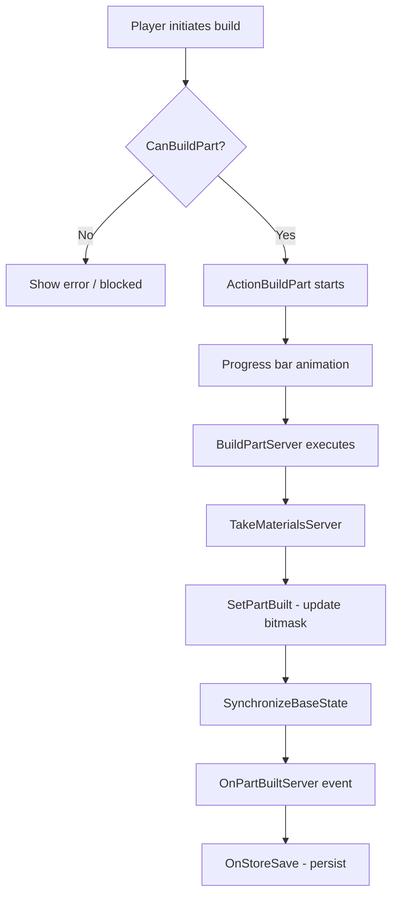

# Chapter 6.17: Construction System

[Home](../README.md) | [<< Previous: Crafting System](16-crafting-system.md) | **Construction System** | [Next: Animation System >>](18-animation-system.md)

---

## Introduction

DayZ's base building system allows players to construct fortifications --- fences, watchtowers, and shelters --- by assembling individual parts using tools and materials. Each structure is divided into named construction parts (walls, platforms, roofs, gates) that are built, dismantled, or destroyed independently.

The system lives primarily in three files:

- `4_World/entities/itembase/basebuildingbase.c` --- the entity base class
- `4_World/classes/basebuilding/construction.c` --- the construction manager
- `4_World/classes/basebuilding/constructionpart.c` --- individual part representation

Construction actions are in `4_World/classes/useractionscomponent/actions/continuous/` and construction data management is handled by `constructionactiondata.c`.

---

## Class Hierarchy

```
ItemBase
└── BaseBuildingBase                    // 4_World/entities/itembase/basebuildingbase.c
    ├── Fence                           // fence.c — gates, combo locks, barbed wire
    ├── Watchtower                      // watchtower.c — multi-floor tower (3 levels)
    └── ShelterSite                     // sheltersite.c — transforms into finished shelter

TentBase
└── ShelterBase                         // shelter.c — finished shelters (leather/fabric/stick)
```

Supporting classes:

```
Construction                            // Manager: parts registry, build/dismantle/destroy logic
ConstructionPart                        // Single buildable section with state and dependencies
ConstructionActionData                  // Client-side data bridge between actions and parts
ConstructionBoxTrigger                  // Collision detection during building
StaticConstructionMethods               // Utility: spawning material piles on dismantle
```

`ShelterSite` extends `BaseBuildingBase` (the buildable site), while finished shelters extend `TentBase` and replace the site on completion.

### BaseBuildingBase Key Members

```
ref Construction    m_Construction;         // the construction manager
bool                m_HasBase;              // whether the foundation part is built
int                 m_SyncParts01;          // bitmask for parts 1-31
int                 m_SyncParts02;          // bitmask for parts 32-62
int                 m_SyncParts03;          // bitmask for parts 63-93
int                 m_InteractedPartId;     // last part an action was performed on
int                 m_PerformedActionId;    // last action type (build/dismantle/destroy)
float               m_ConstructionKitHealth;// stored health for the originating kit
```

All sync variables are registered in the constructor. `ConstructionInit()` creates the `Construction` manager:

```
void ConstructionInit()
{
    if (!m_Construction)
        m_Construction = new Construction(this);
    GetConstruction().Init();
}

Construction GetConstruction()
{
    return m_Construction;
}
```

---

## Construction Parts

Each buildable section is a `ConstructionPart` with these fields:

| Field | Type | Description |
|-------|------|-------------|
| `m_Name` | `string` | Localized display name |
| `m_Id` | `int` | Unique ID for bitmask sync (1-93) |
| `m_PartName` | `string` | Config class name (e.g., `"wall_base_down"`) |
| `m_MainPartName` | `string` | Parent section (e.g., `"wall"`) |
| `m_IsBuilt` | `bool` | Current built state |
| `m_IsBase` | `bool` | True = foundation part (destroying it deletes the whole structure) |
| `m_IsGate` | `bool` | True = functions as openable gate |
| `m_RequiredParts` | `array<string>` | Parts that must be built first |

Parts are registered from `config.cpp` during `Construction.Init()` via `UpdateConstructionParts()`, which reads `cfgVehicles <TypeName> Construction`. The system supports up to **93 parts** (3 x 31-bit sync integers).

### Config Structure Per Part

```
Construction
  <main_part_name>               // e.g., "wall"
    <part_name>                  // e.g., "wall_base_down"
      name = "#str_...";        // localized name
      id = 1;                   // unique sync ID (1-93)
      is_base = 1;              // foundation flag
      is_gate = 0;              // gate flag
      show_on_init = 0;         // initial visibility
      required_parts[] = {};    // prerequisite parts
      conflicted_parts[] = {};  // mutually exclusive parts
      build_action_type = 4;    // tool bitmask for building
      dismantle_action_type = 4;// tool bitmask for dismantling
      material_type = 2;        // ConstructionMaterialType (determines sound)
      Materials { ... };        // required materials
      collision_data[] = { "part_min", "part_max" };  // memory point pair
```

Material type enum: `MATERIAL_NONE(0)`, `MATERIAL_LOG(1)`, `MATERIAL_WOOD(2)`, `MATERIAL_STAIRS(3)`, `MATERIAL_METAL(4)`, `MATERIAL_WIRE(5)`.

---

## Building Process

### Process Flow



### Checking Eligibility

`Construction.CanBuildPart(string part_name, ItemBase tool, bool use_tool)` returns true only when ALL conditions pass:

1. Part is not already built (`!IsPartConstructed`)
2. All prerequisite parts are built (`HasRequiredPart`)
3. No conflicting parts are built (`!HasConflictPart`)
4. Required materials are attached with sufficient quantity (`HasMaterials`)
5. Tool's `build_action_type` matches part's via bitwise AND (`CanUseToolToBuildPart`), skipped if `use_tool` is false
6. No attached materials are ruined (`!MaterialIsRuined`)

Tool matching uses bitmask AND: a tool with `build_action_type = 6` (110) can build parts requiring type 2 (010) or 4 (100).

### Material Checking

Each material entry in config specifies `type`, `slot_name`, `quantity`, and `lockable`. `HasMaterials()` checks that each slot has an attachment with at least the required quantity. For repairs, quantity is reduced to 15% (`REPAIR_MATERIAL_PERCENTAGE = 0.15`), minimum 1.

### Executing the Build

```
void BuildPartServer(notnull Man player, string part_name, int action_id)
{
    // Reset damage zone health to max
    GetParent().SetHealthMax(damage_zone);
    // Consume/lock materials
    TakeMaterialsServer(part_name);
    // Destroy collision check trigger
    DestroyCollisionTrigger();
    // Notify parent entity
    GetParent().OnPartBuiltServer(player, part_name, action_id);
}
```

`TakeMaterialsServer()` handles three material types:
- **Lockable** (e.g., barbed wire): slot is locked, item stays attached but cannot be removed
- **Quantity-based**: quantity subtracted from attachment stack
- **Delete** (quantity = -1): entire attachment is deleted

`OnPartBuiltServer()` then: registers the part bit, syncs to clients, updates visuals/physics/navmesh, and if the part `IsBase()`, marks the base state and spawns a construction kit.

### Synchronization

Part states sync via three `int` bitmask variables (`m_SyncParts01/02/03`). The server manages these with:

```
void RegisterPartForSync(int part_id)    // sets bit in appropriate sync variable
void UnregisterPartForSync(int part_id)  // clears bit
bool IsPartBuildInSyncData(int part_id)  // reads bit state
```

After changing bits, the server calls `SynchronizeBaseState()` which triggers `SetSynchDirty()`. On the client, `OnVariablesSynchronized()` fires `SetPartsFromSyncData()`, iterating all parts and updating built states, visuals, and physics.

Action type constants (defined in `_constants.c`):

| Constant | Value | Purpose |
|----------|-------|---------|
| `AT_BUILD_PART` | 193 | Build action identifier |
| `AT_DISMANTLE_PART` | 195 | Dismantle action identifier |
| `AT_DESTROY_PART` | 209 | Destroy action identifier |

### Persistence

`BaseBuildingBase` saves state through the standard storage API:

```
override void OnStoreSave(ParamsWriteContext ctx)
{
    super.OnStoreSave(ctx);
    ctx.Write(m_SyncParts01);
    ctx.Write(m_SyncParts02);
    ctx.Write(m_SyncParts03);
    ctx.Write(m_HasBase);
}
```

On load, `AfterStoreLoad()` calls `SetPartsAfterStoreLoad()` which reconstructs all part states from the bitmask, restores the base state flag, and synchronizes.

---

## Dismantling and Destroying

### Dismantling (returns materials)

```
bool CanDismantlePart(string part_name, ItemBase tool)
    // Part must be built, have no dependent parts, and tool must match dismantle_action_type
```

`DismantlePartServer()` calls `ReceiveMaterialsServer()` which spawns material piles. Material return is reduced by damage level: `qty_coef = 1 - (healthLevel * 0.2) - 0.2`. A fully healthy part returns 80%; each damage level costs 20% more.

Dismantling the base part triggers `DestroyConstruction()` (deletes the entire entity) after a 200ms delay.

### Destroying (no material return)

```
bool CanDestroyPart(string part_name)
    // Part must be built and have no dependent parts (no tool check)
```

`DestroyPartServer()` destroys lockable materials (deletes them), drops remaining attachments, sets the damage zone health to zero, and calls `DestroyConnectedParts()` which recursively destroys any built parts that depend on the destroyed one.

Exception: gate parts are not cascade-destroyed if either `wall_base_down` or `wall_base_up` is still built.

---

## Construction Actions

### ActionBuildPart

Full-body continuous action. Duration: `UATimeSpent.BASEBUILDING_CONSTRUCT_MEDIUM`. Requires non-ruined tool in hand. Uses the **variant system** --- `ConstructionActionData.OnUpdateActions()` populates a list of buildable parts for the targeted component, and `m_VariantID` selects which part to build.

Animation varies by tool type:

| Tool | Animation Command |
|------|-------------------|
| Pickaxe, Shovel, FarmingHoe, FieldShovel | `CMD_ACTIONFB_DIG` |
| Pliers | `CMD_ACTIONFB_INTERACT` |
| SledgeHammer | `CMD_ACTIONFB_MINEROCK` |
| All others | `CMD_ACTIONFB_ASSEMBLE` |

On completion, calls `BuildPartServer()` and damages the tool (`UADamageApplied.BUILD`). Both `ActionConditionContinue()` and `OnFinishProgressServer()` perform collision checks via `IsCollidingEx()` to prevent building through players or geometry.

### ActionDismantlePart

Full-body continuous action. Duration: `UATimeSpent.BASEBUILDING_DECONSTRUCT_SLOW`. Additional conditions beyond `CanDismantlePart()`:

- Part cannot be on a locked gate (combination lock or flag attached)
- Gate parts cannot be dismantled while the gate is opened
- Camera direction and player position checks prevent dismantling from the wrong side
- Player cannot be prone

On completion, calls `DismantlePartServer()` and damages the tool (`UADamageApplied.DISMANTLE`).

### ActionDestroyPart

Full-body continuous action using `CAContinuousRepeat` with **4 cycles** (`static int CYCLES = 4`). Each cycle removes 25% of the part's max health via `AddHealth()`:

```
base_building.AddHealth(zone_name, "Health", -(base_building.GetMaxHealth(zone_name, "") / CYCLES));
if (base_building.GetHealth(zone_name, "Health") < 1)
    construction.DestroyPartServer(player, part_name, AT_DESTROY_PART);
```

Only when health drops below 1 does `DestroyPartServer()` execute. Tool is damaged each cycle (`UADamageApplied.DESTROY`). Parts without a damage zone are destroyed immediately on the first cycle.

### ActionBuildShelter

No-tool continuous interact action (`ContinuousInteractActionInput`) for `ShelterSite`. Three variants: leather, fabric, stick. When building completes, `ShelterSite.OnPartBuiltServer()` spawns the corresponding finished shelter object (`ShelterLeather`, `ShelterFabric`, or `ShelterStick`) and deletes the site. Player hands are hidden during the action.

### ConstructionActionData

Stored per-player, this class bridges client UI and server execution:

```
ref array<ConstructionPart>  m_BuildParts;          // parts buildable with tool
ref array<ConstructionPart>  m_BuildPartsNoTool;     // parts buildable without tool (shelters)
ref ConstructionPart         m_TargetPart;           // target for dismantle/destroy
```

The `OnUpdateActions()` callback is registered with `ActionVariantManager` and fires when the player looks at a construction object, populating the build part list for the action variant system.

---

## Creating Custom Buildable Objects

### 1. Entity Class

```
class MyWall extends BaseBuildingBase
{
    override string GetConstructionKitType() { return "MyWallKit"; }
    override int GetMeleeTargetType() { return EMeleeTargetType.NONALIGNABLE; }
    override vector GetKitSpawnPosition()
    {
        if (MemoryPointExists("kit_spawn_position"))
            return ModelToWorld(GetMemoryPointPos("kit_spawn_position"));
        return GetPosition();
    }
}
```

### 2. config.cpp

Define `Construction` with parts and materials, `GUIInventoryAttachmentsProps` for material attachment slots, and `DamageSystem` with zones matching part names:

```cpp
class CfgVehicles
{
    class BaseBuildingBase;
    class MyWall : BaseBuildingBase
    {
        scope = 2;
        displayName = "My Wall";
        model = "path\to\mywall.p3d";
        attachments[] = { "Material_WoodenLogs", "Material_WoodenPlanks", "Material_Nails" };

        class GUIInventoryAttachmentsProps
        {
            class base_mats
            {
                name = "Base";
                selection = "wall";
                attachmentSlots[] = { "Material_WoodenLogs" };
            };
        };

        class Construction
        {
            class wall
            {
                class wall_base
                {
                    name = "$STR_my_wall_base";
                    id = 1;
                    is_base = 1;
                    is_gate = 0;
                    show_on_init = 0;
                    required_parts[] = {};
                    conflicted_parts[] = {};
                    build_action_type = 1;
                    dismantle_action_type = 4;
                    material_type = 1;  // LOG
                    class Materials
                    {
                        class material_0
                        {
                            type = "WoodenLog";
                            slot_name = "Material_WoodenLogs";
                            quantity = 2;
                            lockable = 0;
                        };
                    };
                    collision_data[] = { "wall_base_min", "wall_base_max" };
                };
            };
        };

        class DamageSystem
        {
            class GlobalHealth { class Health { hitpoints = 1000; }; };
            class DamageZones
            {
                class wall_base  // must match part_name
                {
                    class Health { hitpoints = 500; transferToGlobalCoef = 0; };
                    componentNames[] = { "wall_base" };
                    fatalInjuryCoef = -1;
                };
            };
        };
    };
};
```

### 3. Model Requirements

The p3d model must have:
- **Named selections** matching each `part_name` (toggled via `SetAnimationPhase`: 0=visible, 1=hidden)
- **Animation sources** for each selection (type `user`, range 0-1)
- **Proxy physics** geometry per part (separate named physics components)
- **Memory points** `<part_name>_min` / `<part_name>_max` for collision boxes
- **`kit_spawn_position`** memory point
- **Component names** in geometry LOD matching part names (for `GetActionComponentName()`)
- **`Deployed`** selection for the unbuilt state

### 4. Construction Kit

Create a kit item extending `KitBase` that players place to spawn the construction site.

---

## Visuals and Physics

Construction visibility is controlled through **animation phases** on the 3D model. Each construction part name corresponds to a named selection:

```
// Show a part (phase 0 = visible)
GetParent().SetAnimationPhase(part_name, 0);

// Hide a part (phase 1 = hidden)
GetParent().SetAnimationPhase(part_name, 1);
```

Physics (collision geometry) uses proxy physics:

```
GetParent().AddProxyPhysics(part_name);     // enable collision
GetParent().RemoveProxyPhysics(part_name);  // disable collision
```

The Watchtower overrides `UpdateVisuals()` to handle its multi-floor system: upper floor view geometry (`level_2`, `level_3`) is only shown when the roof below is built. Wall naming follows the pattern `level_N_wall_M` (3 walls per floor, 3 floors max).

---

## Vanilla Buildable Objects

### Fence

The most common structure. Kit: `FenceKit`. Features a gate system with three states (`GATE_STATE_NONE`, `GATE_STATE_PARTIAL`, `GATE_STATE_FULL`). A fully constructed gate can accept a `CombinationLock` attachment. Supports barbed wire (2 slots creating area damage when mounted) and camo net. Gate opening rotates 100 degrees over ~2 seconds.

### Watchtower

Multi-level tower. Kit: `WatchtowerKit`. Up to 3 floors with walls and roofs per level. Constants: `MAX_WATCHTOWER_FLOORS = 3`, `MAX_WATCHTOWER_WALLS = 3`. Has a `MAX_FLOOR_VERTICAL_DISTANCE = 0.5` check preventing attachment of items from too far below the target floor.

### ShelterSite

Temporary construction site. Kit: `ShelterKit`. Three mutually exclusive build options (leather, fabric, stick) that each spawn a different finished `ShelterBase` subclass and delete the site. Built without tools via `ActionBuildShelter`.

---

## Damage and Raiding

Each construction part maps to a **damage zone** whose name matches the part name (case-insensitive). When a part is built, its health is set to maximum. When a damage zone reaches `STATE_RUINED`, `EEHealthLevelChanged()` triggers automatic destruction:

```
if (newLevel == GameConstants.STATE_RUINED)
{
    construction.DestroyPartServer(null, part_name, AT_DESTROY_PART);
    construction.DestroyConnectedParts(part_name);
}
```

This is the raiding mechanism: explosives and weapons deal damage to damage zones until they reach ruined state. Barbed wire attachments have special handling --- when their zone is ruined, the wire's mounted state is cleared.

Server admins can make bases indestructible via the `"disableBaseDamage"` invulnerability type in `cfgGameplay.json`.

Repair uses `TakeMaterialsServer(part_name, true)`, requiring only 15% of original materials.

---

## Best Practices

1. **Part IDs must be unique** within an object (1-93 range). Gaps are allowed but waste capacity.
2. **Always define `collision_data` memory points** to prevent building through geometry.
3. **Use `required_parts`** to enforce build order (foundation before walls).
4. **Use `conflicted_parts`** for mutually exclusive options (wall vs gate on same section).
5. **Match damage zone names to part names** exactly (case-insensitive) or health/damage will not work.
6. **Enable debug logging** via `LogManager.IsBaseBuildingLogEnable()` for diagnostics --- the vanilla code has extensive `[bsb]` prefixed debug output.
7. **Stay under 93 parts** per object. Complex structures should be split into multiple placeable objects.

---

## Observed in Real Mods

- **DayZ Expansion** extends `BaseBuildingBase` with custom floors, walls, and ramps using dozens of parts per object.
- **Raid mods** override `EEHealthLevelChanged()` or adjust `DamageZones` hitpoints to tune raid difficulty.
- **BuildAnywhere** mods override `IsCollidingEx()` to return `false`, disabling placement collision.
- **Advanced BB mods** use `modded BaseBuildingBase` to inject custom persistence, logging, or anti-grief checks into build/dismantle events.

---

## Common Mistakes

| Mistake | Consequence | Fix |
|---------|-------------|-----|
| Part ID exceeds 93 | State never syncs/persists | Keep IDs in 1-93 range |
| Missing model selection | Part builds but is invisible | Add named selection matching `part_name` |
| Damage zone name mismatch | Health never set, part undamageable | Use identical names |
| No `required_parts` | Walls buildable without foundation | Define dependencies |
| Missing `GetConstructionKitType()` | Empty string causes errors | Override and return kit class |
| Missing collision memory points | Build checks fail silently | Add `_min` / `_max` points |

---

## Compatibility and Impact

The construction system integrates deeply with: **inventory** (materials as attachments), **damage** (per-part zones), **actions** (continuous + variant system), **navmesh** (updated after every change), **persistence** (bitmask storage), and **network sync** (`RegisterNetSyncVariable`).

Mods should use `modded` keyword on `BaseBuildingBase` / `Construction` rather than full replacement. Be especially careful with the sync flow --- modifying bitmask variables or `RegisterPartForSync` without understanding the full chain causes server-client desynchronization.

---

*Key source files: `basebuildingbase.c`, `construction.c`, `constructionpart.c`, `constructionactiondata.c`, `actionbuildpart.c`, `actiondismantlepart.c`, `actiondestroypart.c`, `actionbuildshelter.c`, `fence.c`, `watchtower.c`, `sheltersite.c`, `_constants.c`*
