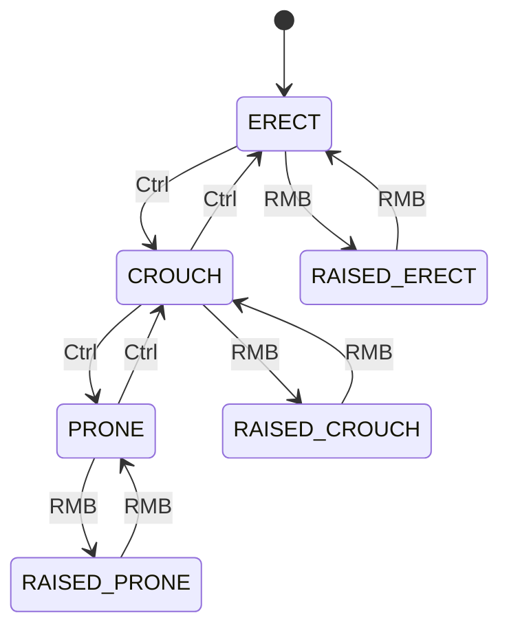

# Chapter 6.18: Animation System

[Home](../README.md) | [<< Previous: Construction System](17-construction-system.md) | **Animation System** | [Next: Terrain & World Queries >>](19-terrain-queries.md)

---

## Introduction

DayZ uses a state-machine-driven animation system built into the Enfusion engine. Player animations are controlled by a hierarchy of `HumanCommand` classes -- movement, actions, climbing, swimming, vehicles, falling, death, and unconsciousness each have their own dedicated command. Object animations (doors, lids, deployables) are driven through `model.cfg` AnimationSources and controlled from script via `SetAnimationPhase()`.

This chapter covers the full animation API: the player movement state machine, the human command system, the gesture/emote pipeline, object animation sources, action callbacks with animation events, and the key constants from `DayZPlayerConstants` that modders interact with daily. All method signatures and constants are taken directly from the vanilla script source.

---

## Player Movement State Machine

### Stance Transitions



### HumanMovementState

The engine exposes the player's current animation state through `HumanMovementState`. Retrieve it by calling `GetMovementState()` on any `Human` (or subclass):

```csharp
// Source: scripts/3_game/human.c
class HumanMovementState
{
    int     m_CommandTypeId;   // current command ID (COMMANDID_MOVE, COMMANDID_ACTION, etc.)
    int     m_iStanceIdx;      // current stance (STANCEIDX_ERECT, STANCEIDX_CROUCH, etc.)
    int     m_iMovement;       // 0=idle, 1=walk, 2=run, 3=sprint
    float   m_fLeaning;        // leaning offset, 0 when not leaning

    bool IsRaised();           // true when stance >= STANCEIDX_RAISEDERECT
    bool IsRaisedInProne();    // true when STANCEIDX_RAISEDPRONE
    bool IsInProne();          // true when STANCEIDX_PRONE
    bool IsInRaisedProne();    // true when STANCEIDX_RAISEDPRONE
    bool IsLeaning();          // true when m_fLeaning != 0
}
```

Usage pattern:

```csharp
HumanMovementState state = new HumanMovementState();
player.GetMovementState(state);

if (state.m_iStanceIdx == DayZPlayerConstants.STANCEIDX_PRONE)
{
    // player is prone
}

if (state.m_iMovement >= 2)
{
    // player is running or sprinting
}
```

### Stance Indices

These constants identify the player's current body posture. Defined in `DayZPlayerConstants` (scripts/3_game/dayzplayer.c):

| Constant | Value | Description |
|----------|-------|-------------|
| `STANCEIDX_ERECT` | 0 | Standing upright |
| `STANCEIDX_CROUCH` | 1 | Crouching |
| `STANCEIDX_PRONE` | 2 | Lying down |
| `STANCEIDX_RAISEDERECT` | 3 | Standing with weapon raised |
| `STANCEIDX_RAISEDCROUCH` | 4 | Crouching with weapon raised |
| `STANCEIDX_RAISEDPRONE` | 5 | Prone with weapon raised |
| `STANCEIDX_RAISED` | 3 | Offset -- add to base stance to get raised variant |

The relationship: `STANCEIDX_ERECT + STANCEIDX_RAISED = STANCEIDX_RAISEDERECT`.

### Stance Masks

Bitmask flags used by `IsPlayerInStance()` and `StartCommand_Action()` to specify which stances an animation supports:

| Constant | Description |
|----------|-------------|
| `STANCEMASK_ERECT` | Standing |
| `STANCEMASK_CROUCH` | Crouching |
| `STANCEMASK_PRONE` | Prone |
| `STANCEMASK_RAISEDERECT` | Standing raised |
| `STANCEMASK_RAISEDCROUCH` | Crouching raised |
| `STANCEMASK_RAISEDPRONE` | Prone raised |
| `STANCEMASK_ALL` | All stances combined |
| `STANCEMASK_NOTRAISED` | `ERECT \| CROUCH \| PRONE` |
| `STANCEMASK_RAISED` | `RAISEDERECT \| RAISEDCROUCH \| RAISEDPRONE` |

```csharp
// DayZPlayer method:
proto native bool IsPlayerInStance(int pStanceMask);

// Example: check if standing or crouching (not raised)
if (player.IsPlayerInStance(DayZPlayerConstants.STANCEMASK_ERECT | DayZPlayerConstants.STANCEMASK_CROUCH))
{
    // player is in erect or crouch, weapon lowered
}
```

### Movement Indices

| Constant | Value | Description |
|----------|-------|-------------|
| `MOVEMENTIDX_SLIDE` | -2 | Sliding |
| `MOVEMENTIDX_IDLE` | 0 | Stationary |
| `MOVEMENTIDX_WALK` | 1 | Walking |
| `MOVEMENTIDX_RUN` | 2 | Jogging |
| `MOVEMENTIDX_SPRINT` | 3 | Sprinting |
| `MOVEMENTIDX_CROUCH_RUN` | 4 | Crouch running |

The `m_iMovement` field in `HumanMovementState` uses these values.

---

## Human Command System

At any given moment, exactly one **main command** controls the player's animation state. The engine provides getter methods that return `null` when that command is not the active one. Only the currently active command returns a valid object.

### Command Hierarchy

| Getter | Class | Description |
|--------|-------|-------------|
| `GetCommand_Move()` | `HumanCommandMove` | Normal locomotion (idle, walk, run, sprint) |
| `GetCommand_Action()` | `HumanCommandActionCallback` | Full-body action animations |
| `GetCommand_Melee()` | `HumanCommandMelee` | Legacy melee |
| `GetCommand_Melee2()` | `HumanCommandMelee2` | Light/heavy melee system |
| `GetCommand_Fall()` | `HumanCommandFall` | Falling/jumping |
| `GetCommand_Ladder()` | `HumanCommandLadder` | Climbing ladders |
| `GetCommand_Swim()` | `HumanCommandSwim` | Swimming |
| `GetCommand_Vehicle()` | `HumanCommandVehicle` | Seated in vehicle |
| `GetCommand_Climb()` | `HumanCommandClimb` | Climbing over obstacles |
| `GetCommand_Death()` | `HumanCommandDeathCallback` | Death animation |
| `GetCommand_Unconscious()` | `HumanCommandUnconscious` | Unconscious state |
| `GetCommand_Damage()` | `HumanCommandFullBodyDamage` | Full-body damage reaction |
| `GetCommand_Script()` | `HumanCommandScript` | Fully scriptable custom command |

Each command also has a corresponding `StartCommand_*()` method on the `Human` class.

### Command IDs

Every command type has a unique integer ID stored in `HumanMovementState.m_CommandTypeId`. Also returned by `GetCurrentCommandID()`:

| Constant | Description |
|----------|-------------|
| `COMMANDID_NONE` | No command (invalid) |
| `COMMANDID_MOVE` | Normal movement |
| `COMMANDID_ACTION` | Full-body action |
| `COMMANDID_MELEE` | Melee (legacy) |
| `COMMANDID_MELEE2` | Melee light/heavy |
| `COMMANDID_FALL` | Falling |
| `COMMANDID_DEATH` | Dead |
| `COMMANDID_DAMAGE` | Full-body damage |
| `COMMANDID_LADDER` | On ladder |
| `COMMANDID_UNCONSCIOUS` | Unconscious |
| `COMMANDID_SWIM` | Swimming |
| `COMMANDID_VEHICLE` | In vehicle |
| `COMMANDID_CLIMB` | Climbing |
| `COMMANDID_SCRIPT` | Scripted command |

Modifier command IDs (additive, always-on):

| Constant | Description |
|----------|-------------|
| `COMMANDID_MOD_LOOKAT` | Head look-at (always active) |
| `COMMANDID_MOD_WEAPONS` | Weapon handling (always active) |
| `COMMANDID_MOD_ACTION` | Additive action overlay |
| `COMMANDID_MOD_DAMAGE` | Additive damage reaction |

### HumanCommandMove

The default locomotion command. Available methods:

```csharp
class HumanCommandMove
{
    proto native float GetCurrentMovementAngle();    // -180..180 degrees
    proto bool         GetCurrentInputAngle(out float pAngle);  // raw input
    proto native float GetCurrentMovementSpeed();    // 0=idle, 1=walk, 2=run, 3=sprint
    proto native bool  IsChangingStance();
    proto native bool  IsOnBack();                   // prone on back
    proto native bool  IsInRoll();                   // barrel rolling
    proto native bool  IsLeavingUncon();
    proto native void  ForceStance(int pStanceIdx);  // force stance, -1 to release
    proto native void  ForceStanceUp(int pStanceIdx); // force stand up
    proto native void  SetMeleeBlock(bool pBlock);
    proto native void  StartMeleeEvade();
}
```

### HumanCommandFall

```csharp
class HumanCommandFall
{
    static const int LANDTYPE_NONE   = 0;
    static const int LANDTYPE_LIGHT  = 1;
    static const int LANDTYPE_MEDIUM = 2;
    static const int LANDTYPE_HEAVY  = 3;

    proto native bool PhysicsLanded();   // true when physically touched ground
    proto native void Land(int pLandType);
    proto native bool IsLanding();       // true during landing animation
}
```

### HumanCommandVehicle

```csharp
class HumanCommandVehicle
{
    proto native Transport GetTransport();
    proto native int       GetVehicleClass();  // VEHICLECLASS_CAR, HELI, BOAT
    proto native int       GetVehicleSeat();   // VEHICLESEAT_DRIVER, CODRIVER, etc.
    proto native void      GetOutVehicle();
    proto native void      JumpOutVehicle();
    proto native void      SwitchSeat(int pTransportPositionIndex, int pVehicleSeat);
    proto native bool      IsGettingIn();
    proto native bool      IsGettingOut();
    proto native bool      IsSwitchSeat();
}
```

### HumanCommandClimb

```csharp
class HumanCommandClimb
{
    proto native int    GetState();  // returns ClimbStates enum value
    proto native vector GetGrabPointWS();
    proto native vector GetClimbOverStandPointWS();

    // Static tests -- use before starting a climb
    proto native static bool DoClimbTest(Human pHuman, SHumanCommandClimbResult pResult, int pDebugDrawLevel);
    proto native static bool DoPerformClimbTest(Human pHuman, SHumanCommandClimbResult pResult, int pDebugDrawLevel);
}

enum ClimbStates
{
    STATE_MOVE,
    STATE_TAKEOFF,
    STATE_ONTOP,
    STATE_FALLING,
    STATE_FINISH
}
```

### HumanCommandUnconscious

```csharp
class HumanCommandUnconscious
{
    proto native void WakeUp(int targetStance = -1);
    proto native bool IsWakingUp();
    proto native bool IsOnLand();
    proto native bool IsInWater();
}
```

---

## Gesture / Emote System

DayZ's gesture system lets players perform social animations (wave, point, sit, dance, surrender, suicide, etc.). It is built on three layers: `EmoteConstants` (IDs), `EmoteBase` (per-emote configuration), and `EmoteManager` (playback orchestration).

### EmoteConstants

All emote IDs are defined in `EmoteConstants` (scripts/3_game/constants.c):

| Constant | ID | Notes |
|----------|----|-------|
| `ID_EMOTE_GREETING` | 1 | Wave/greeting |
| `ID_EMOTE_SOS` | 2 | Full-body SOS signal |
| `ID_EMOTE_HEART` | 3 | Heart gesture |
| `ID_EMOTE_TAUNT` | 4 | Taunt |
| `ID_EMOTE_LYINGDOWN` | 5 | Lie down |
| `ID_EMOTE_TAUNTKISS` | 6 | Blow kiss taunt |
| `ID_EMOTE_FACEPALM` | 7 | Facepalm |
| `ID_EMOTE_TAUNTELBOW` | 8 | Elbow taunt |
| `ID_EMOTE_THUMB` | 9 | Thumbs up |
| `ID_EMOTE_THROAT` | 10 | Throat cut |
| `ID_EMOTE_SUICIDE` | 11 | Suicide (full-body) |
| `ID_EMOTE_DANCE` | 12 | Dance |
| `ID_EMOTE_CAMPFIRE` | 13 | Sit by campfire |
| `ID_EMOTE_SITA` | 14 | Sit variant A |
| `ID_EMOTE_SITB` | 15 | Sit variant B |
| `ID_EMOTE_THUMBDOWN` | 16 | Thumbs down |
| `ID_EMOTE_DABBING` | 32 | Dab |
| `ID_EMOTE_TIMEOUT` | 35 | Timeout signal |
| `ID_EMOTE_CLAP` | 39 | Clapping |
| `ID_EMOTE_POINT` | 40 | Point at something |
| `ID_EMOTE_SILENT` | 43 | Silence gesture |
| `ID_EMOTE_SALUTE` | 44 | Military salute |
| `ID_EMOTE_RPS` | 45 | Rock-Paper-Scissors |
| `ID_EMOTE_WATCHING` | 46 | Watching gesture |
| `ID_EMOTE_HOLD` | 47 | Hold position |
| `ID_EMOTE_LISTENING` | 48 | Listening |
| `ID_EMOTE_POINTSELF` | 49 | Point at self |
| `ID_EMOTE_LOOKATME` | 50 | Look at me |
| `ID_EMOTE_TAUNTTHINK` | 51 | Thinking taunt |
| `ID_EMOTE_MOVE` | 52 | Move out signal |
| `ID_EMOTE_DOWN` | 53 | Get down signal |
| `ID_EMOTE_COME` | 54 | Come here |
| `ID_EMOTE_NOD` | 58 | Nod yes |
| `ID_EMOTE_SHAKE` | 59 | Shake no |
| `ID_EMOTE_SHRUG` | 60 | Shrug |
| `ID_EMOTE_SURRENDER` | 61 | Surrender |
| `ID_EMOTE_VOMIT` | 62 | Vomit |

### EmoteBase Class

Each emote is a class extending `EmoteBase` (scripts/4_world/classes/emoteclasses/emotebase.c). It defines stance requirements, animation callback IDs, and optional conditions:

```csharp
class EmoteBase
{
    protected int    m_ID;                    // EmoteConstants ID
    protected string m_InputActionName;       // input action name (e.g. "EmoteGreeting")
    protected int    m_StanceMaskAdditive;    // stances for additive (overlay) playback
    protected int    m_StanceMaskFullbody;    // stances for full-body playback
    protected int    m_AdditiveCallbackUID;   // CMD_GESTUREMOD_* constant
    protected int    m_FullbodyCallbackUID;   // CMD_GESTUREFB_* constant
    protected bool   m_HideItemInHands;       // hide held item during emote

    bool EmoteCondition(int stancemask);      // override for custom preconditions
    bool CanBeCanceledNormally(notnull EmoteCB callback);
    bool EmoteFBStanceCheck(int stancemask);  // validates full-body stance
    bool DetermineOverride(out int callback_ID, out int stancemask, out bool is_fullbody);
    void OnBeforeStandardCallbackCreated(int callback_ID, int stancemask, bool is_fullbody);
    void OnCallbackEnd();
    bool EmoteStartOverride(typename callbacktype, int id, int mask, bool fullbody);
}
```

Example -- the greeting emote supports additive playback in erect/crouch and full-body in prone:

```csharp
class EmoteGreeting extends EmoteBase
{
    void EmoteGreeting()
    {
        m_ID = EmoteConstants.ID_EMOTE_GREETING;
        m_InputActionName = "EmoteGreeting";
        m_StanceMaskAdditive = DayZPlayerConstants.STANCEMASK_CROUCH | DayZPlayerConstants.STANCEMASK_ERECT;
        m_StanceMaskFullbody = DayZPlayerConstants.STANCEMASK_PRONE;
        m_AdditiveCallbackUID = DayZPlayerConstants.CMD_GESTUREMOD_GREETING;
        m_FullbodyCallbackUID = DayZPlayerConstants.CMD_GESTUREFB_GREETING;
        m_HideItemInHands = false;
    }
}
```

Some emotes require empty hands (dance, SOS, salute, clap) via `EmoteCondition`:

```csharp
class EmoteDance extends EmoteBase
{
    void EmoteDance()
    {
        m_ID = EmoteConstants.ID_EMOTE_DANCE;
        m_InputActionName = "EmoteDance";
        m_StanceMaskAdditive = 0;                    // no additive variant
        m_StanceMaskFullbody = DayZPlayerConstants.STANCEMASK_ERECT;
        m_FullbodyCallbackUID = DayZPlayerConstants.CMD_GESTUREFB_DANCE;
        m_HideItemInHands = true;
    }

    override bool EmoteCondition(int stancemask)
    {
        if (m_Player.GetBrokenLegs() == eBrokenLegs.BROKEN_LEGS)
            return false;
        return !m_Player.GetItemInHands();
    }
}
```

### Additive vs Full-Body Emotes

Emotes have two playback modes, selected automatically by `EmoteManager.DetermineEmoteData()`:

- **Additive (modifier):** Overlaid on top of locomotion. Player can still move. Uses `AddCommandModifier_Action()`. Triggered when the player is in a stance matching `m_StanceMaskAdditive`.
- **Full-body:** Takes over the entire animation state. Player cannot move. Uses `StartCommand_Action()`. Triggered when the player is in a stance matching `m_StanceMaskFullbody`.

The `CMD_GESTUREMOD_*` constants map to additive versions; `CMD_GESTUREFB_*` constants map to full-body versions.

### EmoteManager

`EmoteManager` (scripts/4_world/classes/emotemanager.c) orchestrates emote playback. It is created per-player and ticked each frame from the player's `CommandHandler`:

Key responsibilities:
- Registers all emotes via `EmoteConstructor.ConstructEmotes()`
- Detects emote input via `DetermineGestureIndex()` (checks keybinds)
- Selects additive vs full-body based on current stance
- Creates the `EmoteCB` callback and manages its lifecycle
- Handles interrupt conditions (movement input, water depth, weapon raise)
- Manages surrender state and suicide emote logic

### EmoteLauncher

`EmoteLauncher` is a request object used to queue emotes from script (e.g., from the gesture menu or forced server-side):

```csharp
class EmoteLauncher
{
    static const int FORCE_NONE      = 0;  // normal playback
    static const int FORCE_DIFFERENT = 1;  // force if different from current
    static const int FORCE_ALL       = 2;  // force always

    void EmoteLauncher(int emoteID, bool interrupts_same);
    void SetForced(int mode);
    void SetStartGuaranteed(bool guaranteed);  // remains queued until played
}
```

### Playing Emotes from Script

To play an emote programmatically, use the `EmoteManager`:

```csharp
// Get the player's emote manager
EmoteManager emoteManager = player.GetEmoteManager();

// Create a launcher for the greeting emote
EmoteLauncher launcher = new EmoteLauncher(EmoteConstants.ID_EMOTE_GREETING, true);
launcher.SetForced(EmoteLauncher.FORCE_ALL);

// Queue it (the manager processes it in its Update)
emoteManager.CreateEmoteCBFromMenu(EmoteConstants.ID_EMOTE_GREETING);
```

Alternatively, for direct action-level control (used in camera tools and debug):

```csharp
// Full-body gesture directly via StartCommand_Action
EmoteCB cb = EmoteCB.Cast(
    player.StartCommand_Action(
        DayZPlayerConstants.CMD_GESTUREFB_DANCE,
        EmoteCB,
        DayZPlayerConstants.STANCEMASK_ALL
    )
);
```

### EmoteConstructor and Registration

`EmoteConstructor` (scripts/4_world/classes/emoteconstructor.c) registers all vanilla emotes. Modders can override `RegisterEmotes()` via `modded class` to add custom entries:

```csharp
modded class EmoteConstructor
{
    override void RegisterEmotes(TTypenameArray emotes)
    {
        super.RegisterEmotes(emotes);
        emotes.Insert(MyCustomEmote);
    }
}
```

---

## Object Animations (model.cfg)

Objects like doors, barrels, tents, and deployables use a separate animation system defined in `model.cfg`. Script drives these animations through `SetAnimationPhase()`.

### Animation API on Entity

These methods are defined on `Entity` (scripts/3_game/entities/entity.c) and available on every entity in the game:

```csharp
class Entity extends ObjectTyped
{
    // Get current phase (0.0 to 1.0) of a named animation source
    proto native float GetAnimationPhase(string animation);

    // Set the target phase -- engine interpolates toward it
    proto native void  SetAnimationPhase(string animation, float phase);

    // Set phase immediately, no interpolation
    void SetAnimationPhaseNow(string animation, float phase);

    // Reset internal animation state
    proto native void  ResetAnimationPhase(string animation, float phase);

    // Enumerate user-defined animation sources
    proto int    GetNumUserAnimationSourceNames();
    proto string GetUserAnimationSourceName(int index);
}
```

### model.cfg AnimationSources

In `model.cfg`, each animated model declares `AnimationSources` (the drivers) and `Animations` (what they move). The `source` field in an animation entry links it to a named `AnimationSource`.

```cpp
// model.cfg example for a barrel with a lid
class CfgModels
{
    class MyBarrel
    {
        class AnimationSources
        {
            class Lid
            {
                source = "user";     // driven by script
                animPeriod = 0.5;    // seconds for 0->1 transition
                initPhase = 0;       // starting phase
            };
        };

        class Animations
        {
            class Lid_rot
            {
                type = "rotation";
                source = "Lid";           // links to AnimationSource above
                selection = "lid";        // named selection in the model
                axis = "lid_axis";        // memory point axis
                minValue = 0;
                maxValue = 1;
                angle0 = 0;              // radians at phase 0
                angle1 = 1.5708;         // radians at phase 1 (90 degrees)
            };
        };
    };
};
```

### Source Types

| Source Type | Description |
|-------------|-------------|
| `user` | Driven entirely by script via `SetAnimationPhase()` |
| `hit` | Driven by damage system (destruction animations) |
| `door` | Driven by door opening system |
| `reload` | Weapon reload cycle |

For modding, `user` is the most common. You control it from Enforce Script.

### Animation Types in model.cfg

| Type | Description |
|------|-------------|
| `rotation` | Rotates a selection around an axis |
| `rotationX/Y/Z` | Rotates around a specific world axis |
| `translation` | Translates a selection along an axis |
| `translationX/Y/Z` | Translates along a specific world axis |
| `hide` | Hides/shows a selection (threshold-based) |

### Script-Driven Object Animation Example

Vanilla barrel lid (scripts/4_world/entities/itembase/barrel_colorbase.c):

```csharp
// Open the barrel -- Lid selection rotates, Lid2 hides
SetAnimationPhase("Lid", 1);    // rotates lid open
SetAnimationPhase("Lid2", 0);   // shows open-state geometry

// Close the barrel
SetAnimationPhase("Lid", 0);    // rotates lid closed
SetAnimationPhase("Lid2", 1);   // hides open-state geometry
```

Base building parts (scripts/4_world/entities/itembase/basebuildingbase.c):

```csharp
// Show a built part
SetAnimationPhase(ANIMATION_DEPLOYED, 0);   // phase 0 = visible

// Hide it
SetAnimationPhase(ANIMATION_DEPLOYED, 1);   // phase 1 = hidden
```

---

## Action Callbacks

### HumanCommandActionCallback

All player actions (eating, bandaging, crafting, emotes) use animation callbacks. `HumanCommandActionCallback` (scripts/3_game/human.c) is the base class:

```csharp
class HumanCommandActionCallback
{
    proto native Human GetHuman();
    proto native void  Cancel();
    proto native void  InternalCommand(int pInternalCommandId);  // CMD_ACTIONINT_*
    proto native void  SetAligning(vector pPositionWS, vector pDirectionWS);
    proto native void  ResetAligning();
    proto native void  EnableCancelCondition(bool pEnable);
    proto native bool  DefaultCancelCondition();
    proto native void  RegisterAnimationEvent(string pAnimationEventStr, int pId);
    proto native void  EnableStateChangeCallback();
    proto native int   GetState();  // returns STATE_* constant

    // Callback overrides
    void OnAnimationEvent(int pEventID);
    void OnFinish(bool pCanceled);
    void OnStateChange(int pOldState, int pCurrentState);

    // Type identification
    bool IsUserActionCallback();
    bool IsGestureCallback();
    bool IsSymptomCallback();
}
```

### Action States

Actions go through defined states accessible via `GetState()`:

| Constant | Value | Description |
|----------|-------|-------------|
| `STATE_NONE` | 0 | Not running |
| `STATE_LOOP_IN` | 1 | Entering loop |
| `STATE_LOOP_LOOP` | 2 | In main loop |
| `STATE_LOOP_END` | 3 | Exiting loop (primary end) |
| `STATE_LOOP_END2` | 4 | Exiting loop (secondary end) |
| `STATE_LOOP_LOOP2` | 5 | Secondary loop |
| `STATE_LOOP_ACTION` | 6 | Action within loop |
| `STATE_NORMAL` | 7 | One-time (non-looping) action |

### Internal Action Commands

Use `InternalCommand()` to control action flow:

| Constant | Value | Description |
|----------|-------|-------------|
| `CMD_ACTIONINT_INTERRUPT` | -2 | Hard cancel, no exit animation |
| `CMD_ACTIONINT_FINISH` | -1 | Secondary ending (e.g., ran out of water) |
| `CMD_ACTIONINT_END` | 0 | Normal end (all actions support this) |
| `CMD_ACTIONINT_ACTION` | 1 | Trigger secondary action (e.g., thumb up/down toggle) |
| `CMD_ACTIONINT_ACTIONLOOP` | 2 | Loop secondary action |

### Registering Animation Events

Animation events are named triggers embedded in animation files. Register them to receive callbacks:

```csharp
class EmoteCB extends HumanCommandActionCallback
{
    override void OnAnimationEvent(int pEventID)
    {
        switch (pEventID)
        {
            case EmoteConstants.EMOTE_SUICIDE_DEATH:
                if (g_Game.IsServer())
                    m_Manager.KillPlayer();
                break;

            case EmoteConstants.EMOTE_SUICIDE_BLEED:
                if (g_Game.IsServer())
                    m_Manager.CreateBleedingEffect(m_callbackID);
                break;

            case EmoteConstants.EMOTE_SUICIDE_SIMULATION_END:
                m_player.DeathDropHandEntity();
                m_player.StartDeath();
                break;
        }
    }
}
```

Custom animation event constants for emotes:

| Constant | Value | Description |
|----------|-------|-------------|
| `EMOTE_SUICIDE_DEATH` | 1 | Player dies (server-side) |
| `EMOTE_SUICIDE_BLEED` | 2 | Bleeding effect starts |
| `EMOTE_SUICIDE_SIMULATION_END` | 3 | Simulation ends, physics takeover |
| `UA_ANIM_EVENT` | 11 | Generic user action animation event |

### Starting Actions with Animations

Full-body actions use `StartCommand_Action()`, additive actions use `AddCommandModifier_Action()`:

```csharp
// Full-body action (takes over entire character animation)
HumanCommandActionCallback callback = player.StartCommand_Action(
    DayZPlayerConstants.CMD_ACTIONFB_BANDAGE,   // animation ID
    ActionBandageCB,                             // callback typename
    DayZPlayerConstants.STANCEMASK_CROUCH        // valid stances
);

// Additive action (overlaid on locomotion)
HumanCommandActionCallback callback = player.AddCommandModifier_Action(
    DayZPlayerConstants.CMD_ACTIONMOD_DRINK,     // animation ID
    ActionDrinkCB                                // callback typename
);
```

---

## HumanCommandScript -- Fully Custom Animations

`HumanCommandScript` (scripts/3_game/human.c) provides complete script-level control over character animation. It is the most powerful but also the most complex approach:

```csharp
class HumanCommandScript
{
    // Lifecycle
    void OnActivate();
    void OnDeactivate();
    proto native void SetFlagFinished(bool pFinished);

    // Heading control
    proto native void SetHeading(float yawAngle, float filterDt, float maxYawSpeed);

    // Override for state reporting
    int GetCurrentStance();    // default: STANCEIDX_ERECT
    int GetCurrentMovement();  // default: MOVEMENT_IDLE

    // Animation update phases
    void PreAnimUpdate(float pDt);        // set animation variables here
    void PrePhysUpdate(float pDt);        // after animation, before physics
    bool PostPhysUpdate(float pDt);       // after physics, return false to end

    // PreAnimUpdate helpers
    proto native void PreAnim_CallCommand(int pCommand, int pParamInt, float pParamFloat);
    proto native void PreAnim_SetFloat(int pVar, float pFlt);
    proto native void PreAnim_SetInt(int pVar, int pInt);
    proto native void PreAnim_SetBool(int pVar, bool pBool);

    // PrePhysUpdate helpers
    proto native bool PrePhys_IsEvent(int pEvent);
    proto native bool PrePhys_IsTag(int pTag);
    proto native bool PrePhys_GetTranslation(out vector pOutTransl);
    proto native bool PrePhys_GetRotation(out float pOutRot[4]);
    proto native void PrePhys_SetTranslation(vector pInTransl);
    proto native void PrePhys_SetRotation(float pInRot[4]);

    // PostPhysUpdate helpers
    proto native void PostPhys_GetPosition(out vector pOutTransl);
    proto native void PostPhys_GetRotation(out float pOutRot[4]);
    proto native void PostPhys_SetPosition(vector pInTransl);
    proto native void PostPhys_SetRotation(float pInRot[4]);
    proto native void PostPhys_LockRotation();
}
```

Start a scripted command:

```csharp
// From typename (engine creates the instance)
HumanCommandScript cmd = player.StartCommand_ScriptInst(MyCustomCommand);

// From instance (you create it)
MyCustomCommand cmd = new MyCustomCommand(player);
player.StartCommand_Script(cmd);
```

### HumanAnimInterface

To interact with animation graph variables from `HumanCommandScript`, use `HumanAnimInterface`:

```csharp
class HumanAnimInterface
{
    proto native TAnimGraphCommand  BindCommand(string pCommandName);
    proto native TAnimGraphVariable BindVariableFloat(string pVariable);
    proto native TAnimGraphVariable BindVariableInt(string pVariable);
    proto native TAnimGraphVariable BindVariableBool(string pVariable);
    proto native TAnimGraphTag      BindTag(string pTagName);
    proto native TAnimGraphEvent    BindEvent(string pEventName);
}
```

Access via `player.GetAnimInterface()`.

---

## Command Modifier: Additives

`HumanCommandAdditives` provides ambient animation overlays that run continuously alongside the main command:

```csharp
class HumanCommandAdditives
{
    proto native void SetInjured(float pValue, bool pInterpolate);    // 0..1
    proto native void SetExhaustion(float pValue, bool pInterpolate); // 0..1
    proto native void SetTalking(bool pValue);
    proto native void StartModifier(int pType);
    proto native void CancelModifier();
    proto native bool IsModifierActive();
}
```

Access via `player.GetCommandModifier_Additives()`. These are always active and blend on top of whatever command is running.

---

## DayZPlayerConstants Quick Reference

### Common Action Animation IDs

**Additive (CMD_ACTIONMOD_*)** -- played while standing/crouching:

| Constant | ID | Description |
|----------|----|-------------|
| `CMD_ACTIONMOD_DRINK` | 0 | Drinking |
| `CMD_ACTIONMOD_EAT` | 1 | Eating |
| `CMD_ACTIONMOD_CRAFTING` | 22 | Crafting |
| `CMD_ACTIONMOD_PICKUP_HANDS` | 500 | Pick up to hands |
| `CMD_ACTIONMOD_ITEM_ON` | 509 | Turn item on |
| `CMD_ACTIONMOD_ITEM_OFF` | 510 | Turn item off |
| `CMD_ACTIONMOD_STARTENGINE` | 300 | Vehicle start engine |
| `CMD_ACTIONMOD_SHIFTGEAR` | 405 | Vehicle shift gear |

**Full-body (CMD_ACTIONFB_*)** -- played in prone or special stances:

| Constant | ID | Description |
|----------|----|-------------|
| `CMD_ACTIONFB_DRINK` | 0 | Drinking (prone) |
| `CMD_ACTIONFB_BANDAGE` | 58 | Bandaging |
| `CMD_ACTIONFB_CRAFTING` | 59 | Crafting (crouching) |
| `CMD_ACTIONFB_DIG` | 88 | Digging |
| `CMD_ACTIONFB_ANIMALSKINNING` | 66 | Skinning animal |
| `CMD_ACTIONFB_STARTFIRE` | 65 | Starting fire |
| `CMD_ACTIONFB_PICKUP_HEAVY` | 519 | Pick up heavy item |

### Gesture Command IDs

**Additive gestures (CMD_GESTUREMOD_*)** -- used in erect/crouch:

| Constant | ID |
|----------|----|
| `CMD_GESTUREMOD_GREETING` | 1000 |
| `CMD_GESTUREMOD_POINT` | 1001 |
| `CMD_GESTUREMOD_THUMB` | 1002 |
| `CMD_GESTUREMOD_SILENCE` | 1004 |
| `CMD_GESTUREMOD_TAUNT` | 1005 |
| `CMD_GESTUREMOD_HEART` | 1007 |
| `CMD_GESTUREMOD_CLAP` | 1101 |
| `CMD_GESTUREMOD_SURRENDER` | 1112 |

**Full-body gestures (CMD_GESTUREFB_*)** -- used in prone or exclusive stances:

| Constant | ID | Stance |
|----------|----|--------|
| `CMD_GESTUREFB_SOS` | 1053 | erect |
| `CMD_GESTUREFB_SALUTE` | 1050 | erect |
| `CMD_GESTUREFB_CAMPFIRE` | 1051 | crouch |
| `CMD_GESTUREFB_SITA` | 1054 | crouch |
| `CMD_GESTUREFB_SITB` | 1055 | crouch |
| `CMD_GESTUREFB_LYINGDOWN` | 1052 | crouch |
| `CMD_GESTUREFB_DANCE` | 1109 | erect |
| `CMD_GESTUREFB_SURRENDERIN` | 1113 | crouch/prone |

---

## Practical Examples

### Checking Player Stance

```csharp
// Method 1: Via movement state
HumanMovementState hms = new HumanMovementState();
player.GetMovementState(hms);

if (hms.m_iStanceIdx == DayZPlayerConstants.STANCEIDX_CROUCH)
    Print("Player is crouching");

if (hms.IsRaised())
    Print("Weapon is raised");

// Method 2: Via stance mask (preferred for multi-stance checks)
if (player.IsPlayerInStance(DayZPlayerConstants.STANCEMASK_PRONE | DayZPlayerConstants.STANCEMASK_RAISEDPRONE))
    Print("Player is in some prone stance");

// Method 3: Check current command
int cmdID = player.GetCurrentCommandID();
if (cmdID == DayZPlayerConstants.COMMANDID_SWIM)
    Print("Player is swimming");
```

### Forcing a Stance Change

```csharp
HumanCommandMove cmdMove = player.GetCommand_Move();
if (cmdMove)
{
    // Force player to stand up
    cmdMove.ForceStance(DayZPlayerConstants.STANCEIDX_ERECT);

    // Release the force (let player control stance again)
    // cmdMove.ForceStance(-1);
}
```

### Animating a Custom Object (Door / Lever)

```csharp
// In your custom item class
class MyLever extends ItemBase
{
    protected bool m_IsActivated;

    void ToggleLever()
    {
        m_IsActivated = !m_IsActivated;

        if (m_IsActivated)
        {
            // Animate lever to "on" position (phase 1)
            SetAnimationPhase("lever_source", 1);
        }
        else
        {
            // Animate lever to "off" position (phase 0)
            SetAnimationPhase("lever_source", 0);
        }
    }

    float GetLeverState()
    {
        return GetAnimationPhase("lever_source");
    }
}
```

The corresponding `model.cfg` would define:

```cpp
class AnimationSources
{
    class lever_source
    {
        source = "user";
        animPeriod = 0.3;
        initPhase = 0;
    };
};

class Animations
{
    class lever_rotate
    {
        type = "rotation";
        source = "lever_source";
        selection = "lever";
        axis = "lever_axis";
        minValue = 0;
        maxValue = 1;
        angle0 = 0;
        angle1 = -1.5708;   // -90 degrees in radians
    };
};
```

### Detecting Active Animation Command

```csharp
// Check what the player is currently doing
if (player.GetCommand_Vehicle())
{
    HumanCommandVehicle vehCmd = player.GetCommand_Vehicle();
    Print("In vehicle seat: " + vehCmd.GetVehicleSeat());
}
else if (player.GetCommand_Swim())
{
    Print("Player is swimming");
}
else if (player.GetCommand_Fall())
{
    HumanCommandFall fallCmd = player.GetCommand_Fall();
    if (fallCmd.PhysicsLanded())
        Print("Just landed");
}
else if (player.GetCommand_Action())
{
    HumanCommandActionCallback actionCB = player.GetCommand_Action();
    Print("Action state: " + actionCB.GetStateString());
}
```

---

## Best Practices

1. **Always null-check command getters.** `GetCommand_Move()` returns `null` when the player is not in the move command. Every command getter can return null.

2. **Use stance masks, not stance indices, for multi-stance checks.** `IsPlayerInStance()` with bitmask flags is cleaner than comparing `m_iStanceIdx` against multiple values.

3. **Prefer `SetAnimationPhase()` over `SetAnimationPhaseNow()`.** The interpolated version looks smoother. Use `SetAnimationPhaseNow()` only when you need instant state changes (loading from persistence, initialization).

4. **Keep animation phase values between 0.0 and 1.0.** The engine interpolates between `minValue` and `maxValue` defined in `model.cfg`. The phase is always normalized.

5. **Do not call `StartCommand_*()` from arbitrary code.** Commands should be started from `CommandHandler` or in response to validated conditions. Starting commands at wrong times can cause animation state corruption.

6. **For emotes, go through EmoteManager.** Direct `StartCommand_Action()` with gesture IDs works in debug tools but bypasses the sync, interrupt, and state management logic that `EmoteManager` provides.

---

## Observed in Real Mods

- **Expansion mod** uses `HumanCommandScript` for custom vehicle entry/exit animations and party member position syncing.
- **COT (Community Online Tools)** uses `StartCommand_Action()` directly in its camera/cinematic tools to force gesture animations on players for screenshots.
- **Base building mods** (BuilderItems, BuildAnywhere) make heavy use of `SetAnimationPhase()` to show/hide construction stages on custom structures.
- **Vanilla barrel** toggles `SetAnimationPhase("Lid", 0/1)` for open/close, demonstrating the standard pattern for binary state objects.

---

## Theory vs Practice

**Theory:** `HumanCommandScript` lets you create entirely custom animation commands with full physics control.
**Practice:** Most modders never need it. The action system (`StartCommand_Action` / `AddCommandModifier_Action`) with pre-existing animation IDs covers 95% of use cases. `HumanCommandScript` is reserved for edge cases like custom vehicle types or entirely new movement modes.

**Theory:** You can register custom animation events and receive them in callbacks.
**Practice:** Custom animation events require custom animation files (`.rtm` / animation graph changes), which need Workbench and the DayZ animation toolchain. Most modders reuse existing animation IDs and rely on state change callbacks (`OnStateChange`, `OnFinish`) rather than custom events.

**Theory:** Any emote can play in any stance.
**Practice:** The stance mask system is strict. If your emote class declares `m_StanceMaskFullbody = STANCEMASK_ERECT` but the player is crouching, the emote will not play. The `DetermineEmoteData()` method checks additive first, then full-body, and fails silently if neither matches.

---

## Common Mistakes

1. **Checking the wrong command.** Calling `GetCommand_Move()` while the player is in a vehicle returns `null`. Always check `GetCurrentCommandID()` first or null-check the result.

2. **Forgetting that action commands replace movement.** `StartCommand_Action()` is full-body -- the player stops moving. If you want an overlay animation, use `AddCommandModifier_Action()` instead.

3. **Using `SetAnimationPhase()` with wrong source names.** The string must match the `AnimationSources` class name in `model.cfg` exactly. There is no error if the name is wrong -- nothing happens.

4. **Mixing up stance index and stance mask.** `ForceStance()` takes a `STANCEIDX_*` value (integer 0-5). `StartCommand_Action()` and `IsPlayerInStance()` take `STANCEMASK_*` values (bitmask flags). Passing one where the other is expected produces silent, wrong behavior.

5. **Not checking `EmoteCondition()`.** Trying to play an emote that requires empty hands while holding an item will fail. The emote system checks conditions before playback but does not log a warning.

6. **Calling `StartCommand_*()` on the wrong machine.** Most commands should only be started on the machine that owns the player (server for AI, client for controlled player). Starting commands on the wrong side causes desync.

---

## Compatibility & Impact

- The animation command system is **engine-level** and has remained stable across DayZ versions. `HumanCommandMove`, `HumanCommandActionCallback`, and `DayZPlayerConstants` have not changed their API in years.
- `EmoteManager` and `EmoteBase` are **moddable via `modded class`**. You can add new emotes by extending `EmoteBase` and modding `EmoteConstructor`.
- Object animations via `SetAnimationPhase()` are the **standard pattern** used by all vanilla items and most mods. The API is stable and well-tested.
- `HumanCommandScript` is a **power-user API**. It works but is sparsely documented by Bohemia. The best learning resource is reading vanilla implementations in `dayzplayerimplement.c`.
- Adding new animation IDs (CMD_ACTIONFB/MOD values) requires corresponding animation graph entries in the game's animation system, which is only possible with Workbench access and p3d model editing tools.

---

**Source files referenced in this chapter:**

| File | Content |
|------|---------|
| `scripts/3_game/human.c` | HumanInputController, HumanCommandActionCallback, HumanCommandMove, HumanCommandFall, HumanCommandClimb, HumanCommandSwim, HumanCommandVehicle, HumanCommandScript, HumanMovementState, HumanAnimInterface, Human class |
| `scripts/3_game/dayzplayer.c` | DayZPlayerConstants (stances, commands, action/gesture IDs) |
| `scripts/3_game/constants.c` | EmoteConstants (emote IDs, suicide event IDs) |
| `scripts/3_game/entities/entity.c` | SetAnimationPhase, GetAnimationPhase |
| `scripts/4_world/classes/emotemanager.c` | EmoteCB, EmoteLauncher, EmoteManager |
| `scripts/4_world/classes/emoteclasses/emotebase.c` | EmoteBase class |
| `scripts/4_world/classes/emoteclasses/emoteclasses.c` | All vanilla EmoteBase subclasses |
| `scripts/4_world/classes/emoteconstructor.c` | EmoteConstructor (emote registration) |
