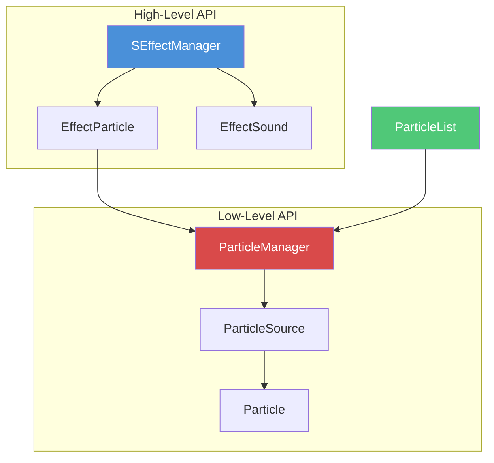

# Chapter 6.20: Particle & Effect System

[Home](../README.md) | [<< Previous: Terrain & World Queries](19-terrain-queries.md) | **Particle & Effect System** | [Next: Zombie & AI System >>](21-zombie-ai-system.md)

---

## Introduction

DayZ's particle and visual effects system handles fire, smoke, blood, explosions, weather effects, vehicle exhaust, contaminated area gas, and more. Every visual effect you see in the game world --- from a campfire to a bullet impact crater --- is driven by this system.

There are **two layers** for working with particles from script:

1. **Low-level:** The `Particle` / `ParticleSource` classes and `ParticleManager` --- direct control over engine particle objects.
2. **High-level:** The `EffectParticle` wrapper and `SEffectManager` --- lifecycle-managed effects with events, autodestroy, and integration with the unified Effect system (shared with `EffectSound`).

All particle playback is **client-side only**. Dedicated servers have no rendering pipeline and cannot display particles. Always guard particle creation behind `!GetGame().IsDedicatedServer()` or rely on the built-in guards in the API. The `ParticleManager.GetInstance()` method already returns `null` on dedicated servers.

This chapter covers the complete particle pipeline: the `ParticleList` registry, both creation approaches, the `EmitorParam` system for runtime tuning, the `EffectParticle` wrapper, `SEffectManager` integration, and real-world patterns from vanilla code.

---

## Particle Architecture Overview

### System Architecture



### Detailed Pipeline

```
ParticleList                                 Script (High-Level)
------------                                 --------------------
Static int IDs                               EffectParticle
  (CAMP_SMALL_FIRE,                              |
   BLEEDING_SOURCE,                              v
   GUN_FNX, etc.)                            SEffectManager
      |                                      PlayInWorld / PlayOnObject
      v                                          |
  RegisterParticle()                              |
  maps ID -> "graphics/particles/xxx"             |
      |                                           |
      +-------------------------------------------+
      |
      v
  ParticleManager (pool-based)        Particle (legacy, per-instance)
  CreateParticle / PlayOnObject       CreateOnObject / PlayInWorld
      |                                   |
      v                                   v
  ParticleSource (Entity)             Particle (Entity)
  (native engine particle component)  (child Object with vobject)
      |
      v
  .ptc file (binary particle definition)
```

**Key distinction:**

- **`Particle`** (legacy) creates a separate child `Object` to hold the particle effect. Each instance registers for `EOnFrame` to track lifetime. Suitable for simple, infrequent particles.
- **`ParticleSource`** (modern, via `ParticleManager`) is the particle entity itself, with native C++ lifetime management. Uses a pre-allocated pool of 10,000 slots. Preferred for all new code.

---

## ParticleList --- Built-in Particle IDs

All particles are registered in `ParticleList` (`scripts/3_game/particles/particlelist.c`). Each registration maps an integer constant to a `.ptc` file path under `graphics/particles/`.

### Registration Mechanism

```c
// Internal registration -- maps sequential ID to file path
static int RegisterParticle(string file_name)
{
    return RegisterParticle(GetPathToParticles(), file_name);
    // GetPathToParticles() returns "graphics/particles/"
    // Full path becomes: "graphics/particles/<file_name>.ptc"
}
```

IDs are assigned sequentially starting from 1. `NONE = 0` and `INVALID = -1` are reserved.

### Common Particle ID Categories

**Fire particles:**

| Constant | File | Use Case |
|----------|------|----------|
| `CAMP_FIRE_START` | `fire_small_camp_01_start` | Campfire ignition |
| `CAMP_SMALL_FIRE` | `fire_small_camp_01` | Small campfire flame |
| `CAMP_NORMAL_FIRE` | `fire_medium_camp_01` | Medium campfire flame |
| `CAMP_STOVE_FIRE` | `fire_small_stove_01` | Stove flame |
| `TORCH_T1` / `T2` / `T3` | `fire_small_torch_0x` | Torch flame states |
| `BONFIRE_FIRE` | `fire_bonfire` | Large bonfire |
| `TIREPILE_FIRE` | `fire_tirepile` | Burning tire pile |

**Smoke particles:**

| Constant | File | Use Case |
|----------|------|----------|
| `CAMP_SMALL_SMOKE` | `smoke_small_camp_01` | Campfire smoke (small) |
| `CAMP_NORMAL_SMOKE` | `smoke_medium_camp_01` | Campfire smoke (medium) |
| `SMOKING_HELI_WRECK` | `smoke_heli_wreck_01` | Helicopter crash site |
| `SMOKE_GENERIC_WRECK` | `smoke_generic_wreck` | Generic wreckage smoke |
| `POWER_GENERATOR_SMOKE` | `smoke_small_generator_01` | Running generator |
| `SMOKING_BARREL` | `smoking_barrel` | Hot gun barrel |

**Blood and player effects:**

| Constant | File | Use Case |
|----------|------|----------|
| `BLEEDING_SOURCE` | `blood_bleeding_01` | Active bleeding wound |
| `BLEEDING_SOURCE_LIGHT` | `blood_bleeding_02` | Light bleeding wound |
| `BLOOD_SURFACE_DROPS` | `blood_surface_drops` | Blood dripping on ground |
| `BLOOD_SURFACE_CHUNKS` | `blood_surface_chunks` | Blood splatter chunks |
| `VOMIT` | `character_vomit_01` | Character vomiting |
| `BREATH_VAPOUR_LIGHT` | `breath_vapour_light` | Cold breath (light) |
| `BREATH_VAPOUR_HEAVY` | `breath_vapour_heavy` | Cold breath (heavy) |

**Cooking effects:**

| Constant | File | Use Case |
|----------|------|----------|
| `COOKING_BOILING_START` | `cooking_boiling_start` | Water starting to boil |
| `COOKING_BOILING_DONE` | `cooking_boiling_done` | Boiling complete |
| `COOKING_BAKING_START` | `cooking_baking_start` | Food baking steam |
| `COOKING_BURNING_DONE` | `cooking_burning_done` | Food burnt smoke |
| `ITEM_HOT_VAPOR` | `item_hot_vapor` | Steam from hot items |

**Weapon effects:**

| Constant | File | Use Case |
|----------|------|----------|
| `GUN_FNX` | `weapon_shot_fnx_01` | FNX muzzle flash |
| `GUN_AKM` | `weapon_shot_akm_01` | AKM muzzle flash |
| `GUN_M4A1` | `weapon_shot_m4a1_01` | M4A1 muzzle flash |
| `GUN_PARTICLE_CASING` | `weapon_shot_chamber_smoke` | Chamber smoke after shot |
| `GUN_PELLETS` | `weapon_shot_pellets` | Shotgun pellet spread |

**Bullet impacts (per material):**

| Pattern | Example | Description |
|---------|---------|-------------|
| `IMPACT_<MATERIAL>_ENTER` | `IMPACT_WOOD_ENTER` | Bullet entry into surface |
| `IMPACT_<MATERIAL>_RICOCHET` | `IMPACT_METAL_RICOCHET` | Bullet deflection |
| `IMPACT_<MATERIAL>_EXIT` | `IMPACT_CONCRETE_EXIT` | Bullet exit from surface |

Materials include: `WOOD`, `CONCRETE`, `DIRT`, `METAL`, `GLASS`, `SAND`, `SNOW`, `ICE`, `MEAT`, `WATER` (small/medium/large), and more.

**Explosions and grenades:**

| Constant | Description |
|----------|-------------|
| `RGD5`, `M67` | Fragmentation grenade explosions |
| `EXPLOSION_LANDMINE` | Landmine detonation |
| `CLAYMORE_EXPLOSION` | Directional mine |
| `GRENADE_M18_<COLOR>_START/LOOP/END` | Smoke grenade lifecycle (6 colors) |
| `GRENADE_RDG2_BLACK/WHITE_START/LOOP/END` | Russian smoke grenade |

**Vehicles:**

| Constant | Description |
|----------|-------------|
| `HATCHBACK_EXHAUST_SMOKE` | Vehicle exhaust |
| `HATCHBACK_COOLANT_OVERHEATING` | Engine warning steam |
| `HATCHBACK_ENGINE_OVERHEATED` | Engine failure smoke |
| `BOAT_WATER_FRONT` / `BACK` / `SIDE` | Boat wake effects |

**Environment:**

| Constant | Description |
|----------|-------------|
| `CONTAMINATED_AREA_GAS_BIGASS` | Large contaminated zone gas |
| `ENV_SWARMING_FLIES` | Flies around corpses |
| `SPOOKY_MIST` | Atmospheric mist |
| `STEP_SNOW` / `STEP_DESERT` | Footstep particles |
| `HOTPSRING_WATERVAPOR` | Hot spring steam |
| `GEYSER_NORMAL` / `GEYSER_STRONG` | Geyser eruption |

---

## Playing Particles --- Direct API

### Method 1: ParticleManager (Recommended)

`ParticleManager` uses a pre-allocated pool of `ParticleSource` entities. This avoids the overhead of creating and destroying objects at runtime.

```c
// Get the global ParticleManager singleton (returns null on server)
ParticleManager pm = ParticleManager.GetInstance();
if (!pm)
    return;

// Play a particle attached to an object
ParticleSource p = pm.PlayOnObject(
    ParticleList.CAMP_SMALL_FIRE,   // particle ID
    myObject,                        // parent entity
    "0 0.5 0",                       // local offset from parent origin
    "0 0 0",                         // local orientation (yaw, pitch, roll)
    false                            // force world-space rotation
);

// Play a particle at a world position (no parent)
ParticleSource p2 = pm.PlayInWorld(
    ParticleList.SMOKE_GENERIC_WRECK,
    worldPosition
);

// Extended variant with parent for world-position particles
ParticleSource p3 = pm.PlayInWorldEx(
    ParticleList.EXPLOSION_LANDMINE,
    parentObj,              // optional parent
    worldPosition,
    "0 0 0",                // orientation
    true                     // force world rotation
);
```

**Create without playing** (deferred activation):

```c
// Create but don't play yet
ParticleSource p = pm.CreateOnObject(
    ParticleList.POWER_GENERATOR_SMOKE,
    generatorObj,
    "0 1.2 0"
);

// ... later, start it
p.PlayParticle();
```

**Batch creation** (multiple particles at once):

```c
array<ParticleSource> results = new array<ParticleSource>;
ParticleProperties props = new ParticleProperties(
    worldPos,
    ParticlePropertiesFlags.PLAY_ON_CREATION,
    null,         // no parent
    vector.Zero,  // orientation
    this          // owner (prevents pool reuse while alive)
);

pm.CreateParticles(results, "graphics/particles/debug_dot.ptc", {props}, 10);
```

### Method 2: Particle Static Methods (Legacy)

The legacy `Particle` class creates individual entity instances. Still functional but less efficient for high particle counts.

```c
// Create and play on an object (one line)
Particle p = Particle.PlayOnObject(
    ParticleList.BLEEDING_SOURCE,
    playerObj,
    "0 0.8 0",   // local position
    "0 0 0",      // local orientation
    true          // force world rotation
);

// Create and play at world position
Particle p2 = Particle.PlayInWorld(
    ParticleList.EXPLOSION_LANDMINE,
    explosionPos
);

// Create without playing
Particle p3 = Particle.CreateOnObject(
    ParticleList.CAMP_SMALL_SMOKE,
    campfireObj,
    "0 0.5 0"
);
// ... later
p3.PlayParticle();
```

---

## Stopping and Controlling Particles

### Stopping

```c
// Gradual fade (default) -- particle stops emitting, existing particles finish
p.StopParticle();

// Legacy shorthand
p.Stop();

// ParticleSource: Immediate stop (freezes and hides)
p.StopParticle(StopParticleFlags.IMMEDIATE);

// ParticleSource: Pause (freeze but keep visible)
p.StopParticle(StopParticleFlags.PAUSE);

// ParticleSource: Stop and reset to initial state
p.StopParticle(StopParticleFlags.RESET);
```

### Auto-Destroy Behavior

`ParticleSource` auto-destroys by default when the particle ends or stops:

```c
// Check current flags
int flags = p.GetParticleAutoDestroyFlags();

// Disable auto-destroy (keep the particle for reuse)
p.DisableAutoDestroy();
// or
p.SetParticleAutoDestroyFlags(ParticleAutoDestroyFlags.NONE);

// Only destroy on natural end (not on manual stop)
p.SetParticleAutoDestroyFlags(ParticleAutoDestroyFlags.ON_END);

// Destroy on either end or stop (default)
p.SetParticleAutoDestroyFlags(ParticleAutoDestroyFlags.ALL);
```

**Important:** Particles belonging to a `ParticleManager` pool ignore auto-destroy flags --- the pool manages their lifecycle.

### Reset and Restart (ParticleSource Only)

```c
// Reset to initial state (clears all particles, resets timer)
p.ResetParticle();

// Restart = reset + play
p.RestartParticle();
```

### State Queries

```c
// Is the particle currently playing?
bool playing = p.IsParticlePlaying();

// Does it have any active (visible) particles right now?
bool active = p.HasActiveParticle();

// Total count of active particles across all emitters
int count = p.GetParticleCount();

// Is any emitter set to repeat?
bool loops = p.IsRepeat();

// Approximate maximum lifetime in seconds
float maxLife = p.GetMaxLifetime();
```

### Attaching and Detaching

```c
// Attach to a parent entity
p.AddAsChild(parentObj, "0 1 0", "0 0 0", false);

// Detach from parent (pass null)
p.AddAsChild(null);

// Get current parent
Object parent = p.GetParticleParent();
```

---

## EmitorParam --- Runtime Parameter Tuning

Every particle effect contains one or more **emitters** (also spelled "emitors" in the API). Each emitter has tunable parameters defined by the `EmitorParam` enum.

### EmitorParam Values

| Parameter | Type | Description |
|-----------|------|-------------|
| `CONEANGLE` | vector | Emission cone angle |
| `EMITOFFSET` | vector | Emission offset from origin |
| `VELOCITY` | float | Base particle velocity |
| `VELOCITY_RND` | float | Random velocity variation |
| `AVELOCITY` | float | Angular velocity |
| `SIZE` | float | Particle size |
| `STRETCH` | float | Particle stretch factor |
| `RANDOM_ANGLE` | bool | Begin with random rotation |
| `RANDOM_ROT` | bool | Rotate in random direction |
| `AIR_RESISTANCE` | float | Air drag factor |
| `AIR_RESISTANCE_RND` | float | Random air drag variation |
| `GRAVITY_SCALE` | float | Gravity multiplier |
| `GRAVITY_SCALE_RND` | float | Random gravity variation |
| `BIRTH_RATE` | float | Particle spawn rate |
| `BIRTH_RATE_RND` | float | Random spawn rate variation |
| `LIFETIME` | float | Emitter active duration |
| `LIFETIME_RND` | float | Random lifetime variation |
| `LIFETIME_BY_ANIM` | bool | Tie lifetime to animation |
| `ANIM_ONCE` | bool | Play animation once |
| `RAND_FRAME` | bool | Start on random frame |
| `EFFECT_TIME` | float | Total effect time for emitter |
| `REPEAT` | bool | Loop the emitter |
| `CURRENT_TIME` | float | Current emitter time (read) |
| `ACTIVE_PARTICLES` | int | Active particle count (read-only) |
| `SORT` | bool | Sort particles by distance |
| `WIND` | bool | Affected by wind |
| `SPRING` | float | Spring force |

### Setting Parameters

```c
// Set a parameter on ALL emitters (-1 = all)
p.SetParameter(-1, EmitorParam.LIFETIME, 5.0);

// Set a parameter on a specific emitter (index 0)
p.SetParameter(0, EmitorParam.BIRTH_RATE, 20.0);

// Shorthand: set on all emitters
p.SetParticleParam(EmitorParam.SIZE, 2.0);
```

### Getting Parameters

```c
// Get current value
float value;
p.GetParameter(0, EmitorParam.VELOCITY, value);

// Get current value (return variant)
float vel = p.GetParameterEx(0, EmitorParam.VELOCITY);

// Get ORIGINAL value (before any runtime changes)
float origVel = p.GetParameterOriginal(0, EmitorParam.VELOCITY);
```

### Scaling and Incrementing

```c
// Scale relative to ORIGINAL value (multiplicative)
p.ScaleParticleParamFromOriginal(EmitorParam.SIZE, 2.0);   // double original size

// Scale relative to CURRENT value
p.ScaleParticleParam(EmitorParam.BIRTH_RATE, 0.5);         // halve current rate

// Increment from ORIGINAL value (additive)
p.IncrementParticleParamFromOriginal(EmitorParam.VELOCITY, 5.0);  // add 5 to original

// Increment from CURRENT value
p.IncrementParticleParam(EmitorParam.GRAVITY_SCALE, -0.5);  // reduce current gravity
```

### Low-Level Engine Functions

These are the raw proto functions that all the above methods call internally:

```c
// Get emitter count
int count = GetParticleEmitorCount(entityWithParticle);

// Set/Get parameters directly
SetParticleParm(entity, emitterIndex, EmitorParam.SIZE, 3.0);
GetParticleParm(entity, emitterIndex, EmitorParam.SIZE, outValue);
GetParticleParmOriginal(entity, emitterIndex, EmitorParam.SIZE, outValue);

// Force-update particle position (avoids particle streaking on teleport)
ResetParticlePosition(entity);
```

---

## Wiggle API

The Wiggle API makes a particle randomly change orientation at intervals, useful for effects like flickering flames or swaying smoke.

```c
// Start wiggling: random angle range, random interval range
p.SetWiggle(15.0, 0.5);
// Orientation will change by [-15, 15] degrees every [0, 0.5] seconds

// Check if wiggling
bool wiggling = p.IsWiggling();

// Stop wiggling (restores original orientation)
p.StopWiggle();
```

**Note:** On legacy `Particle`, wiggle only works when the particle has a parent. On `ParticleSource`, it works in all cases.

---

## EffectParticle --- High-Level Wrapper

`EffectParticle` extends the `Effect` base class to provide a managed lifecycle for particles, integrated with `SEffectManager`. It wraps a `Particle` or `ParticleSource` internally.

### Class Hierarchy

```
Effect (base)
  |
  +-- EffectParticle (visual particle effects)
  |     |
  |     +-- BleedingSourceEffect
  |     +-- BloodSplatter
  |     +-- EffVehicleSmoke
  |     +-- EffGeneratorSmoke
  |     +-- EffVomit / EffVomitBlood
  |     +-- EffBulletImpactBase
  |     +-- EffSwarmingFlies
  |     +-- EffBreathVapourLight / Medium / Heavy
  |     +-- EffWheelSmoke
  |     +-- EffectParticleGeneral (dynamic ID)
  |     +-- (your custom subclass)
  |
  +-- EffectSound (audio effects --- see Chapter 6.15)
```

### Creating Custom EffectParticle Subclasses

```c
class MyCustomSmoke : EffectParticle
{
    void MyCustomSmoke()
    {
        // Set the particle ID in the constructor
        SetParticleID(ParticleList.SMOKE_GENERIC_WRECK);
    }
}
```

**Multi-state example** (from vanilla `EffVehicleSmoke`):

```c
class EffVehicleSmoke : EffectParticle
{
    void EffVehicleSmoke()
    {
        SetParticleStateLight();
    }

    void SetParticleStateLight()
    {
        SetParticleState(ParticleList.HATCHBACK_COOLANT_OVERHEATING);
    }

    void SetParticleStateHeavy()
    {
        SetParticleState(ParticleList.HATCHBACK_COOLANT_OVERHEATED);
    }

    void SetParticleState(int state)
    {
        bool was_playing = IsPlaying();
        Stop();
        SetParticleID(state);
        if (was_playing)
        {
            Start();
        }
    }
}
```

### Playing EffectParticle Through SEffectManager

```c
// Play at a world position
EffectParticle eff = new MyCustomSmoke();
int effectID = SEffectManager.PlayInWorld(eff, worldPos);

// Play attached to an object
EffectParticle eff2 = new EffGeneratorSmoke();
int effectID2 = SEffectManager.PlayOnObject(eff2, generatorObj, "0 1.2 0");
```

### EffectParticle Lifecycle

When `Start()` is called on an `EffectParticle`:

1. If `m_ParticleID > 0`, it creates a particle via `ParticleManager.GetInstance().CreateParticle()`.
2. The particle is attached to the parent (if any) with the cached position and orientation.
3. The `Event_OnStarted` invoker fires.
4. If no particle was created (e.g., invalid ID), `ValidateStart()` calls `Stop()`.

When `Stop()` is called:

1. The managed `Particle` is stopped and released (`SetParticle(null)`).
2. The `Event_OnStopped` invoker fires.
3. If `IsAutodestroy()` is true, the Effect queues itself for deletion.

### Attaching EffectParticle to Objects

```c
EffectParticle eff = new BleedingSourceEffect();

// Method 1: Set parent before Start
eff.SetParent(playerObj);
eff.SetLocalPosition("0 0.8 0");
eff.SetAttachedLocalOri("0 0 0");
eff.Start();

// Method 2: Use AttachTo after creation
eff.AttachTo(playerObj, "0 0.8 0", "0 0 0", false);

// Method 3: Use SEffectManager.PlayOnObject (handles everything)
SEffectManager.PlayOnObject(eff, playerObj, "0 0.8 0");
```

### Cleanup

Always clean up effects to prevent memory leaks:

```c
// Option 1: Set autodestroy (effect cleans itself when stopped)
eff.SetAutodestroy(true);

// Option 2: Manual destruction
SEffectManager.DestroyEffect(eff);

// Option 3: Stop by registered ID
SEffectManager.Stop(effectID);
```

---

## SEffectManager --- Unified Effect Manager

`SEffectManager` is a static manager that handles both `EffectParticle` and `EffectSound`. It maintains a registry of all active effects with integer IDs.

### Key Methods for Particles

| Method | Returns | Description |
|--------|---------|-------------|
| `PlayInWorld(eff, pos)` | `int` | Register and play Effect at world position |
| `PlayOnObject(eff, obj, pos, ori)` | `int` | Register and play Effect on parent object |
| `Stop(effectID)` | void | Stop Effect by ID |
| `DestroyEffect(eff)` | void | Stop, unregister, and delete |
| `IsEffectExist(effectID)` | `bool` | Check if ID is registered |
| `GetEffectByID(effectID)` | `Effect` | Retrieve Effect by ID |

### Registration

Every Effect played through `SEffectManager` is automatically registered and receives an integer ID. The manager holds a `ref` to the Effect, preventing garbage collection.

```c
// SEffectManager holds a strong ref -- must unregister to allow cleanup
int id = SEffectManager.PlayInWorld(eff, pos);

// Later, to fully clean up:
SEffectManager.DestroyEffect(eff);
// or
SEffectManager.EffectUnregister(id);
```

### Server-Side Particle Effecters

`SEffectManager` also provides a server-side mechanism for synchronized particle effects via `EffecterBase` / `ParticleEffecter`. These use network sync to replicate particle state:

```c
// Server-side: create a synced particle effecter
ParticleEffecterParameters params = new ParticleEffecterParameters(
    "ParticleEffecter",                     // effecter type
    30.0,                                    // lifespan in seconds
    ParticleList.CONTAMINATED_AREA_GAS_BIGASS // particle ID
);
int effecterID = SEffectManager.CreateParticleServer(worldPos, params);

// Control the effecter
SEffectManager.StartParticleServer(effecterID);
SEffectManager.StopParticleServer(effecterID);
SEffectManager.DestroyEffecterParticleServer(effecterID);
```

---

## ParticleProperties and Flags

When using `ParticleManager`, particle behavior is configured through `ParticleProperties`:

```c
ParticleProperties props = new ParticleProperties(
    localPos,                              // position (local if parent, world if no parent)
    ParticlePropertiesFlags.PLAY_ON_CREATION,  // flags
    parentObj,                              // parent (optional, null for world)
    localOri,                               // orientation (optional)
    ownerInstance                            // owner class (optional)
);
```

### ParticlePropertiesFlags

| Flag | Description |
|------|-------------|
| `NONE` | Default, no special behavior |
| `PLAY_ON_CREATION` | Start playing immediately when created |
| `FORCE_WORLD_ROT` | Orientation stays in world space even with parent |
| `KEEP_PARENT_ON_END` | Don't unparent when particle ends |

---

## Common Particle Patterns

### Campfire / Fireplace Effect

```c
class MyFireplace
{
    protected Particle m_FireParticle;
    protected Particle m_SmokeParticle;

    void StartFire()
    {
        if (GetGame().IsDedicatedServer())
            return;

        ParticleManager pm = ParticleManager.GetInstance();
        if (!pm)
            return;

        // Play fire at a memory point
        m_FireParticle = pm.PlayOnObject(
            ParticleList.CAMP_SMALL_FIRE,
            this,
            GetMemoryPointPos("fire_point"),
            vector.Zero,
            true  // world rotation
        );

        // Play smoke slightly above fire
        m_SmokeParticle = pm.PlayOnObject(
            ParticleList.CAMP_SMALL_SMOKE,
            this,
            GetMemoryPointPos("smoke_point"),
            vector.Zero,
            true
        );
    }

    void StopFire()
    {
        if (m_FireParticle)
            m_FireParticle.StopParticle();

        if (m_SmokeParticle)
            m_SmokeParticle.StopParticle();
    }
}
```

### Blood Splatter on Hit

```c
void OnPlayerHit(vector hitPosition)
{
    BloodSplatter eff = new BloodSplatter();  // extends EffectParticle
    eff.SetAutodestroy(true);
    SEffectManager.PlayInWorld(eff, hitPosition);
}
```

### Bleeding Source Attached to Player

```c
class BleedingSourceEffect : EffectParticle
{
    void BleedingSourceEffect()
    {
        SetParticleID(ParticleList.BLEEDING_SOURCE);
    }
}

// Usage
BleedingSourceEffect eff = new BleedingSourceEffect();
SEffectManager.PlayOnObject(eff, playerObj, boneOffset);
```

### Vehicle Exhaust

```c
// From vanilla CarScript (simplified)
protected ref EffVehicleSmoke m_exhaustFx;
protected int m_exhaustPtcFx;

void UpdateExhaust()
{
    if (!m_exhaustFx)
    {
        m_exhaustFx = new EffExhaustSmoke();
        m_exhaustPtcFx = SEffectManager.PlayOnObject(
            m_exhaustFx, this, m_exhaustPtcPos, m_exhaustPtcDir
        );
        m_exhaustFx.SetParticleStateLight();
    }
}

void CleanupExhaust()
{
    SEffectManager.DestroyEffect(m_exhaustFx);
}
```

### Heli Wreck Smoke (Static World Effect)

```c
// From vanilla wreck_uh1y.c
class Wreck_UH1Y extends Wreck
{
    protected Particle m_ParticleEfx;

    override void EEInit()
    {
        super.EEInit();
        if (!GetGame().IsDedicatedServer())
        {
            m_ParticleEfx = ParticleManager.GetInstance().PlayOnObject(
                ParticleList.SMOKING_HELI_WRECK,
                this,
                Vector(-0.5, 0, -1.0)
            );
        }
    }
}
```

### Contaminated Area Particle Spawning

The `EffectArea` class spawns particles in concentric rings to fill a contaminated zone:

```c
// Particle IDs from config
int m_ParticleID       = ParticleList.CONTAMINATED_AREA_GAS_BIGASS;
int m_AroundParticleID = ParticleList.CONTAMINATED_AREA_GAS_AROUND;
int m_TinyParticleID   = ParticleList.CONTAMINATED_AREA_GAS_TINY;

// Particles are stored in an array for batch management
ref array<Particle> m_ToxicClouds;
```

---

## Registering Custom Particles from Mods

To add custom particles from your mod, use a `modded class` on `ParticleList`:

```c
modded class ParticleList
{
    // Register with a subfolder path under graphics/particles/
    static const int MY_MOD_CUSTOM_SMOKE = RegisterParticle("mymod/custom_smoke");

    // Or with an explicit root path
    static const int MY_MOD_MAGIC_FX = RegisterParticle("mymod/particles/", "magic_fx");
}
```

The particle file must exist at:
```
graphics/particles/mymod/custom_smoke.ptc
```

### Particle File Format

`.ptc` files are binary particle definitions created with the **Enfusion Workbench Particle Editor**. They define emitters, textures, blend modes, velocities, colors, and all visual properties. These files cannot be authored from script alone --- they require the toolchain.

### Lookup Methods

```c
// Get path from ID
string path = ParticleList.GetParticlePath(particleID);       // without .ptc
string fullPath = ParticleList.GetParticleFullPath(particleID); // with .ptc

// Get ID from path (without .ptc, without root)
int id = ParticleList.GetParticleID("graphics/particles/mymod/custom_smoke");

// Get ID by filename only (must be unique across all mods)
int id2 = ParticleList.GetParticleIDByName("custom_smoke");

// Validate an ID
bool valid = ParticleList.IsValidId(id);  // not NONE and not INVALID
```

---

## ParticleBase Events

Both `Particle` and `ParticleSource` inherit from `ParticleBase`, which provides an event system via `ParticleEvents`:

```c
ParticleEvents events = myParticle.GetEvents();

// Subscribe to lifecycle events
events.Event_OnParticleStart.Insert(OnMyParticleStarted);
events.Event_OnParticleStop.Insert(OnMyParticleStopped);
events.Event_OnParticleEnd.Insert(OnMyParticleEnded);
events.Event_OnParticleReset.Insert(OnMyParticleReset);

// ParticleSource only:
events.Event_OnParticleParented.Insert(OnParented);
events.Event_OnParticleUnParented.Insert(OnOrphaned);

// Event handler signature
void OnMyParticleStarted(ParticleBase particle)
{
    // particle started playing
}
```

**Difference between Stop and End:**
- `OnParticleStop` fires when `StopParticle()` is called or the particle naturally finishes.
- `OnParticleEnd` fires only when the particle fully ends (no active particles remain). Looping particles never fire this naturally.

---

## Observed in Real Mods

Patterns seen in vanilla DayZ and community mods:

1. **ParticleManager is dominant.** Nearly all vanilla 4_World code uses `ParticleManager.GetInstance().PlayOnObject()/PlayInWorld()` rather than `Particle.PlayOnObject()`. The pool-based approach is the standard.

2. **EffectParticle subclasses are thin.** Most subclasses consist of a constructor that calls `SetParticleID()` and nothing else. Complex behavior (state changes, parameter tuning) happens in the owning class, not in the effect.

3. **Vehicle effects use SEffectManager.** Cars and boats play particles through `SEffectManager.PlayOnObject()` with `EffectParticle` subclasses, storing both the effect ref and the returned ID.

4. **Cleanup is explicit.** Vanilla code always calls `SEffectManager.DestroyEffect()` in destructors and cleanup methods. Relying solely on autodestroy is rare in entity-owned effects.

5. **Memory points for attachment.** Object particles are almost always positioned at named memory points (`GetMemoryPointPos("fire_point")`) rather than hardcoded offsets.

---

## Theory vs Practice

| What the API Suggests | What Actually Works |
|----------------------|-------------------|
| `Particle.CreateOnObject()` and `ParticleManager.CreateOnObject()` both exist | `ParticleManager` version is preferred; legacy `Particle` version creates per-instance entities |
| `ParticleAutoDestroyFlags` controls particle lifetime | Ignored for particles managed by a `ParticleManager` pool --- the pool handles lifecycle |
| `ResetParticle()` and `RestartParticle()` are on `ParticleBase` | Only functional on `ParticleSource`, the `Particle` base throws "Not implemented" errors |
| `EffectParticle.ForceParticleRotationRelativeToWorld()` can be called anytime | Only takes effect on the next `Start()` call, cannot live-update an active particle |
| `SetSource()` can change the particle ID at runtime | On legacy `Particle`, this only takes effect after stopping and replaying; `ParticleSource` updates immediately |

---

## Common Mistakes

### 1. Creating Particles on Dedicated Server

```c
// WRONG: This wastes resources and ParticleManager.GetInstance() returns null
Particle p = ParticleManager.GetInstance().PlayInWorld(ParticleList.CAMP_SMALL_FIRE, pos);

// CORRECT: Guard with server check
if (!GetGame().IsDedicatedServer())
{
    ParticleManager pm = ParticleManager.GetInstance();
    if (pm)
    {
        Particle p = pm.PlayInWorld(ParticleList.CAMP_SMALL_FIRE, pos);
    }
}
```

### 2. Forgetting to Stop Looping Particles

Looping particles (where `REPEAT = true` in the .ptc definition) never end on their own. If the owning entity is deleted without stopping them, they persist as orphaned effects.

```c
// WRONG: No cleanup
void ~MyEntity()
{
    // particle keeps playing forever
}

// CORRECT: Stop in destructor
void ~MyEntity()
{
    if (m_MyParticle)
        m_MyParticle.StopParticle();
}
```

### 3. Not Destroying EffectParticle References

`SEffectManager` holds a strong `ref` to every registered Effect. If you don't unregister or destroy it, the effect and its associated particle remain in memory.

```c
// WRONG: Leak
EffectParticle eff = new MySmoke();
SEffectManager.PlayInWorld(eff, pos);
eff = null;  // SEffectManager still holds the ref!

// CORRECT: Either autodestroy or explicit cleanup
eff.SetAutodestroy(true);
// or later:
SEffectManager.DestroyEffect(eff);
```

### 4. Using SetParameter on Null Particle Effect

Both `Particle` and `ParticleSource` guard against null internally, but calling methods on a particle that has not been played yet (or has already been stopped and cleaned up) does nothing silently.

```c
// This does nothing -- particle hasn't been created yet
Particle p = Particle.CreateOnObject(ParticleList.CAMP_SMALL_FIRE, obj);
p.SetParameter(0, EmitorParam.SIZE, 5.0);  // m_ParticleEffect is null!

// Must play first, then adjust
p.PlayParticle();
p.SetParameter(0, EmitorParam.SIZE, 5.0);  // now it works
```

### 5. Mixing Legacy Particle and ParticleSource APIs

Legacy `Particle` and `ParticleSource` have overlapping method names but different internal behavior. Do not mix them on the same instance.

```c
// WRONG: Using ResetParticle() on a legacy Particle
Particle p = Particle.PlayInWorld(ParticleList.DEBUG_DOT, pos);
p.ResetParticle();  // Throws "Not implemented" error

// ParticleSource (from ParticleManager) supports it
ParticleSource ps = ParticleManager.GetInstance().PlayInWorld(ParticleList.DEBUG_DOT, pos);
ps.ResetParticle();  // Works correctly
```

---

## Best Practices

- **Always use `ParticleManager.GetInstance()` for new code.** The pool-based approach is more efficient, supports batch creation, and provides full `ParticleSource` functionality including reset, restart, and native lifecycle management.
- **Guard all particle code with `!GetGame().IsDedicatedServer()`.** Even though `ParticleManager.GetInstance()` returns null on servers, calling any particle-related method on the server is wasteful. Guard early and return.
- **Store particle references and clean them up explicitly.** In your entity's destructor or cleanup method, always stop and null your particle references. For `EffectParticle` wrappers, use `SEffectManager.DestroyEffect()`.
- **Use memory points for attachment positions.** Hardcoded offsets break when models change. Use `GetMemoryPointPos("point_name")` to position particles relative to model geometry.
- **Use `EffectParticle` subclasses for lifecycle-managed effects.** When you need start/stop events, autodestroy, or integration with `SEffectManager`, wrapping your particle in an `EffectParticle` is cleaner than managing raw `Particle` instances manually.
- **Prefer `SetAutodestroy(true)` for one-shot effects.** Fire-and-forget particles (explosions, blood splatters) should self-clean. Persistent effects (engine smoke, bleeding) should be managed explicitly.
- **Call `ResetParticlePosition()` after teleporting an entity.** Without this, emitted particles streak between the old and new positions in a single frame.

---

## Key Source Files

| File | Contains |
|------|----------|
| `scripts/3_game/particles/particlelist.c` | `ParticleList` --- all registered particle IDs and lookup methods |
| `scripts/3_game/particles/particlebase.c` | `ParticleBase`, `ParticleEvents` --- base class and event system |
| `scripts/3_game/particles/particle.c` | `Particle` --- legacy particle class with static Create/Play methods |
| `scripts/3_game/particles/particlemanager/particlemanager.c` | `ParticleManager` --- pool-based particle manager |
| `scripts/3_game/particles/particlemanager/particlesource.c` | `ParticleSource` --- modern particle entity with native lifecycle |
| `scripts/3_game/effect.c` | `Effect` --- base wrapper class for managed effects |
| `scripts/3_game/effects/effectparticle.c` | `EffectParticle` --- particle wrapper with SEffectManager integration |
| `scripts/3_game/effectmanager.c` | `SEffectManager`, `EffecterBase`, `ParticleEffecter` --- unified effect manager |
| `scripts/1_core/proto/envisual.c` | `EmitorParam` enum, `SetParticleParm`, `GetParticleParm` proto functions |
| `scripts/4_world/classes/contaminatedarea/effectarea.c` | `EffectArea` --- contaminated zone particle spawning |

---

## Compatibility & Impact

- **Multi-Mod:** `ParticleList` is a single global class. Multiple mods can register particles via `modded class ParticleList`, but particle filenames must be unique --- duplicates cause an error on the second registration, and `GetParticleIDByName()` only returns the first match.
- **Performance:** The global `ParticleManager` pool is limited to 10,000 slots (`ParticleManagerConstants.POOL_SIZE`). Exceeding this creates "virtual" particles that wait for a slot to free up. Mods spawning many simultaneous particles (e.g., weather effects, contaminated areas with hundreds of emitters) should monitor pool usage and avoid exhausting it.
- **Server/Client:** All particle rendering is client-side. Server-side particle effecters (`ParticleEffecter`) are network-synced entities that trigger client-side rendering via `OnVariablesSynchronized`. Direct `Particle` or `ParticleManager` calls on a dedicated server do nothing.
- **Legacy Compatibility:** The legacy `Particle` static methods (`Particle.PlayOnObject`, `Particle.CreateInWorld`) still work and are used by older mods. They are not deprecated but are less efficient than `ParticleManager` equivalents.

---

[Home](../README.md) | [<< Previous: Terrain & World Queries](19-terrain-queries.md) | **Particle & Effect System** | [Next: Zombie & AI System >>](21-zombie-ai-system.md)
