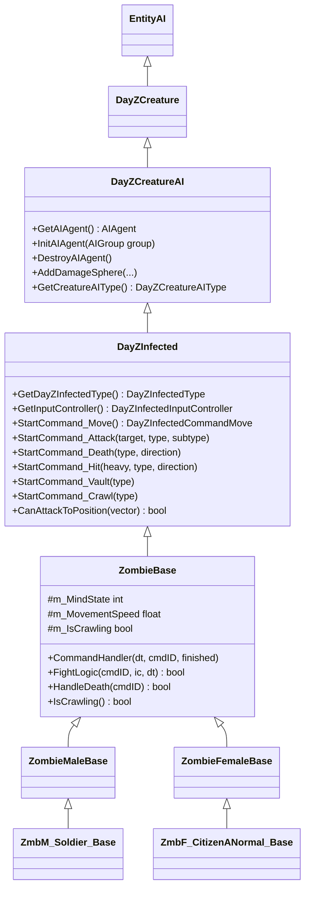

# Chapter 6.21: Zombie & AI System

[Home](../README.md) | [<< Previous: Particle & Effect System](20-particle-effects.md) | **Zombie & AI System** | [Next: Admin & Server Management >>](22-admin-server.md)

---

## Introduction

Zombies (officially called "Infected") are the primary hostile AI entity in DayZ. They patrol, detect players through sight, sound, and proximity, transition through behavioral states, attack, vault, crawl, and die --- all driven by a C++ AI engine with script-level hooks for customization. Understanding how the infected system works is essential for any mod that spawns, modifies, or interacts with zombies.

This chapter covers the full class hierarchy, the mind state machine, movement and attack commands, the perception/targeting system, spawning patterns, and modding hooks. All method signatures and constants are taken directly from the vanilla script source. Where behavior is driven by the C++ engine with no script-visible API, that is noted explicitly.

---

## Class Hierarchy

The infected entity inherits from a deep chain shared with animals. Each level adds capabilities:

```
Class (root of all Enforce Script classes)
+-- Managed
    +-- IEntity
        +-- Object
            +-- ObjectTyped
                +-- Entity
                    +-- EntityAI
                        +-- DayZCreature                 // 3_Game - animation, bones, sound
                            +-- DayZCreatureAI           // 3_Game - AI agent, navmesh, damage spheres
                                +-- DayZInfected         // 3_Game - infected commands, hit handling
                                    +-- ZombieBase       // 4_World - command handler, fight logic, sync
                                        +-- ZombieMaleBase     // sound sets, male variants
                                        |   +-- ZmbM_CitizenASkinny_Base
                                        |   +-- ZmbM_Soldier_Base  (IsZombieMilitary = true)
                                        |   +-- ZmbM_NBC_Yellow     (ResistContaminatedEffect = true)
                                        |   +-- ZmbM_Mummy          (custom light + visual on death)
                                        |   +-- ... (~35 more types)
                                        +-- ZombieFemaleBase   // sound sets, IsMale = false
                                            +-- ZmbF_CitizenANormal_Base
                                            +-- ZmbF_PoliceWomanNormal_Base
                                            +-- ... (~20 more types)
```

### Key Classes at Each Level

| Class | Script File | Role |
|-------|------------|------|
| `DayZCreature` | `3_Game/entities/dayzanimal.c` | Animation instance, bone queries, `StartDeath()` / `ResetDeath()` |
| `DayZCreatureAI` | `3_Game/entities/dayzanimal.c` | `GetAIAgent()`, `InitAIAgent()`, `DestroyAIAgent()`, `AddDamageSphere()` |
| `DayZInfected` | `3_Game/entities/dayzinfected.c` | Command starters (`StartCommand_Move`, `_Attack`, `_Death`, etc.), `EEHitBy` |
| `DayZInfectedType` | `3_Game/entities/dayzinfectedtype.c` | Attack registration, hit component selection, utility-based attack choice |
| `ZombieBase` | `4_World/entities/creatures/infected/zombiebase.c` | `CommandHandler`, fight logic, crawl transition, damage hit evaluation, net sync |

### Hierarchy Diagram



---

## Enums and Constants

### DayZInfectedConstants

Defined in `3_Game/entities/dayzinfected.c`:

```csharp
enum DayZInfectedConstants
{
    // Animation command IDs
    COMMANDID_MOVE,       // 0
    COMMANDID_VAULT,      // 1
    COMMANDID_DEATH,      // 2
    COMMANDID_HIT,        // 3
    COMMANDID_ATTACK,     // 4
    COMMANDID_CRAWL,      // 5
    COMMANDID_SCRIPT,     // 6

    // Mind states
    MINDSTATE_CALM,       // 7
    MINDSTATE_DISTURBED,  // 8
    MINDSTATE_ALERTED,    // 9
    MINDSTATE_CHASE,      // 10
    MINDSTATE_FIGHT,      // 11
}
```

### DayZInfectedConstantsMovement

```csharp
enum DayZInfectedConstantsMovement
{
    MOVEMENTSTATE_IDLE   = 0,
    MOVEMENTSTATE_WALK,        // 1
    MOVEMENTSTATE_RUN,         // 2
    MOVEMENTSTATE_SPRINT       // 3
}
```

### DayZInfectedDeathAnims

```csharp
enum DayZInfectedDeathAnims
{
    ANIM_DEATH_DEFAULT   = 0,
    ANIM_DEATH_IMPULSE   = 1,   // vehicle hit / physics impulse
    ANIM_DEATH_BACKSTAB  = 2,   // finisher: liver stab
    ANIM_DEATH_NECKSTAB  = 3    // finisher: neck stab
}
```

### GameConstants (AI-Related)

From `3_Game/constants.c`:

| Constant | Value | Purpose |
|----------|-------|---------|
| `AI_ATTACKSPEED` | `1.5` | Multiplier for attack cooldown reduction rate |
| `AI_MAX_BLOCKABLE_ANGLE` | `60` | Max angle (degrees) where player block stance works against infected |
| `AI_CONTAMINATION_DMG_PER_SEC` | `3` | Damage per tick in contaminated zones |
| `NL_DAMAGE_CLOSECOMBAT_CONVERSION_INFECTED` | `0.20` | Shock-to-health conversion for melee hits on infected |
| `NL_DAMAGE_FIREARM_CONVERSION_INFECTED` | varies | Shock-to-health conversion for firearm hits on infected |

---

## Mind States

The infected AI uses five mind states, managed entirely by the C++ AI engine. Script reads the current state via `DayZInfectedInputController.GetMindState()` but cannot directly set it.

### State Descriptions

| State | Enum Value | Behavior |
|-------|-----------|----------|
| **CALM** | `MINDSTATE_CALM` | Idle or wandering. No threat detected. Idle animation state 0. |
| **DISTURBED** | `MINDSTATE_DISTURBED` | Noise or brief visual stimulus. Alert posture, looking around. Idle animation state 1. |
| **ALERTED** | `MINDSTATE_ALERTED` | Strong stimulus confirmed. Active searching. Used in sound event handling. |
| **CHASE** | `MINDSTATE_CHASE` | Target acquired, pursuing. Running/sprinting. Chase-group attacks enabled. Idle animation state 2. |
| **FIGHT** | `MINDSTATE_FIGHT` | In melee range. Standing attacks with cooldowns. Fight-group attacks enabled. |

### State Transitions in Script

The `HandleMindStateChange` method in `ZombieBase` reads the mind state from the input controller each frame and triggers idle animation transitions:

```csharp
bool HandleMindStateChange(int pCurrentCommandID, DayZInfectedInputController pInputController, float pDt)
{
    m_MindState = pInputController.GetMindState();
    if (m_LastMindState != m_MindState)
    {
        switch (m_MindState)
        {
        case DayZInfectedConstants.MINDSTATE_CALM:
            if (moveCommand && !moveCommand.IsTurning())
                moveCommand.SetIdleState(0);
            break;
        case DayZInfectedConstants.MINDSTATE_DISTURBED:
            if (moveCommand && !moveCommand.IsTurning())
                moveCommand.SetIdleState(1);
            break;
        case DayZInfectedConstants.MINDSTATE_CHASE:
            if (moveCommand && !moveCommand.IsTurning() && (m_LastMindState < DayZInfectedConstants.MINDSTATE_CHASE))
                moveCommand.SetIdleState(2);
            break;
        }
        m_LastMindState = m_MindState;
        m_AttackCooldownTime = 0.0;
        SetSynchDirty();
    }
    return false;
}
```

> **Important:** The actual state transitions (CALM to DISTURBED, DISTURBED to CHASE, etc.) are driven by the C++ perception system. Script cannot force a mind state change --- it only reacts to what the engine decides.

### Network Synchronization

`m_MindState` is registered as a synced variable:

```csharp
RegisterNetSyncVariableInt("m_MindState", -1, 4);
```

On clients, `OnVariablesSynchronized()` triggers sound event updates based on the current mind state.

---

## Movement System

### DayZInfectedCommandMove

The primary movement command, started with `StartCommand_Move()`. Methods:

| Method | Signature | Description |
|--------|-----------|-------------|
| `SetStanceVariation` | `void SetStanceVariation(int pStanceVariation)` | Sets animation stance variant (0-3, randomized on init) |
| `SetIdleState` | `void SetIdleState(int pIdleState)` | Sets idle animation (0=calm, 1=disturbed, 2=chase) |
| `StartTurn` | `void StartTurn(float pDirection, int pSpeedType)` | Initiates a turn animation |
| `IsTurning` | `bool IsTurning()` | Returns true during turn animation |

Movement speed is read from the input controller and synced:

```csharp
RegisterNetSyncVariableFloat("m_MovementSpeed", -1, 3);
```

The `HandleMove` method updates `m_MovementSpeed` from `ic.GetMovementSpeed()` and marks dirty when the change exceeds 0.9.

### DayZCreatureAIInputController (Base)

The base input controller (shared with animals) provides override methods:

| Method | Signature | Description |
|--------|-----------|-------------|
| `OverrideMovementSpeed` | `void OverrideMovementSpeed(bool state, float movementSpeed)` | Force a specific movement speed |
| `GetMovementSpeed` | `float GetMovementSpeed()` | Current movement speed |
| `OverrideHeading` | `void OverrideHeading(bool state, float heading)` | Force heading direction |
| `OverrideTurnSpeed` | `void OverrideTurnSpeed(bool state, float turnSpeed)` | Force turn rate |
| `OverrideAlertLevel` | `void OverrideAlertLevel(bool state, bool alerted, int level, float inLevel)` | Force alert level |
| `OverrideBehaviourSlot` | `void OverrideBehaviourSlot(bool state, int slot)` | Force behaviour slot |

### DayZInfectedInputController (Infected-Specific)

Extends the base controller with infected-specific queries:

| Method | Signature | Description |
|--------|-----------|-------------|
| `IsVault` | `bool IsVault()` | AI wants to vault |
| `GetVaultHeight` | `float GetVaultHeight()` | Height of the vault obstacle |
| `GetMindState` | `int GetMindState()` | Current mind state enum value |
| `GetTargetEntity` | `EntityAI GetTargetEntity()` | Current AI target entity |

### Vaulting

`HandleVault` in `ZombieBase` translates vault height to a type:

| Height Range | Vault Type |
|-------------|-----------|
| <= 0.6m | 0 (step over) |
| <= 1.1m | 1 (low vault) |
| <= 1.6m | 2 (medium vault) |
| > 1.6m | 3 (high vault) |

After landing (`WasLand()` returns true), a 2-second `m_KnuckleOutTimer` runs before the vault command exits via `StartCommand_Vault(-1)`.

### Crawling

Crawling is triggered by leg damage. When either leg's health reaches 0 (damage >= `LEG_CRIPPLE_THRESHOLD` of 74.0), `HandleSpecialZoneDamage` sets the leg health to zero, and `EvaluateCrawlTransitionAnimation` determines the crawl transition type:

| Condition | Anim Type |
|-----------|-----------|
| Left leg destroyed, hit from behind | 0 |
| Left leg destroyed, hit from front | 1 |
| Right leg destroyed, hit from behind | 2 |
| Right leg destroyed, hit from front | 3 |

After the crawl transition command finishes, the zombie remains in `COMMANDID_MOVE` with `m_IsCrawling = true`. The `IsCrawling()` method returns this flag.

```csharp
RegisterNetSyncVariableBool("m_IsCrawling");
```

---

## Attack System

### Attack Registration

`DayZInfectedType.RegisterAttacks()` defines two attack groups with parameters read from config:

```csharp
RegisterAttack(groupType, distance, pitch, type, subtype, ammoType, isHeavy, cooldown, probability);
```

### DayZInfectedAttackType

```csharp
class DayZInfectedAttackType
{
    float m_Distance;      // attack reach in meters
    int m_Pitch;           // 1=up, 0=center, -1=down
    int m_Type;            // animation type (left/right)
    float m_Subtype;       // animation subtype (up/center/down/run)
    string m_AmmoType;     // damage config from cfgAmmo
    int m_IsHeavy;         // 0=light (blockable), 1=heavy (unblockable)
    float m_Cooldown;      // seconds between attacks
    float m_Probability;   // selection probability [0..1]
}
```

### Attack Groups

**Chase Group** (`DayZInfectedAttackGroupType.CHASE`): Running attacks at 2.4m range, no cooldown reduction, always center pitch (-1). Two variants: left and right.

**Fight Group** (`DayZInfectedAttackGroupType.FIGHT`): Standing attacks at 1.4-1.7m range. Ten variants covering up/center/down pitch and left/right/heavy combinations. Cooldowns from 0.1 to 0.6 seconds.

### Attack Selection (Utility System)

`DayZInfectedType.ChooseAttack()` uses a utility function to select attacks:

1. Filter by matching pitch
2. Reject attacks where target is beyond attack distance
3. Compute utility = distance_score (0-100) + probability_score (0-10)
4. Select the highest utility attack

### Fight Logic Flow

`ZombieBase.FightLogic()` is the main combat dispatcher:

1. In **COMMANDID_MOVE** + **MINDSTATE_CHASE**: calls `ChaseAttackLogic`
2. In **COMMANDID_MOVE** + **MINDSTATE_FIGHT**: calls `FightAttackLogic`
3. In **COMMANDID_ATTACK**: checks `WasHit()` and applies damage

### Damage Application

When `attackCommand.WasHit()` returns true:

- Check if target is within attack distance
- If player is blocking and facing the zombie (within `AI_MAX_BLOCKABLE_ANGLE` = 60 degrees):
  - Heavy attack: reduced to `"MeleeZombie"` ammo type
  - Light attack: reduced to `"Dummy_Light"` (no real damage)
- Otherwise: full damage via `DamageSystem.CloseCombatDamageName()` with the attack's `m_AmmoType`

Ammo types are read from config paths:
- `cfgVehicles <ZombieClass> AttackActions AttackShort ammoType` (light/fight)
- `cfgVehicles <ZombieClass> AttackActions AttackLong ammoType` (heavy/fight)
- `cfgVehicles <ZombieClass> AttackActions AttackRun ammoType` (chase)

### Attack Cooldown

Fight attacks use a cooldown timer decremented by `pDt * GameConstants.AI_ATTACKSPEED` (1.5x speed). Chase attacks have no cooldown gating in script --- they fire as soon as target alignment is valid.

### Target Cone Validation

Before attacking, the zombie verifies target alignment using `DayZPlayerUtils.GetMeleeTarget()` with cone angles:
- Chase: `TARGET_CONE_ANGLE_CHASE = 20` degrees
- Fight: `TARGET_CONE_ANGLE_FIGHT = 30` degrees

---

## Perception System

Zombie perception is primarily handled by the C++ engine. Script exposes the result (mind state, target entity) but not the internal perception logic. However, the script side defines the **target callbacks** and **noise system** that feed into the engine.

### Vision (Visibility Modifiers)

`AITargetCallbacksPlayer` (registered on each `PlayerBase`) provides `GetMaxVisionRangeModifier()`, which tells the engine how visible a player is:

**Speed modifiers** (from `PlayerConstants`):

| Movement State | Multiplier |
|---------------|-----------|
| Sprint / Run | `AI_VISIBILITY_RUN = 1.0` |
| Walk | `AI_VISIBILITY_WALK = 0.66` |
| Idle | `AI_VISIBILITY_IDLE = 0.3` |

**Stance modifiers**:

| Stance | Multiplier |
|--------|-----------|
| Standing | `AI_VISIBILITY_STANDING = 1.5` |
| Crouched | `AI_VISIBILITY_CROUCH = 0.6` |
| Prone | `AI_VISIBILITY_PRONE = 0.15` |

The final modifier is the average of speed and stance coefficients: `mod = (speedCoef + stanceCoef) / 2`.

**Vision point selection** also depends on mind state: when the infected is ALERTED or higher, it looks at the player's head bone; otherwise, it checks the chest (Spine3 bone).

### Sound (Noise System)

The noise system feeds into AI perception via `g_Game.GetNoiseSystem().AddNoise()`. Player actions generate noise with multipliers:

**Speed noise** (from `PlayerConstants`):

| Action | Multiplier |
|--------|-----------|
| Rolling (prone) | `AI_NOISE_ROLL = 2.0` |
| Sprinting | `AI_NOISE_SPRINT = 1.0` |
| Running | `AI_NOISE_RUN = 0.8` |
| Crouch running | `AI_NOISE_CROUCH_RUN = 0.6` |
| Walking | `AI_NOISE_WALK = 0.4` |
| Idle | `AI_NOISE_IDLE = 0.0` |

**Footwear noise**:

| Type | Multiplier |
|------|-----------|
| Boots | `AI_NOISE_SHOES_BOOTS = 0.85` |
| Sneakers | `AI_NOISE_SHOES_SNEAKERS = 0.6` |
| Barefoot | `AI_NOISE_SHOES_NONE = 0.45` |

The final noise is computed by `NoiseAIEvaluate.GetNoiseMultiplier()`:

```
surfaceNoise *= 0.25
avgNoise = (shoesNoise + surfaceNoise) / 1.25
finalNoise = avgNoise * speedNoise
```

Weather also reduces noise via `Weather.GetNoiseReductionByWeather()` (rain reduces detection).

### Smell / Proximity

There is no script-visible "smell" API. Proximity detection appears to be handled entirely in the C++ engine. Modders should treat the engine perception as a black box that outputs mind state and target entity.

---

## The Command Handler

`ZombieBase.CommandHandler()` is called every frame by the engine. It is the central decision point:

```
CommandHandler(dt, currentCommandID, currentCommandFinished)
  |
  +-- ModCommandHandlerBefore() ........ [mod hook, return true to override]
  |
  +-- HandleDeath() .................... [if not alive or finisher in progress]
  |
  +-- HandleMove() ..................... [sync movement speed]
  +-- HandleOrientation() .............. [sync yaw angle]
  |
  +-- [if command finished] ............ [restart StartCommand_Move]
  |
  +-- ModCommandHandlerInside() ........ [mod hook]
  |
  +-- HandleCrawlTransition() .......... [leg destruction -> crawl]
  |
  +-- HandleDamageHit() ................ [stagger/hit reaction]
  |
  +-- HandleVault() .................... [navmesh vault obstacles]
  +-- HandleMindStateChange() .......... [idle state animation updates]
  +-- FightLogic() ..................... [chase/fight attacks]
  |
  +-- ModCommandHandlerAfter() ......... [mod hook]
```

### Mod Hooks

Three insertion points let mods override or extend behavior:

| Hook | When | Usage |
|------|------|-------|
| `ModCommandHandlerBefore` | Before any vanilla logic | Return `true` to skip all default behavior |
| `ModCommandHandlerInside` | After death/move handling, before combat | Return `true` to skip combat logic |
| `ModCommandHandlerAfter` | After all vanilla logic | Return `true` (no practical effect, runs last) |

All three are meant to be overridden via `modded class ZombieBase`.

---

## Damage and Death

### Hit Reactions

When a zombie takes damage, `EEHitBy` in `ZombieBase`:

1. Calls `super.EEHitBy()` (DayZInfected level handles shock-to-health conversion and killer tracking)
2. If dead: evaluates death animation via `EvaluateDeathAnimationEx()`
3. If alive: checks for crawl transition (leg destroyed), then evaluates hit reaction animation

Hit reactions are throttled by `HIT_INTERVAL_MIN = 0.3` seconds. The stun chance is:

```
stunChance = SHOCK_TO_STUN_MULTIPLIER * shockDamage  // 2.82 * damage
```

A random roll (0-100) must be <= `stunChance` for the hit animation to play, unless:
- The hit is heavy (always staggers)
- The zombie is in CALM or DISTURBED state (always staggers)

### Special Zone Damage

`DayZInfected.HandleSpecialZoneDamage()` checks if damage exceeds `LEG_CRIPPLE_THRESHOLD = 74.0`:
- **LeftLeg / RightLeg**: Sets leg health to 0 (triggers crawl transition)
- **Torso / Head**: Sets `m_HeavyHitOverride = true` (forces heavy hit animation)

### Shock-to-Health Conversion

`DayZInfected.ConvertNonlethalDamage()` converts shock damage to actual health damage:
- Close combat: `damage * 0.20`
- Firearms: `damage * PROJECTILE_CONVERSION_INFECTED`

### Death

`HandleDeath()` triggers when `!IsAlive()` or `m_FinisherInProgress`:

```csharp
StartCommand_Death(m_DeathType, m_DamageHitDirection);
m_MovementSpeed = -1;
m_MindState = -1;
SetSynchDirty();
```

Death types are selected by `EvaluateDeathAnimation()` based on ammo config (`doPhxImpulse`). Vehicle hits apply physics impulse to ragdoll.

### Finisher (Backstab) System

`SetBeingBackstabbed()` disables AI via `GetAIAgent().SetKeepInIdle(true)`, selects a death animation type, and sets `m_FinisherInProgress = true`. The `HandleDeath` check catches this flag and triggers the death command.

If the finisher fails, `OnRecoverFromDeath()` re-enables AI:

```csharp
GetAIAgent().SetKeepInIdle(false);
m_FinisherInProgress = false;
```

---

## Spawning Zombies

### Script Spawning with CreateObjectEx

```csharp
// Server-side only
DayZInfected zombie = DayZInfected.Cast(
    g_Game.CreateObjectEx(
        "ZmbF_JournalistNormal_Blue",        // class name from cfgVehicles
        spawnPosition,                        // vector position
        ECE_PLACE_ON_SURFACE | ECE_INITAI | ECE_EQUIP_ATTACHMENTS
    )
);
```

**ECE Flags** (from `3_Game/ce/centraleconomy.c`):

| Flag | Value | Purpose |
|------|-------|---------|
| `ECE_INITAI` | `2048` | Initialize the AI agent (required for zombies to function) |
| `ECE_EQUIP_ATTACHMENTS` | `8192` | Equip configured attachments from config |
| `ECE_PLACE_ON_SURFACE` | `1060` | Composite: create physics + update pathgraph + trace to ground |

> **Critical:** Omitting `ECE_INITAI` creates a zombie with no AI brain --- it will stand motionless. You can later call `zombie.InitAIAgent(group)` manually, but `ECE_INITAI` is the standard approach.

### Manual AI Initialization

```csharp
// Create without AI
DayZInfected zombie = DayZInfected.Cast(
    g_Game.CreateObjectEx("ZmbM_Soldier_Normal", pos, ECE_PLACE_ON_SURFACE)
);

// Later, initialize AI with a group
AIWorld aiWorld = g_Game.GetAIWorld();
AIGroup group = aiWorld.CreateDefaultGroup();
zombie.InitAIAgent(group);

// To disable AI temporarily
zombie.GetAIAgent().SetKeepInIdle(true);

// To re-enable
zombie.GetAIAgent().SetKeepInIdle(false);

// To destroy the AI agent
zombie.DestroyAIAgent();
```

### Events.xml Zombie Spawning

The Central Economy spawns zombies via `events.xml` using zombie class names and group definitions. This is not script --- it is XML configuration processed by the CE engine:

```xml
<event name="InfectedCity">
    <nominal>15</nominal>
    <min>10</min>
    <max>18</max>
    <lifetime>150</lifetime>
    <restock>0</restock>
    <saferadius>1</saferadius>
    <distanceradius>80</distanceradius>
    <cleanupradius>120</cleanupradius>
    <flags deletable="1" init_random="0" remove_damaged="0"/>
    <position>fixed</position>
    <limit>child</limit>
    <active>1</active>
    <children>
        <child lootmax="0" lootmin="0" max="5" min="3" type="ZmbF_CitizenANormal"/>
        <child lootmax="0" lootmin="0" max="5" min="3" type="ZmbM_CitizenASkinny"/>
    </children>
</event>
```

The `type` values must match class names in `cfgVehicles`. The CE handles spawn positions, despawn radius, and population caps.

---

## AI Groups and Patrol Waypoints

### AIWorld

`AIWorld` provides navmesh pathfinding and group management:

```csharp
AIWorld aiWorld = g_Game.GetAIWorld();

// Pathfinding
PGFilter filter = new PGFilter();
filter.SetFlags(PGPolyFlags.WALK, PGPolyFlags.DISABLED, 0);
TVectorArray waypoints = new TVectorArray();
bool found = aiWorld.FindPath(fromPos, toPos, filter, waypoints);

// Navmesh sampling
vector sampledPos;
bool onNavmesh = aiWorld.SampleNavmeshPosition(pos, 5.0, filter, sampledPos);
```

### AIGroup and BehaviourGroupInfectedPack

Groups can have patrol waypoints:

```csharp
AIGroup group = aiWorld.CreateGroup("BehaviourGroupInfectedPack");
BehaviourGroupInfectedPack behaviour = BehaviourGroupInfectedPack.Cast(group.GetBehaviour());

// Define patrol waypoints
array<ref BehaviourGroupInfectedPackWaypointParams> waypoints = new array<ref BehaviourGroupInfectedPackWaypointParams>();
waypoints.Insert(new BehaviourGroupInfectedPackWaypointParams("100 0 200", 10.0));
waypoints.Insert(new BehaviourGroupInfectedPackWaypointParams("150 0 250", 15.0));

behaviour.SetWaypoints(waypoints, 0, true, true);   // start at 0, forward, loop
```

### PGPolyFlags (Navmesh Filter)

| Flag | Purpose |
|------|---------|
| `WALK` | Ground, grass, road |
| `DOOR` | Can move through doors |
| `INSIDE` | Can move inside buildings |
| `JUMP_OVER` | Can vault obstacles |
| `CRAWL` | Can crawl |
| `CLIMB` | Can climb |

---

## Zombie Configuration (DayZInfectedType)

### Hit Components

`DayZInfectedType.RegisterHitComponentsForAI()` defines which body parts zombies target and with what probability:

| Component | Weight | Notes |
|-----------|--------|-------|
| Head | 2 | Rare target selection |
| LeftArm | 50 | Common |
| Torso | 65 | Most common |
| RightArm | 50 | Common |
| LeftLeg | 50 | Common |
| RightLeg | 50 | Common |

Default hit component: `"Torso"`. Default hit position component: `"Spine1"`.

Finisher-suitable components: `"Head"`, `"Neck"`, `"Torso"`.

### Type Variants

Specific zombie types override behavior flags:

| Override | Types | Effect |
|----------|-------|--------|
| `IsZombieMilitary()` | ZmbM_PatrolNormal, ZmbM_Soldier, ZmbM_SoldierNormal, ZmbM_usSoldier_normal, ZmbM_NBC_Grey, ZmbM_NBC_White | Used for loot table selection |
| `ResistContaminatedEffect()` | ZmbM_NBC_Yellow, ZmbM_NBC_Grey, ZmbM_NBC_White, ZmbM_Mummy | Immune to contaminated zone damage |
| `IsMale()` | All `ZombieFemaleBase` return `false` | Sound set selection |

---

## Script Access Patterns

### Reading Zombie State

```csharp
ZombieBase zombie = ZombieBase.Cast(someEntity);
if (zombie)
{
    // Mind state (synced)
    int mindState = zombie.GetMindStateSynced();

    // Movement speed (-1 to 3, synced)
    // Access m_MovementSpeed via the synced variable

    // Crawling state (synced)
    bool crawling = zombie.IsCrawling();

    // Orientation (synced, 0-359 degrees)
    int yaw = zombie.GetOrientationSynced();

    // Alive check
    bool alive = zombie.IsAlive();  // inherited from EntityAI

    // Type checks
    bool military = zombie.IsZombieMilitary();
    bool male = zombie.IsMale();
}
```

### Reading via Input Controller (Server Only)

```csharp
DayZInfectedInputController ic = zombie.GetInputController();
if (ic)
{
    int mindState = ic.GetMindState();
    float speed = ic.GetMovementSpeed();
    EntityAI target = ic.GetTargetEntity();
}
```

### Overriding AI Behavior (Server Only)

```csharp
DayZInfectedInputController ic = zombie.GetInputController();

// Force movement speed
ic.OverrideMovementSpeed(true, 2.0);   // force run speed
ic.OverrideMovementSpeed(false, 0);     // release override

// Force heading
ic.OverrideHeading(true, 90.0);         // face east
ic.OverrideHeading(false, 0);           // release

// Suspend AI entirely
zombie.GetAIAgent().SetKeepInIdle(true);

// Resume AI
zombie.GetAIAgent().SetKeepInIdle(false);
```

---

## Custom Zombie Types

### Extending ZombieBase

```csharp
class MyCustomZombie extends ZombieMaleBase
{
    override bool IsZombieMilitary()
    {
        return true;    // drops military loot
    }

    override bool ResistContaminatedEffect()
    {
        return true;    // immune to gas zones
    }

    override string CaptureSound()
    {
        return "MyCustom_CaptureSound_Soundset";
    }

    override string ReleaseSound()
    {
        return "MyCustom_ReleaseSound_Soundset";
    }
}
```

This also requires a `config.cpp` entry in `CfgVehicles` inheriting from an existing zombie class.

### Custom Command Scripts

`DayZInfectedCommandScript` allows fully scriptable animation commands:

```csharp
class MyZombieCommand extends DayZInfectedCommandScript
{
    void MyZombieCommand(DayZInfected pInfected)
    {
        // Constructor - first param MUST be DayZInfected
    }

    bool PostPhysUpdate(float pDt)
    {
        // Called each frame after physics
        // Return true to keep running, false to finish
        return true;
    }
}

// Start the custom command
zombie.StartCommand_ScriptInst(MyZombieCommand);
```

> **Warning:** `DayZInfectedCommandScript` is NON-MANAGED. Once sent to the CommandHandler via `StartCommand_Script` or `StartCommand_ScriptInst`, the engine takes ownership. Do not delete it manually while active --- this will cause a crash.

### Modding via modded class

The recommended approach for modifying all zombies is `modded class ZombieBase`:

```csharp
modded class ZombieBase
{
    override bool ModCommandHandlerBefore(float pDt, int pCurrentCommandID, bool pCurrentCommandFinished)
    {
        // Custom pre-processing
        // Return true to skip all default command handling
        return false;
    }

    override bool ModCommandHandlerInside(float pDt, int pCurrentCommandID, bool pCurrentCommandFinished)
    {
        // Runs after death/move handling, before combat
        return false;
    }

    override bool ModCommandHandlerAfter(float pDt, int pCurrentCommandID, bool pCurrentCommandFinished)
    {
        // Runs after all vanilla logic
        return false;
    }
}
```

---

## Sound System

Infected sound is managed by `InfectedSoundEventHandler` (client only), which maps mind states to sound event IDs:

| Mind State | Sound Event |
|-----------|-------------|
| CALM | `MINDSTATE_CALM_MOVE` |
| DISTURBED | `MINDSTATE_DISTURBED_IDLE` |
| ALERTED | `MINDSTATE_ALERTED_MOVE` |
| CHASE | `MINDSTATE_CHASE_MOVE` |
| FIGHT (and others) | Sound stopped |

Animation-driven voice events (`OnSoundVoiceEvent`) interrupt state-based sounds. Male and female zombies use different sound sets:

- Male: `"ZmbM_Normal_HeavyHit_Soundset"`, `"ZmbM_Normal_CallToArmsShort_Soundset"`
- Female: `"ZmbF_Normal_HeavyHit_Soundset"`, `"ZmbF_Normal_CallToArmsShort_Soundset"`

---

## Best Practices

1. **Always use `ECE_INITAI` when spawning** --- without it, the zombie has no AI brain and will be motionless.
2. **Server-side spawning only** --- `CreateObjectEx` for zombies should only run on the server; the network handles client replication.
3. **Check `IsAlive()` before any AI manipulation** --- calling `GetAIAgent()` on a dead zombie can produce unexpected results.
4. **Use `SetKeepInIdle(true)` sparingly** --- it suspends the entire AI, including perception. Remember to restore it.
5. **Respect the command handler flow** --- use `ModCommandHandlerBefore/Inside/After` instead of overriding `CommandHandler` directly.
6. **Avoid deleting active `DayZInfectedCommandScript`** --- the engine owns it once started. Let it finish or call `SetFlagFinished(true)`.

---

## Observed in Real Mods

### DayZ Expansion AI (eAIBase)

The Expansion mod extends the zombie/creature AI system by creating `eAIBase` (extending `DayZPlayer`, not `DayZInfected`) for human-like AI. For infected modifications, Expansion uses `modded class ZombieBase` to add quest-related tracking (e.g., counting kills for objectives). This demonstrates that the `modded class` approach is the standard for infected customization.

### Vanilla Debug Plugin

`PluginDayZInfectedDebug` (in `4_World/plugins/pluginbase/plugindayzinfecteddebug.c`) is a built-in debug tool that demonstrates the full API:

- Spawns a zombie with `CreateObjectEx("ZmbF_JournalistNormal_Blue", pos, ECE_PLACE_ON_SURFACE|ECE_INITAI|ECE_EQUIP_ATTACHMENTS)`
- Sets `GetAIAgent().SetKeepInIdle(true)` for manual control
- Overrides movement speed via `GetInputController().OverrideMovementSpeed(true, speed)`
- Directly issues commands: `StartCommand_Vault`, `StartCommand_Crawl`, `StartCommand_Hit`, `StartCommand_Death`, `StartCommand_Attack`

This plugin is an excellent reference for testing any infected-related mod.

---

## Theory vs Practice

| Theory | Practice |
|--------|---------|
| Mind states can be set from script | The C++ engine controls transitions; script can only read state and override input controller values |
| Zombies use pathfinding for navigation | Yes, via `AIWorld.FindPath()` and navmesh, but the path planning is internal to the engine |
| Attack selection is random | It uses a utility function combining distance, pitch, and weighted probability |
| All zombie types behave differently | Most share identical behavior; only NBC (contamination resistance) and Military (loot flags) differ in script |
| `DayZInfectedCommandCrawl` controls crawling | It only handles the transition animation; actual crawling uses `DayZInfectedCommandMove` with `m_IsCrawling = true` |
| `GetMindState()` works on clients | The raw controller method is server-only; clients use the synced `m_MindState` variable via `GetMindStateSynced()` |

---

## Common Mistakes

1. **Forgetting `ECE_INITAI`** --- The most common spawning bug. The zombie appears but does nothing.
2. **Calling `StartCommand_Attack(null, ...)` in production** --- The debug plugin does this for testing, but real attacks need a valid target entity or damage will not apply.
3. **Overriding `CommandHandler` directly** --- This breaks compatibility with other mods. Use the three `ModCommandHandler*` hooks instead.
4. **Assuming `COMMANDID_CRAWL` means the zombie is crawling** --- `COMMANDID_CRAWL` is only the transition. Check `IsCrawling()` for the persistent state.
5. **Reading `m_MindState` on clients without sync** --- Use `GetMindStateSynced()` which reads the network-synced variable.
6. **Not checking `!IsAlive()` before AI operations** --- Dead zombies still exist as entities but their AI state is undefined.
7. **Deleting zombie entities without `DestroyAIAgent()` first** --- Can cause orphaned AI agents. The engine usually handles this, but explicit cleanup is safer for mod-spawned zombies.
8. **Setting leg health to 0 without triggering `m_CrawlTransition`** --- Direct `SetHealth("LeftLeg", "Health", 0)` does not trigger the crawl transition; the logic flows through `EEHitBy` -> `HandleSpecialZoneDamage` -> `EvaluateCrawlTransitionAnimation`.

---

## Compatibility & Impact

| Aspect | Impact |
|--------|--------|
| **Performance** | Each zombie runs its `CommandHandler` every frame on the server. Large zombie populations (50+) can cause server lag. |
| **Network** | Three synced variables per zombie (`m_MindState`, `m_MovementSpeed`, `m_IsCrawling`, `m_OrientationSynced`). Changes trigger `SetSynchDirty()`. |
| **Mod conflicts** | Multiple mods using `ModCommandHandlerBefore` returning `true` will conflict --- only the last-loaded mod's override runs. |
| **Client/Server** | Command handler, fight logic, and damage run server-side only. Sound events and animation playback are client-side. |
| **AI engine dependency** | Mind state transitions, pathfinding decisions, and target selection are C++ engine features. Script cannot fully replace or bypass the built-in AI. |

---

## Quick Reference

```csharp
// Spawn a zombie (server only)
DayZInfected z = DayZInfected.Cast(
    g_Game.CreateObjectEx("ZmbM_Soldier_Normal", pos,
        ECE_PLACE_ON_SURFACE | ECE_INITAI | ECE_EQUIP_ATTACHMENTS));

// Check state
int mind = z.GetInputController().GetMindState();     // server
int mindSync = ZombieBase.Cast(z).GetMindStateSynced(); // synced

// Suspend/resume AI
z.GetAIAgent().SetKeepInIdle(true);
z.GetAIAgent().SetKeepInIdle(false);

// Force movement
z.GetInputController().OverrideMovementSpeed(true, 3.0); // sprint
z.GetInputController().OverrideMovementSpeed(false, 0);   // release

// Kill
z.SetHealth("", "Health", 0);
// (death command triggers automatically via HandleDeath on next frame)

// Check type
ZombieBase zb = ZombieBase.Cast(z);
bool isMilitary = zb.IsZombieMilitary();
bool isCrawling = zb.IsCrawling();
bool isZombie   = zb.IsZombie();       // always true for ZombieBase
```

---

*Source files referenced: `3_Game/entities/dayzinfected.c`, `3_Game/entities/dayzinfectedtype.c`, `3_Game/entities/dayzinfectedinputcontroller.c`, `3_Game/entities/dayzcreatureaiinputcontroller.c`, `3_Game/entities/dayzanimal.c`, `3_Game/entities/dayzcreatureaitype.c`, `3_Game/ai/aiworld.c`, `3_Game/ai/aiagent.c`, `3_Game/ai/aigroup.c`, `3_Game/ai/aigroupbehaviour.c`, `3_Game/systems/ai/aitarget_callbacks.c`, `3_Game/constants.c`, `3_Game/playerconstants.c`, `3_Game/ce/centraleconomy.c`, `4_World/entities/creatures/infected/zombiebase.c`, `4_World/entities/creatures/infected/zombiemalebase.c`, `4_World/entities/creatures/infected/zombiefemalebase.c`, `4_World/entities/dayzinfectedimplement.c`, `4_World/entities/manbase/playerbase/aitargetcallbacksplayer.c`, `4_World/static/sensesaievaluate.c`, `4_World/plugins/pluginbase/plugindayzinfecteddebug.c`, `4_World/classes/soundevents/infectedsoundevents/`*
