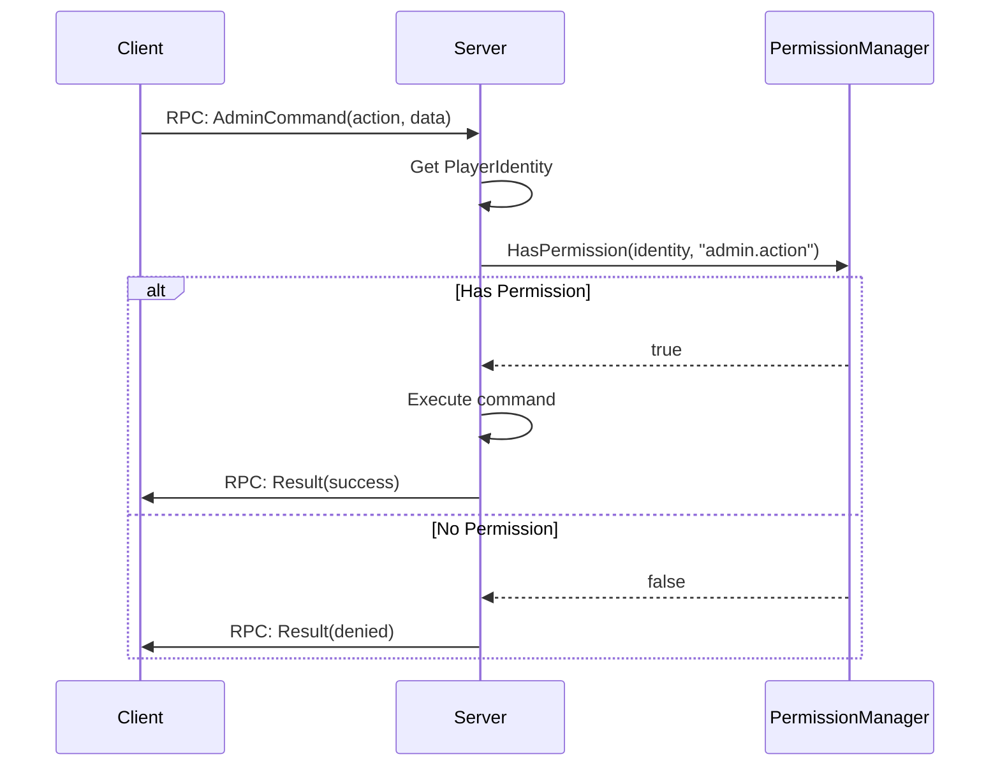

# Chapter 6.22: Admin & Server Management

[Home](../README.md) | [<< Previous: Zombie & AI System](21-zombie-ai-system.md) | **Admin & Server Management** | [Next: World Systems >>](23-world-systems.md)

---

## Introduction

Server administration in DayZ covers a broad set of responsibilities: managing connected players, enforcing rules, controlling world state (time, weather), logging events for audit trails, and integrating with persistence systems. Unlike most game engines that provide a built-in admin panel, DayZ offers only low-level scripting APIs. The admin tool ecosystem --- COT, VPP, and custom solutions --- is built entirely on top of these APIs.

This chapter documents the engine-level APIs available for server administration, the patterns established by major admin mods, and the integration points that connect scripts to the Hive database, BattlEye anti-cheat, and external services like Discord. All method signatures are taken from the vanilla script source and verified against real mod implementations.

---

## Player Management

### Getting All Online Players

The engine provides two equivalent ways to retrieve all connected player entities.

```c
// Via CGame (most common)
array<Man> players = new array<Man>();
GetGame().GetPlayers(players);

// Via World object (identical result)
array<Man> players = new array<Man>();
GetGame().GetWorld().GetPlayerList(players);
```

**Signatures** (from `3_Game/global/game.c` and `3_Game/global/world.c`):

```c
// CGame
proto native void GetPlayers(out array<Man> players);

// World
proto native void GetPlayerList(out array<Man> players);
```

Both populate an output array with `Man` references. Cast each to `PlayerBase` for full functionality:

```c
array<Man> players = new array<Man>();
GetGame().GetPlayers(players);

foreach (Man man : players)
{
    PlayerBase player = PlayerBase.Cast(man);
    if (player && player.GetIdentity())
    {
        string name = player.GetIdentity().GetName();
        string steamId = player.GetIdentity().GetPlainId();
        // ... admin logic
    }
}
```

### PlayerIdentity

Every connected player has a `PlayerIdentity` object that exposes identification and network statistics. Access it via `player.GetIdentity()`.

**Key methods** (from `3_Game/gameplay.c`):

```c
class PlayerIdentityBase : Managed
{
    // --- Identification ---
    proto string GetName();         // Nick (short) name of player
    proto string GetPlainName();    // Nick without any processing
    proto string GetFullName();     // Full name of player
    proto string GetId();           // Hashed unique id (BattlEye GUID) - use for DB/logs
    proto string GetPlainId();      // Plaintext unique id (Steam64 ID) - use for lookups
    proto int    GetPlayerId();     // Session id (reused after disconnect)

    // --- Network Stats ---
    proto int GetPingAct();         // Current ping
    proto int GetPingMin();         // Minimum ping
    proto int GetPingMax();         // Maximum ping
    proto int GetPingAvg();         // Average ping
    proto int GetBandwidthMin();    // Bandwidth estimation (kbps)
    proto int GetBandwidthMax();
    proto int GetBandwidthAvg();
    proto float GetOutputThrottle(); // Throttling on output (0-1)
    proto float GetInputThrottle();  // Throttling on input (0-1)

    // --- Associated Player ---
    proto Man GetPlayer();          // Get the player entity
}

// Moddable subclass (can be extended by mods)
class PlayerIdentity : PlayerIdentityBase {}
```

**Identity ID guidance:**

| Method | Returns | Use For |
|--------|---------|---------|
| `GetPlainId()` | Raw Steam64 ID (e.g. `"76561198012345678"`) | Admin lists, Steam profile lookups, display |
| `GetId()` | BattlEye GUID hash | Database keys, persistent storage, log files |
| `GetName()` | Display name (sanitized) | UI display, log messages |
| `GetPlayerId()` | Integer session ID | Network operations within current session |

### Kicking Players

DayZ does not expose a direct `KickPlayer()` script function. Instead, the engine provides `DisconnectPlayer()` which terminates the connection.

**Signature** (from `3_Game/global/game.c`):

```c
proto native void DisconnectPlayer(PlayerIdentity identity, string uid = "");
```

Admin mods implement kick functionality using this, combined with a notification RPC so the client sees a reason message before disconnection:

```c
// Pattern from VPP Admin Tools - send reason, then disconnect
void KickPlayerWithReason(PlayerBase target, string reason)
{
    if (!target || !target.GetIdentity())
        return;

    // Send kick reason to client via RPC (client shows it as dialog)
    // Then disconnect after a short delay
    GetGame().DisconnectPlayer(target.GetIdentity());
}
```

VPP uses a deferred approach, sending the reason via RPC first and calling disconnect on a timer:

```c
// From VPP missionServer.c - deferred kick via CallLater
GetGame().GetCallQueue(CALL_CATEGORY_SYSTEM).CallLater(
    this.InvokeKickPlayer, m_LoginTimeMs, true,
    identity.GetPlainId(), banReason
);
```

The `EClientKicked` enum (from `3_Game/global/errormodulehandler/clientkickedmodule.c`) defines all possible kick reasons the engine recognizes:

```c
enum EClientKicked
{
    UNKNOWN = -1,
    OK = 0,
    SERVER_EXIT,        // Server shutting down
    KICK_ALL_ADMIN,     // Admin kicked all (RCON)
    KICK_ALL_SERVER,    // Server kicked all
    TIMEOUT,            // Network timeout
    KICK,               // Generic kick
    BAN,                // Player was banned
    PING,               // Ping limit exceeded
    MODIFIED_DATA,      // Modified game files
    NOT_WHITELISTED,    // Not on whitelist
    ADMIN_KICK,         // Kicked by admin
    BATTLEYE = 240,     // BattlEye kick
    // ... additional codes for login machine errors, DB errors, etc.
}
```

### Ban Management

The vanilla engine has no script-level ban API. Bans are managed through:

1. **BattlEye** -- RCON commands (`#kick`, `#ban`, `#exec ban`)
2. **Server-side ban lists** -- Admin mods maintain their own JSON ban files in `$profile:`

VPP implements a full ban system with expiration dates, stored under `$profile:VPPAdminTools/`:

```c
// VPP ban pattern (simplified from PlayerManager.c)
void BanPlayer(PlayerIdentity sender, string targetId)
{
    // 1. Verify admin has permission
    if (!GetPermissionManager().VerifyPermission(sender.GetPlainId(), "PlayerManager:BanPlayer"))
        return;

    // 2. Create ban record with timestamp
    BanDuration banDuration = GetBansManager().GetCurrentTimeStamp();
    banDuration.Permanent = true;

    // 3. Add to persistent ban list (saved to JSON)
    GetBansManager().AddToBanList(new BannedPlayer(
        playerName, targetId, hashedId, banDuration, authorDetails, reason
    ));

    // 4. Kick the player to enforce immediately
    GetGame().DisconnectPlayer(targetIdentity);
}
```

On subsequent connection attempts, VPP checks the ban list during `ClientPrepareEvent` and refuses entry by scheduling a kick before the player fully loads.

---

## Server Commands & World Control

### Admin Log

The engine provides a native method to write to the server's admin log file (`*.ADM` file in the server profile).

**Signature** (from `3_Game/global/game.c`):

```c
proto native void AdminLog(string text);
```

**Usage:**

```c
// Direct engine call
GetGame().AdminLog("Admin action: player teleported");

// Through PluginAdminLog (vanilla pattern)
PluginAdminLog adm = PluginAdminLog.Cast(GetPlugin(PluginAdminLog));
if (adm)
    adm.DirectAdminLogPrint("Custom admin event occurred");
```

The vanilla `PluginAdminLog` class (registered in `4_World/plugins/pluginmanager.c`) wraps `AdminLog()` and provides structured logging for player events:

| Method | Logged Event |
|--------|-------------|
| `PlayerKilled(player, source)` | Kill with weapon, distance, attacker |
| `PlayerHitBy(damageResult, ...)` | Hit details: zone, damage, ammo type |
| `UnconStart(player)` / `UnconStop(player)` | Unconsciousness transitions |
| `Suicide(player)` | Suicide via emote |
| `BleedingOut(player)` | Death by bleeding |
| `OnPlacementComplete(player, item)` | Item placement (tents, traps) |
| `OnContinouousAction(action_data)` | Build/dismantle/destroy actions |
| `PlayerList()` | Periodic dump of all players with positions |
| `PlayerTeleportedLog(player, from, to, reason)` | Teleportation events |

The plugin is controlled by `serverDZ.cfg` settings:

```c
// Read in PluginAdminLog constructor
m_HitFilter = g_Game.ServerConfigGetInt("adminLogPlayerHitsOnly");   // 1 = player hits only
m_PlacementFilter = g_Game.ServerConfigGetInt("adminLogPlacement");  // 1 = log placements
m_ActionsFilter = g_Game.ServerConfigGetInt("adminLogBuildActions"); // 1 = log build actions
m_PlayerListFilter = g_Game.ServerConfigGetInt("adminLogPlayerList"); // 1 = periodic list
```

### Chat Messages

```c
// Print text to local chat (client-side)
proto native void Chat(string text, string colorClass);

// Send chat from server to specific player (undocumented behavior)
proto native void ChatMP(Man recipient, string text, string colorClass);

// Send player chat message (server context)
proto native void ChatPlayer(string text);
```

The `colorClass` parameter maps to config entries. Common values are `"colorAction"`, `"colorFriendly"`, `"colorImportant"`.

### Time & Date Control

The `World` class provides direct control over the in-game date and time.

**Signatures** (from `3_Game/global/world.c`):

```c
class World : Managed
{
    // Read current date/time
    proto void GetDate(out int year, out int month, out int day, out int hour, out int minute);

    // Set date/time (server-side only, syncs to clients)
    proto native void SetDate(int year, int month, int day, int hour, int minute);

    // Time acceleration multiplier (0-64, -1 to reset to config)
    proto native void SetTimeMultiplier(float timeMultiplier);

    // Day/night queries
    proto native bool IsNight();
    proto native float GetSunOrMoon(); // 0 = sun, 1 = moon
}
```

**Example usage** (pattern from VPP TimeManager):

```c
// Read current time
int year, month, day, hour, minute;
GetGame().GetWorld().GetDate(year, month, day, hour, minute);

// Set to noon
GetGame().GetWorld().SetDate(year, month, day, 12, 0);

// Speed up time (2x acceleration)
GetGame().GetWorld().SetTimeMultiplier(2.0);
```

Also available from `CGame`:

```c
proto native float GetDayTime(); // Seconds since midnight (0-86400 approx.)
```

### Weather Control

The `Weather` class (accessed via `GetGame().GetWeather()`) exposes phenomenon objects for overcast, rain, fog, snowfall, and wind.

**Core structure** (from `3_Game/weather.c`):

```c
class Weather
{
    proto native Overcast       GetOvercast();
    proto native Fog            GetFog();
    proto native Rain           GetRain();
    proto native Snowfall       GetSnowfall();
    proto native WindDirection   GetWindDirection();
    proto native WindMagnitude   GetWindMagnitude();

    proto native void SetStorm(float density, float threshold, float timeOut);
    proto native void SetWind(vector wind);
    proto native float GetWindSpeed();

    void MissionWeather(bool use);  // Enable mission-controlled weather
}
```

Each phenomenon (Overcast, Rain, Fog, etc.) extends `WeatherPhenomenon` with these key methods:

```c
class WeatherPhenomenon
{
    proto native float GetActual();     // Current value (0-1)
    proto native float GetForecast();   // Target value

    // Set forecast: value, interpolation time (seconds), minimum duration (seconds)
    proto native void Set(float forecast, float time = 0, float minDuration = 0);

    // Control auto-change behavior
    proto native void SetLimits(float fnMin, float fnMax);
    proto native void SetForecastChangeLimits(float fcMin, float fcMax);
    proto native void SetForecastTimeLimits(float ftMin, float ftMax);
    proto native float GetNextChange();
    proto native void SetNextChange(float time);
}
```

**Admin weather control example:**

```c
Weather weather = GetGame().GetWeather();

// Force clear skies over 60 seconds, hold for 10 minutes
weather.GetOvercast().Set(0.0, 60, 600);

// Stop rain immediately
weather.GetRain().Set(0.0, 0, 300);

// Dense fog over 30 seconds
weather.GetFog().Set(0.8, 30, 600);

// Thunderstorm: high density, triggers above 0.6 overcast, 10s between strikes
weather.SetStorm(1.0, 0.6, 10);

// Take full control (prevents automatic weather changes)
weather.MissionWeather(true);
weather.GetOvercast().SetLimits(0.0, 0.2);   // Lock to clear
weather.GetRain().SetLimits(0.0, 0.0);       // No rain
```

---

## Admin Permission Patterns



### UID-Based Admin Detection

The simplest admin check is comparing a player's Steam ID against a hardcoded or file-loaded list.

```c
// Minimal UID-based admin check
ref array<string> m_AdminUIDs = new array<string>();

void LoadAdmins()
{
    // Load from file at $profile:admins.txt
    // Each line contains one Steam64 ID
    FileHandle file = OpenFile("$profile:admins.txt", FileMode.READ);
    if (file == 0)
        return;

    string line;
    while (FGets(file, line) >= 0)
    {
        line = line.Trim();
        if (line.Length() > 0)
            m_AdminUIDs.Insert(line);
    }
    CloseFile(file);
}

bool IsAdmin(PlayerIdentity identity)
{
    if (!identity)
        return false;
    return m_AdminUIDs.Find(identity.GetPlainId()) != -1;
}
```

### Hierarchical Permission Systems

Both COT and VPP implement permission systems that go beyond simple admin/non-admin checks:

**COT pattern** (dot-separated hierarchical permissions):

```c
// COT registers permissions on mission start
GetPermissionsManager().RegisterPermission("Admin.Player.Read");
GetPermissionsManager().RegisterPermission("Admin.Player.Teleport.Position");
GetPermissionsManager().RegisterPermission("Camera.View");

// Check before executing any privileged operation
if (!GetPermissionsManager().HasPermission("Admin.Player.Teleport.Position", senderRPC))
    return;
```

**VPP pattern** (colon-separated, user groups stored in `$profile:`):

```c
// VPP verifies permission and also checks target protection
if (!GetPermissionManager().VerifyPermission(
    sender.GetPlainId(), "PlayerManager:KickPlayer"))
    return;

// Two-argument form: also checks if target is protected
if (GetPermissionManager().VerifyPermission(
    sender.GetPlainId(), "PlayerManager:BanPlayer", targetId))
{
    // Proceed with ban
}
```

VPP stores permission data under `$profile:VPPAdminTools/Permissions/`:

```
$profile:VPPAdminTools/
    Permissions/
        SuperAdmins/           -- UID files for superadmins
        UserGroups/            -- Group definitions with permission sets
    Logging/                   -- Session log files
    ConfigurablePlugins/       -- Per-plugin config JSON
```

### Integration with RPC

Every admin command must be validated server-side. The pattern is:

1. Client sends RPC requesting an action
2. Server receives RPC, extracts sender identity
3. Server checks permissions using sender's `GetPlainId()`
4. Server executes or rejects the action

```c
// Server-side RPC handler (VPP pattern)
void KickPlayer(CallType type, ParamsReadContext ctx, PlayerIdentity sender, Object target)
{
    if (type == CallType.Server)
    {
        Param2<ref array<string>, string> data;
        if (!ctx.Read(data))
            return;

        // ALWAYS verify permissions server-side
        if (!GetPermissionManager().VerifyPermission(
            sender.GetPlainId(), "PlayerManager:KickPlayer"))
            return;

        // Execute the privileged action
        array<string> ids = data.param1;
        foreach (string tgId : ids)
        {
            PlayerBase tg = GetPermissionManager().GetPlayerBaseByID(tgId);
            if (tg)
                GetGame().DisconnectPlayer(tg.GetIdentity());
        }
    }
}
```

Never trust client-side permission checks alone. Always re-validate on the server.

---

## Server Startup & Configuration

### init.c Execution

The server entry point is `init.c`, located in the mission folder (e.g., `mpmissions/dayzOffline.chernarusplus/`). It creates and assigns the mission:

```c
// Typical init.c for server
void main()
{
    // Hive setup for persistence
    Hive hive = CreateHive();
    if (hive)
    {
        hive.InitOnline("$mission:storage_1\\init.c");
        hive.SetShardID("");
        hive.SetEnviroment("dayz");
    }
}

// Engine calls this to get the mission class
Mission CreateCustomMission(string path)
{
    return new ChernarusPlus(path);
}
```

### Mission Lifecycle

`MissionServer` (extending `MissionBase`) receives connection events through its `OnEvent()` dispatcher:

| Event Type | Method Called | When |
|------------|-------------|------|
| `ClientPrepareEventTypeID` | `OnClientPrepareEvent()` | Player begins connecting |
| `ClientNewEventTypeID` | `OnClientNewEvent()` | New character created |
| `ClientReadyEventTypeID` | `OnClientReadyEvent()` | Existing character loaded |
| `ClientReconnectEventTypeID` | `OnClientReconnectEvent()` | Reconnecting to existing character |
| `ClientDisconnectedEventTypeID` | `OnClientDisconnectedEvent()` | Player disconnecting |

These are the primary hook points for admin mods. Both COT and VPP use `modded class MissionServer` to inject admin logic at each stage.

### Server Profile Folder ($profile:)

The `$profile:` path prefix resolves to the server's profile directory (set via `-profiles=` launch parameter). This is the primary location for server-side data:

| Path | Content |
|------|---------|
| `$profile:` | Root profile folder |
| `$profile:*.ADM` | Admin log files |
| `$profile:*.RPT` | Script log / crash reports |
| `$profile:storage_1/` | Hive persistence data |
| `$profile:VPPAdminTools/` | VPP configuration and logs |
| `$profile:CommunityOnlineTools/` | COT player permissions |

### Common Launch Parameters

| Parameter | Purpose |
|-----------|---------|
| `-config=serverDZ.cfg` | Server configuration file |
| `-port=2302` | Game port |
| `-profiles=ServerProfile` | Profile directory path |
| `-mission=mpmissions/dayzOffline.chernarusplus` | Mission folder |
| `-mod=@ModName` | Load mod(s) |
| `-servermod=@ServerMod` | Server-only mod(s) |
| `-BEpath=battleye` | BattlEye path |
| `-dologs` | Enable logging |
| `-adminlog` | Enable admin log (ADM file) |
| `-freezecheck` | Enable freeze detection |
| `-cpuCount=4` | CPU core count hint |

### ServerConfig Access

Scripts can read values from `serverDZ.cfg` at runtime:

```c
// From CGame
proto native int ServerConfigGetInt(string name);

// Example usage
int debugMonitor = g_Game.ServerConfigGetInt("enableDebugMonitor");
int personalLight = g_Game.ServerConfigGetInt("disablePersonalLight");
int adminLogHitsOnly = g_Game.ServerConfigGetInt("adminLogPlayerHitsOnly");
```

---

## Logging & Monitoring

### Admin Log (ADM Files)

The primary server-side audit log. Controlled by `serverDZ.cfg` settings (`adminLogPlayerHitsOnly`, `adminLogPlacement`, `adminLogBuildActions`, `adminLogPlayerList`). Written to `$profile:` as `.ADM` files.

```c
// Write directly
GetGame().AdminLog("Custom message to ADM file");
```

The vanilla `PluginAdminLog` class provides structured logging. It automatically formats player prefixes with name, Steam ID, and position:

```c
// Vanilla prefix format (from PluginAdminLog.GetPlayerPrefix):
// Player "PlayerName" (id=SteamGUID pos=<X, Y, Z>)
```

VPP's `VPPLogManager` additionally writes to its own log files and optionally mirrors to the ADM log:

```c
// VPP dual logging pattern
void Log(string str)
{
    // Write to VPP session log file
    FPrintln(m_LogFile, timeStamp + str);

    // Optionally also write to engine admin log
    if (SendLogsToADM)
        GetGame().AdminLog(timeStamp + " [VPPAT] " + str);
}
```

### Script Log (RPT Files)

The script runtime log, used for debugging. Written via:

```c
Print("Debug message");                              // Standard output
PrintFormat("Player %1 at pos %2", name, pos);       // Formatted output
Error("Something went wrong");                       // Error-level output
```

### Custom Log Files

For mod-specific logging, use the file I/O API:

```c
// Create directory and log file
MakeDirectory("$profile:MyMod/Logs");

int hour, minute, second;
int year, month, day;
GetHourMinuteSecondUTC(hour, minute, second);
GetYearMonthDayUTC(year, month, day);

string fileName = string.Format("$profile:MyMod/Logs/Log_%1-%2-%3.txt", year, month, day);
FileHandle file = OpenFile(fileName, FileMode.WRITE);

if (file != 0)
{
    FPrintln(file, "=== Session Started ===");
    FPrintln(file, "Admin action logged at " + hour + ":" + minute);
    CloseFile(file);
}
```

### Discord Webhook Patterns

Both COT and VPP provide Discord integration via webhook URLs. The general pattern is:

**COT** uses a `JMWebhookModule` that creates Discord embed messages:

```c
// COT webhook pattern (from PluginAdminLog.c override)
auto msg = m_Webhook.CreateDiscordMessage();
msg.GetEmbed().AddField("Player Death",
    player.FormatSteamWebhook() + " was killed by " + source.GetDisplayName());
m_Webhook.Post("PlayerDeath", msg);
```

**VPP** uses a `WebHooksManager` with typed message classes:

```c
// VPP webhook pattern (from PlayerManager.c)
GetWebHooksManager().PostData(
    AdminActivityMessage,
    new AdminActivityMessage(
        sender.GetPlainId(),
        sender.GetName(),
        "[PlayerManager] Kicked " + ids.Count() + " player(s)"
    )
);
```

Both store webhook URLs in `$profile:` JSON configuration files.

> **Note:** The DayZ engine does not provide a native HTTP client. Webhook functionality relies on the CF (Community Framework) `RestApi` system, which provides an HTTP callback mechanism. This is an external dependency, not a vanilla engine feature.

---

## Hive & Database

### What Is the Hive

The Hive is DayZ's persistence layer --- a native C++ system that stores character data, world objects (tents, barrels, vehicles), and server state to disk. It is not directly accessible from script beyond a small set of `proto native` methods.

**Hive class** (from `3_Game/hive/hive.c`):

```c
class Hive
{
    proto native void InitOnline(string ceSetup, string host = "");
    proto native void InitOffline();
    proto native void InitSandbox();
    proto native bool IsIdleMode();
    proto native void SetShardID(string shard);
    proto native void SetEnviroment(string env);
    proto native void CharacterSave(Man player);
    proto native void CharacterKill(Man player);
    proto native void CharacterExit(Man player);
    proto native void CallUpdater(string content);
    proto native bool CharacterIsLoginPositionChanged(Man player);
}

proto native Hive CreateHive();
proto native void DestroyHive();
proto native Hive GetHive();
```

### Character Persistence

The Hive manages character lifecycle through these methods:

```c
// Save character state (called periodically and on disconnect)
GetHive().CharacterSave(player);

// Mark character as dead in database
GetHive().CharacterKill(player);

// Mark character as exited (disconnect without death)
GetHive().CharacterExit(player);
```

These are called automatically by `MissionServer` during connection and disconnection events:

```c
// From MissionServer.OnClientDisconnectedEvent()
if (GetHive())
{
    GetHive().CharacterExit(player);
}
```

### Object Persistence

World objects (tents, barrels, buried stashes, vehicles) persist through the Central Economy (CE) system, not through direct script calls. The CE reads and writes to the `storage_1/` folder in the server profile. Scripts can force a save through the Hive but cannot query the persistence database directly.

### Hive Initialization Modes

| Mode | Method | Use Case |
|------|--------|----------|
| Online | `InitOnline(ceSetup)` | Normal dedicated server with persistence |
| Offline | `InitOffline()` | Singleplayer / listen server, local storage |
| Sandbox | `InitSandbox()` | Testing, no persistence at all |

The Hive mode is set in `init.c` before the mission starts. If no Hive is created, `GetHive()` returns null and the server runs without any persistence.

---

## Common Admin Mod Patterns

> These patterns were confirmed by studying the source code of COT (Community Online Tools) and VPP (Vanilla++ Admin Tools).

### Teleport System

Admin mods implement teleportation by directly setting player position. VPP provides three teleport operations:

```c
// VPP teleport types (from PlayerManager.c)
enum VPPAT_TeleportType
{
    GOTO,    // Admin teleports to target player
    BRING,   // Target player teleported to admin
    RETURN   // Return player to pre-teleport position
}
```

The actual position change is straightforward:

```c
// Teleport player to position (server-side)
void TeleportPlayer(PlayerBase player, vector targetPos)
{
    if (!player || !player.IsAlive())
        return;

    player.SetPosition(targetPos);
}
```

COT adds a crosshair-teleport feature bound to a hotkey:

```c
// COT teleport to cursor position (from MissionGameplay)
// Gets world position at cursor, sends via RPC to server
vector cursorPos = GetGame().GetCursorPos();
// RPC_TeleportToPosition -> server sets player position
```

### Player ESP (Extra Sensory Perception)

ESP overlays show player names, distances, and health above their heads on the admin's screen. COT implements this as `JMESPModule` with dedicated layouts:

- ESP data is gathered server-side and sent to the admin client via RPC
- Client renders `CanvasWidget` overlays at projected screen positions
- Updates run on a timer to avoid excessive network traffic

### Object Spawner

Both COT and VPP allow spawning any item or entity:

```c
// COT spawning pattern (from JMObjectSpawnerModule.c)
void SpawnEntity_Position(string className, vector position,
    float quantity, float health, float temp, int itemState)
{
    // On server: create the object
    Object obj = GetGame().CreateObject(className, position, false, false, true);

    // Set properties
    EntityAI entity = EntityAI.Cast(obj);
    if (entity)
    {
        if (health >= 0)
            entity.SetHealth("", "", health);
    }
}
```

The engine's `CreateObject` signature:

```c
proto native Object CreateObject(string type, vector pos,
    bool create_local = false, bool init_ai = false, bool create_physics = true);

proto native Object CreateObjectEx(string type, vector pos,
    int iFlags, int iRotation = RF_DEFAULT);
```

### Weather & Time Controllers

Admin weather panels wrap the `Weather` API described above:

```c
// VPP weather control (from WeatherManager plugin)
void ApplyWeather(float overcast, float rain, float fog,
    float interpTime, float duration)
{
    Weather w = GetGame().GetWeather();
    w.GetOvercast().Set(overcast, interpTime, duration);
    w.GetRain().Set(rain, interpTime, duration);
    w.GetFog().Set(fog, interpTime, duration);
}
```

Time control uses preset management with saved configurations:

```c
// VPP time preset application (from TimeManager.c)
void ApplyDate(int year, int month, int day, int hour, int minute)
{
    GetGame().GetWorld().SetDate(year, month, day, hour, minute);
}
```

### Player Stats Viewer

Admin mods read player stats via the `PlayerBase` API (see Chapter 6.14):

```c
// Common stats read for admin panel
float health = player.GetHealth("", "Health");
float blood  = player.GetHealth("", "Blood");
float shock  = player.GetHealth("", "Shock");
float water  = player.GetStatWater().Get();
float energy = player.GetStatEnergy().Get();
vector pos   = player.GetPosition();
int bleedSources = player.GetBleedingManagerServer().GetBleedingSourcesCount();
```

---

## BattlEye Integration

### What BattlEye Does

BattlEye is DayZ's anti-cheat system. It runs as a separate process alongside the server and monitors:

- Memory integrity of client game processes
- Network packet validity
- Script execution patterns (via script restrictions)

### Script Restrictions

BattlEye uses restriction files (`scripts.txt`, `remoteexec.txt`) in the `battleye/` folder to filter script commands. When a script call matches a restriction pattern, BattlEye can:

1. **Log** the event (restriction level 1)
2. **Log and kick** the player (restriction level 5)

Admin mods must add exceptions to these files for their RPC calls to function. This is why admin mods include BattlEye exception files in their installation instructions.

### How Admin Tools Work with BattlEye

Admin tools operate within BattlEye's framework by:

1. Using the standard DayZ RPC system (registered via `CGame.RPC()` or CF's `GetRPCManager()`)
2. Providing BattlEye exception entries for their custom RPC calls
3. Validating permissions server-side (BattlEye only monitors, it does not enforce admin permissions)

The chat system includes a BattlEye channel (`CCBattlEye = 64`) for RCON messages:

```c
// From chat.c - BattlEye/system messages displayed differently
if (channel & CCSystem || channel & CCBattlEye)
{
    // Display as system message (different color/style)
}
```

RCON (Remote Console) is BattlEye's admin interface, separate from script. RCON commands like `#kick`, `#ban`, `#shutdown` are handled by BattlEye directly and are not accessible from Enforce Script.

---

## Best Practices

- **Always validate permissions server-side.** Client-side checks are cosmetic only. Any RPC handler that performs a privileged action must call a permission check before executing. The client can be modified to skip UI-level checks.
- **Use `GetPlainId()` for admin UID lists, `GetId()` for persistent data.** `GetPlainId()` returns the Steam64 ID that administrators actually know and use. `GetId()` returns the BattlEye GUID hash, which is what DayZ uses internally for character persistence.
- **Null-check `GetIdentity()` in every admin operation.** During connection handshake and disconnect teardown, player entities exist without identity objects. Admin tools that iterate players must handle this gracefully.
- **Log every admin action with both admin and target identifiers.** Include the admin's name, Steam ID, the action performed, and the target. This creates an audit trail that helps resolve disputes and detect admin abuse.
- **Use `$profile:` for all server-side file storage.** Never use hardcoded absolute paths. The `$profile:` prefix adapts to whatever profile directory the server operator has configured.
- **Defer kicks with `CallLater` when sending a reason.** If you disconnect a player instantly, they may not receive the RPC containing the kick reason. VPP uses a short delay (configurable via `m_LoginTimeMs`) to ensure the message arrives first.
- **Call `MissionWeather(true)` before locking weather values.** Without this flag, the engine's automatic weather controller will override your settings when it computes the next forecast change.

---

## Observed in Real Mods

> These patterns were confirmed by studying the source code of professional DayZ admin mods.

| Pattern | Mod | File/Location |
|---------|-----|---------------|
| Deferred kick via `CallLater` + `DisconnectPlayer` with reason RPC | VPP Admin Tools | `5_Mission/missionServer.c` |
| `GetPermissionsManager().HasPermission()` check before every RPC handler | COT | `5_Mission/CommunityOnlineTools.c` |
| User groups with per-permission granularity stored in `$profile:` JSON | VPP Admin Tools | `PermissionManager/PermissionManager.c` |
| `PluginAdminLog` override to add Discord webhook posts on kill events | COT | `4_World/Plugins/PluginAdminLog.c` |
| `WebHooksManager.PostData()` for Discord notifications on every admin action | VPP Admin Tools | `PlayerManager/PlayerManager.c` |
| Ban list checked during `ClientPrepareEvent` with deferred kick | VPP Admin Tools | `5_Mission/missionServer.c` |
| `GetGame().GetWorld().SetDate()` wrapped in preset system with saved configs | VPP Admin Tools | `WeatherManager/TimeManager.c` |
| `JMObjectSpawnerModule` using `GetGame().CreateObject()` with quantity/health params | COT | `modules/Object/JMObjectSpawnerModule.c` |
| Session log files with UTC timestamps via `GetHourMinuteSecondUTC()` | VPP Admin Tools | `LogManager/LogManager.c` |

---

## Common Mistakes

### 1. Trusting Client-Side Permission Checks

Never rely solely on client-side UI to prevent unauthorized actions. A modified client can send any RPC.

```c
// WRONG - only checking on client
if (m_IsAdmin)
    SendRPC_KickPlayer(targetId);

// CORRECT - client check is cosmetic, server re-validates
// Client:
if (m_IsAdmin)
    SendRPC_KickPlayer(targetId);

// Server RPC handler:
void RPC_KickPlayer(PlayerIdentity sender, string targetId)
{
    // Re-validate on server
    if (!IsAdmin(sender))
        return;
    // ... proceed
}
```

### 2. Not Handling Null Identity During Connection Events

During `ClientPrepareEvent`, the player entity may not exist yet. During `ClientDisconnectedEvent`, the identity may already be null.

```c
// WRONG
void OnClientDisconnectedEvent(PlayerIdentity identity, PlayerBase player, ...)
{
    string name = identity.GetName(); // identity can be null!
}

// CORRECT
void OnClientDisconnectedEvent(PlayerIdentity identity, PlayerBase player, ...)
{
    string name = "Unknown";
    if (identity)
        name = identity.GetName();
    // Continue with safe fallback
}
```

### 3. Setting Weather Without MissionWeather Flag

If you set weather values without calling `MissionWeather(true)`, the engine's automatic weather controller will override your changes at the next forecast computation.

```c
// WRONG - changes will be overridden
GetGame().GetWeather().GetOvercast().Set(0.0, 0, 600);

// CORRECT - take control first
GetGame().GetWeather().MissionWeather(true);
GetGame().GetWeather().GetOvercast().Set(0.0, 0, 600);
```

### 4. Using GetGame().GetPlayer() on Server

`GetGame().GetPlayer()` returns the local player entity. On a dedicated server, there is no local player.

```c
// WRONG - always null on dedicated server
PlayerBase admin = PlayerBase.Cast(GetGame().GetPlayer());

// CORRECT - use GetPlayers() or track players via connection events
array<Man> players = new array<Man>();
GetGame().GetPlayers(players);
```

### 5. Writing Files Without Creating Directories First

`OpenFile()` will fail silently if the parent directory does not exist.

```c
// WRONG - directory may not exist
FileHandle f = OpenFile("$profile:MyMod/Logs/session.txt", FileMode.WRITE);

// CORRECT - ensure directory exists first
MakeDirectory("$profile:MyMod");
MakeDirectory("$profile:MyMod/Logs");
FileHandle f = OpenFile("$profile:MyMod/Logs/session.txt", FileMode.WRITE);
```

---

## Compatibility & Impact

> **Mod Compatibility:** `MissionServer` is heavily modded by admin tools. COT, VPP, and Expansion all use `modded class MissionServer` to intercept connection events. Load order determines which mod's hooks run outermost.

- **Load Order:** Admin mods that override `OnEvent()`, `InvokeOnConnect()`, or `OnClientDisconnectedEvent()` must call `super` to allow other mods to receive these events. Forgetting `super` breaks all subsequently loaded mods.
- **PluginAdminLog Conflicts:** If multiple mods override `PluginAdminLog` (e.g., COT adds webhook support), only the last-loaded override is active unless each calls `super` in every overridden method.
- **RPC ID Collisions:** COT uses CF's string-based RPC routing. VPP uses `GetRPCManager().AddRPC()` with string identifiers. Custom admin mods should avoid using raw integer RPC IDs that may collide with vanilla `ERPCs` values.
- **Performance Impact:** ESP systems that send frequent player position updates can generate significant network traffic. Both COT and VPP use update timers (typically 1-5 second intervals) rather than per-frame updates. The vanilla `PluginAdminLog.PlayerList()` runs every 300 seconds (5 minutes) to minimize overhead.
- **Server/Client:** All admin commands are server-authoritative. Client mods provide UI only. Server-only mods (`-servermod=`) can implement admin logic without distributing scripts to clients, but cannot provide in-game UI.
