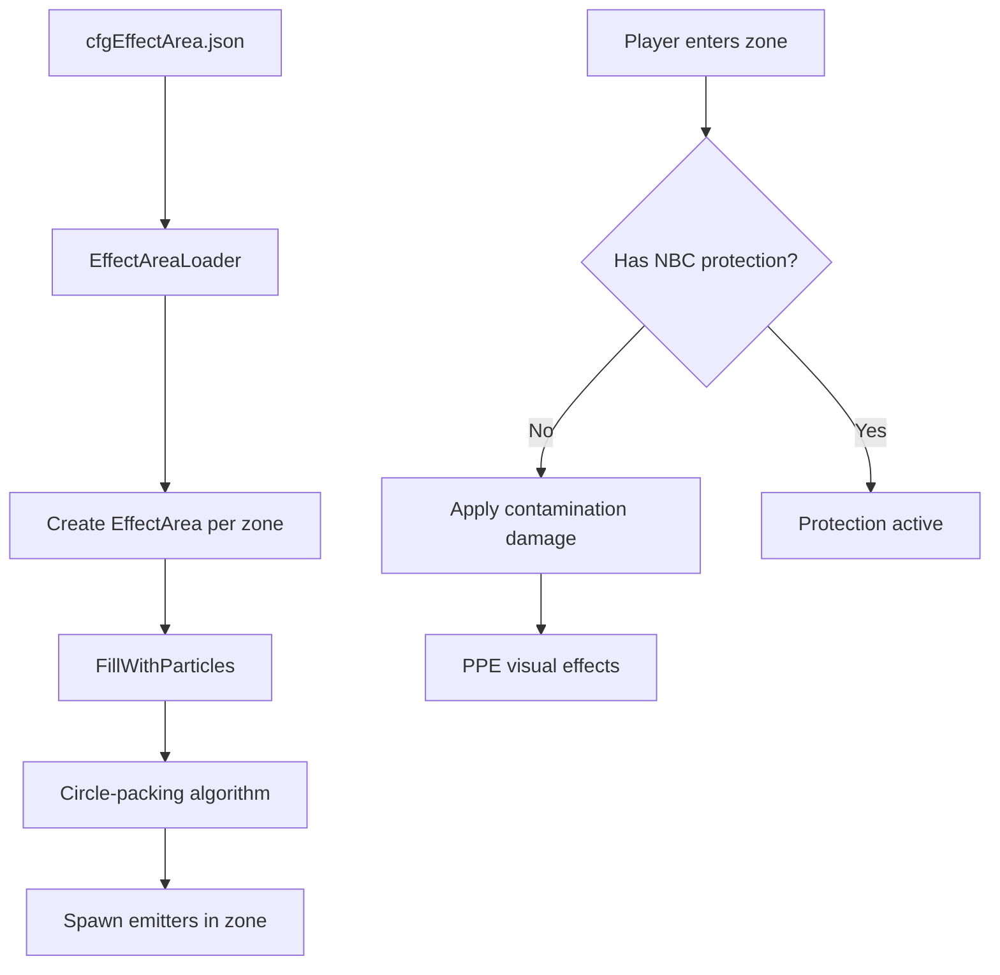

# Chapter 6.23: World Configuration Systems

[Home](../README.md) | [<< Previous: Admin & Server Management](22-admin-server.md) | **World Systems**

---

## Introduction

DayZ provides several JSON and XML configuration files that control world-level systems without requiring script modifications. These files live in the **mission folder** and are loaded at server start, allowing server owners to customize contaminated areas, underground darkness, weather behavior, gameplay rules, and object placement with no code changes and no wipe required.

This chapter covers five mission-folder configuration systems:

1. **Contaminated Areas** (`cfgEffectArea.json`) --- toxic gas zones with particles, PPE, and player damage
2. **Underground Areas** (`cfgundergroundtriggers.json`) --- eye accommodation (darkness simulation) for caves and bunkers
3. **Weather Configuration** (`cfgweather.xml`) --- declarative weather parameter overrides
4. **Gameplay Settings** (`cfgGameplay.json`) --- stamina, building, navigation, and other gameplay tweaks
5. **Object Spawner** --- JSON-based world object placement at mission start

---

## Contaminated Areas (cfgEffectArea.json)



Contaminated areas are toxic gas zones that damage players without protective equipment. They are configured through `cfgEffectArea.json` in the mission folder.

### Key Concepts

- **Static areas** are defined in the JSON file and created at mission start. They are **not persistent** --- you can add or remove zones between restarts with no wipe required.
- **Dynamic areas** are spawned through the Central Economy as dynamic events (configured separately through CE files, not covered here).
- To **disable all effect areas**, place an empty JSON file (`{}`) in the mission folder.

### File Structure (v1.28+)

As of version 1.28, the particle configuration uses a circle-packing algorithm via `FillWithParticles()`. This is the current recommended format:

```json
{
    "Areas":
    [
        {
            "AreaName": "Radunin-Village",
            "Type": "ContaminatedArea_Static",
            "TriggerType": "ContaminatedTrigger",
            "Data": {
                "Pos": [ 7347, 0, 6410 ],
                "Radius": 150,
                "PosHeight": 20,
                "NegHeight": 10,
                "InnerPartDist": 100,
                "OuterOffset": 30,
                "ParticleName": "graphics/particles/contaminated_area_gas_bigass_debug"
            },
            "PlayerData": {
                "AroundPartName": "graphics/particles/contaminated_area_gas_around",
                "TinyPartName": "graphics/particles/contaminated_area_gas_around_tiny",
                "PPERequesterType": "PPERequester_ContaminatedAreaTint"
            }
        }
    ]
}
```

### Area Fields

| Field | Type | Description |
|-------|------|-------------|
| `AreaName` | string | Human-readable identifier for the zone (also used in debug) |
| `Type` | string | Class name of the EffectArea subclass to spawn (`ContaminatedArea_Static`) |
| `TriggerType` | string | Trigger class name (`ContaminatedTrigger`). Leave empty for no trigger |
| `Pos` | float[3] | World position `[X, Y, Z]`. If Y is 0, the entity snaps to ground |
| `Radius` | float | Radius of the zone in meters |
| `PosHeight` | float | Height of the cylinder above the anchor position (meters) |
| `NegHeight` | float | Height of the cylinder below the anchor position (meters) |

### Particle Fields (v1.28+)

The new system uses `FillWithParticles(pos, areaRadius, outwardsBleed, partSize, partId)`:

| Field | Maps To | Description |
|-------|---------|-------------|
| `InnerPartDist` | `partSize` | Perceived particle size in meters. Controls spacing between emitters |
| `OuterOffset` | `outwardsBleed` | Distance beyond the radius where particles remain visible (meters) |
| `ParticleName` | --- | Path to the particle effect definition |

The algorithm uses a naive circle-packing approach: given the area circle of radius `R = Radius + OuterOffset` and particle circles of radius `Rp = InnerPartDist / 2`, emitters are packed with some overlap margin.

> **Performance Warning:** The maximum number of emitters is clamped to 1000 per zone. More emitters means worse performance. Keep `InnerPartDist` large enough to avoid exceeding this limit.

### Particle Fields (Pre-1.28, Legacy)

The legacy system uses explicit ring configuration. It is backward-compatible but not recommended for new setups:

| Field | Type | Description |
|-------|------|-------------|
| `InnerRingCount` | int | Number of concentric rings inside the area (excludes outer ring) |
| `InnerPartDist` | int | Distance between emitters on inner rings (straight-line meters) |
| `OuterRingToggle` | bool | Whether an outer ring of emitters is generated |
| `OuterPartDist` | int | Distance between emitters on the outer ring |
| `OuterOffset` | int | Offset from radius for the outer ring (negative pushes it outside) |
| `VerticalLayers` | int | Additional vertical layers above ground level |
| `VerticalOffset` | int | Vertical distance between layers (meters) |
| `ParticleName` | string | Particle effect name (without `graphics/particles/` prefix in old format) |

**Legacy emitter count formula:**

```
emitters_per_ring = 2 * PI / ACOS(1 - (spacing^2 / (2 * ring_radius^2)))
```

For inner rings, the ring radius is calculated as: `area_radius / (inner_ring_count + 1) * ring_index`. Total emitters = sum of all rings + 1 (center) multiplied by vertical layers.

### Player Data (PPE & Particles)

| Field | Description |
|-------|-------------|
| `AroundPartName` | Particle effect spawned around the player when inside the trigger zone |
| `TinyPartName` | Smaller particle effect spawned near the player inside the trigger |
| `PPERequesterType` | Post-process effect class applied to the player's camera (`PPERequester_ContaminatedAreaTint`) |

### Player Health Impact

When a player is inside a contaminated trigger zone without proper protection:

- The contamination agent is applied, causing progressive health damage
- The PPE effect tints the player's vision (green/yellow tint by default)
- Gas particles appear around the player character

**Protection:** Gas masks with intact filters and NBC suits provide protection. The protection logic is handled in script (`ContaminatedAreaAgent` and related classes), not in the JSON configuration.

### Multiple Zones

Add multiple objects to the `Areas` array. Each zone is independent:

```json
{
    "Areas":
    [
        {
            "AreaName": "Zone-Alpha",
            "Type": "ContaminatedArea_Static",
            "TriggerType": "ContaminatedTrigger",
            "Data": { "Pos": [ 4581, 0, 9592 ], "Radius": 300, "PosHeight": 25, "NegHeight": 10, "InnerPartDist": 100, "OuterOffset": 30, "ParticleName": "graphics/particles/contaminated_area_gas_bigass_debug" },
            "PlayerData": { "AroundPartName": "graphics/particles/contaminated_area_gas_around", "TinyPartName": "graphics/particles/contaminated_area_gas_around_tiny", "PPERequesterType": "PPERequester_ContaminatedAreaTint" }
        },
        {
            "AreaName": "Zone-Bravo",
            "Type": "ContaminatedArea_Static",
            "TriggerType": "ContaminatedTrigger",
            "Data": { "Pos": [ 4036, 0, 11712 ], "Radius": 150, "PosHeight": 30, "NegHeight": 60, "InnerPartDist": 80, "OuterOffset": 20, "ParticleName": "graphics/particles/contaminated_area_gas_bigass_debug" },
            "PlayerData": { "AroundPartName": "graphics/particles/contaminated_area_gas_around", "TinyPartName": "graphics/particles/contaminated_area_gas_around_tiny", "PPERequesterType": "PPERequester_ContaminatedAreaTint" }
        }
    ]
}
```

---

## Underground Areas (cfgundergroundtriggers.json)

Underground areas use trigger volumes and breadcrumb waypoints to simulate darkness in caves, bunkers, and other enclosed spaces. The system controls **eye accommodation** --- the degree to which the player can see without artificial light sources.

- Eye accommodation `1.0` = normal visibility (surface)
- Eye accommodation `0.0` = complete darkness (deep underground)

Configuration is stored in `cfgundergroundtriggers.json` in the mission folder. For a working example, see the [official DayZ Central Economy repository](https://github.com/BohemiaInteractive/DayZ-Central-Economy).

> **Note:** The JSON snippets below include comments for clarity. Real JSON files must not contain comments.

### Configuration Objects

The file defines two types of objects:

1. **Triggers** --- box-shaped volumes that detect player presence and manage eye accommodation level and ambient sound
2. **Breadcrumbs** --- point-and-radius waypoints that influence eye accommodation gradually within transitional triggers

### Trigger Types

There are three trigger types, determined automatically by their configuration:

| Type | Breadcrumbs? | EyeAccommodation | Purpose |
|------|-------------|-------------------|---------|
| **Outer** | Empty array | `1.0` | Switches night-only lights (chemlights) to work during daytime. Placed just outside the entrance |
| **Transitional** | Has entries | Any | Gradual eye accommodation change via breadcrumbs. Placed between outer and inner triggers |
| **Inner** | Empty array | `< 1.0` (typically `0.0`) | Constant darkness deep underground. Eye accommodation is fixed at the configured value |

### Outer Trigger

Any trigger with an empty `Breadcrumbs` array and `EyeAccommodation` set to `1` becomes an Outer trigger. Place these just outside the underground entrance:

```json
{
    "Position": [ 749.738708, 533.460144, 1228.527954 ],
    "Orientation": [ 0, 0, 0 ],
    "Size": [ 15, 5.6, 10.8 ],
    "EyeAccommodation": 1,
    "Breadcrumbs": [],
    "InterpolationSpeed": 1
}
```

| Field | Type | Description |
|-------|------|-------------|
| `Position` | float[3] | World position of the trigger center |
| `Orientation` | float[3] | Rotation as Yaw, Pitch, Roll (degrees) |
| `Size` | float[3] | Dimensions in X, Y, Z (meters) |
| `EyeAccommodation` | float | Target eye accommodation level (0.0 - 1.0) |
| `Breadcrumbs` | array | Empty for outer/inner triggers |
| `InterpolationSpeed` | float | Speed of transition from previous accommodation value to target |

### Transitional Trigger

Any trigger **with breadcrumbs** automatically becomes a Transitional trigger. These handle the gradual light-to-dark transition:

```json
{
    "Position": [ 735.0, 533.7, 1229.1 ],
    "Orientation": [ 0, 0, 0 ],
    "Size": [ 15, 5.6, 10.8 ],
    "EyeAccommodation": 0,
    "Breadcrumbs":
    [
        {
            "Position": [ 741.294556, 531.522729, 1227.548218 ],
            "EyeAccommodation": 1,
            "UseRaycast": 0,
            "Radius": -1
        },
        {
            "Position": [ 739.904, 531.6, 1230.51 ],
            "EyeAccommodation": 0.7,
            "UseRaycast": 1,
            "Radius": -1
        }
    ]
}
```

### Inner Trigger

Any trigger with an empty `Breadcrumbs` array and `EyeAccommodation` less than `1` becomes an Inner trigger. Use these for deep underground areas:

```json
{
    "Position": [ 701.8, 535.1, 1184.5 ],
    "Orientation": [ 0, 0, 0 ],
    "Size": [ 55.6, 8.6, 104.6 ],
    "EyeAccommodation": 0,
    "Breadcrumbs": [],
    "InterpolationSpeed": 1
}
```

### Breadcrumb Configuration

Breadcrumbs are positioned along the player's expected path through the transitional trigger. Each breadcrumb within reach contributes to the player's current eye accommodation level, weighted by distance --- closer breadcrumbs have more influence.

```json
{
    "Position": [ 741.294556, 531.522729, 1227.548218 ],
    "EyeAccommodation": 1,
    "UseRaycast": 0,
    "Radius": -1
}
```

| Field | Type | Description |
|-------|------|-------------|
| `Position` | float[3] | World position of the breadcrumb |
| `EyeAccommodation` | float | The accommodation weight this breadcrumb contributes (0.0 - 1.0) |
| `UseRaycast` | int | If `1`, a ray is cast from player to breadcrumb; it only contributes if the trace is unobstructed |
| `Radius` | float | Influence radius in meters. Set to `-1` for the engine default |

**Recommended breadcrumb layout for a transitional trigger:**

1. Near the entrance (close to the outer trigger): `EyeAccommodation: 1.0`
2. Midway through the transition: `EyeAccommodation: 0.5`
3. Near the inner trigger: `EyeAccommodation: 0.0`

The exact number and placement depends on the geometry of the transitional area.

> **Tip:** When using `UseRaycast: 1`, raise the breadcrumb position slightly off the floor (a few centimeters in the Y axis) to avoid the ray being blocked by the ground surface.

### Sound Management

Transitional triggers also handle the **underground ambient sound** volume fade. As the player moves deeper, the ambient sound fades in. As they move back toward the surface, it fades out. This is tied to the same trigger system --- no separate configuration is needed.

### Interpolation

The `InterpolationSpeed` field on outer and inner triggers controls how quickly the eye accommodation transitions from its previous value to the target. Higher values produce faster transitions. Combined with the breadcrumb weighting in transitional triggers, this creates a smooth visual experience as players move between surface and underground.

### Debugging Underground Areas

Using `DayZDiag_x64`, the following diag menu options are available:

| Diag Menu Path | Function |
|----------------|----------|
| Script > Triggers > Show Triggers | Display active triggers and their coverage areas |
| Script > Underground Areas > Show Breadcrumbs | Display all active breadcrumbs |
| Script > Underground Areas > Disable Darkening | Toggle the darkening effect (also via `Ctrl+F`) |

---

## Weather Configuration (cfgweather.xml)

While Chapter 6.3 covers the Weather script API in detail, this section documents the `cfgweather.xml` mission-folder file for declarative weather configuration without scripting.

### Overview

There are three ways to adjust weather behavior in DayZ:

1. **Script weather state machine** --- override `WorldData::WeatherOnBeforeChange()` (see `4_World/Classes/Worlds/Enoch.c` for an example)
2. **Mission init script** --- call `MissionWeather(true)` in `init.c` and use the Weather API
3. **cfgweather.xml** --- place an XML file in the mission folder (recommended for server admins)

By default, all vanilla server missions use the scripted weather state machine. For custom weather, the XML approach is the simplest.

### Full cfgweather.xml Structure

```xml
<?xml version="1.0" encoding="UTF-8" standalone="yes" ?>
<weather reset="0" enable="1">
    <overcast>
        <current actual="0.45" time="120" duration="240" />
        <limits min="0.0" max="1.0" />
        <timelimits min="900" max="1800" />
        <changelimits min="0.0" max="1.0" />
    </overcast>
    <fog>
        <current actual="0.1" time="120" duration="240" />
        <limits min="0.0" max="1.0" />
        <timelimits min="900" max="1800" />
        <changelimits min="0.0" max="1.0" />
    </fog>
    <rain>
        <current actual="0.0" time="120" duration="240" />
        <limits min="0.0" max="1.0" />
        <timelimits min="300" max="600" />
        <changelimits min="0.0" max="1.0" />
        <thresholds min="0.5" max="1.0" end="120" />
    </rain>
    <windMagnitude>
        <current actual="8.0" time="120" duration="240" />
        <limits min="0.0" max="20.0" />
        <timelimits min="120" max="240" />
        <changelimits min="0.0" max="20.0" />
    </windMagnitude>
    <windDirection>
        <current actual="0.0" time="120" duration="240" />
        <limits min="-3.14" max="3.14" />
        <timelimits min="60" max="120" />
        <changelimits min="-1.0" max="1.0" />
    </windDirection>
    <snowfall>
        <current actual="0.0" time="0" duration="32768" />
        <limits min="0.0" max="0.0" />
        <timelimits min="300" max="3600" />
        <changelimits min="0.0" max="0.0" />
        <thresholds min="1.0" max="1.0" end="120" />
    </snowfall>
    <storm density="1.0" threshold="0.7" timeout="25"/>
</weather>
```

### Root Element Attributes

| Attribute | Type | Default | Description |
|-----------|------|---------|-------------|
| `reset` | bool | `false` | Whether to discard stored weather state on server start |
| `enable` | bool | `true` | Whether this file is active |

Supports `0`/`1`, `true`/`false`, or `yes`/`no`.

### Phenomenon Parameters

Each phenomenon (`overcast`, `fog`, `rain`, `snowfall`, `windMagnitude`, `windDirection`) supports these child elements:

| Element | Attributes | Description |
|---------|------------|-------------|
| `current` | `actual`, `time`, `duration` | Initial value, seconds to reach it, seconds it holds |
| `limits` | `min`, `max` | Range of the phenomenon value |
| `timelimits` | `min`, `max` | Range for how long (seconds) a transition takes |
| `changelimits` | `min`, `max` | Range for how much the value can change per transition |
| `thresholds` | `min`, `max`, `end` | Overcast range that allows this phenomenon; `end` = seconds to stop if outside range |

`thresholds` applies to **rain** and **snowfall** only --- these phenomena require sufficient overcast to appear.

### Thunderstorm Configuration

```xml
<storm density="1.0" threshold="0.7" timeout="25"/>
```

| Attribute | Description |
|-----------|-------------|
| `density` | Lightning frequency (0.0 - 1.0) |
| `threshold` | Minimum overcast level for lightning to appear (0.0 - 1.0) |
| `timeout` | Seconds between lightning strikes |

### Alternative XML Formatting

All float parameters can be written as either attributes or child elements:

```xml
<!-- Attribute style (compact) -->
<limits min="0" max="1"/>

<!-- Element style (verbose) -->
<limits>
    <min>0</min>
    <max>1</max>
</limits>
```

Both formats are equivalent. You can mix them freely within the same file.

### Common Weather Profiles

**Permanent clear sky (no rain, no fog):**

```xml
<weather reset="1" enable="1">
    <overcast>
        <current actual="0.0" time="0" duration="32768" />
        <limits min="0.0" max="0.2" />
    </overcast>
    <rain>
        <limits min="0.0" max="0.0" />
    </rain>
    <fog>
        <limits min="0.0" max="0.1" />
    </fog>
</weather>
```

**Heavy winter (constant snow, no rain):**

```xml
<weather reset="1" enable="1">
    <overcast>
        <current actual="0.8" time="0" duration="32768" />
        <limits min="0.6" max="1.0" />
    </overcast>
    <rain>
        <limits min="0.0" max="0.0" />
    </rain>
    <snowfall>
        <current actual="0.7" time="60" duration="3600" />
        <limits min="0.3" max="1.0" />
        <thresholds min="0.5" max="1.0" end="120" />
    </snowfall>
</weather>
```

> **Note:** You only need to include the phenomena you want to override. Omitted phenomena use engine defaults.

---

## Gameplay Settings (cfgGameplay.json)

The `cfgGameplay.json` file provides server admins with a way to tweak gameplay behavior without modding scripts.

### Initial Setup

1. Copy `cfgGameplay.json` from `DZ/worlds/chernarusplus/ce/` (or the [DayZ Central Economy GitHub](https://github.com/BohemiaInteractive/DayZ-Central-Economy)) to your mission folder
2. Add `enableCfgGameplayFile = 1;` to your `serverDZ.cfg`
3. Modify values as needed and restart the server

### General Settings

| Type | Parameter | Default | Description |
|------|-----------|---------|-------------|
| int | `version` | Current | Internal version tracker |
| string[] | `spawnGearPresetFiles` | `[]` | Player spawn gear JSON config files to load |
| string[] | `objectSpawnersArr` | `[]` | Object Spawner JSON files (see Object Spawner section below) |
| bool | `disableRespawnDialog` | `false` | Disable the respawn type selection UI |
| bool | `disableRespawnInUnconsciousness` | `false` | Remove the "Respawn" button when unconscious |
| bool | `disablePersonalLight` | `false` | Disable the subtle personal light during nighttime |
| int | `lightingConfig` | `1` | Nighttime lighting (0 = bright, 1 = dark) |
| float[] | `wetnessWeightModifiers` | `[1.0, 1.0, 1.33, 1.66, 2.0]` | Item weight multipliers by wetness level: Dry, Damp, Wet, Soaked, Drenched |
| float | `boatDecayMultiplier` | `1` | Multiplier for boat decay speed |
| string[] | `playerRestrictedAreaFiles` | `["pra/warheadstorage.json"]` | Player restricted area config files |

### Stamina Settings

| Type | Parameter | Default | Description |
|------|-----------|---------|-------------|
| float | `sprintStaminaModifierErc` | `1.0` | Stamina consumption rate during standing sprint |
| float | `sprintStaminaModifierCro` | `1.0` | Stamina consumption rate during crouched sprint |
| float | `staminaWeightLimitThreshold` | `6000.0` | Stamina points (divided by 1000) exempt from weight deduction |
| float | `staminaMax` | `100.0` | Maximum stamina (do not set to 0) |
| float | `staminaKgToStaminaPercentPenalty` | `1.75` | Multiplier for stamina deduction based on player load |
| float | `staminaMinCap` | `5.0` | Minimum stamina cap (do not set to 0) |
| float | `sprintSwimmingStaminaModifier` | `1.0` | Stamina consumption during fast swimming |
| float | `sprintLadderStaminaModifier` | `1.0` | Stamina consumption during fast ladder climbing |
| float | `meleeStaminaModifier` | `1.0` | Stamina consumed by heavy melee and evasion |
| float | `obstacleTraversalStaminaModifier` | `1.0` | Stamina consumed by jumping, climbing, vaulting |
| float | `holdBreathStaminaModifier` | `1.0` | Stamina consumption when holding breath |

### Shock Settings

| Type | Parameter | Default | Description |
|------|-----------|---------|-------------|
| float | `shockRefillSpeedConscious` | `5.0` | Shock recovery per second while conscious |
| float | `shockRefillSpeedUnconscious` | `1.0` | Shock recovery per second while unconscious |
| bool | `allowRefillSpeedModifier` | `true` | Allow ammo-type-based shock recovery modifier |

### Inertia Settings

| Type | Parameter | Default | Description |
|------|-----------|---------|-------------|
| float | `timeToStrafeJog` | `0.1` | Time to blend strafing while jogging (min 0.01) |
| float | `rotationSpeedJog` | `0.15` | Character rotation speed while jogging (min 0.01) |
| float | `timeToSprint` | `0.45` | Time to reach sprint from jog (min 0.01) |
| float | `timeToStrafeSprint` | `0.3` | Time to blend strafing while sprinting (min 0.01) |
| float | `rotationSpeedSprint` | `0.15` | Rotation speed while sprinting (min 0.01) |
| bool | `allowStaminaAffectInertia` | `true` | Allow stamina to influence inertia |

### Base Building & Object Placement

These booleans disable specific placement/construction validation checks:

| Parameter | Default | What It Disables |
|-----------|---------|------------------|
| `disableBaseDamage` | `false` | Damage from base-building structures |
| `disableContainerDamage` | `false` | Damage from tents, barrels, etc. |
| `disableIsCollidingBBoxCheck` | `false` | Bounding-box collision with world objects |
| `disableIsCollidingPlayerCheck` | `false` | Collision with players |
| `disableIsClippingRoofCheck` | `false` | Clipping with roofs |
| `disableIsBaseViableCheck` | `false` | Placement on dynamic/incompatible surfaces |
| `disableIsCollidingGPlotCheck` | `false` | Garden plot surface type restriction |
| `disableIsCollidingAngleCheck` | `false` | Roll/pitch/yaw limit check |
| `disableIsPlacementPermittedCheck` | `false` | Rudimentary placement permission |
| `disableHeightPlacementCheck` | `false` | Height space restriction |
| `disableIsUnderwaterCheck` | `false` | Underwater placement restriction |
| `disableIsInTerrainCheck` | `false` | Terrain clipping restriction |
| `disableColdAreaPlacementCheck` | `false` | Garden plot frozen ground restriction |
| `disablePerformRoofCheck` | `false` | Construction roof clipping |
| `disableIsCollidingCheck` | `false` | Construction world-object collision |
| `disableDistanceCheck` | `false` | Construction minimum distance |
| `disallowedTypesInUnderground` | `["FenceKit", "TerritoryFlagKit", "WatchtowerKit"]` | Item types prohibited underground (includes inherited) |

### Navigation Settings

| Type | Parameter | Default | Description |
|------|-----------|---------|-------------|
| bool | `use3DMap` | `false` | Use 3D map only (disables 2D overlay) |
| bool | `ignoreMapOwnership` | `false` | Open map with "M" key without having one in inventory |
| bool | `ignoreNavItemsOwnership` | `false` | Show compass/GPS helpers without owning the items |
| bool | `displayPlayerPosition` | `false` | Show red player position marker on map |
| bool | `displayNavInfo` | `true` | Show GPS/compass UI in map legend |

### Hit Indicator Settings

| Type | Parameter | Default | Description |
|------|-----------|---------|-------------|
| bool | `hitDirectionOverrideEnabled` | `false` | Enable custom hit indicator settings |
| int | `hitDirectionBehaviour` | `1` | 0 = Disabled, 1 = Static, 2 = Dynamic |
| int | `hitDirectionStyle` | `0` | 0 = Splash, 1 = Spike, 2 = Arrow |
| string | `hitDirectionIndicatorColorStr` | `"0xffbb0a1e"` | Indicator color in ARGB hex format |
| float | `hitDirectionMaxDuration` | `2.0` | Maximum display duration in seconds |
| float | `hitDirectionBreakPointRelative` | `0.2` | Fraction of duration before fade-out begins |
| float | `hitDirectionScatter` | `10.0` | Inaccuracy scatter in degrees (applied +/-) |
| bool | `hitIndicationPostProcessEnabled` | `true` | Enable the red flash hit effect |

### Drowning Settings

| Type | Parameter | Default | Description |
|------|-----------|---------|-------------|
| float | `staminaDepletionSpeed` | `10.0` | Stamina lost per second while drowning |
| float | `healthDepletionSpeed` | `10.0` | Health lost per second while drowning |
| float | `shockDepletionSpeed` | `10.0` | Shock lost per second while drowning |

### Environment Settings

| Type | Parameter | Default | Description |
|------|-----------|---------|-------------|
| float[12] | `environmentMinTemps` | `[-3, -2, 0, 4, 9, 14, 18, 17, 12, 7, 4, 0]` | Minimum temperature per month (Jan-Dec) |
| float[12] | `environmentMaxTemps` | `[3, 5, 7, 14, 19, 24, 26, 25, 21, 16, 10, 5]` | Maximum temperature per month (Jan-Dec) |

### Weapon Obstruction Settings

| Type | Parameter | Default | Description |
|------|-----------|---------|-------------|
| int | `staticMode` | `1` | Static entity obstruction (0 = Off, 1 = On, 2 = Always) |
| int | `dynamicMode` | `1` | Dynamic entity obstruction (0 = Off, 1 = On, 2 = Always) |

### ARGB Color Format

The `hitDirectionIndicatorColorStr` uses ARGB hexadecimal format as a string:

```
"0xAARRGGBB"
```

- `AA` = Alpha (00-FF)
- `RR` = Red (00-FF)
- `GG` = Green (00-FF)
- `BB` = Blue (00-FF)

Example: `"0xffbb0a1e"` = fully opaque dark red. The value is not case-sensitive.

---

## Object Spawner

The Object Spawner allows server admins to place world objects through JSON files, loaded at mission start.

### Setup

1. Enable `cfgGameplay.json` (see above)
2. Create a JSON file (e.g., `spawnerData.json`) in the mission folder
3. Reference it in `cfgGameplay.json`:

```json
"objectSpawnersArr": ["spawnerData.json"]
```

Multiple files are supported:

```json
"objectSpawnersArr": ["mySpawnData1.json", "mySpawnData2.json", "mySpawnData3.json"]
```

### File Structure

```json
{
    "Objects": [
        {
            "name": "Land_Wall_Gate_FenR",
            "pos": [ 4395.167480, 339.012421, 10353.140625 ],
            "ypr": [ 0.0, 0.0, 0.0 ],
            "scale": 1
        },
        {
            "name": "Land_Wall_Gate_FenR",
            "pos": [ 4395.501953, 339.736824, 10356.338867 ],
            "ypr": [ 90.0, 0.0, 0.0 ],
            "scale": 2
        },
        {
            "name": "Apple",
            "pos": [ 4395.501953, 339.736824, 10362.338867 ],
            "ypr": [ 0.0, 0.0, 0.0 ],
            "scale": 1,
            "enableCEPersistency": true
        }
    ]
}
```

### Object Parameters

| Type | Field | Description |
|------|-------|-------------|
| string | `name` | Class name (e.g., `"Land_Wall_Gate_FenR"`) or p3d model path (e.g., `"DZ/plants/tree/t_BetulaPendula_1fb.p3d"`) |
| float[3] | `pos` | World position `[X, Y, Z]` |
| float[3] | `ypr` | Orientation as Yaw, Pitch, Roll (degrees) |
| float | `scale` | Size multiplier (1.0 = original size) |
| bool | `enableCEPersistency` | When `true`, spawns without persistence; persistence enables once a player interacts with the item |
| string | `customString` | Custom user data, handled by overriding `OnSpawnByObjectSpawner()` on the item's script class |

### P3D Model Path Limitations

Only these paths are supported for direct p3d spawning:

- `DZ/plants`, `DZ/plants_bliss`, `DZ/plants_sakhal`
- `DZ/rocks`, `DZ/rocks_bliss`, `DZ/rocks_sakhal`

### Custom Data Handling

To process `customString`, override `OnSpawnByObjectSpawner()` on the spawned item's script class. See `StaticFlagPole` in vanilla scripts for an example where the custom string specifies which flag to spawn on the pole.

> **Performance Warning:** Spawning a large number of objects through this system impacts both server and client performance. Use it for detail objects and small additions, not for large-scale world modifications.

---

## Best Practices

### Contaminated Areas

- **Start with large `InnerPartDist` values** (80-100) to keep emitter counts low. Decrease only if visual coverage is insufficient.
- **Test particle performance** with your target player count. Each zone with many emitters has a measurable client-side FPS impact.
- **Use the v1.28+ format** for new setups. The legacy ring-based system is maintained for backward compatibility but the circle-packing approach is simpler and produces better visual results.
- **Leave `TriggerType` empty** if you want a visual-only gas cloud with no player damage.

### Underground Areas

- **Layer triggers correctly:** Outer (at entrance) -> Transitional (corridor) -> Inner (deep area). They should be adjacent with slight overlap.
- **Place at least 3 breadcrumbs** in transitional triggers: one near entrance (`EyeAccommodation: 1.0`), one midway (`0.5`), one near the inner trigger (`0.0`).
- **Raise raycast breadcrumbs** slightly off the floor in the Y axis to prevent ground interference.
- **Use the diag menu** to visualize trigger volumes and breadcrumb positions during development.

### Weather (cfgweather.xml)

- **Only include phenomena you want to change.** Omitted phenomena use engine defaults.
- **Set `reset="1"`** when you want a clean weather state on every restart, ignoring stored persistence.
- **Rain requires overcast.** If your overcast `limits max` is below the rain `thresholds min`, rain will never appear.
- **Snowfall and rain share overcast thresholds** but are typically mutually exclusive by threshold ranges.

### Gameplay Settings

- **Always copy the latest `cfgGameplay.json`** from the official Central Economy repository. The file format evolves with game updates.
- **Do not set `staminaMax` or `staminaMinCap` to 0** --- this produces unexpected behavior.
- **All inertia values have a minimum of 0.01** --- setting them lower has no additional effect.
- **Test base-building disable flags carefully.** Disabling collision checks can allow players to build inside terrain or walls.

### Object Spawner

- **Keep object counts reasonable.** Every spawned object consumes server and client resources.
- **Use class names over p3d paths** when possible --- p3d paths are limited to specific directories.
- **Each object entry except the last must end with a comma** in the JSON array.

---

## Common Mistakes

| Mistake | Consequence | Fix |
|---------|-------------|-----|
| JSON comments (`//` or `/* */`) in config files | File fails to parse; features silently disabled | Remove all comments from production JSON files |
| Invalid number format (`0150` instead of `150`) | JSON parse error | Use standard integer/float notation |
| Missing `enableCfgGameplayFile = 1` in `serverDZ.cfg` | `cfgGameplay.json` is completely ignored | Add the parameter to server config |
| Setting overcast max below rain threshold | Rain never appears despite configuration | Ensure overcast `limits max` >= rain `thresholds min` |
| Too many particle emitters per zone | Client FPS drops significantly | Increase `InnerPartDist` or reduce `Radius` |
| Breadcrumbs placed on the floor with `UseRaycast: 1` | Raycast blocked by ground; breadcrumb has no effect | Raise breadcrumb Y position by a few centimeters |
| Overlapping inner triggers with different `EyeAccommodation` | Unpredictable darkness flickering | Ensure inner triggers do not overlap |
| Missing comma between JSON array entries | Parse error; entire file fails to load | Validate JSON before deploying |
| Setting `staminaMax` to 0 | Undefined behavior, potential crash | Use a positive value (minimum 1.0) |
| Spawning hundreds of objects via Object Spawner | Server and client performance degradation | Keep spawned object counts minimal |

---

## Compatibility & Impact

### Contaminated Areas

- **No wipe required** to add or remove static zones between restarts. The entities are not persistent.
- **Mod compatibility:** Mods that override `ContaminatedArea_Static` or `ContaminatedTrigger` classes will affect all configured zones. Only one override chain runs per class.
- **Dynamic zones** (CE-spawned) use script defaults and are configured through the Central Economy, not `cfgEffectArea.json`.

### Underground Areas

- **Triggers are engine-level.** They work with any terrain/map mod that has underground geometry.
- **No mod conflicts** unless another mod overrides the underground trigger system classes.
- **Available since 1.20** with diag menu debugging support.

### Weather (cfgweather.xml)

- **Overrides the script state machine.** If both `cfgweather.xml` and a scripted `WeatherOnBeforeChange()` override are active, the XML limits apply and the script operates within those limits.
- **Only one cfgweather.xml is loaded** per mission folder. Multiple weather mods cannot stack XML files.

### Gameplay Settings

- **One cfgGameplay.json per mission.** Values are global --- they affect all players on the server.
- **The file version must match the game version.** Outdated files may have missing parameters that default to engine values.
- **Mod interactions:** Mods that override stamina, base building, or navigation systems in script may conflict with or override cfgGameplay.json values.

### Object Spawner

- **Objects are spawned fresh each restart.** They are not persistent unless the player interacts with items that have `enableCEPersistency: true`.
- **The spawner runs after CE initialization.** Spawned objects do not interfere with the Central Economy loot tables.
- **Failed spawns** (invalid class name or p3d path) produce "Object spawner failed to spawn" in the server RPT log.

---

## Summary

| System | File | Location | Purpose |
|--------|------|----------|---------|
| Contaminated Areas | `cfgEffectArea.json` | Mission folder | Toxic gas zones with particles, PPE, and damage |
| Underground Areas | `cfgundergroundtriggers.json` | Mission folder | Eye accommodation (darkness) for caves/bunkers |
| Weather | `cfgweather.xml` | Mission folder | Declarative weather parameter overrides |
| Gameplay Settings | `cfgGameplay.json` | Mission folder | Stamina, building, navigation, combat tweaks |
| Object Spawner | Custom JSON files | Mission folder | Static object placement at mission start |

All five systems share these characteristics:
- Configured through files in the **mission folder**
- Loaded at **server start** (changes require restart)
- Require **no script modifications** for basic use
- Can be **combined with scripting** for advanced behavior

---

[Home](../README.md) | [<< Previous: Admin & Server Management](22-admin-server.md) | **World Systems**
