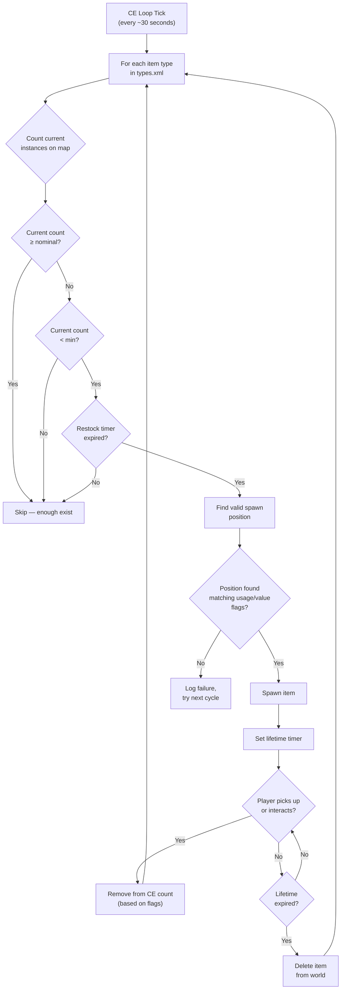

# Chapter 9.4: Loot Economy Deep Dive

[Home](../README.md) | [<< Previous: serverDZ.cfg Reference](03-server-cfg.md) | **Loot Economy Deep Dive**

---

> **Summary:** The Central Economy (CE) is the system that controls every item spawn in DayZ -- from a can of beans on a shelf to an AKM in a military barracks. This chapter explains the full spawn cycle, documents every field in `types.xml`, `globals.xml`, `events.xml`, and `cfgspawnabletypes.xml` with real examples from the vanilla server files, and covers the most common economy mistakes.

---

## Table of Contents

- [How the Central Economy Works](#how-the-central-economy-works)
- [The Spawn Cycle](#the-spawn-cycle)
- [types.xml -- Item Spawn Definitions](#typesxml----item-spawn-definitions)
- [Real types.xml Examples](#real-typesxml-examples)
- [types.xml Field Reference](#typesxml-field-reference)
- [globals.xml -- Economy Parameters](#globalsxml----economy-parameters)
- [events.xml -- Dynamic Events](#eventsxml----dynamic-events)
- [cfgspawnabletypes.xml -- Attachments and Cargo](#cfgspawnabletypesxml----attachments-and-cargo)
- [cfgspawnabletypes.xml Expansion (1.28+)](#cfgspawnabletypesxml-expansion-128)
- [The Nominal/Restock Relationship](#the-nominalrestock-relationship)
- [Common Economy Mistakes](#common-economy-mistakes)

---

## How the Central Economy Works

The Central Economy (CE) is a server-side system that runs on a continuous loop. Its job is to maintain the world's item population at the levels defined in your configuration files.

The CE does **not** place items when a player enters a building. Instead, it runs on a global timer and spawns items across the entire map, regardless of player proximity. Items have a **lifetime** -- when that timer expires and no player has interacted with the item, the CE removes it. Then, on the next cycle, it detects that the count is below target and spawns a replacement somewhere else.

Key concepts:

- **Nominal** -- the target number of copies of an item that should exist on the map
- **Min** -- the threshold below which the CE will attempt to respawn the item
- **Lifetime** -- how long (in seconds) an untouched item persists before cleanup
- **Restock** -- minimum time (in seconds) before the CE can respawn an item after it was taken/destroyed
- **Flags** -- what counts toward the total (on map, in cargo, in player inventory, in stashes)

---

## The Spawn Cycle



In short: the CE counts how many of each item exist, compares against the nominal/min targets, and spawns replacements when the count drops below `min` and the `restock` timer has elapsed.

---

## types.xml -- Item Spawn Definitions

This is the most important economy file. Every item that can spawn in the world needs an entry here. The vanilla `types.xml` for Chernarus contains approximately 23,000 lines covering thousands of items.

### Real types.xml Examples

**Weapon -- AKM**

```xml
<type name="AKM">
    <nominal>3</nominal>
    <lifetime>7200</lifetime>
    <restock>3600</restock>
    <min>2</min>
    <quantmin>30</quantmin>
    <quantmax>80</quantmax>
    <cost>100</cost>
    <flags count_in_cargo="0" count_in_hoarder="0" count_in_map="1" count_in_player="0" crafted="0" deloot="0"/>
    <category name="weapons"/>
    <usage name="Military"/>
    <value name="Tier4"/>
</type>
```

The AKM is a rare, high-tier weapon. Only 3 can exist on the map at once (`nominal`). It spawns in Military buildings in Tier 4 (northwest) areas. When a player picks one up, the CE sees the map count drop below `min=2` and will spawn a replacement after at least 3600 seconds (1 hour). The weapon spawns with 30-80% ammo in its internal magazine (`quantmin`/`quantmax`).

**Food -- BakedBeansCan**

```xml
<type name="BakedBeansCan">
    <nominal>15</nominal>
    <lifetime>14400</lifetime>
    <restock>0</restock>
    <min>12</min>
    <quantmin>-1</quantmin>
    <quantmax>-1</quantmax>
    <cost>100</cost>
    <flags count_in_cargo="0" count_in_hoarder="0" count_in_map="1" count_in_player="0" crafted="0" deloot="0"/>
    <category name="food"/>
    <tag name="shelves"/>
    <usage name="Town"/>
    <usage name="Village"/>
    <value name="Tier1"/>
    <value name="Tier2"/>
    <value name="Tier3"/>
</type>
```

Baked beans are common food. 15 cans should exist at any time. They spawn on shelves in Town and Village buildings across Tiers 1-3 (coast to mid-map). `restock=0` means instant respawn eligibility. `quantmin=-1` and `quantmax=-1` mean the item does not use the quantity system (it is not a liquid or ammo container).

**Clothing -- RidersJacket_Black**

```xml
<type name="RidersJacket_Black">
    <nominal>14</nominal>
    <lifetime>28800</lifetime>
    <restock>0</restock>
    <min>10</min>
    <quantmin>-1</quantmin>
    <quantmax>-1</quantmax>
    <cost>100</cost>
    <flags count_in_cargo="0" count_in_hoarder="0" count_in_map="1" count_in_player="0" crafted="0" deloot="0"/>
    <category name="clothes"/>
    <usage name="Town"/>
    <value name="Tier1"/>
    <value name="Tier2"/>
</type>
```

A common civilian jacket. 14 copies on the map, found in Town buildings near the coast (Tiers 1-2). Lifetime of 28800 seconds (8 hours) means it persists a long time if nobody picks it up.

**Medical -- BandageDressing**

```xml
<type name="BandageDressing">
    <nominal>40</nominal>
    <lifetime>14400</lifetime>
    <restock>0</restock>
    <min>30</min>
    <quantmin>-1</quantmin>
    <quantmax>-1</quantmax>
    <cost>100</cost>
    <flags count_in_cargo="0" count_in_hoarder="0" count_in_map="1" count_in_player="0" crafted="0" deloot="0"/>
    <category name="tools"/>
    <tag name="shelves"/>
    <usage name="Medic"/>
</type>
```

Bandages are very common (40 nominal). They spawn in Medic buildings (hospitals, clinics) across all tiers (no `<value>` tag means all tiers). Note the category is `"tools"`, not `"medical"` -- DayZ does not have a medical category; medical items use the tools category.

**Disabled item (crafted variant)**

```xml
<type name="AK101_Black">
    <nominal>0</nominal>
    <lifetime>28800</lifetime>
    <restock>0</restock>
    <min>0</min>
    <quantmin>-1</quantmin>
    <quantmax>-1</quantmax>
    <cost>100</cost>
    <flags count_in_cargo="0" count_in_hoarder="0" count_in_map="1" count_in_player="0" crafted="1" deloot="0"/>
    <category name="weapons"/>
</type>
```

`nominal=0` and `min=0` means the CE will never spawn this item. `crafted=1` indicates it can only be obtained through crafting (painting a weapon). It still has a lifetime so persisted instances eventually clean up.

---

## types.xml Field Reference

### Core Fields

| Field | Type | Range | Description |
|-------|------|-------|-------------|
| `name` | string | -- | Class name of the item. Must exactly match the game's class name. |
| `nominal` | int | 0+ | Target number of this item on the map. Set to 0 to prevent spawning. |
| `min` | int | 0+ | When the count drops to this value or below, the CE will try to spawn more. |
| `lifetime` | int | seconds | How long an untouched item exists before the CE deletes it. |
| `restock` | int | seconds | Minimum cooldown before the CE can spawn a replacement. 0 = immediate. |
| `quantmin` | int | -1 to 100 | Minimum quantity percentage when spawned (ammo %, liquid %). -1 = not applicable. |
| `quantmax` | int | -1 to 100 | Maximum quantity percentage when spawned. -1 = not applicable. |
| `cost` | int | 0+ | Priority weight for spawn selection. Currently all vanilla items use 100. |

### Flags

```xml
<flags count_in_cargo="0" count_in_hoarder="0" count_in_map="1" count_in_player="0" crafted="0" deloot="0"/>
```

| Flag | Values | Description |
|------|--------|-------------|
| `count_in_map` | 0, 1 | Count items lying on the ground or in building spawn points. **Almost always 1.** |
| `count_in_cargo` | 0, 1 | Count items inside other containers (backpacks, tents). |
| `count_in_hoarder` | 0, 1 | Count items in stashes, barrels, buried containers, tents. |
| `count_in_player` | 0, 1 | Count items in player inventory (on body or in hands). |
| `crafted` | 0, 1 | When 1, this item is only obtainable through crafting, not CE spawning. |
| `deloot` | 0, 1 | Dynamic Event loot. When 1, the item only spawns at dynamic event locations (helicrashes, etc.). |

**Flag strategy matters.** If `count_in_player=1`, every AKM a player is carrying counts toward the nominal. This means picking up an AKM would not trigger a respawn because the count did not change. Most vanilla items use `count_in_player=0` so that player-held items do not block respawns.

### Tags

| Element | Purpose | Defined In |
|---------|---------|-----------|
| `<category name="..."/>` | Item category for spawn point matching | `cfglimitsdefinition.xml` |
| `<usage name="..."/>` | Building type where this item can spawn | `cfglimitsdefinition.xml` |
| `<value name="..."/>` | Map tier zone where this item can spawn | `cfglimitsdefinition.xml` |
| `<tag name="..."/>` | Spawn position type within a building | `cfglimitsdefinition.xml` |

**Valid categories:** `tools`, `containers`, `clothes`, `food`, `weapons`, `books`, `explosives`, `lootdispatch`

**Valid usage flags:** `Military`, `Police`, `Medic`, `Firefighter`, `Industrial`, `Farm`, `Coast`, `Town`, `Village`, `Hunting`, `Office`, `School`, `Prison`, `Lunapark`, `SeasonalEvent`, `ContaminatedArea`, `Historical`

**Valid value flags:** `Tier1`, `Tier2`, `Tier3`, `Tier4`, `Unique`

**Valid tags:** `floor`, `shelves`, `ground`

An item can have **multiple** `<usage>` and `<value>` tags. Multiple usages mean it can spawn in any of those building types. Multiple values mean it can spawn in any of those tiers.

If you omit `<value>` entirely, the item spawns in **all** tiers. If you omit `<usage>`, the item has no valid spawn location and will **not spawn**.

---

## globals.xml -- Economy Parameters

This file controls global CE behavior. Every parameter from the vanilla file:

```xml
<variables>
    <var name="AnimalMaxCount" type="0" value="200"/>
    <var name="CleanupAvoidance" type="0" value="100"/>
    <var name="CleanupLifetimeDeadAnimal" type="0" value="1200"/>
    <var name="CleanupLifetimeDeadInfected" type="0" value="330"/>
    <var name="CleanupLifetimeDeadPlayer" type="0" value="3600"/>
    <var name="CleanupLifetimeDefault" type="0" value="45"/>
    <var name="CleanupLifetimeLimit" type="0" value="50"/>
    <var name="CleanupLifetimeRuined" type="0" value="330"/>
    <var name="FlagRefreshFrequency" type="0" value="432000"/>
    <var name="FlagRefreshMaxDuration" type="0" value="3456000"/>
    <var name="FoodDecay" type="0" value="1"/>
    <var name="IdleModeCountdown" type="0" value="60"/>
    <var name="IdleModeStartup" type="0" value="1"/>
    <var name="InitialSpawn" type="0" value="100"/>
    <var name="LootDamageMax" type="1" value="0.82"/>
    <var name="LootDamageMin" type="1" value="0.0"/>
    <var name="LootProxyPlacement" type="0" value="1"/>
    <var name="LootSpawnAvoidance" type="0" value="100"/>
    <var name="RespawnAttempt" type="0" value="2"/>
    <var name="RespawnLimit" type="0" value="20"/>
    <var name="RespawnTypes" type="0" value="12"/>
    <var name="RestartSpawn" type="0" value="0"/>
    <var name="SpawnInitial" type="0" value="1200"/>
    <var name="TimeHopping" type="0" value="60"/>
    <var name="TimeLogin" type="0" value="15"/>
    <var name="TimeLogout" type="0" value="15"/>
    <var name="TimePenalty" type="0" value="20"/>
    <var name="WorldWetTempUpdate" type="0" value="1"/>
    <var name="ZombieMaxCount" type="0" value="1000"/>
    <var name="ZoneSpawnDist" type="0" value="300"/>
</variables>
```

The `type` attribute indicates data type: `0` = integer, `1` = float.

### Complete Parameter Reference

| Parameter | Type | Default | Description |
|-----------|------|---------|-------------|
| **AnimalMaxCount** | int | 200 | Maximum number of animals alive on the map at once. |
| **CleanupAvoidance** | int | 100 | Distance in meters from a player where the CE will NOT clean up items. Items within this radius are protected from lifetime expiry. |
| **CleanupLifetimeDeadAnimal** | int | 1200 | Seconds before a dead animal corpse is removed. (20 minutes) |
| **CleanupLifetimeDeadInfected** | int | 330 | Seconds before a dead zombie corpse is removed. (5.5 minutes) |
| **CleanupLifetimeDeadPlayer** | int | 3600 | Seconds before a dead player body is removed. (1 hour) |
| **CleanupLifetimeDefault** | int | 45 | Default cleanup time in seconds for items with no specific lifetime. |
| **CleanupLifetimeLimit** | int | 50 | Maximum number of items processed per cleanup cycle. |
| **CleanupLifetimeRuined** | int | 330 | Seconds before ruined items are cleaned up. (5.5 minutes) |
| **FlagRefreshFrequency** | int | 432000 | How often a flag pole must be "refreshed" by interaction to prevent base decay, in seconds. (5 days) |
| **FlagRefreshMaxDuration** | int | 3456000 | Maximum lifetime of a flag pole even with regular refreshing, in seconds. (40 days) |
| **FoodDecay** | int | 1 | Enable (1) or disable (0) food spoilage over time. |
| **IdleModeCountdown** | int | 60 | Seconds before server enters idle mode when no players are connected. |
| **IdleModeStartup** | int | 1 | Whether the server starts in idle mode (1) or active mode (0). |
| **InitialSpawn** | int | 100 | Percentage of nominal values to spawn on first server start (0-100). |
| **LootDamageMax** | float | 0.82 | Maximum damage state for randomly spawned loot (0.0 = pristine, 1.0 = ruined). |
| **LootDamageMin** | float | 0.0 | Minimum damage state for randomly spawned loot. |
| **LootProxyPlacement** | int | 1 | Enable (1) visual placement of items on shelves/tables vs random floor drops. |
| **LootSpawnAvoidance** | int | 100 | Distance in meters from a player where the CE will NOT spawn new loot. Prevents items popping into existence in front of players. |
| **RespawnAttempt** | int | 2 | Number of spawn position attempts per item per CE cycle before giving up. |
| **RespawnLimit** | int | 20 | Maximum number of items the CE will respawn per cycle. |
| **RespawnTypes** | int | 12 | Maximum number of different item types processed per respawn cycle. |
| **RestartSpawn** | int | 0 | When 1, re-randomize all loot positions on server restart. When 0, load from persistence. |
| **SpawnInitial** | int | 1200 | Number of items to spawn during the initial economy population on first start. |
| **TimeHopping** | int | 60 | Cooldown in seconds preventing a player from reconnecting to the same server (anti-server-hop). |
| **TimeLogin** | int | 15 | Login countdown timer in seconds (the "Please wait" timer when connecting). |
| **TimeLogout** | int | 15 | Logout countdown timer in seconds. Player remains in the world during this time. |
| **TimePenalty** | int | 20 | Extra penalty time in seconds added to logout timer if the player disconnects improperly (Alt+F4). |
| **WorldWetTempUpdate** | int | 1 | Enable (1) or disable (0) world temperature and wetness simulation updates. |
| **ZombieMaxCount** | int | 1000 | Maximum number of zombies alive on the map at once. |
| **ZoneSpawnDist** | int | 300 | Distance in meters from a player at which zombie spawn zones become active. |

### Common Tuning Adjustments

**More loot (PvP server):**
```xml
<var name="InitialSpawn" type="0" value="100"/>
<var name="RespawnLimit" type="0" value="50"/>
<var name="RespawnTypes" type="0" value="30"/>
<var name="RespawnAttempt" type="0" value="4"/>
```

**Longer dead bodies (more time to loot kills):**
```xml
<var name="CleanupLifetimeDeadPlayer" type="0" value="7200"/>
```

**Shorter base decay (wipe stale bases faster):**
```xml
<var name="FlagRefreshFrequency" type="0" value="259200"/>
<var name="FlagRefreshMaxDuration" type="0" value="1728000"/>
```

---

## events.xml -- Dynamic Events

Events define spawns for entities that need special handling: animals, vehicles, and helicopter crashes. Unlike `types.xml` items which spawn inside buildings, events spawn at predefined world positions listed in `cfgeventspawns.xml`.

### Real Vehicle Event Example

```xml
<event name="VehicleCivilianSedan">
    <nominal>8</nominal>
    <min>5</min>
    <max>11</max>
    <lifetime>300</lifetime>
    <restock>0</restock>
    <saferadius>500</saferadius>
    <distanceradius>500</distanceradius>
    <cleanupradius>200</cleanupradius>
    <flags deletable="0" init_random="0" remove_damaged="1"/>
    <position>fixed</position>
    <limit>mixed</limit>
    <active>1</active>
    <children>
        <child lootmax="0" lootmin="0" max="5" min="3" type="CivilianSedan"/>
        <child lootmax="0" lootmin="0" max="5" min="3" type="CivilianSedan_Black"/>
        <child lootmax="0" lootmin="0" max="5" min="3" type="CivilianSedan_Wine"/>
    </children>
</event>
```

### Real Animal Event Example

```xml
<event name="AnimalBear">
    <nominal>0</nominal>
    <min>2</min>
    <max>2</max>
    <lifetime>180</lifetime>
    <restock>0</restock>
    <saferadius>200</saferadius>
    <distanceradius>0</distanceradius>
    <cleanupradius>0</cleanupradius>
    <flags deletable="0" init_random="0" remove_damaged="1"/>
    <position>fixed</position>
    <limit>custom</limit>
    <active>1</active>
    <children>
        <child lootmax="0" lootmin="0" max="1" min="1" type="Animal_UrsusArctos"/>
    </children>
</event>
```

### Event Field Reference

| Field | Description |
|-------|-------------|
| `name` | Event identifier. Must match an entry in `cfgeventspawns.xml` for `position="fixed"` events. |
| `nominal` | Target number of active event groups on the map. |
| `min` | Minimum group members per spawn point. |
| `max` | Maximum group members per spawn point. |
| `lifetime` | Seconds before the event is cleaned up and respawned. For vehicles, this is the respawn check interval, not the vehicle's persistence lifetime. |
| `restock` | Minimum seconds between respawns. |
| `saferadius` | Minimum distance in meters from a player for the event to spawn. |
| `distanceradius` | Minimum distance between two instances of the same event. |
| `cleanupradius` | Distance from any player below which the event will NOT be cleaned up. |
| `deletable` | Whether the event can be deleted by the CE (0 = no). |
| `init_random` | Randomize initial positions (0 = use fixed positions). |
| `remove_damaged` | Remove the event entity if it becomes damaged/ruined (1 = yes). |
| `position` | `"fixed"` = use positions from `cfgeventspawns.xml`. `"player"` = spawn near players. |
| `limit` | `"child"` = limit per child type. `"mixed"` = limit across all children. `"custom"` = special behavior. |
| `active` | 1 = enabled, 0 = disabled. |

### Children

Each `<child>` element defines a variant that can spawn:

| Attribute | Description |
|-----------|-------------|
| `type` | Class name of the entity to spawn. |
| `min` | Minimum instances of this variant (for `limit="child"`). |
| `max` | Maximum instances of this variant (for `limit="child"`). |
| `lootmin` | Minimum number of loot items spawned inside/on the entity. |
| `lootmax` | Maximum number of loot items spawned inside/on the entity. |

---

## cfgspawnabletypes.xml -- Attachments and Cargo

This file defines what attachments, cargo, and damage state an item has when it spawns. Without an entry here, items spawn empty and at random damage (within `LootDamageMin`/`LootDamageMax` from `globals.xml`).

### Weapon with Attachments -- AKM

```xml
<type name="AKM">
    <damage min="0.45" max="0.85" />
    <attachments chance="1.00">
        <item name="AK_PlasticBttstck" chance="1.00" />
    </attachments>
    <attachments chance="1.00">
        <item name="AK_PlasticHndgrd" chance="1.00" />
    </attachments>
    <attachments chance="0.50">
        <item name="KashtanOptic" chance="0.30" />
        <item name="PSO11Optic" chance="0.20" />
    </attachments>
    <attachments chance="0.05">
        <item name="AK_Suppressor" chance="1.00" />
    </attachments>
    <attachments chance="0.30">
        <item name="Mag_AKM_30Rnd" chance="1.00" />
    </attachments>
</type>
```

Reading this entry:

1. The AKM spawns with damage between 45-85% (worn to badly damaged)
2. It **always** (100%) gets a plastic buttstock and handguard
3. 50% chance of an optic slot being filled -- if it is, 30% chance for Kashtan, 20% for PSO-11
4. 5% chance of a suppressor
5. 30% chance of a loaded magazine

Each `<attachments>` block represents one attachment slot. The `chance` on the block is the probability of that slot being populated at all. The `chance` on each `<item>` within is relative selection weight -- the CE picks one item from the list using these as weights.

### Weapon with Attachments -- M4A1

```xml
<type name="M4A1">
    <damage min="0.45" max="0.85" />
    <attachments chance="1.00">
        <item name="M4_OEBttstck" chance="1.00" />
    </attachments>
    <attachments chance="1.00">
        <item name="M4_PlasticHndgrd" chance="1.00" />
    </attachments>
    <attachments chance="1.00">
        <item name="BUISOptic" chance="0.50" />
        <item name="M4_CarryHandleOptic" chance="1.00" />
    </attachments>
    <attachments chance="0.30">
        <item name="Mag_CMAG_40Rnd" chance="0.15" />
        <item name="Mag_CMAG_10Rnd" chance="0.50" />
        <item name="Mag_CMAG_20Rnd" chance="0.70" />
        <item name="Mag_CMAG_30Rnd" chance="1.00" />
    </attachments>
</type>
```

### Vest with Pouches -- PlateCarrierVest_Camo

```xml
<type name="PlateCarrierVest_Camo">
    <damage min="0.1" max="0.6" />
    <attachments chance="0.85">
        <item name="PlateCarrierHolster_Camo" chance="1.00" />
    </attachments>
    <attachments chance="0.85">
        <item name="PlateCarrierPouches_Camo" chance="1.00" />
    </attachments>
</type>
```

### Backpack with Cargo

```xml
<type name="AssaultBag_Ttsko">
    <cargo preset="mixArmy" />
    <cargo preset="mixArmy" />
    <cargo preset="mixArmy" />
</type>
```

The `preset` attribute references a loot pool defined in `cfgrandompresets.xml`. Each `<cargo>` line is one roll -- this backpack gets 3 rolls from the `mixArmy` pool. The pool's own `chance` value determines if each roll actually produces an item.

### Hoarder-Only Items

```xml
<type name="Barrel_Blue">
    <hoarder />
</type>
<type name="SeaChest">
    <hoarder />
</type>
```

The `<hoarder />` tag marks items as hoarder containers. The CE counts items inside these separately using the `count_in_hoarder` flag from `types.xml`.

### Spawn Damage Override

```xml
<type name="BandageDressing">
    <damage min="0.0" max="0.0" />
</type>
```

Forces bandages to always spawn in Pristine condition, overriding the global `LootDamageMin`/`LootDamageMax` from `globals.xml`.

---

## cfgspawnabletypes.xml Expansion (1.28+)

DayZ 1.28 significantly expanded what `cfgspawnabletypes.xml` can do. You can now spawn weapons fully loaded with attachments, cargo, and even chambered rounds.

### quantmin / quantmax for Stack Sizes

Control how full stackable items spawn (0-100%):

```xml
<type name="Ammo_556x45">
    <cargo>
        <item name="Ammo_556x45" quantmin="50" quantmax="100" />
    </cargo>
</type>
```

The `quantmin` and `quantmax` attributes on nested `<item>` elements work the same as in `types.xml` -- they set the percentage range for quantity-based items like ammunition and liquids. A value of `50` means the item spawns at least half full.

### Nested Item Cargo and Attachments

Items spawned inside other items can themselves have attachments and cargo:

```xml
<type name="M4A1">
    <attachments>
        <item name="M4_RISHndgrd" />
        <item name="M68Optic" />
    </attachments>
    <cargo>
        <item name="Mag_STANAG_30Rnd" quantmin="50" quantmax="100" />
    </cargo>
</type>
```

This spawns an M4A1 with a RIS handguard and M68 optic attached, plus a STANAG magazine in its cargo that is 50-100% full. Before 1.28, cargo items could not have their own quantity set inline.

### Nested Damage min/max

Control the damage state of nested items independently from the parent:

```xml
<type name="AKM">
    <attachments>
        <item name="AK_Bayonet">
            <damage min="0.0" max="0.3" />
        </item>
    </attachments>
</type>
```

The bayonet spawns between Pristine and Worn condition, regardless of the AKM's own damage state. This lets you ensure that valuable attachments spawn in better condition than the weapon itself.

### Weapons with Chambered Rounds (1.28+)

Weapons can now spawn with a bullet chambered and bullets in the internal magazine:

```xml
<type name="Mosin9130">
    <!-- Weapon spawns with rounds in internal magazine -->
</type>
```

This is configured via `cfgspawnabletypes.xml` in combination with `randompresets.xml`. The preset system handles the round type and count, while the spawnable type entry ties the weapon to the preset.

### Nested Presets via equip="true"

Reference preset loadouts for spawned items using the `equip` attribute:

```xml
<type name="M4A1">
    <attachments preset="M4Preset" equip="true" />
</type>
```

When `equip="true"` is set, the preset is applied as a full equipment loadout on the spawned item rather than selecting a single random item from the preset pool. This is useful for defining complete weapon configurations as reusable presets.

### randompresets.xml Now Appendable

Starting in 1.28, `randompresets.xml` can be appended via `cfgeconomycore.xml`, letting mods add presets without overwriting vanilla:

```xml
<!-- In cfgeconomycore.xml -->
<ce folder="db">
    <file name="my_presets.xml" type="randompresets" />
</ce>
```

This is a significant improvement for mod compatibility. Previously, any mod that needed custom random presets had to replace the entire `randompresets.xml` file, causing conflicts when multiple mods were loaded. Now each mod can ship its own preset file and register it through `cfgeconomycore.xml`.

---

## The Nominal/Restock Relationship

Understanding how `nominal`, `min`, and `restock` work together is critical for tuning your economy.

### The Math

```
IF (current_count < min) AND (time_since_last_spawn > restock):
    spawn new item (up to nominal)
```

**Example with the AKM:**
- `nominal = 3`, `min = 2`, `restock = 3600`
- Server starts: CE spawns 3 AKMs across the map
- Player picks up 1 AKM: map count drops to 2
- Count (2) is NOT less than min (2), so no respawn yet
- Player picks up another AKM: map count drops to 1
- Count (1) IS less than min (2), and restock timer (3600s = 1 hour) starts
- After 1 hour, CE spawns 2 new AKMs to reach nominal (3) again

**Example with BakedBeansCan:**
- `nominal = 15`, `min = 12`, `restock = 0`
- Player eats a can: map count drops to 14
- Count (14) is NOT less than min (12), so no respawn
- 3 more cans eaten: count drops to 11
- Count (11) IS less than min (12), restock is 0 (instant)
- Next CE cycle: spawns 4 cans to reach nominal (15)

### Key Insights

- **Gap between nominal and min** determines how many items can be "consumed" before the CE reacts. A small gap (like AKM: 3/2) means the CE reacts after just 2 pickups. A large gap means more items can leave the economy before respawn kicks in.

- **restock = 0** makes respawning effectively instant (next CE cycle). High restock values create scarcity -- the CE knows it needs to spawn more but must wait.

- **Lifetime** is independent of nominal/min. Even if the CE has spawned an item to reach nominal, the item will be deleted when its lifetime expires if nobody touches it. This creates a constant "churn" of items appearing and disappearing across the map.

- Items that players pick up but later drop (in a different location) still count if the relevant flag is set. A dropped AKM on the ground still counts toward the map total because `count_in_map=1`.

---

## Common Economy Mistakes

### Item Has a types.xml Entry But Does Not Spawn

**Check in order:**

1. Is `nominal` greater than 0?
2. Does the item have at least one `<usage>` tag? (No usage = no valid spawn location)
3. Is the `<usage>` tag defined in `cfglimitsdefinition.xml`?
4. Is the `<value>` tag (if present) defined in `cfglimitsdefinition.xml`?
5. Is the `<category>` tag valid?
6. Is the item listed in `cfgignorelist.xml`? (Items there are blocked)
7. Is the `crafted` flag set to 1? (Crafted items never spawn naturally)
8. Is `RestartSpawn` in `globals.xml` set to 0 with existing persistence? (Old persistence may block new items from spawning until a wipe)

### Items Spawn But Immediately Disappear

The `lifetime` value is too low. A lifetime of 45 seconds (the `CleanupLifetimeDefault`) means the item is cleaned up almost immediately. Weapons should have lifetimes of 7200-28800 seconds.

### Too Many/Too Few of an Item

Adjust `nominal` and `min` together. If you set `nominal=100` but `min=1`, the CE will not spawn replacements until 99 items have been taken. If you want a steady supply, keep `min` close to `nominal` (e.g., `nominal=20, min=15`).

### Items Only Spawn in One Area

Check your `<value>` tags. If an item only has `<value name="Tier4"/>`, it will only spawn in the northwest military area of Chernarus. Add more tiers to spread it across the map:

```xml
<value name="Tier1"/>
<value name="Tier2"/>
<value name="Tier3"/>
<value name="Tier4"/>
```

### Modded Items Not Spawning

When adding items from a mod to `types.xml`:

1. Make sure the mod is loaded (listed in `-mod=` parameter)
2. Verify the class name is **exactly** correct (case-sensitive)
3. Add the item's category/usage/value tags -- just having a `types.xml` entry is not enough
4. If the mod adds new usage or value tags, add them to `cfglimitsdefinitionuser.xml`
5. Check the script log for warnings about unknown class names

### Vehicle Parts Not Spawning Inside Vehicles

Vehicle parts spawn through `cfgspawnabletypes.xml`, not `types.xml`. If a vehicle spawns without wheels or a battery, check that the vehicle has an entry in `cfgspawnabletypes.xml` with the appropriate attachment definitions.

### All Loot is Pristine or All Loot is Ruined

Check `LootDamageMin` and `LootDamageMax` in `globals.xml`. Vanilla values are `0.0` and `0.82`. Setting both to `0.0` makes everything pristine. Setting both to `1.0` makes everything ruined. Also check per-item overrides in `cfgspawnabletypes.xml`.

### Economy Feels "Stuck" After Editing types.xml

After editing economy files, do one of:
- Delete `storage_1/` for a full wipe and fresh economy start
- Set `RestartSpawn` to `1` in `globals.xml` for one restart to re-randomize loot, then set it back to `0`
- Wait for item lifetimes to expire naturally (can take hours)

---

**Previous:** [serverDZ.cfg Reference](03-server-cfg.md) | [Home](../README.md) | **Next:** [Vehicle & Dynamic Event Spawning](05-vehicle-spawning.md)
